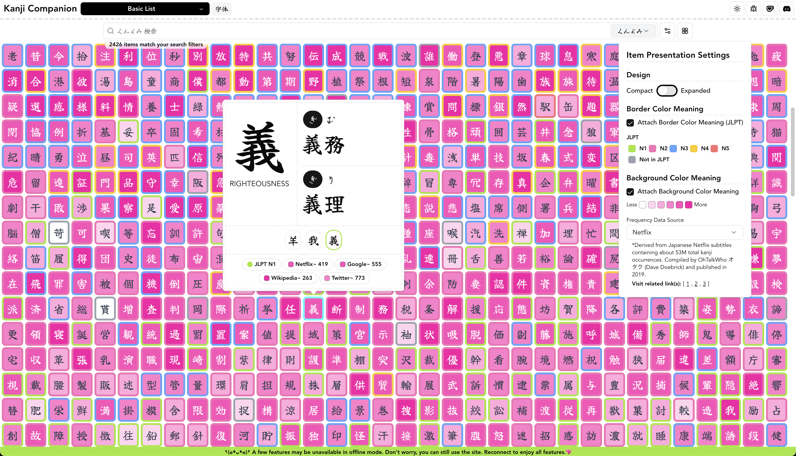
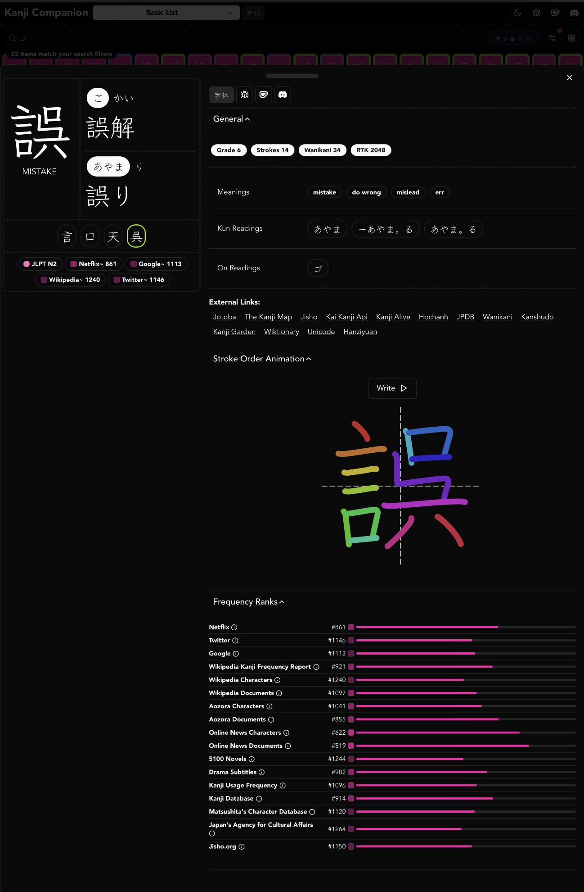
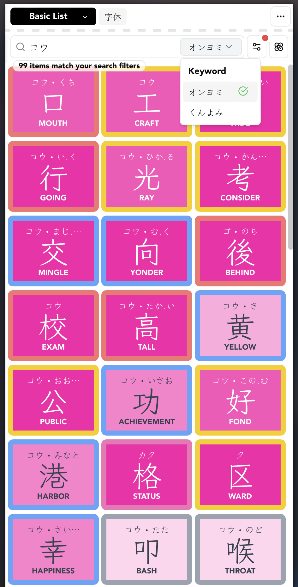
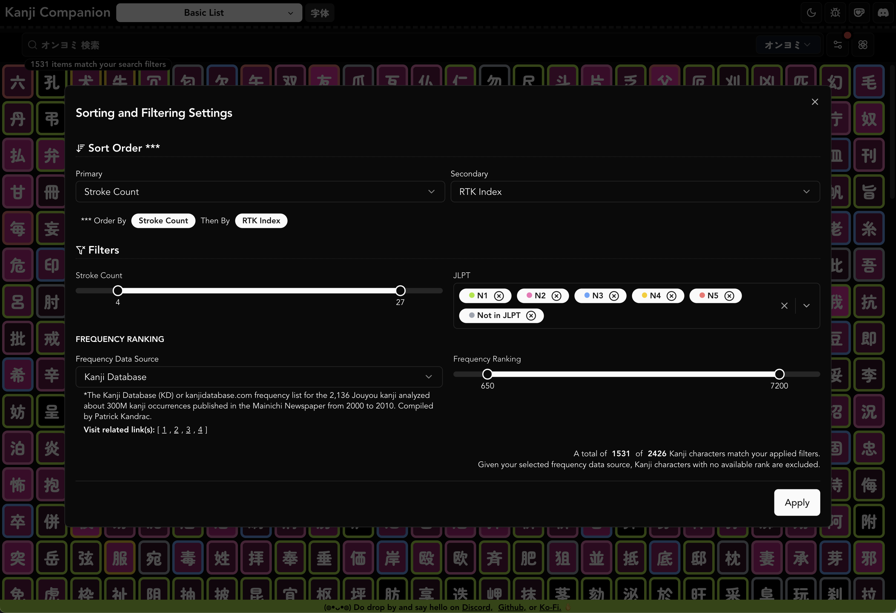

# Kanji Heatmap (previously Kanji Companion)



|  |  |
| ------------------------------------------------- | -------------------------------------------------- |
|                                                   |                                                    |



## Development

```
$ nvm use 22
$ pnpm install
$ pnpm run dev
```

> **Note:** When using `pnpm run dev`, clicking the book icon (Jisho lookup) in the vocabulary table will not load data — it requires a Cloudflare Worker running locally. All other features work normally.

### Full functionality (with Jisho lookup)

The Jisho lookup feature and Google handwriting API proxies requests through a [Cloudflare Pages Function](./functions/api/) to work around CORS restrictions. To run it locally you need [wrangler](https://developers.cloudflare.com/workers/wrangler/):

```
# Terminal 1
$ pnpm run dev

# Terminal 2
$ pnpm run dev:cf
```

Then open `http://localhost:5173` (wrangler's port, not Vite's).

Note

```
If you ever see a port bump to 5175, it means a stale vite is still holding 5174 — clear it with lsof -ti:5174,5173 | xargs kill and restart both.
```

## Testing

### Unit / component tests

```
pnpm test
```

### End-to-end tests (Playwright)

`pnpm install` installs the Playwright npm package, but **not** the browser binaries. Download Chromium once (and again after Playwright upgrades):

```
pnpm exec playwright install chromium
pnpm test:e2e

# Watching the test
pnpm exec playwright test --headed
pnpm exec playwright test --debug
pnpm exec playwright test --ui
```

If e2e fails with `browserType.launch: Executable doesn't exist` (often pointing at `~/Library/Caches/ms-playwright/chromium_headless_shell-…`), re-run `pnpm exec playwright install chromium`. That usually means Playwright was updated and the matching browser build is missing locally.

## Updating Data

If you have both [Kanji Heatmap Data](https://github.com/PikaPikaGems/kanji-heatmap-data) and this repository in the same directory, you can directly copy its output files

```
cp ../kanji-heatmap-data/output/*.json ./public/json
```

### Regenerating derived JSON

`pnpm run build` regenerates derived JSON before compiling and bundling:

```
node scripts/generate-speed-katakana.mjs && tsc -b && vite build
```

#### Speed Katakana challenge sets

The `/speed-katakana` game loads word lists from `public/json/katakana/challenge-set-<N>.json`, generated from `raw-data/katakana-kore.txt` (48 words per set, ordered by frequency).

```
pnpm run generate-speed-katakana
```

## Dependency visualization

Use these when deciding what to extract into its own file or move between folders. They map **module import** edges (file → file), not every function call.

**Prerequisite for SVG output:** [Graphviz](https://graphviz.org/) (`dot` on your `PATH`).

```
# macOS
brew install graphviz

# Debian / Ubuntu
sudo apt-get install graphviz
```

### Generate static graphs

```
pnpm run deps:graph
```

Writes into `dependency-graphs/` (gitignored):

| File          | Tool                                                                 | What it shows                                    |
| ------------- | -------------------------------------------------------------------- | ------------------------------------------------ |
| `madge.svg`   | [madge](https://github.com/pahen/madge)                              | Full module import graph                         |
| `folders.svg` | [dependency-cruiser](https://github.com/sverweij/dependency-cruiser) | Directory-level edges                            |
| `cruise.svg`  | dependency-cruiser                                                   | Modules collapsed to folder depth 3              |
| `archi.svg`   | dependency-cruiser                                                   | High-level area clusters (best start for moves)  |
| `cruise.mmd`  | dependency-cruiser                                                   | Mermaid source (paste into any Mermaid renderer) |

Open the SVGs in a browser. Start with `archi.svg` / `folders.svg`, then `cruise.svg` or `madge.svg` when you need more detail. A fully uncollapsed dependency-cruiser file graph is too large for Graphviz on this repo — use skott (below) to explore interactively instead.

Individual generators:

```
pnpm run deps:madge
pnpm run deps:cruise:folders
pnpm run deps:cruise:svg
pnpm run deps:cruise:archi
```

### Interactive graph (skott)

```
pnpm run deps:skott
```

Starts [skott](https://github.com/antoine-coulon/skott)’s web UI from `src/main.tsx` (resolves `@/` via `tsconfig.app.json`). Explore clusters, circular paths, and unused-looking leaves there.

### Circular dependencies

```
pnpm run deps:madge:circular
pnpm run deps:cruise
```

`deps:cruise` uses `.dependency-cruiser.mjs` (warns on cycles, notes orphans). Config lives there if you want stricter folder boundary rules later.

### How to read the graphs for refactors

- **Dense hubs** — many files import one module → candidate to split or keep as a shared primitive.
- **One-way leaves** — a util only used by one feature folder → move it next to that feature.
- **Cycles** — extract a shared type/helper or invert the dependency before moving files.
- **Wrong cluster** — a file sitting in `common/` but only linked from one screen → relocate with the feature.

For “should this _function_ be its own file?”, use the graph for context, then IDE Find References / extract helpers.

## Build Analysis

Analyze the **bundle** (not the source import graph) with

```
ANALYZE=true ANALYZE_TEMPLATE=flamegraph pnpm run build
# ANALYZE_TEMPLATE can be sunburst, treemap, network, raw-data, list, or flamegraph
```

Configure the visualizer settings in vite.config.ts if you want

## Preview

```
$ pnpm run peek
  ➜  Local:   http://localhost:4173/
  ➜  Network: http://192.168.254.107:4173/
  ➜  press h + enter to show help
```

## Updating the Data (Production)

Get the latest `tar.gz` from the [Kanji Heatmap Data](https://github.com/PikaPikaGems/kanji-heatmap-data) repository

```
curl -OL https://github.com/PikaPikaGems/kanji-heatmap-data/releases/latest/download/kanji-heatmap-data.tar.gz
```

Uncompress and store the json files in `./public/json`

```
tar -xzf ./kanji-heatmap-data.tar.gz -C ./public/json/
```

You should have the following files updated (among others from the release)

```
ls -la public/json

    component_keyword.json
    cum_use.json
    extra_kanji_keyword.json
    filtered_kanji.json
    kanji_extended.json
    kanji_main.json
    kanji_representative_words.json
    phonetic.json
    similar-kanjis.json
    vocab_furigana.json
    vocab_meaning.json
```

Derived files (`kanji-structure-*.json`, `kanji-readings-details.json`, `katakana/`) are produced by the generators above, not by this tarball.

Delete the `tar.gz` file since it's not needed anymore

```
rm kanji-heatmap-data.tar.gz
```

#### Structure and reading files

These files in `public/json/` should have the following files:

- `kanji-structure-hlorenzi.json`
- `kanji-readings-details.json`
- `kanji-structure-kanjium.json`
- `kanji-structure-scott.json`
- `kanji-structure-yagays.json`

## Talk to Us

- [Discord](https://discord.gg/Ash8ZrGb4s)
- [X/Twitter](https://x.com/pikapikagemsjp)
- [Instagram](https://www.instagram.com/pikapikagems)
