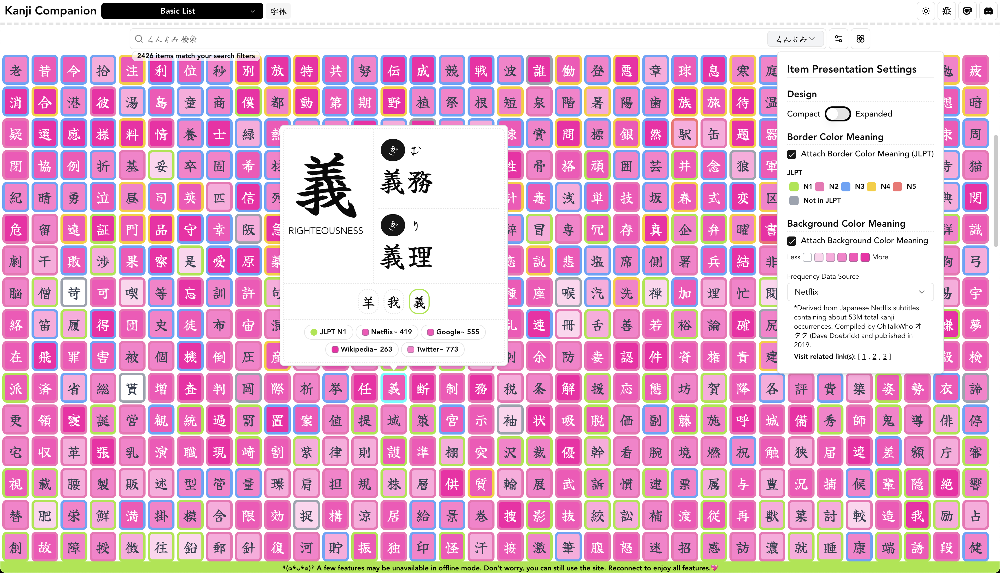
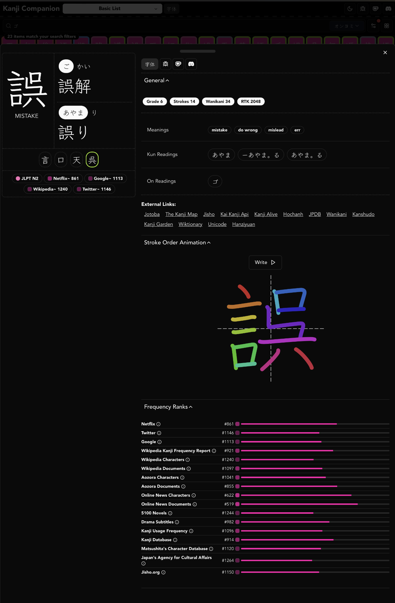
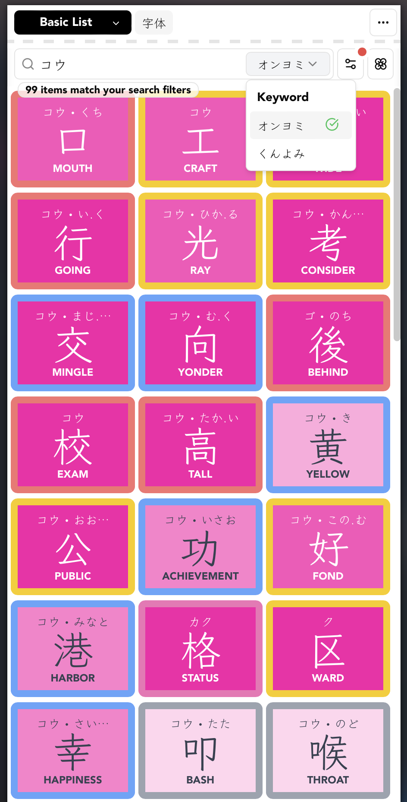
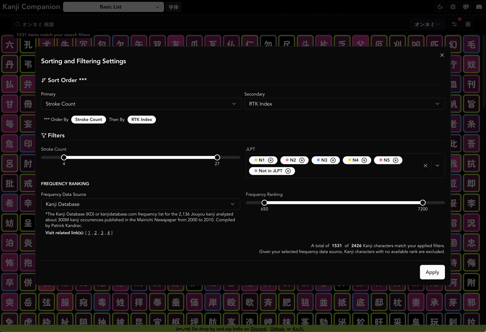

# Kanji Heatmap (previously Kanji Companion)



|  |  |
| :-----------------------------------------------: | :------------------------------------------------: |



## Development

```bash
nvm use 22
pnpm install
pnpm run dev
```

> **Note:** When using `pnpm run dev`, features that require Cloudflare Functions — such as Jisho, Jotoba, and the Google Handwriting API — will not work. All other features work normally.

### Running locally with Cloudflare Functions

API proxy requests through a [Cloudflare Pages Function](./functions/api/) to work around CORS restrictions. To run them locally you need [Wrangler](https://developers.cloudflare.com/workers/wrangler/):

```bash
# Terminal 1
pnpm run dev

# Terminal 2
pnpm run dev:cf
```

Then open `http://localhost:5173` (Wrangler's port, not Vite's).

> **Note:** If you ever see a port bump to 5175, a stale Vite process is still holding 5174. Clear it with `lsof -ti:5174,5173 | xargs kill` and restart both.

## Testing

### Unit / component tests

```bash
pnpm test
```

### End-to-end tests (Playwright)

`pnpm install` installs the Playwright npm package, but **not** the browser binaries. Download Chromium once (and again after Playwright upgrades):

```bash
pnpm exec playwright install chromium
pnpm test:e2e

# Watching the test
pnpm exec playwright test --headed
pnpm exec playwright test --debug
pnpm exec playwright test --ui
```

If e2e fails with `browserType.launch: Executable doesn't exist` (often pointing at `~/Library/Caches/ms-playwright/chromium_headless_shell-…`), re-run `pnpm exec playwright install chromium`. That usually means Playwright was updated and the matching browser build is missing locally.

## Build analysis

Analyze the build with:

```bash
ANALYZE=true ANALYZE_TEMPLATE=flamegraph pnpm run build
# ANALYZE_TEMPLATE can be sunburst, treemap, network, raw-data, list, or flamegraph
```

Configure the visualizer settings in `vite.config.ts` if you want.

## Updating kanji data

Upstream data is an **input**, not something the app serves directly: it goes
into `./raw-data`, and `scripts/generate-v2-json.mjs` turns it into the files
the app fetches from `./public/json/v2`. See `raw-data/README.md`.

If you have both [Kanji Heatmap Data](https://github.com/PikaPikaGems/kanji-heatmap-data) and this repository in the same parent directory, you can copy its output files directly:

```bash
cp ../kanji-heatmap-data/output/*.json ./raw-data
```

Or get the latest `tar.gz` from the [Kanji Heatmap Data](https://github.com/PikaPikaGems/kanji-heatmap-data) repository:

```bash
curl -OL https://github.com/PikaPikaGems/kanji-heatmap-data/releases/latest/download/kanji-heatmap-data.tar.gz
```

Uncompress and store the JSON files in `./raw-data`:

```bash
tar -xzf ./kanji-heatmap-data.tar.gz -C ./raw-data/
```

You should have the following files updated (among others from the release):

```bash
ls -la raw-data
```

```text
component_keyword.json
cum_use.json
extra_kanji_keyword.json
filtered_kanji.json
kanji_extended.json
kanji_main.json
kanji_representative_words.json
phonetic.json
similar-kanjis.json
vocab_furigana.json
vocab_meaning.json
```

Regenerate the files the app actually serves, then delete the `tar.gz` since
it is no longer needed:

```bash
pnpm run generate-json
rm kanji-heatmap-data.tar.gz
```

`generate-json` reads `./raw-data` and writes `./public/json/v2` plus
`docs/data/component-coverage.json`. It fails instead of writing if the data
breaks an invariant (missing kanji, conflicting component keywords, furigana
that does not round-trip, a sort field that is not a number).

#### Checking data sizes

`generate-json` prints the size and entry count of everything it writes, so
the quickest check is to run it and read the output.

To measure the files independently — inputs and served output, raw and
gzipped, which is what matters over the wire — paste this:

```bash
for f in raw-data/*.json public/json/*.json public/json/v2/*.json docs/data/*.json; do
  printf "%7s %7s  %s\n" \
    "$(( $(stat -c%s "$f") / 1024 ))K" \
    "$(( $(gzip -9 -c "$f" | wc -c) / 1024 ))K" \
    "$f"
done | sort -k3
```

Columns are raw, gzipped, path. (On macOS, `stat -c%s` is `stat -f%z`.)

Totals per directory, and the eager/lazy split that
`docs/notes/kanji-worker-data-redesign.md` documents:

```bash
# gzipped total of everything served from public/json/v2, summed per file
# (each is fetched separately, so the per-file sum is what goes over the wire —
# don't `cat` them together first, that compresses across files and overstates)
for f in public/json/v2/*.json; do gzip -9 -c "$f" | wc -c; done |
  awk '{t+=$1} END {printf "%.0f KB gz total\n", t/1024}'

# the one file loaded before first paint — everything else is lazy
gzip -9 -c public/json/v2/kanji_main.json | wc -c |
  awk '{printf "%.0f KB gz eager\n", $1/1024}'
```

§5 of `docs/notes/kanji-worker-data-redesign.md` lists the expected size and
entry count of every generated file, so these commands verify the design note
rather than trusting it.

### Regenerating derived JSON

`pnpm run build` regenerates derived JSON before compiling and bundling:

```bash
node scripts/generate-speed-katakana.mjs && tsc -b && vite build
```

The `/speed-katakana` game loads word lists from `public/json/katakana/challenge-set-<N>.json`, generated from `raw-data/katakana-kore.txt` (48 words per set, ordered by frequency).

#### Other required data

Every JSON the app fetches from `public/` is committed, so a fresh clone plus
`pnpm run generate-speed-katakana` is enough to run the site. The only data
_not_ in the repo is the per-kanji vocabulary, which is gitignored because it
is one file per kanji (see also `./src/lib/assets-paths.ts`):

- `/kanji-textbook-words-min/<KANJI>.json`
- `/kanji-words/v4/<KANJI>.json`

These paths are used in development only. In production the same data is
served from `https://assets.pikapikagems.com`, so the site works without them;
locally, the vocabulary sections of the kanji drawer stay empty until you
populate the two directories.

## Talk to us

- [Discord](https://discord.gg/Ash8ZrGb4s)
- [X/Twitter](https://x.com/pikapikagemsjp)
- [Instagram](https://www.instagram.com/pikapikagems)
