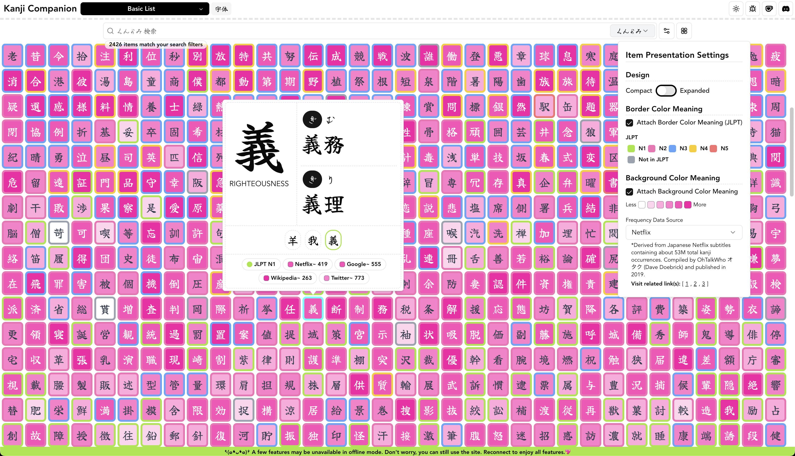
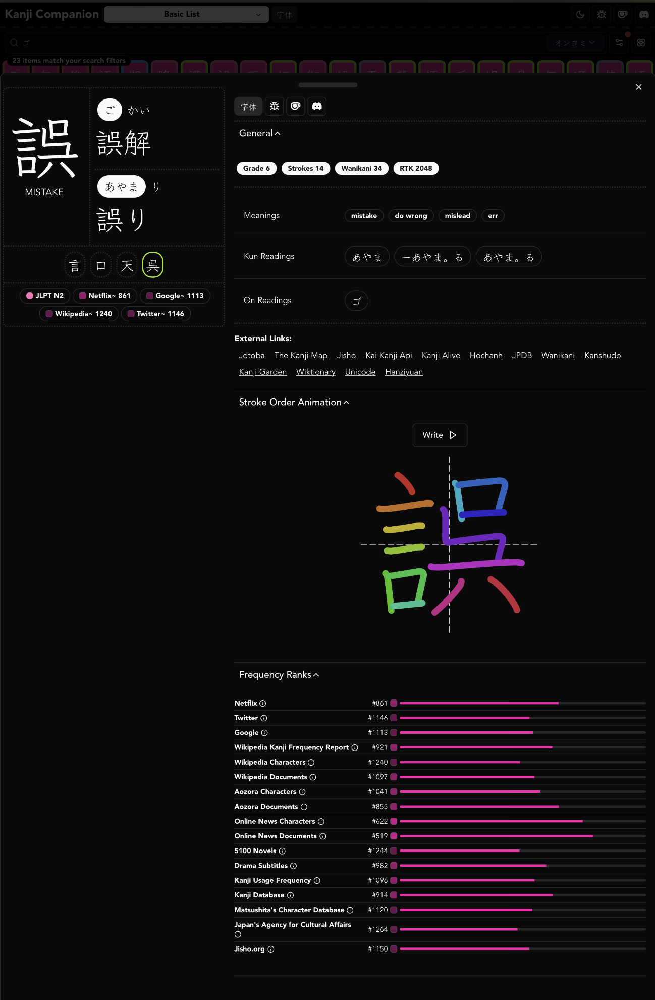
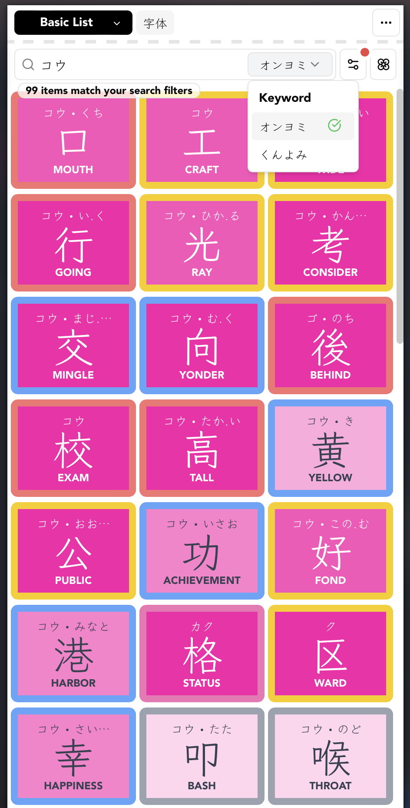
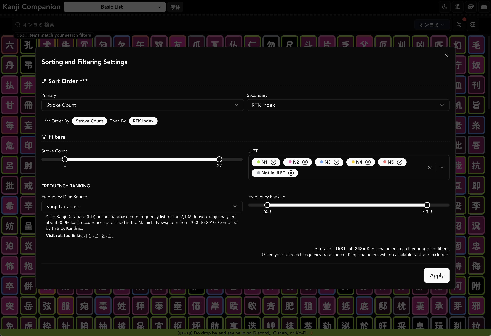

# Kanji Heatmap (previously Kanji Companion)



|  |  |
| :-----------------------------------------------: | :------------------------------------------------: |



## Development

```bash
nvm use 22
pnpm install
pnpm run generate-speed-katakana   # word lists for the Speed Katakana game (gitignored)
pnpm run dev                       # http://localhost:5174
```

`pnpm run dev:cf` is the same app on port 5173.

> **Note:** Jisho, Jotoba, KanjiAPI and Google Handwriting lookups go through
> [Cloudflare Pages Functions](./functions/api/) (to get around CORS). Neither
> dev script serves them, so they return 404 locally and only work on the
> deployed site. Everything else works locally.

### Data that isn't in the repo

The per-kanji vocabulary is one file per kanji, so it's gitignored. In
production it comes from cloud storage; locally the vocabulary sections of the
kanji drawer stay empty unless you fill these folders (paths are in
`src/lib/assets-paths.ts`):

- `public/kanji-words/v6/<KANJI>.json`
- `public/kanji-textbook-words-min/<KANJI>.json`

Everything else the app fetches is committed.

## Checks

These are what CI runs (`.github/workflows/ci.yml`):

```bash
pnpm run format:check   # fix with: pnpm exec prettier --write <file>
pnpm run lint
pnpm run typecheck
pnpm test
CF_PAGES=1 pnpm run build
```

`CF_PAGES=1` turns off the Cloudflare Vite plugin, matching the real Cloudflare
Pages build. `pnpm run build` does not run Prettier, so run `format:check`
yourself.

### End-to-end tests (Playwright)

`pnpm install` doesn't download browsers. Install Chromium once, and again
after Playwright upgrades:

```bash
pnpm exec playwright install chromium
pnpm test:e2e
```

To watch or debug a run, add `--headed`, `--debug` or `--ui` to
`pnpm exec playwright test`. If a run fails with
`browserType.launch: Executable doesn't exist`, install Chromium again.

## Kanji data

`raw-data/` holds the inputs; `pnpm run generate-json` turns them into the files
the app fetches from `public/json/v2/`. Never edit `public/json/v2/` by hand.
`raw-data/README.md` describes every input and where it came from.

`generate-json` also writes the reports in `docs/data/`, prints the size of
every file it writes, and fails instead of writing if the data breaks a rule
(missing kanji, clashing keywords, furigana that doesn't round-trip, …).
Commit the regenerated files together with the change that caused them.

### Updating from Kanji Heatmap Data

Most kanji data comes from
[Kanji Heatmap Data](https://github.com/PikaPikaGems/kanji-heatmap-data) and
is copied unchanged into `raw-data/kanji-heatmap-data/`. To update it, either
copy from a local checkout next to this repo:

```bash
cp ../kanji-heatmap-data/output/*.json ./raw-data/kanji-heatmap-data
```

or download the latest release:

```bash
curl -OL https://github.com/PikaPikaGems/kanji-heatmap-data/releases/latest/download/kanji-heatmap-data.tar.gz
tar -xzf kanji-heatmap-data.tar.gz -C ./raw-data/kanji-heatmap-data/
rm kanji-heatmap-data.tar.gz
```

Then regenerate:

```bash
pnpm run generate-json
```

### Stroke-order SVGs

SVGs for the 2,426 kanji in `raw-data/kanji-heatmap-data/filtered_kanji.json`
are committed in `public/svg/`. Other kanji (e.g. 唸) load from a CDN; see
`src/lib/kanji-svg-url.ts`. To download them again:

```bash
pnpm run download-kanji-svgs
```

### File sizes

```bash
./scripts/print-file-sizes.sh
```

prints raw and gzipped sizes. §5 of `docs/notes/kanji-worker-data-redesign.md`
lists the expected size of every generated file.

## Build analysis

```bash
ANALYZE=true ANALYZE_TEMPLATE=flamegraph pnpm run build
# ANALYZE_TEMPLATE: sunburst, treemap, network, raw-data, list or flamegraph
```

The visualizer settings are in `vite.config.ts`.

## Talk to us

- [Discord](https://discord.gg/Ash8ZrGb4s)
- [X/Twitter](https://x.com/pikapikagemsjp)
- [Instagram](https://www.instagram.com/pikapikagems)
