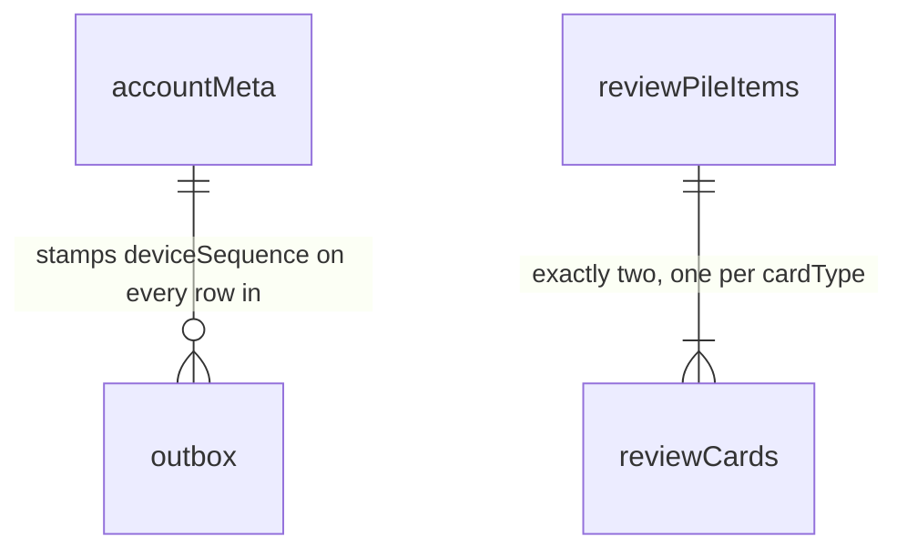

# IndexedDB tables and schemas

What StudyEngine actually stores in the browser, and why each table and
column exists.

Unlike the other documents in this folder, none of this is a public API — a
host never opens these databases or reads a row directly. It's here because
"what is on disk" is the thing people ask about first when they want to
understand how offline, sync, and eviction really behave.

## 1. Two databases

```text
kh-study-engine-meta-v1              one per browser: which accounts are cached here
kh-study-engine-account-<cacheId>    one per cached account: everything that account owns
```

The split exists so that signing out, switching accounts, or evicting a
stale cache is a whole-database operation rather than a delete-by-account-id
sweep across every table. Names are illustrative; the important rule is that
**no database name contains an email address or a raw account ID**, because
database names are readable without any authorization check.

## 2. The browser metadata database

Two stores. Neither one holds study data.

```ts
// Exactly one row, key "singleton".
interface BrowserMetaRow {
  key: "singleton";
  schemaVersion: number; // shape of this database, for migrations
  activeCacheId: string | null; // which account cache is currently signed in; null when signed out
  maximumTotalAccountCacheCount: number; // default 2, including the active one
  lastObservedWallTime: UnixMs; // last clock reading seen, to notice a large backwards jump
  logoutPending: boolean; // a logout started but didn't finish (tab closed mid-way); finish it on next start
}

// One row per account cache retained on this browser.
interface AccountCacheRow {
  localCacheId: string; // random; this is the <cacheId> in the database name
  accountId: AccountId; // the backend account this cache belongs to
  databaseName: string; // the account database to open
  databaseSchemaVersion: number;
  createdAt: UnixMs;
  lastActivatedAt: UnixMs; // drives least-recently-used eviction
  lastOpenedAt: UnixMs; // diagnostics only; does NOT drive eviction
  state: "active" | "inactive" | "locked";
  lockReason?: "migration_failed" | "corrupt"; // set only when state is "locked"
}
```

`localCacheId` is the indirection that keeps `accountId` out of the database
name: the mapping from a random ID to a real account lives inside a
database, where reading it at least requires opening one.

This database holds no notes, no bookmarks, no card state, no session
token, and no JavaScript-readable bearer credential. It may hold the signed
entitlement lease, which is what allows an offline restart to know the
account is still paid up without a network call.

## 3. The account database

Nine tables.

```ts
interface AccountDatabaseTables {
  // Identity and sync position
  accountMeta: AccountMetaRow; // 1

  // State the user edits directly
  notes: KanjiNoteRow; // 2
  bookmarks: KanjiBookmarkRow; // 3
  reviewPileItems: ReviewPileItemRow; // 4
  reviewCards: ReviewCardRow; // 5
  reviewSettings: ReviewSettingsRow; // 6

  // Counts the backend derives; no local writer
  dailySummaries: DailySummaryRow; // 7
  challengeSummaries: ChallengeSummaryRow; // 8

  // Everything written locally but not yet acknowledged by the server
  outbox: OutboxRow; // 9
}
```

There are almost no relationships between them — see the F.A.Q. The two
that exist:



### 3.1 `accountMeta` — who this database is, and where sync left off

```ts
// Exactly one row, key "singleton".
interface AccountMetaRow {
  key: "singleton";
  accountId: AccountId; // checked on open; a mismatch means this cache was mislabelled and must not be used
  deviceId: DeviceId; // assigned by the backend on first bootstrap, opaque and random

  // The local sequence space. Every outbox row takes the next number,
  // allocated inside the same transaction that writes it.
  nextDeviceSequence: number;
  acceptedThroughDeviceSequence: number; // high-water mark the server has confirmed

  // How far this cache has consumed the account's change history. Opaque —
  // the engine stores it and sends it back, and never parses it.
  cursor: ServerCursor;

  // Present only while a bootstrap is in progress. Their presence is what
  // marks this database as "not safe to read or write yet".
  activeBootstrapId?: string;
  bootstrapSnapshotRevision?: number;
}
```

This is the only place device identity is stored. There is no `devices`
table, because a browser profile is exactly one device to the backend.

### 3.2 `notes` — one Markdown note per kanji

```ts
interface KanjiNoteRow {
  kanji: Kanji; // primary key
  content: string; // Markdown; never empty while active
  contentUtf8Bytes: number; // precomputed so a size check doesn't re-encode the string
  updatedAt: UnixMs; // when this text was written, by whichever device wrote it

  // Who wrote it. Used as a deterministic tiebreaker so two devices that
  // edited at the same millisecond still agree on the ordering.
  writerDeviceId: DeviceId;
  writerDeviceSequence: number;

  baseServerRevision: number; // the revision this edit was based on; how the backend detects divergence
  serverRevision?: number; // undefined until this note has synced at least once
  active: boolean; // false means removed — the row stays, see F.A.Q.

  hasMergedEdit: boolean; // the backend joined a divergent edit into `content`
  mergedAt?: UnixMs; // set only alongside hasMergedEdit
}
```

### 3.3 `bookmarks` — set membership, nothing else

```ts
interface KanjiBookmarkRow {
  kanji: Kanji; // primary key
  updatedAt: UnixMs;
  writerDeviceId: DeviceId;
  writerDeviceSequence: number;
  baseServerRevision: number;
  serverRevision?: number;
  active: boolean; // false means un-bookmarked
}
```

No word, no reading, no meaning, no JLPT band. The host resolves all of
that from its own data — see
[bookmark-public-api.md](./bookmark-public-api.md).

### 3.4 `reviewPileItems` — one row per kanji ever added to the review pile

```ts
interface ReviewPileItemRow {
  kanji: Kanji; // primary key
  word: string; // the representative word the two cards test, frozen at add time
  generation: number; // increments on each re-add; see F.A.Q.
  createdAt: UnixMs;
  createdByDeviceId: DeviceId;
  removedAt?: UnixMs;
  removedByDeviceId?: DeviceId;
  serverRevision?: number;
  active: boolean;
}
```

### 3.5 `reviewCards` — two rows per active pile item

```ts
type CardType = "reading" | "writing";

interface ReviewCardRow {
  kanji: Kanji; // with cardType, the primary key
  cardType: CardType;
  generation: number; // must match its pile item's generation
  cardRevision: number; // bumps on every local or server change; this is what `expectedRevision` checks

  // The scheduler's whole memory of this card. Nulled when the card is
  // deactivated, so an inactive card costs tens of bytes instead of hundreds.
  state: FsrsCardStateV1 | null;

  counters: ReviewCounters; // lifetime totals, kept even when `state` is nulled
  serverRevision?: number;
  active: boolean;
}

interface FsrsCardStateV1 {
  schemaVersion: 1;
  schedulerAlgorithm: "fsrs";
  schedulerVersion: string; // which scheduler produced this; a mismatch is a migration, not a silent reinterpretation
  dueAt: UnixMs;
  lastReviewAt: UnixMs | null;
  stability: number; // roughly, days until recall drops to the target retention
  difficulty: number; // 1..10
  elapsedDays: number;
  scheduledDays: number;
  learningStep: number; // index into the configured learning/relearning steps
  repetitions: number;
  lapses: number;
  learningState: "new" | "learning" | "review" | "relearning";
}

interface ReviewCounters {
  reviews: number; // every grade this card has received, ever
  lapses: number;
  again: number; // the four below break `reviews` down by rating
  hard: number;
  good: number;
  easy: number;
}
```

There is no local review-history ring. The backend keeps a bounded window
per card for conflict replay; nothing on the client reads it, so shipping a
copy would mean maintaining two implementations of one structure.

### 3.6 `reviewSettings` — one row, shared by both card types

```ts
// Exactly one row, key "singleton".
interface ReviewSettingsRow {
  key: "singleton";
  schemaVersion: 1;
  schedulerVersion: string;
  settings: ReviewSettings; // the values exposed as-is on ReviewsApi.settings
  settingsRevision: number; // monotonic; forward-only, never applied backwards
  updatedAt: UnixMs;
  origin: "device" | "server"; // a server-authored write beats a device-authored one at the same instant
  writerDeviceId?: DeviceId; // absent when origin is "server"
  writerDeviceSequence?: number;
  serverRevision?: number;
}
```

There is no settings history table. Conflict replay applies the winning
current settings across its short window, so older versions have no reader.

### 3.7 `dailySummaries` — one row per local day with activity

```ts
interface DailySummaryRow {
  schemaVersion: 1;
  localDate: LocalDate; // primary key, YYYY-MM-DD in the device's local time at the time of practice
  timeZonesSeen: readonly IanaTimeZone[]; // bounded; informational only, counts stay filed under localDate

  speedKatakanaSessions: number;
  speakingPracticeSessions: number;
  readingPracticeRounds: number;
  writingPracticeRounds: number;

  readingCardsReviewed: number;
  writingCardsReviewed: number;
  ratingAgain: number;
  ratingHard: number;
  ratingGood: number;
  ratingEasy: number;

  firstActivityAt: UnixMs; // widened as facts arrive; not currently exposed publicly
  lastActivityAt: UnixMs;
  serverRevision: number; // never optional — a device cannot create this row
}
```

### 3.8 `challengeSummaries` — one row per challenge attempted

```ts
interface ChallengeScoreRecord {
  eventId: string; // tiebreaker when two attempts hit the same value
  value: number;
  achievedAt: UnixMs;
}

// One shape per activityType, matching the public ChallengeSummary union.
type ChallengeSummaryRow =
  | SpeedKatakanaChallengeSummaryRow
  | SpeakingPracticeChallengeSummaryRow;

interface SpeedKatakanaChallengeSummaryRow {
  schemaVersion: 1;
  activityType: "speed_katakana"; // with challengeId, the primary key
  challengeId: string;
  attemptCount: number;
  latest: {
    eventId: string;
    occurredAt: UnixMs;
    accuracyPercent: number;
    charactersPerMinute: number;
  };
  bestAccuracy: ChallengeScoreRecord;
  bestCharactersPerMinute: ChallengeScoreRecord;
  bestCharactersPerMinuteAbove70Accuracy?: ChallengeScoreRecord; // absent until an attempt clears 70%
  serverRevision: number;
}

interface SpeakingPracticeChallengeSummaryRow {
  schemaVersion: 1;
  activityType: "speaking_practice";
  challengeId: string;
  attemptCount: number;
  serverRevision: number;
}
```

### 3.9 `outbox` — the only thing on disk the server hasn't seen yet

```ts
interface OutboxRow {
  deviceSequence: number; // primary key; allocated from accountMeta.nextDeviceSequence
  operationId: string; // stable across retries — this is what makes a retry idempotent
  kind:
    | "note_put"
    | "note_remove"
    | "bookmark_add"
    | "bookmark_remove"
    | "review_settings_update"
    | "review_pile_add"
    | "review_pile_remove"
    | "review_grade"
    | "practice_activity_event_add";
  payload: unknown; // narrowed by `kind` internally; see F.A.Q. for why it isn't typed here
  createdAt: UnixMs;
  state: "pending" | "sending"; // a crashed "sending" row returns to "pending" on startup
  attemptCount: number; // diagnostics and backoff
}
```

There is one outbox, one sequence space, and one acknowledgement path.
Rows are deleted only when the server confirms a sequence at or above
theirs.

### 3.10 Indexes

```text
notes:               &kanji, serverRevision, active
bookmarks:           &kanji, serverRevision, active
reviewPileItems:     &kanji, generation, serverRevision, active
reviewCards:         &[kanji+cardType], [cardType+dueAt], generation, serverRevision, active
dailySummaries:      &localDate, serverRevision
challengeSummaries:  &[activityType+challengeId], serverRevision
outbox:              &deviceSequence, operationId, state
```

`&` marks the primary key. Every table carries a `serverRevision` index for
one reason: applying a pull means finding rows by revision. `[cardType+dueAt]`
is the only index that exists for a user-facing query — building a due queue.

## 4. F.A.Q

**Why one database per account instead of one database with an `accountId`
column on every row?**
Because "forget this account" then becomes a single `deleteDatabase` call
that cannot half-succeed, instead of a delete sweep across nine tables that
can be interrupted, miss a row, or leave one account's data visible to
another after a bug. It also means the wrong account's data is never one
missing `WHERE` clause away from being read.

**The denser design document says "eight tables" — is that right?**
No, it lists nine and calls it eight. Nine is correct: `accountMeta`,
`notes`, `bookmarks`, `reviewPileItems`, `reviewCards`, `reviewSettings`,
`dailySummaries`, `challengeSummaries`, `outbox`. Noting it here rather than
quietly agreeing with one of them.

**Why are there almost no relationships between these tables?**
Because each one is keyed by something the domain already guarantees is
unique and bounded — a kanji, a local date, a challenge ID. Nothing needs a
generated ID to point at, so nothing needs a foreign key to follow. The one
real parent/child relationship is a pile item and its two cards, and even
that is expressed by sharing `kanji` rather than by a reference.

**Why does a deleted note or bookmark stay in the table with
`active: false`?**
Because a device that was offline for a month has to be able to learn about
the deletion, and a row that has been physically removed cannot show up in
"everything that changed since revision N." The usual fix is a tombstone
table, which then needs its own garbage collection, which needs every
device's acknowledged position tracked before anything can be reclaimed.
Keeping the row and flipping a boolean removes all of that. The cost is that
rows are never reclaimed — bounded by the kanji set, so an account that
bookmarked and un-bookmarked everything it ever saw keeps a few thousand
tiny rows.

**Why is `generation` a column on a pile item instead of part of its key?**
So that removing and re-adding the same kanji fifty times produces one row,
not fifty. The protection it provides is unchanged: a grade carries the
generation it was based on, and a grade based on generation 4 can never
apply to generation 5 — that check reads the value, not the row's identity.

**Why is `serverRevision` optional on notes and bookmarks but required on
the two summary tables?**
Because a note or bookmark can exist locally before it has ever reached the
server — written offline, still sitting in the outbox. A summary row can't:
it only comes into existence when the backend derives it, so by the time a
device has one, it has a revision.

**Why store the summary tables locally at all, if the backend owns them?**
So that opening the app on a plane shows last month's heatmap instead of a
spinner. They're a cache of a server-owned value, which is exactly why they
have no local writer and no `active` column — nothing local ever creates or
deletes one.

**If a summary is server-owned, how does a count update the instant a round
ends, before sync runs?**
The row is recomputed, not patched: the displayed value is always the last
server value with any still-unacknowledged outbox operations for that key
replayed on top. Patching in place would break the moment a server value
arrived while some grades were still pending — it would either double-count
the acknowledged ones or drop the pending ones. Recomputing is correct in
both directions and needs no special cases.

**Why does `dailySummaries` have columns the public API doesn't expose
(`timeZonesSeen`, `firstActivityAt`, `lastActivityAt`, `serverRevision`)?**
Because the table is the storage shape and `ActivitiesSummary` is the
reading shape, and they don't have to match. Those four are engine
bookkeeping — travel diagnostics and sync mechanics — with no host reading
them today. Exposing a field is easy later; unexposing one isn't.

**Why is the table called `dailySummaries` when the public type was renamed
to `ActivitiesSummary`?**
Because every row in this table genuinely is one day, keyed by `localDate`.
The public type got renamed because it's reused for all-time totals, where
"daily" was actively misleading. Here there's no such reuse, so the more
specific name is the accurate one.

**Where are all-time totals stored, then? There's no `allTime` table.**
There isn't one, deliberately. `watchAllTime()` is computed by walking
`dailySummaries` — `cakeDay` is the earliest row, `daysActive` is the row
count, and the rest are sums. That's bounded by the account's age in days,
so a few thousand small rows for a multi-year user, which IndexedDB handles
without difficulty. Worth being precise about what the activity API's
"cheap" claim means: it's that a _host_ doesn't have to fetch and sum years
of rows across the API boundary, not that the engine avoids the scan
internally. If that scan ever does become the slow part, the fix is a cached
aggregate on the `accountMeta` singleton — which is already read on every
startup — rather than a tenth table.

**Why is `outbox.payload` typed `unknown` instead of a proper union?**
It is a proper union internally, narrowed by `kind`. It's `unknown` at the
table boundary because the stored bytes and the live TypeScript type can
drift across an engine upgrade: a row written by yesterday's build has to be
readable by today's. Forcing the stored shape to satisfy the current
compile-time type is how a migration turns into silent corruption.

**Why is there one outbox rather than one per domain, or a separate one for
raw events?**
Because the backend derives card state and summaries from facts, so it needs
the fact inside the sync transaction — a second pipeline for events could
not deliver that. One outbox also means one sequence space, one backoff, and
one acknowledgement path, and it removes the state where notes have synced
but events are still queued locally. The cost, accepted knowingly: raw
events count against the same size limits as everything else.

**Why do notes, bookmarks, and settings sit in the same outbox as grades and
practice events, when they're such different things?**
They do behave differently and the design leans on that. Grades and practice
events are **facts** — immutable records of something that happened, which
never conflict with each other, and from which the backend derives card
state and summaries. The rest are **state intents** — a desired value for
something mutable, resolved by last-writer-wins or, for notes, by merging.
Sharing a table and a sequence space is what keeps ordering and retry
correct; it isn't a claim that they're the same kind of thing. Modelling a
note's text as a fact log would buy nothing and cost a domain.

**Four tables an implementer will look for and not find.**
A note conflicts table: divergent edits merge into the note itself, so
there's nothing to store separately. A sync staging table: a pull response
is bounded and applied from memory in one transaction, which already gives
the atomicity staging would provide, at half the writes. A bootstrap page
table: pages write straight into the live tables while the database is
gated as `bootstrapping`, so a partial state is unobservable without a
second copy. A review lease table: an open review is an in-memory handle,
and a reload correctly discarding it is the desired behavior.

**What happens to these tables when a migration fails?**
The database closes, its cache row is marked `locked` with a reason, and a
diagnostic ID is surfaced. It is specifically not deleted — a locked cache
may hold unsynced outbox rows, and deleting on failure would throw away
exactly the data that was hardest to recover. It also can't be evicted
automatically to make room for another account; if every removable slot is
locked, the engine returns a storage error instead.
