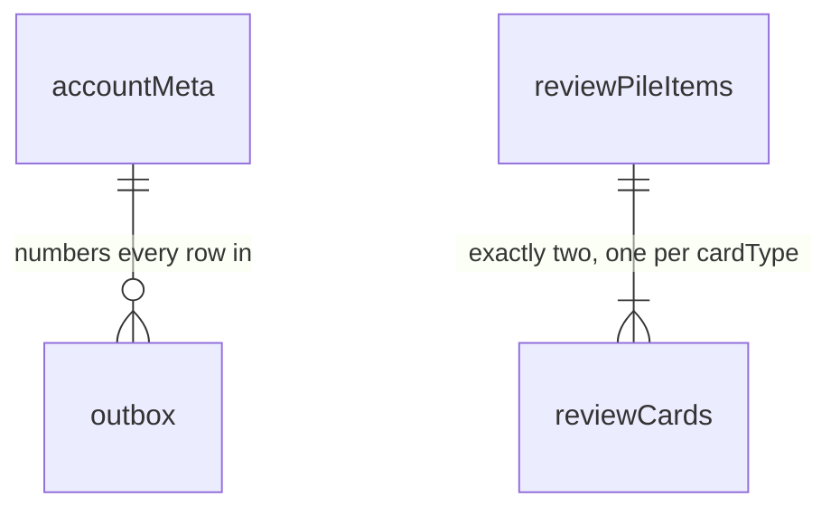

# IndexedDB tables and schemas

What StudyEngine stores in the browser: every table, and what every column
is for. A host never opens these databases — this is here so "what's
actually on disk" has an answer.

## 1. The tables

```ts
// ---- Basic building blocks ----

type UnixMs = number;
type Kanji = string; // a single kanji character
type LocalDate = string; // YYYY-MM-DD, e.g. "2026-07-28"

type AccountId = string; // the account these rows belong to
type DeviceId = string; // one browser profile, assigned by the backend

// How far this cache has consumed the account's history. Opaque — store it,
// send it back, never parse it.
type ServerCursor = string;

// `ReviewSettings` below is the same shape ReviewsApi exposes — see
// review-public-api.md.
```

Two databases. One per browser for bookkeeping, one per cached account for
that account's data, so that forgetting an account is a single
`deleteDatabase` rather than a delete sweep across every table.

```text
kh-study-engine-meta-v1              which accounts are cached on this browser
kh-study-engine-account-<cacheId>    everything one account owns
```

`<cacheId>` is a random ID, never an email address or account ID — database
names are readable without opening anything.

Two account caches are kept, so two people sharing one device (or one person
with a second account) can switch back and forth without re-downloading
everything each time. The limit is an engine constant, not stored state.

### The metadata database — 2 stores

**`browserMeta`** — one row, the state of this browser as a whole.

```ts
interface BrowserMetaRow {
  key: "singleton";
  schemaVersion: number; // shape of this database, for migrations
  activeCacheId: string | null; // which cache is signed in; null when signed out
  logoutPending: boolean; // a logout didn't finish; complete it on next start
}
```

**`accountCaches`** — one row per account database kept on this browser.

```ts
interface AccountCacheRow {
  localCacheId: string; // the <cacheId> in the database name
  accountId: AccountId; // which account this cache holds
  lastActivatedAt: UnixMs; // last time this account signed in; decides what gets evicted
  state: "bootstrapping" | "active" | "inactive" | "locked";
  lockReason?: "migration_failed" | "corrupt"; // only when locked
}
```

`state` is the gate on everything: `bootstrapping` is still being filled and
must not be read or written, `active` is the one currently signed in,
`inactive` is the other cache kept for fast switching, and `locked` failed a
migration or an integrity check.

No study data lives here — no notes, bookmarks, cards, or session token. It
may hold the signed entitlement lease, which is what lets an offline restart
know the account is still paid up.

### The account database — 9 tables

```ts
interface AccountDatabaseTables {
  accountMeta: AccountMetaRow; // 1  identity and sync position
  notes: KanjiNoteRow; // 2  state the user edits
  bookmarks: KanjiBookmarkRow; // 3
  reviewPileItems: ReviewPileItemRow; // 4
  reviewCards: ReviewCardRow; // 5
  reviewSettings: ReviewSettingsRow; // 6
  dailySummaries: DailySummaryRow; // 7  counts the backend derives
  challengeSummaries: ChallengeSummaryRow; // 8
  outbox: OutboxRow; // 9  written locally, not yet acknowledged
}
```



Those are the only two relationships. Every other table is keyed by
something the domain already guarantees is unique — a kanji, a local date, a
challenge ID — so nothing needs a foreign key.

**1. `accountMeta`** — who this database belongs to, and where sync left
off. One row.

```ts
interface AccountMetaRow {
  key: "singleton";
  accountId: AccountId; // checked on open; a mismatch means don't use this cache
  deviceId: DeviceId; // this browser's identity, assigned by the backend on first bootstrap
  nextDeviceSequence: number; // the number the next outbox row will take
  cursor: ServerCursor; // how far this cache has consumed the account's history
}
```

This is the only place device identity is stored. There is no `devices`
table — a browser profile is one device.

**2. `notes`** — one Markdown note per kanji.

```ts
interface KanjiNoteRow {
  kanji: Kanji; // primary key
  content: string; // the note text; never empty while active
  updatedAt: UnixMs; // when this text was written

  // Which device wrote it. Also the tiebreaker, with updatedAt, that makes
  // two devices merging the same note produce byte-identical results.
  writerDeviceId: DeviceId;
  writerDeviceSequence: number;

  serverRevision?: number; // absent until this note has synced once
  active: boolean; // false means removed; the row stays

  hasMergedEdit: boolean; // the backend joined another device's edit into `content`
  mergedAt?: UnixMs; // when that happened
}
```

**3. `bookmarks`** — which kanji are bookmarked. Membership only; the host
supplies the word, reading, and meaning from its own data.

```ts
interface KanjiBookmarkRow {
  kanji: Kanji; // primary key
  updatedAt: UnixMs;
  writerDeviceId: DeviceId; // which device set it
  writerDeviceSequence: number; // tiebreaker, same as notes
  serverRevision?: number; // absent until synced once
  active: boolean; // false means un-bookmarked
}
```

**4. `reviewPileItems`** — one row per kanji ever added to the review pile.

```ts
interface ReviewPileItemRow {
  kanji: Kanji; // primary key
  word: string; // the word its cards test, frozen at add time so a data update can't change it
  generation: number; // increments on each re-add, so a stale grade can't hit a fresh card
  serverRevision?: number;
  active: boolean; // false means removed from the pile
}
```

**5. `reviewCards`** — the scheduler's state. Two rows per active pile item,
one reading and one writing.

```ts
interface ReviewCardRow {
  kanji: Kanji; // with cardType, the primary key
  cardType: "reading" | "writing";
  generation: number; // must match its pile item's
  cardRevision: number; // bumps on every change; what `expectedRevision` checks against
  state: FsrsCardStateV1 | null; // the schedule; nulled when the card is deactivated
  counters: ReviewCounters; // lifetime totals, kept even when `state` is nulled
  serverRevision?: number;
  active: boolean;
}

interface FsrsCardStateV1 {
  schemaVersion: 1; // the scheduler's schema, which versions separately from this database
  schedulerAlgorithm: "fsrs"; // reserved for a possible future algorithm; always "fsrs" today
  schedulerVersion: string; // which scheduler produced this state
  dueAt: UnixMs; // when this card comes up next
  lastReviewAt: UnixMs | null; // null until first graded
  stability: number; // roughly, days until recall drops to the target retention
  difficulty: number; // 1..10, how hard this card is for this user
  elapsedDays: number; // days since the last review, as of that review
  scheduledDays: number; // the interval that was intended between the last two reviews
  learningStep: number; // position in the configured learning/relearning steps
  repetitions: number; // the scheduler's own copy of `counters.reviews`
  lapses: number; // the scheduler's own copy of `counters.lapses`
  learningState: "new" | "learning" | "review" | "relearning";
}

// The lasting record of what happened to this card. `state` is what the
// scheduler needs and gets nulled on deactivation; these survive it.
interface ReviewCounters {
  reviews: number; // every grade this card has ever received
  lapses: number; // times it fell back to relearning
  again: number; // the four below break `reviews` down by rating
  hard: number;
  good: number;
  easy: number;
}
```

**6. `reviewSettings`** — the FSRS settings, shared by both card types. One
row.

```ts
interface ReviewSettingsRow {
  key: "singleton";
  schedulerVersion: string;
  settings: ReviewSettings; // the values ReviewsApi.settings exposes as-is
  settingsRevision: number; // monotonic; applied forward only
  updatedAt: UnixMs;
  origin: "device" | "server"; // a server write wins over a device write at the same instant
  writerDeviceId?: DeviceId; // which device changed them; absent when origin is "server"
  writerDeviceSequence?: number;
  serverRevision?: number;
}
```

**7. `dailySummaries`** — activity counts, one row per local day that had
any. Days with nothing have no row.

```ts
interface DailySummaryRow {
  localDate: LocalDate; // primary key; the device's local day when the activity happened

  speedKatakanaSessions: number; // practice counts
  speakingPracticeSessions: number;
  readingPracticeRounds: number;
  writingPracticeRounds: number;

  readingCardsReviewed: number; // FSRS review counts
  writingCardsReviewed: number;
  ratingAgain: number; // those reviews broken down by rating
  ratingHard: number;
  ratingGood: number;
  ratingEasy: number;

  serverRevision: number; // never optional — a device can't create this row
}
```

**8. `challengeSummaries`** — per-challenge records for the challenge-based
games. One row per challenge attempted, one shape per activity type.

```ts
// Same shape as `ChallengeScore` in activity-public-api.md — value,
// achievedAt, eventId.

type ChallengeSummaryRow =
  | SpeedKatakanaChallengeSummaryRow
  | SpeakingPracticeChallengeSummaryRow;

interface SpeedKatakanaChallengeSummaryRow {
  activityType: "speed_katakana"; // with challengeId, the primary key
  challengeId: string;
  attemptCount: number; // completed sessions for this challenge

  // The most recent attempt. No eventId — unlike a best, "latest" has
  // nothing to tie-break, since there's only ever one most-recent.
  latestAt: UnixMs;
  latestAccuracyPercent: number;
  latestCharactersPerMinute: number;

  bestAccuracy: ChallengeScore;
  bestCharactersPerMinute: ChallengeScore;
  bestCharactersPerMinuteAbove70Accuracy?: ChallengeScore; // absent until one clears 70%
  serverRevision: number;
}

interface SpeakingPracticeChallengeSummaryRow {
  activityType: "speaking_practice";
  challengeId: string;
  attemptCount: number; // the only stat speaking practice tracks
  serverRevision: number;
}
```

**9. `outbox`** — everything written locally that the server hasn't
acknowledged. One row per mutation.

```ts
interface OutboxRow {
  // Primary key, taken from accountMeta.nextDeviceSequence, and the
  // operation's identity. Stable across retries, which is what makes a
  // resend safe. Rows are deleted only when the server acknowledges them,
  // so the lowest one here is the sync high-water mark.
  deviceSequence: number;
  kind:
    | "note_put"
    | "note_remove"
    | "bookmark_add"
    | "bookmark_remove"
    | "review_settings_update"
    | "review_pile_add"
    | "review_pile_remove"
    | "review_grade"
    | "practice_activity_event_add";
  payload: unknown; // one of the nine operation shapes in backend-sync-contract.md, narrowed by `kind`
  state: "pending" | "sending"; // a crashed "sending" row returns to "pending" on startup
}
```

### Indexes

```text
notes:               &kanji, serverRevision, active
bookmarks:           &kanji, serverRevision, active
reviewPileItems:     &kanji, generation, serverRevision, active
reviewCards:         &[kanji+cardType], [cardType+dueAt], generation, serverRevision, active
dailySummaries:      &localDate, serverRevision
challengeSummaries:  &[activityType+challengeId], serverRevision
outbox:              &deviceSequence, state
```

`&` marks the primary key. The `serverRevision` indexes exist because
applying a sync means finding rows by revision. `[cardType+dueAt]` is the
only one serving a user-facing query — building a due queue.

## 2. F.A.Q

**Why does a deleted note or bookmark stay in the table with
`active: false`?**
A device that was offline for a month has to learn about the deletion, and a
row that's been physically removed can't show up in "everything that changed
since revision N." Keeping the row and flipping a boolean avoids tombstones
and the garbage collection they'd need. Rows are never reclaimed, but
they're bounded by the kanji set.

**Why is `serverRevision` optional on some tables and required on others?**
A note or bookmark can exist locally before reaching the server — written
offline, still in the outbox. A summary can't: it only exists once the
backend derives it.

**Why store the summaries locally if the backend owns them?**
So the heatmap works offline. They're a cache, which is why they have no
local writer and no `active` column. Before a sync, what's displayed is the
last server value with any still-pending outbox operations replayed on top.

**Where are all-time totals? There's no table for them.**
Computed from `dailySummaries` — earliest row is the cake day, row count is
days active, the rest are sums. Bounded by the account's age in days.

**Is it nine tables or eight?**
Nine. The original design document says "eight" directly above a list of
nine, in two places.

**Why do `repetitions` and `lapses` appear in both `state` and `counters`?**
Because they belong to two different owners. `counters` is the lasting
record and survives a card being deactivated; `state` is the object handed
to the scheduler library, which needs its own copies of those two numbers to
do its arithmetic. `counters` is the source of truth if they ever disagree.

**Columns that were here and got removed.**
Each either had nothing reading it or was recoverable from something else on
disk. Listed so the reasoning is reviewable and any of them is easy to put
back — none of these removals is load-bearing for anything else.

| Removed                                                                                 | Why, and what it costs                                                                                                                                                                                                                                                                                         |
| --------------------------------------------------------------------------------------- | -------------------------------------------------------------------------------------------------------------------------------------------------------------------------------------------------------------------------------------------------------------------------------------------------------------- |
| `AccountCacheRow.databaseName`                                                          | It's always `kh-study-engine-account-<localCacheId>`. Cost: changing that naming convention now needs a migration that enumerates existing databases instead of reading their names from a row.                                                                                                                |
| `AccountCacheRow.databaseSchemaVersion`                                                 | IndexedDB reports a database's version when you open it. Cost: you can't decide whether to open one based on its version without opening it — but opening is how you'd find out anyway.                                                                                                                        |
| `AccountCacheRow.createdAt`, `.lastOpenedAt`                                            | Nothing read either. `lastOpenedAt` was already commented "does not affect eviction"; `lastActivatedAt` is the one eviction uses.                                                                                                                                                                              |
| `BrowserMetaRow.maximumTotalAccountCacheCount`                                          | Fixed at two and nothing wrote it, so it's an engine constant rather than stored state. Cost: changing the limit is a release, not a setting.                                                                                                                                                                  |
| `BrowserMetaRow.lastObservedWallTime`                                                   | Collected to notice a large backwards clock jump, but nothing acted on one. Cost: if clock-jump handling is ever specified, this comes back.                                                                                                                                                                   |
| `AccountMetaRow.activeBootstrapId`, `.bootstrapSnapshotRevision`                        | Replaced by `"bootstrapping"` as a fourth `AccountCacheRow.state`, so the "don't touch this database yet" gate lives in one place instead of two. An interrupted bootstrap restarts rather than resuming, so nothing about the run needs to survive a crash.                                                   |
| `AccountMetaRow.acceptedThroughDeviceSequence`                                          | Acknowledged outbox rows are deleted, so the high-water mark is `min(pending deviceSequence) - 1`. **The least certain removal here** — it costs a stored number and buys a derivation on a path that matters.                                                                                                 |
| `KanjiNoteRow.contentUtf8Bytes`                                                         | `new TextEncoder().encode(content).length` on a size-capped string. Cost: recomputed on each validation instead of read.                                                                                                                                                                                       |
| `KanjiNoteRow.baseServerRevision`, `KanjiBookmarkRow.baseServerRevision`                | Same value as the row's `serverRevision` at the moment an edit is made, and the outbox operation carries its own copy to send.                                                                                                                                                                                 |
| `ReviewPileItemRow.createdAt`, `.createdByDeviceId`, `.removedAt`, `.removedByDeviceId` | Four audit fields with no reader. Note these are device-provenance fields, unlike `writerDeviceId` on notes and bookmarks, which stays because it has a defined job — it's part of the tuple that makes concurrent edits resolve identically everywhere. Cost: no "added on" date if a pile UI ever wants one. |
| `DailySummaryRow.firstActivityAt`, `.lastActivityAt`                                    | Already marked "not exposed publicly," and nothing internal read them.                                                                                                                                                                                                                                         |
| `DailySummaryRow.timeZonesSeen`                                                         | Collected but never read. It exists for a streak-and-travel policy that isn't written yet — flying east loses a day, west can double-count. Cost: that policy has to start collecting from scratch.                                                                                                            |
| `schemaVersion` on the summary, challenge, and settings rows                            | The database has one version already. Kept on `FsrsCardStateV1`, which versions separately because the scheduler does.                                                                                                                                                                                         |
| `OutboxRow.attemptCount`                                                                | There's one backoff for the whole outbox, not one per row, so nothing consumed a per-row count.                                                                                                                                                                                                                |
| `OutboxRow.createdAt`                                                                   | Nothing read it. `deviceSequence` already orders the queue.                                                                                                                                                                                                                                                    |
