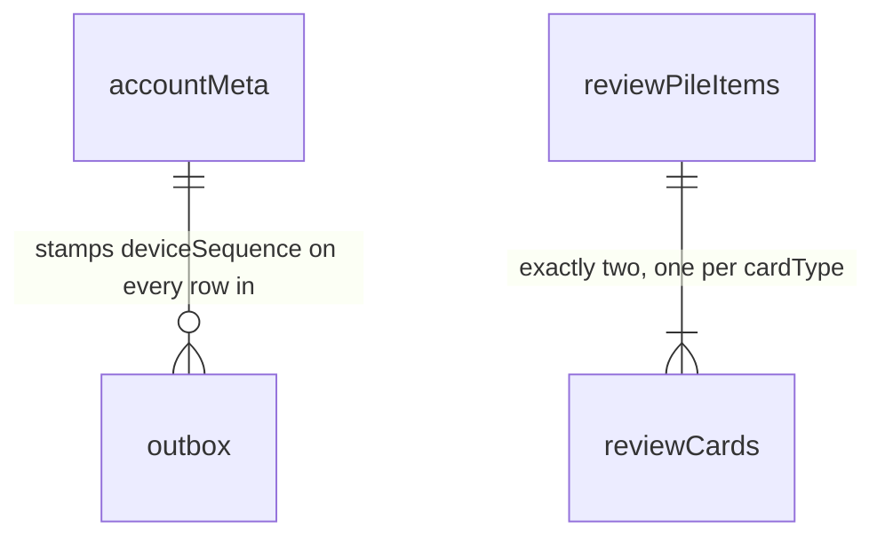

# IndexedDB tables and schemas

What StudyEngine stores in the browser, and why each table and column
exists.

One caveat before anything else: every other file in this folder answers
"what do I call, and what do I get back." This one doesn't — a host never
opens these databases or reads a row. It's here because "what's actually on
disk" is what people ask first when they want to know how offline, sync, and
eviction really behave.

## 1. The tables

Two databases:

```text
kh-study-engine-meta-v1              one per browser: which accounts are cached here
kh-study-engine-account-<cacheId>    one per cached account: everything that account owns
```

The split is so that forgetting an account is one `deleteDatabase` call
rather than a delete sweep across every table. Names are illustrative; the
rule that isn't is that **no database name contains an email address or a
raw account ID**, since names are readable without opening anything.

### The metadata database — 2 stores

```ts
// Exactly one row, key "singleton".
interface BrowserMetaRow {
  key: "singleton";
  schemaVersion: number; // shape of this database, for migrations
  activeCacheId: string | null; // which cache is signed in; null when signed out
  maximumTotalAccountCacheCount: number; // default 2, including the active one — see FAQ
  lastObservedWallTime: UnixMs; // last clock reading seen, to notice a large backwards jump
  logoutPending: boolean; // a logout started and didn't finish; complete it on next start
}

// One row per account cache retained on this browser.
interface AccountCacheRow {
  localCacheId: string; // random; this is the <cacheId> in the database name
  accountId: AccountId; // the backend account this cache belongs to
  databaseName: string;
  databaseSchemaVersion: number;
  createdAt: UnixMs;
  lastActivatedAt: UnixMs; // drives eviction
  lastOpenedAt: UnixMs; // diagnostics only; does NOT drive eviction
  state: "active" | "inactive" | "locked";
  lockReason?: "migration_failed" | "corrupt"; // set only when state is "locked"
}
```

`localCacheId` is what keeps `accountId` out of the database name: the
mapping from random ID to real account lives inside a database, where
reading it at least requires opening one.

No notes, no bookmarks, no card state, no session token, and no
JavaScript-readable credential live here. The signed entitlement lease may,
which is what lets an offline restart know the account is still paid up.

### The account database — 9 tables

```ts
interface AccountDatabaseTables {
  // Identity and sync position
  accountMeta: AccountMetaRow; // 1

  // State the user edits
  notes: KanjiNoteRow; // 2
  bookmarks: KanjiBookmarkRow; // 3
  reviewPileItems: ReviewPileItemRow; // 4
  reviewCards: ReviewCardRow; // 5
  reviewSettings: ReviewSettingsRow; // 6

  // Counts the backend derives; no local writer
  dailySummaries: DailySummaryRow; // 7
  challengeSummaries: ChallengeSummaryRow; // 8

  // Written locally, not yet acknowledged by the server
  outbox: OutboxRow; // 9
}
```

Almost nothing here points at anything else — see the F.A.Q. The two
relationships that exist:



**`accountMeta`** — who this database is, and where sync left off.

```ts
// Exactly one row, key "singleton".
interface AccountMetaRow {
  key: "singleton";
  accountId: AccountId; // checked on open; a mismatch means this cache must not be used
  deviceId: DeviceId; // assigned by the backend on first bootstrap; opaque and random

  // The local sequence space. Every outbox row takes the next number,
  // allocated in the same transaction that writes it, so two tabs can't
  // hand out the same one.
  nextDeviceSequence: number;
  acceptedThroughDeviceSequence: number; // the server has confirmed everything up to here

  cursor: ServerCursor; // how far this cache has consumed the account's history; opaque

  // Present only during a bootstrap. Their presence is what marks this
  // database "not safe to read or write yet".
  activeBootstrapId?: string;
  bootstrapSnapshotRevision?: number;
}
```

This is the only place device identity lives. There's no `devices` table —
a browser profile is exactly one device.

**`notes`** — one Markdown note per kanji.

```ts
interface KanjiNoteRow {
  kanji: Kanji; // primary key
  content: string; // never empty while active
  contentUtf8Bytes: number; // precomputed so a size check doesn't re-encode the string
  updatedAt: UnixMs;

  // Who wrote it — the tiebreaker when two devices edited at the same
  // millisecond, so both converge on the same ordering.
  writerDeviceId: DeviceId;
  writerDeviceSequence: number;

  baseServerRevision: number; // what this edit was based on; how divergence is detected
  serverRevision?: number; // absent until this note has synced once
  active: boolean; // false means removed — the row stays, see FAQ

  hasMergedEdit: boolean; // the backend joined a divergent edit into `content`
  mergedAt?: UnixMs; // set only alongside hasMergedEdit
}
```

**`bookmarks`** — set membership, nothing else.

```ts
interface KanjiBookmarkRow {
  kanji: Kanji; // primary key
  updatedAt: UnixMs;
  writerDeviceId: DeviceId;
  writerDeviceSequence: number;
  baseServerRevision: number;
  serverRevision?: number;
  active: boolean; // false means un-bookmarked
}
```

No word, no reading, no meaning. The host resolves all of that from its own
data — see [bookmark-public-api.md](./bookmark-public-api.md).

**`reviewPileItems`** — one row per kanji ever added to the pile.

```ts
interface ReviewPileItemRow {
  kanji: Kanji; // primary key
  word: string; // the word these cards test, frozen at add time
  generation: number; // increments on each re-add — see FAQ
  createdAt: UnixMs;
  createdByDeviceId: DeviceId;
  removedAt?: UnixMs;
  removedByDeviceId?: DeviceId;
  serverRevision?: number;
  active: boolean;
}
```

**`reviewCards`** — two rows per active pile item.

```ts
interface ReviewCardRow {
  kanji: Kanji; // with cardType, the primary key
  cardType: "reading" | "writing";
  generation: number; // must match its pile item's
  cardRevision: number; // bumps on every change; this is what `expectedRevision` checks

  // The scheduler's whole memory of this card. Nulled when deactivated, so
  // an inactive card costs tens of bytes instead of hundreds.
  state: FsrsCardStateV1 | null;

  counters: ReviewCounters; // lifetime totals, kept even when `state` is nulled
  serverRevision?: number;
  active: boolean;
}

interface FsrsCardStateV1 {
  schemaVersion: 1;
  schedulerAlgorithm: "fsrs";
  schedulerVersion: string; // a mismatch is a migration, not a silent reinterpretation
  dueAt: UnixMs;
  lastReviewAt: UnixMs | null;
  stability: number; // roughly, days until recall drops to the target retention
  difficulty: number; // 1..10
  elapsedDays: number;
  scheduledDays: number;
  learningStep: number; // index into the configured learning/relearning steps
  repetitions: number;
  lapses: number;
  learningState: "new" | "learning" | "review" | "relearning";
}

interface ReviewCounters {
  reviews: number; // every grade this card has ever received
  lapses: number;
  again: number; // the four below break `reviews` down by rating
  hard: number;
  good: number;
  easy: number;
}
```

No local review-history ring. The backend keeps a bounded window per card
for conflict replay; nothing on the client reads it, so a copy here would
mean maintaining two implementations of one structure.

**`reviewSettings`** — one row, shared by both card types.

```ts
// Exactly one row, key "singleton".
interface ReviewSettingsRow {
  key: "singleton";
  schemaVersion: 1;
  schedulerVersion: string;
  settings: ReviewSettings; // the values exposed as-is on ReviewsApi.settings
  settingsRevision: number; // monotonic; applied forward only, never backwards
  updatedAt: UnixMs;
  origin: "device" | "server"; // a server write beats a device write at the same instant
  writerDeviceId?: DeviceId; // absent when origin is "server"
  writerDeviceSequence?: number;
  serverRevision?: number;
}
```

No settings history table: replay applies the winning current settings
across its short window, so older versions have no reader.

**`dailySummaries`** — one row per local day with activity.

```ts
interface DailySummaryRow {
  schemaVersion: 1;
  localDate: LocalDate; // primary key; the device's local day at the time of practice
  timeZonesSeen: readonly IanaTimeZone[]; // bounded; nothing reads this today — see FAQ

  speedKatakanaSessions: number;
  speakingPracticeSessions: number;
  readingPracticeRounds: number;
  writingPracticeRounds: number;

  readingCardsReviewed: number;
  writingCardsReviewed: number;
  ratingAgain: number;
  ratingHard: number;
  ratingGood: number;
  ratingEasy: number;

  firstActivityAt: UnixMs; // widened as facts arrive; not exposed publicly
  lastActivityAt: UnixMs;
  serverRevision: number; // never optional — a device cannot create this row
}
```

**`challengeSummaries`** — one row per challenge attempted.

```ts
interface ChallengeScoreRecord {
  eventId: string; // tiebreaker when two attempts hit the same value
  value: number;
  achievedAt: UnixMs;
}

// One shape per activityType, matching the public ChallengeSummary union.
type ChallengeSummaryRow =
  | SpeedKatakanaChallengeSummaryRow
  | SpeakingPracticeChallengeSummaryRow;

interface SpeedKatakanaChallengeSummaryRow {
  schemaVersion: 1;
  activityType: "speed_katakana"; // with challengeId, the primary key
  challengeId: string;
  attemptCount: number;
  latest: {
    eventId: string;
    occurredAt: UnixMs;
    accuracyPercent: number;
    charactersPerMinute: number;
  };
  bestAccuracy: ChallengeScoreRecord;
  bestCharactersPerMinute: ChallengeScoreRecord;
  bestCharactersPerMinuteAbove70Accuracy?: ChallengeScoreRecord; // absent until one clears 70%
  serverRevision: number;
}

interface SpeakingPracticeChallengeSummaryRow {
  schemaVersion: 1;
  activityType: "speaking_practice";
  challengeId: string;
  attemptCount: number;
  serverRevision: number;
}
```

**`outbox`** — the only thing on disk the server hasn't seen.

```ts
interface OutboxRow {
  deviceSequence: number; // primary key; from accountMeta.nextDeviceSequence
  operationId: string; // stable across retries — this is what makes a retry safe
  kind:
    | "note_put"
    | "note_remove"
    | "bookmark_add"
    | "bookmark_remove"
    | "review_settings_update"
    | "review_pile_add"
    | "review_pile_remove"
    | "review_grade"
    | "practice_activity_event_add";
  payload: unknown; // narrowed by `kind` internally — see FAQ
  createdAt: UnixMs;
  state: "pending" | "sending"; // a crashed "sending" row returns to "pending" on startup
  attemptCount: number; // diagnostics and backoff
}
```

One outbox, one sequence space, one acknowledgement path. Rows are deleted
only when the server confirms a sequence at or above theirs.

### Indexes

```text
notes:               &kanji, serverRevision, active
bookmarks:           &kanji, serverRevision, active
reviewPileItems:     &kanji, generation, serverRevision, active
reviewCards:         &[kanji+cardType], [cardType+dueAt], generation, serverRevision, active
dailySummaries:      &localDate, serverRevision
challengeSummaries:  &[activityType+challengeId], serverRevision
outbox:              &deviceSequence, operationId, state
```

`&` marks the primary key. Every table has a `serverRevision` index for one
reason: applying a pull means finding rows by revision. `[cardType+dueAt]`
is the only index here that serves a user-facing query — building a due
queue.

## 2. F.A.Q

**Why one database per account instead of one database with an `accountId`
column on every row?**
Because "forget this account" becomes a single `deleteDatabase` that can't
half-succeed, rather than a sweep across nine tables that can be
interrupted, miss a row, or leave one account's data visible to another
after a bug. The wrong account's data is never one missing `WHERE` clause
away.

**Why are there almost no relationships between these tables?**
Because each is keyed by something the domain already guarantees is unique
and bounded — a kanji, a local date, a challenge ID. Nothing needs a
generated ID to point at, so nothing needs a foreign key. The one real
parent/child pair is a pile item and its two cards, and even that is
expressed by sharing `kanji`.

**Why does a deleted note or bookmark stay with `active: false`?**
Because a device offline for a month has to be able to learn about the
deletion, and a row that's been physically removed can't show up in
"everything that changed since revision N." The usual fix is a tombstone
table, which needs garbage collection, which needs every device's position
tracked before anything can be reclaimed. Keeping the row and flipping a
boolean deletes all three. The cost: rows are never reclaimed — bounded by
the kanji set, so an account that bookmarked and un-bookmarked everything
keeps a few thousand tiny rows.

**Why is `generation` a column instead of part of the key?**
So removing and re-adding a kanji fifty times makes one row, not fifty. The
protection is unchanged: a grade carries the generation it was based on, and
one based on generation 4 can never apply to generation 5 — that check reads
the value, not the row's identity.

**Why is `serverRevision` optional on notes and bookmarks but required on
the summaries?**
A note or bookmark can exist locally before reaching the server — written
offline, still in the outbox. A summary can't: it only exists once the
backend derives it, so by the time a device has one it has a revision.

**Why store the summaries locally at all if the backend owns them?**
So opening the app on a plane shows last month's heatmap instead of a
spinner. They're a cache of a server-owned value, which is why they have no
local writer and no `active` column.

**Then how does a count update the instant a round ends, before sync?**
The row is recomputed, not patched: what's displayed is the last server
value with any still-unacknowledged outbox operations for that key replayed
on top. Patching in place breaks as soon as a server value arrives while
some grades are pending — it would either double-count the acknowledged ones
or drop the pending ones. Recomputing is right in both directions.

**Why does `dailySummaries` carry `timeZonesSeen` when nothing reads it?**
It shouldn't, by this folder's own rule about fields with no reader — worth
saying plainly rather than dressing it up as "informational." It's collected
so that a future streak or travel-aware feature has the history, and the
review of the original documents flagged the same thing, along with the
related open question of what `daysActive` and `cakeDay` should do when
someone flies east and loses a day. Until that policy exists, this column is
write-only.

**Why is the table `dailySummaries` when the public type is
`ActivitiesSummary`?**
Every row here genuinely is one day, keyed by `localDate`. The public type
was renamed because it's reused for all-time totals, where "daily" was
misleading. There's no such reuse here, so the specific name is the accurate
one.

**Where are all-time totals? There's no `allTime` table.**
Deliberately none. `watchAllTime()` walks `dailySummaries` — `cakeDay` is
the earliest row, `daysActive` is the row count, the rest are sums — bounded
by the account's age in days. Worth being precise about what the activity
API means by "cheap": a _host_ doesn't fetch and sum years of rows across
the API boundary, not that the engine skips the scan. If that scan ever
becomes the slow part, the fix is a cached aggregate on the `accountMeta`
singleton, which is already read on startup, rather than a tenth table.

**Is it nine tables or eight?**
Nine. The original document says "eight" directly above a list of nine, in
two places — item 7 in the P3 contradictions table of the design review
above. Repeating the correct count here so this file doesn't inherit it.

**Why is `outbox.payload` typed `unknown` rather than a union?**
It is a union internally, narrowed by `kind`. It's `unknown` at the table
boundary because stored bytes and the live TypeScript type drift across an
engine upgrade — a row written by yesterday's build has to be readable by
today's. Forcing stored data to satisfy the current compile-time type is how
a migration becomes silent corruption.

**Why do notes and bookmarks share an outbox with grades and practice
events, when they're such different things?**
They are different, and the design leans on that. Grades and practice events
are **facts** — immutable records of something that happened, which never
conflict with each other, and from which the backend derives card state and
summaries. The rest are **state intents** — a desired value for something
mutable, resolved by last-writer-wins or, for notes, by merging. Sharing one
table and one sequence space is what keeps ordering and retry correct; it
isn't a claim they're the same kind of thing.

**Why one outbox rather than a separate one for raw events?**
Because the backend derives card state and summaries from facts, so it needs
the fact inside the sync transaction — a second pipeline couldn't deliver
that. One outbox also means one backoff and one acknowledgement path, and
removes the state where notes have synced but events are still queued
locally.

**Four tables an implementer will look for and not find.**
A note conflicts table: divergent edits merge into the note itself. A sync
staging table: a pull response is bounded and applied from memory in one
transaction, which already gives the atomicity staging would, at half the
writes. A bootstrap page table: pages write straight into the live tables
while the database is gated as `bootstrapping`, so a partial state is
unobservable without a second copy. A review lease table: an open review is
an in-memory handle, and a reload correctly discarding it is the point.

**Why two account caches, and is that settled?**
Not settled. `maximumTotalAccountCacheCount` defaults to 2 so that switching
between two accounts doesn't re-bootstrap each time. The design review
argues for cutting it to one: the eviction algorithm, LRU semantics, the
displacement rule, and a contingent logout default all exist to avoid one
re-bootstrap of an account measured in hundreds of kilobytes, for a case
that's speculative in a single-user study app. `AccountCacheRow` survives
either way — the opaque-ID mapping and the `locked` state are needed
regardless. Documenting what's specified today and flagging that the number
is under review, rather than picking a side here.

**What happens to these tables when a migration fails?**
The database closes, its cache row is marked `locked` with a reason, and a
diagnostic ID surfaces. It is specifically not deleted — a locked cache may
hold unsynced outbox rows, which is exactly the data hardest to recover. It
also can't be evicted automatically to make room; if every removable slot is
locked, the engine returns a storage error instead of deleting anything.
