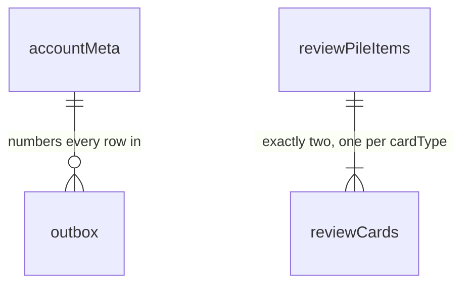

# IndexedDB tables and schemas

What StudyEngine stores in the browser: every table, and what every column
is for. A host never opens these databases — this is here so "what's
actually on disk" has an answer.

## 1. The tables

Two databases. One per browser for bookkeeping, one per cached account for
that account's data, so that forgetting an account is a single
`deleteDatabase` rather than a delete sweep across every table.

```text
kh-study-engine-meta-v1              which accounts are cached on this browser
kh-study-engine-account-<cacheId>    everything one account owns
```

`<cacheId>` is a random ID, never an email address or account ID — database
names are readable without opening anything.

### The metadata database — 2 stores

**`browserMeta`** — one row, the state of this browser as a whole.

```ts
interface BrowserMetaRow {
  key: "singleton";
  schemaVersion: number; // shape of this database, for migrations
  activeCacheId: string | null; // which cache is signed in; null when signed out
  maximumTotalAccountCacheCount: number; // default 2; under review, may become 1
  lastObservedWallTime: UnixMs; // last clock reading, to notice a large backwards jump
  logoutPending: boolean; // a logout didn't finish; complete it on next start
}
```

**`accountCaches`** — one row per account database kept on this browser.

```ts
interface AccountCacheRow {
  localCacheId: string; // the <cacheId> in the database name
  accountId: AccountId; // which account this cache holds
  databaseName: string; // the database to open
  databaseSchemaVersion: number;
  createdAt: UnixMs;
  lastActivatedAt: UnixMs; // last time this account signed in; decides what gets evicted
  lastOpenedAt: UnixMs; // diagnostics only; does not affect eviction
  state: "active" | "inactive" | "locked";
  lockReason?: "migration_failed" | "corrupt"; // only when locked
}
```

No study data lives here — no notes, bookmarks, cards, or session token. It
may hold the signed entitlement lease, which is what lets an offline restart
know the account is still paid up.

### The account database — 9 tables

```ts
interface AccountDatabaseTables {
  accountMeta: AccountMetaRow; // 1  identity and sync position
  notes: KanjiNoteRow; // 2  state the user edits
  bookmarks: KanjiBookmarkRow; // 3
  reviewPileItems: ReviewPileItemRow; // 4
  reviewCards: ReviewCardRow; // 5
  reviewSettings: ReviewSettingsRow; // 6
  dailySummaries: DailySummaryRow; // 7  counts the backend derives
  challengeSummaries: ChallengeSummaryRow; // 8
  outbox: OutboxRow; // 9  written locally, not yet acknowledged
}
```



Those are the only two relationships. Every other table is keyed by
something the domain already guarantees is unique — a kanji, a local date, a
challenge ID — so nothing needs a foreign key.

**1. `accountMeta`** — who this database belongs to, and where sync left
off. One row.

```ts
interface AccountMetaRow {
  key: "singleton";
  accountId: AccountId; // checked on open; a mismatch means don't use this cache
  deviceId: DeviceId; // assigned by the backend on first bootstrap

  nextDeviceSequence: number; // the number the next outbox row will take
  acceptedThroughDeviceSequence: number; // the server has confirmed everything up to here
  cursor: ServerCursor; // how far this cache has consumed the account's history

  activeBootstrapId?: string; // present only mid-bootstrap; marks the database unsafe to read
  bootstrapSnapshotRevision?: number; // the revision that bootstrap is filling up to
}
```

This is the only place device identity lives. There is no `devices` table —
a browser profile is one device.

**2. `notes`** — one Markdown note per kanji.

```ts
interface KanjiNoteRow {
  kanji: Kanji; // primary key
  content: string; // the note text; never empty while active
  contentUtf8Bytes: number; // its size, precomputed so a check doesn't re-encode the string
  updatedAt: UnixMs; // when this text was written

  writerDeviceId: DeviceId; // which device wrote it
  writerDeviceSequence: number; // together with the above, breaks ties between simultaneous edits

  baseServerRevision: number; // what this edit was based on; how the backend spots divergence
  serverRevision?: number; // absent until this note has synced once
  active: boolean; // false means removed; the row stays

  hasMergedEdit: boolean; // the backend joined another device's edit into `content`
  mergedAt?: UnixMs; // when that happened
}
```

**3. `bookmarks`** — which kanji are bookmarked. Membership only; the host
supplies the word, reading, and meaning from its own data.

```ts
interface KanjiBookmarkRow {
  kanji: Kanji; // primary key
  updatedAt: UnixMs;
  writerDeviceId: DeviceId; // which device set it
  writerDeviceSequence: number; // tiebreaker
  baseServerRevision: number;
  serverRevision?: number; // absent until synced once
  active: boolean; // false means un-bookmarked
}
```

**4. `reviewPileItems`** — one row per kanji ever added to the review pile.

```ts
interface ReviewPileItemRow {
  kanji: Kanji; // primary key
  word: string; // the word its cards test, frozen at add time so a data update can't change it
  generation: number; // increments on each re-add, so a stale grade can't hit a fresh card
  createdAt: UnixMs;
  createdByDeviceId: DeviceId;
  removedAt?: UnixMs;
  removedByDeviceId?: DeviceId;
  serverRevision?: number;
  active: boolean; // false means removed from the pile
}
```

**5. `reviewCards`** — the scheduler's state. Two rows per active pile item,
one reading and one writing.

```ts
interface ReviewCardRow {
  kanji: Kanji; // with cardType, the primary key
  cardType: "reading" | "writing";
  generation: number; // must match its pile item's
  cardRevision: number; // bumps on every change; what `expectedRevision` checks against
  state: FsrsCardStateV1 | null; // the schedule; nulled when the card is deactivated
  counters: ReviewCounters; // lifetime totals, kept even when `state` is nulled
  serverRevision?: number;
  active: boolean;
}

interface FsrsCardStateV1 {
  schemaVersion: 1;
  schedulerAlgorithm: "fsrs";
  schedulerVersion: string; // which scheduler produced this state
  dueAt: UnixMs; // when this card comes up next
  lastReviewAt: UnixMs | null; // null until first graded
  stability: number; // roughly, days until recall drops to the target retention
  difficulty: number; // 1..10, how hard this card is for this user
  elapsedDays: number; // days since the last review, as of that review
  scheduledDays: number; // the interval that was intended between the last two reviews
  learningStep: number; // position in the configured learning/relearning steps
  repetitions: number; // times graded
  lapses: number; // times this card fell back to relearning
  learningState: "new" | "learning" | "review" | "relearning";
}

interface ReviewCounters {
  reviews: number; // every grade this card has ever received
  lapses: number;
  again: number; // the four below break `reviews` down by rating
  hard: number;
  good: number;
  easy: number;
}
```

**6. `reviewSettings`** — the FSRS settings, shared by both card types. One
row.

```ts
interface ReviewSettingsRow {
  key: "singleton";
  schemaVersion: 1;
  schedulerVersion: string;
  settings: ReviewSettings; // the values ReviewsApi.settings exposes as-is
  settingsRevision: number; // monotonic; applied forward only
  updatedAt: UnixMs;
  origin: "device" | "server"; // a server write wins over a device write at the same instant
  writerDeviceId?: DeviceId; // absent when origin is "server"
  writerDeviceSequence?: number;
  serverRevision?: number;
}
```

**7. `dailySummaries`** — activity counts, one row per local day that had
any. Days with nothing have no row.

```ts
interface DailySummaryRow {
  schemaVersion: 1;
  localDate: LocalDate; // primary key; the device's local day when the activity happened
  timeZonesSeen: readonly IanaTimeZone[]; // which zones contributed; nothing reads this yet

  speedKatakanaSessions: number; // practice counts
  speakingPracticeSessions: number;
  readingPracticeRounds: number;
  writingPracticeRounds: number;

  readingCardsReviewed: number; // FSRS review counts
  writingCardsReviewed: number;
  ratingAgain: number; // those reviews broken down by rating
  ratingHard: number;
  ratingGood: number;
  ratingEasy: number;

  firstActivityAt: UnixMs; // earliest and latest activity that day; not exposed publicly
  lastActivityAt: UnixMs;
  serverRevision: number; // never optional — a device can't create this row
}
```

**8. `challengeSummaries`** — per-challenge records for the challenge-based
games. One row per challenge attempted, one shape per activity type.

```ts
interface ChallengeScoreRecord {
  eventId: string; // which attempt set it; breaks ties on equal values
  value: number;
  achievedAt: UnixMs;
}

type ChallengeSummaryRow =
  | SpeedKatakanaChallengeSummaryRow
  | SpeakingPracticeChallengeSummaryRow;

interface SpeedKatakanaChallengeSummaryRow {
  schemaVersion: 1;
  activityType: "speed_katakana"; // with challengeId, the primary key
  challengeId: string;
  attemptCount: number; // completed sessions for this challenge
  latest: {
    // the most recent attempt
    eventId: string;
    occurredAt: UnixMs;
    accuracyPercent: number;
    charactersPerMinute: number;
  };
  bestAccuracy: ChallengeScoreRecord;
  bestCharactersPerMinute: ChallengeScoreRecord;
  bestCharactersPerMinuteAbove70Accuracy?: ChallengeScoreRecord; // absent until one clears 70%
  serverRevision: number;
}

interface SpeakingPracticeChallengeSummaryRow {
  schemaVersion: 1;
  activityType: "speaking_practice";
  challengeId: string;
  attemptCount: number; // the only stat speaking practice tracks
  serverRevision: number;
}
```

**9. `outbox`** — everything written locally that the server hasn't
acknowledged. One row per mutation.

```ts
interface OutboxRow {
  deviceSequence: number; // primary key; taken from accountMeta.nextDeviceSequence
  operationId: string; // stable across retries, so a resend isn't applied twice
  kind:
    | "note_put"
    | "note_remove"
    | "bookmark_add"
    | "bookmark_remove"
    | "review_settings_update"
    | "review_pile_add"
    | "review_pile_remove"
    | "review_grade"
    | "practice_activity_event_add";
  payload: unknown; // the operation's data, narrowed by `kind` internally
  createdAt: UnixMs;
  state: "pending" | "sending"; // a crashed "sending" row returns to "pending" on startup
  attemptCount: number; // how many sends have been tried; drives backoff
}
```

### Indexes

```text
notes:               &kanji, serverRevision, active
bookmarks:           &kanji, serverRevision, active
reviewPileItems:     &kanji, generation, serverRevision, active
reviewCards:         &[kanji+cardType], [cardType+dueAt], generation, serverRevision, active
dailySummaries:      &localDate, serverRevision
challengeSummaries:  &[activityType+challengeId], serverRevision
outbox:              &deviceSequence, operationId, state
```

`&` marks the primary key. The `serverRevision` indexes exist because
applying a sync means finding rows by revision. `[cardType+dueAt]` is the
only one serving a user-facing query — building a due queue.

## 2. F.A.Q

**Why does a deleted note or bookmark stay in the table with
`active: false`?**
A device that was offline for a month has to learn about the deletion, and a
row that's been physically removed can't show up in "everything that changed
since revision N." Keeping the row and flipping a boolean avoids tombstones
and the garbage collection they'd need. Rows are never reclaimed, but
they're bounded by the kanji set.

**Why is `serverRevision` optional on some tables and required on others?**
A note or bookmark can exist locally before reaching the server — written
offline, still in the outbox. A summary can't: it only exists once the
backend derives it.

**Why store the summaries locally if the backend owns them?**
So the heatmap works offline. They're a cache, which is why they have no
local writer and no `active` column. Before a sync, what's displayed is the
last server value with any still-pending outbox operations replayed on top.

**Where are all-time totals? There's no table for them.**
Computed from `dailySummaries` — earliest row is the cake day, row count is
days active, the rest are sums. Bounded by the account's age in days.

**Is it nine tables or eight?**
Nine. The original design document says "eight" directly above a list of
nine, in two places.
