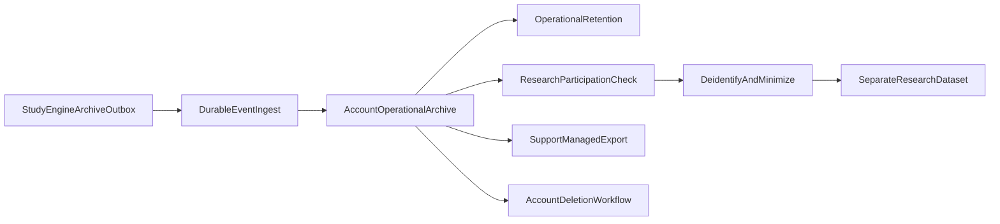
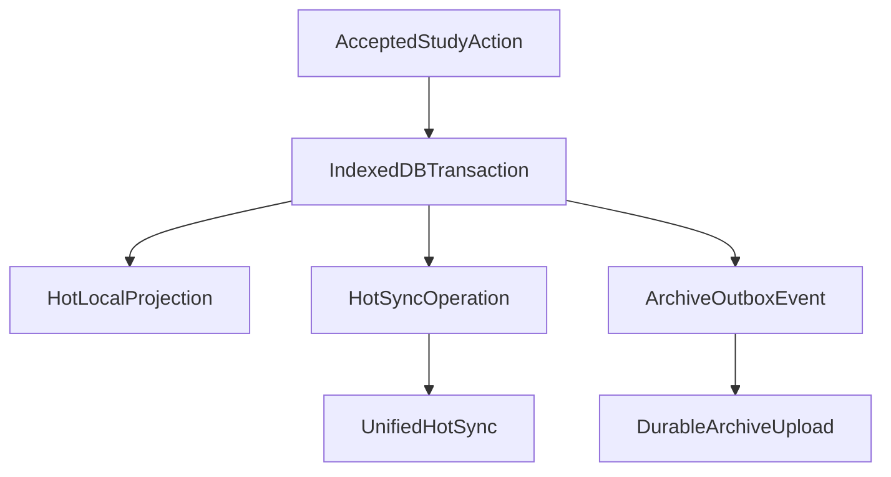
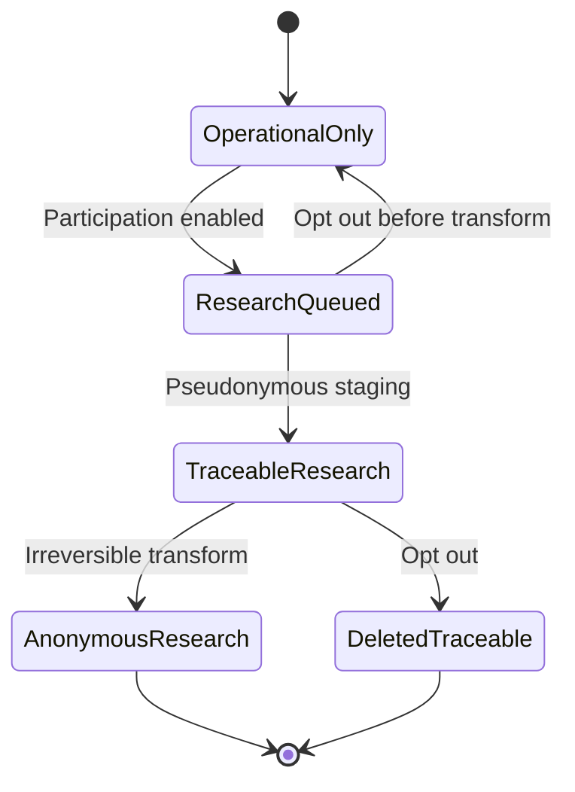
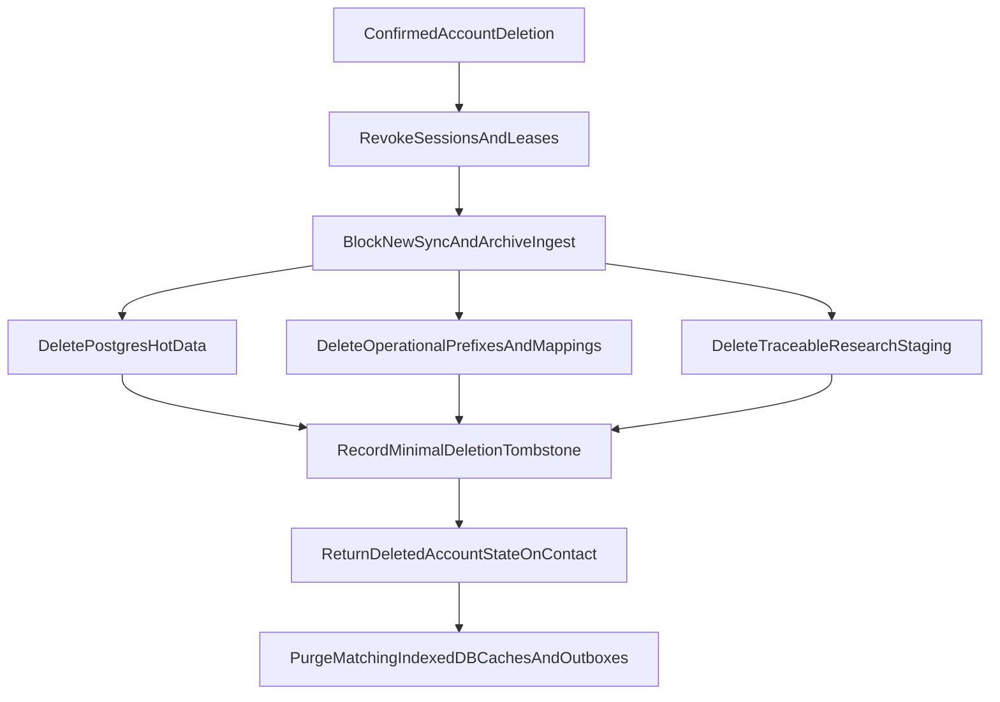

# Archives and Privacy

This document owns raw-event durability, operational and research archive
separation, note-conflict cold history, retention, opt-out behavior, export and
deletion boundaries, and privacy limitations.

It is an engineering specification, not legal advice. Launch policy requires
market-specific privacy review.

## Two archives with different purposes

The design has two intentionally separate datasets:

1. **Operational archive**

   - Account-associated.
   - Contains accepted raw practice and FSRS review events.
   - May contain displaced note conflict copies.
   - Supports support investigation, account export, audit, and future
     operational recovery features.
   - Has a backend-published retention period.
   - Is deleted with the account, subject to documented backup/deletion
     processing.

2. **Research dataset**
   - Receives transformed practice/review records only.
   - Exists for population analytics and possible future model fitting.
   - Never supports account restore or individual history display.
   - Excludes note/bookmark content and direct identity.
   - Is governed by the research participation setting and a separate
     de-identification review.

Do not reuse an operational object as “anonymous research data” by merely
dropping one column.



## Event delivery contract

The operational pipeline is durable at least once:

- Every event has a stable globally unique `eventId`.
- Every device has a monotonic archive sequence.
- The browser retains the event until acknowledged.
- Retry uses the same ID and sequence.
- The backend deduplicates.
- The backend acknowledges only after a durable queue or R2 accepts the event.
- Redis-only acceptance does not satisfy durability.

Exactly-once network delivery is neither required nor realistic. Exactly-once
materialization is achieved by idempotent event IDs.

## Local archive outbox

Practice and review transactions append raw events in the same local
transaction as their hot projections:



Hot and archive paths have independent acknowledgements. An archive outage:

- does not block hot sync;
- does not invalidate already committed study work;
- leaves raw events in the local archive outbox;
- exposes pending count, bytes, oldest age, and degraded status;
- retries with independent backoff.

The user may continue studying while new archive events can still be committed
locally. If storage quota prevents that durable local write, the mutation
returns `storage_quota`; the engine must not silently drop a promised event.

## Operational event envelope

All operational objects use a versioned envelope:

```ts
interface OperationalEventEnvelopeV1<TType extends string, TPayload> {
  archiveSchemaVersion: 1;
  eventId: string;
  eventType: TType;

  accountArchiveKey: string;
  deviceArchiveKey: string;
  deviceSequence: number;

  occurredAt: UnixMs;
  receivedAt: UnixMs;
  localDate: LocalDate;
  timeZone?: IanaTimeZone;

  engineVersion: string;
  applicationId: string;
  catalogVersion: string;
  schedulerVersion?: string;

  payload: TPayload;
}
```

`accountArchiveKey` and `deviceArchiveKey` are backend-generated opaque keys,
not email addresses or public account/device IDs. Postgres retains the mapping
needed for export/deletion. Removing direct IDs does not make the operational
record anonymous; it remains intentionally account-associated.

The backend overrides account/device keys from authenticated context. It never
trusts client-supplied archive ownership.

## Operational event types

### Practice

Version-one raw practice events mirror the validated contract union:

```text
speed_katakana_session_completed
reading_practice_round_completed
writing_practice_round_completed
```

They may include:

- start/end/occurrence instants;
- local date/time zone;
- typed challenge/session settings;
- score inputs such as accuracy and CPM;
- counts needed to explain the hot summary;
- event schema and app version.

Do not include rendered screen content, arbitrary host state, IP address in the
payload, browser fingerprint, or unrelated settings.

Future speaking/shadowing variants require a new typed schema and privacy
review before collection.

### FSRS review

A raw review event may include:

- card/pile generation archive keys;
- kanji and reading/writing type;
- rating;
- adjusted and reported review instants;
- prior and provisional card state;
- settings/scheduler versions;
- elapsed/scheduled days;
- stability/difficulty;
- event predecessor and base revision;
- backend merge outcome such as replay, direct apply, LWW winner, or ignored
  deleted generation.

This “fat” event supports explanation and future model analysis without
querying the current card row. It does not make the archive authoritative for
hot sync.

### Note conflict history

Notes are not research events. When the single hot note conflict slot must be
replaced:

1. Build an encrypted/account-associated conflict record.
2. Durably write it to operational cold storage.
3. Record archive object identity in the note conflict transaction.
4. Only then replace the hot conflict copy.

The cold conflict object includes kanji, losing Markdown content, canonical
revision at displacement, writer metadata, and timestamps. It is exportable
and deleted with the account. It is never sent to research transformation.

## R2 object layout

One possible logical layout:

```text
operational/v1/accounts/<accountArchiveKey>/events/<yyyy>/<mm>/<batchId>.jsonl.zst
operational/v1/accounts/<accountArchiveKey>/note-conflicts/<yyyy>/<objectId>.json.zst
operational/v1/accounts/<accountArchiveKey>/exports/<exportId>.zip

research/v1/reviews/<yyyy>/<mm>/<partitionId>.parquet
research/v1/practice/<eventType>/<yyyy>/<mm>/<partitionId>.parquet
```

File formats are replaceable implementation details, but objects must have:

- schema version;
- record count;
- uncompressed byte count;
- content checksum;
- creation time;
- retention class;
- encryption metadata;
- no secrets in object names.

Batch small events to avoid per-event object cost. Batch boundaries do not
affect event identity or deduplication.

Operational and research data should use separate buckets or strict prefixes
with separate IAM policies, lifecycle rules, and audit logs. A research worker
should not need permission to read note conflicts.

## Durable acceptance options

The backend may acknowledge after either:

1. A durable queue accepts the validated event batch, and a retrying consumer
   writes R2.
2. R2 directly writes an idempotent batch object before response.
3. A transactional Postgres delivery outbox commits, followed by a retrying R2
   worker.

If using a Postgres delivery outbox, it is short-lived infrastructure, not a
permanent user event table. Monitor its oldest undelivered row and delete rows
after verified R2 persistence.

Redis may cache or coalesce work but cannot be the only accepted copy.

## Archive sequence and deduplication

For each registered device, the backend stores:

```ts
interface ArchiveDeviceState {
  deviceId: DeviceId;
  acceptedThroughArchiveSequence: number;
  lastAcceptedAt: UnixMs;
}
```

The browser sends contiguous batches. Handling:

- A batch beginning at high-water + 1 is validated and accepted atomically.
- An exact/old retry is deduplicated by sequence and event ID.
- A gap is rejected without advancing.
- Reusing a sequence with a different event ID is a protocol integrity error.
- Reusing an event ID with different content is an integrity/security error.

The durable sink should keep an event-ID dedupe index or deterministic object
key long enough to cover client retry windows. Sequence high-water handles the
normal case; content hash guards inconsistent duplicates.

## Operational retention

Retention is backend-published policy, not hardcoded in the shared contract.

The policy response should state:

```ts
interface OperationalRetentionPolicy {
  policyVersion: string;
  rawPracticeEventDays: number;
  rawReviewEventDays: number;
  displacedNoteConflictDays: number;
  exportBundleDays: number;
  deletionSlaDays: number;
}
```

The UI may display this policy, but StudyEngine does not provide legal copy.

Lifecycle rules:

- Set R2 object lifecycle metadata at write time.
- Do not extend retention silently when rewriting/compacting an object.
- A compaction manifest preserves the earliest source expiry.
- Delete expired Postgres archive mappings.
- Export generation does not reset source retention.
- Operational retention expiration may make old conflict copies or raw events
  unavailable. Current hot projections remain unaffected.

## Research participation

Selected product policy:

- Research participation is enabled by default with opt-out.
- Changing the setting is a premium mutation in the first release.
- After entitlement loss, the user must contact support to opt out, export, or
  delete.

This policy has a known risk: support-only withdrawal is more difficult than
default enrollment and may fail privacy/consent requirements in some markets.
It must pass explicit legal and product review before launch. The architecture
should keep the backend endpoint capable of a future entitlement-independent
opt-out even if the first UI does not expose it.

Research state is backend-authoritative:

```ts
interface ResearchParticipation {
  state: "enabled" | "disabled";
  policyVersion: string;
  updatedAt: UnixMs;
  effectiveAfterEventId?: string;
}
```

Do not rely only on a cached client setting. The research transformer checks
current backend state immediately before transfer.

## Opt-out behavior

On opt-out:

1. Stop transferring future operational records to research.
2. Cancel queued, not-yet-transformed research work for the account.
3. Delete traceable staged or pseudonymous research records that still have a
   reversible account mapping.
4. Keep operational records under operational retention unless account
   deletion is also requested.
5. Disclose that prior records that were already irreversibly anonymized cannot
   be selected for individual deletion.



The system must not promise deletion of irreversibly anonymous records while
also retaining a hidden join key that makes that deletion possible. If a join
key exists, the data is still traceable and belongs in the traceable category.

## Research transformation

Research output must exclude:

- email, account ID, account archive key;
- device ID, device archive key, IP address;
- session cookie or entitlement data;
- note Markdown and note metadata;
- bookmarked word and bookmark metadata;
- exact object path from operational storage;
- request/diagnostic IDs that can join to server logs.

Possible retained review features, subject to review:

- card type;
- rating;
- scheduler/settings schema version;
- bucketed elapsed/scheduled days;
- bounded stability/difficulty values;
- learning state;
- coarse date bucket or no calendar date;
- relative event order within a short anonymous sample.

Possible retained practice features:

- practice type and schema version;
- challenge category that is not user-generated;
- bucketed accuracy/speed/duration;
- coarse date bucket;
- app/engine version when needed for quality analysis.

Data minimization should prefer derived/bucketed features over copying the
entire fat operational payload.

## “Anonymous” is a conclusion, not a field operation

Removing account ID and changing an exact timestamp to a date does not by
itself prove anonymity. Re-identification may use:

- upload timing and server access logs;
- rare event sequences;
- unique device or version combinations;
- object paths and batch IDs;
- retained operational-to-research mappings;
- small cohorts;
- detailed FSRS trajectories.

Required pre-release work:

- Document the research purpose and minimum fields.
- Perform a re-identification/threat assessment.
- Define minimum cohort/partition sizes.
- Review logs, backups, staging, and data warehouse copies.
- Verify access controls and deletion of temporary mappings.
- Define retention and downstream use.
- Publish accurate user disclosure.

Do not write “sidesteps GDPR erasure by construction” in production
documentation without qualified legal and technical assessment.

## Account export

The first release may fulfill exports through support, but the backend should
have a reproducible export job.

An export can contain:

- current notes and recoverable conflict copy;
- bookmarks;
- FSRS settings and current cards;
- device-owned daily/challenge summaries;
- retained operational raw events;
- retained displaced note conflicts;
- policy/version metadata.

It must not contain:

- another account's data;
- server secrets or internal fraud signals;
- anonymous research rows that can no longer be linked;
- raw cookies/PIN records.

Export bundles use short retention and authenticated/support-controlled
delivery. Creating an export must not prolong source-object retention.

## Account deletion

Confirmed backend deletion is authoritative:



The minimal deletion tombstone must contain only what is required to prevent
accidental recreation/replay and must itself have a retention policy.

If an old offline device returns:

- reject its session/device and pending operations;
- report the account-deleted state;
- purge its matching local cache;
- never replay its outbox into a new account.

Prior irreversibly anonymous research rows are not linkable for account
deletion by definition.

## Lapsed entitlement

Under the selected first-release access policy:

- Cached hot data is readable.
- New study mutations and hot sync are blocked.
- Archive upload is blocked with other authenticated premium operations.
- Pending hot/archive outboxes remain local.
- Renewal resumes both pipelines.
- Support handles opt-out, export, and deletion.

Because no new study events can be created in read-only mode, the archive
backlog cannot grow after entitlement loss. Existing operational events may
remain eligible for research transformation until support records opt-out.
This behavior must be disclosed and reviewed.

## Data security

Operational safeguards:

- TLS in transit.
- Provider/server-side encryption at rest.
- Separate IAM for operational, research, export, and deletion workers.
- No public buckets.
- Short-lived service credentials and audited access.
- Content checksums and immutable event IDs.
- Malware/content-size controls for note conflict payloads.
- Redaction of note content and event payloads from application logs.
- Backup policies aligned with deletion/retention disclosures.

Client safeguards:

- Do not place account IDs or content in console logs.
- Do not cache authenticated API responses in the service worker.
- Keep archive outbox in the isolated account database.
- Purge it on confirmed local removal or remote deletion.
- Expose storage pressure rather than silently dropping events.

Application-level IndexedDB locking is not encryption. A person with access to
the browser profile or same-origin code may inspect retained data.

## Failure and recovery

### Durable sink unavailable

- Return retryable failure without acknowledgement.
- Keep local events pending.
- Continue hot sync.
- Back off independently with jitter.
- Alert on oldest backend delivery-outbox age and client backlog telemetry.

### Partial object write or checksum mismatch

- Do not acknowledge.
- Delete/quarantine the bad object.
- Retry with the same event IDs.

### Duplicate event

- Verify matching content hash.
- Return acknowledgement without writing a second logical record.

### Research transform failure

- Keep operational source unchanged.
- Retry from a durable work record.
- Re-check participation at retry time.
- Never fall back to copying the raw operational object unchanged.

### Retention worker failure

- Alert on overdue objects.
- Do not silently alter published retention metadata.
- Run idempotent deletion repair.

## Monitoring

Track without content:

- local archive backlog count/bytes/oldest age;
- ingest batch count/bytes/latency;
- duplicate and content-mismatch rates;
- durable queue/outbox oldest age;
- R2 write/checksum failures;
- operational object count/bytes by retention class;
- research eligible/transformed/skipped/opted-out counts;
- traceable staging age;
- account deletion completion and SLA breaches;
- export generation duration/failure;
- note-conflict displacement count.

Access to operational/research monitoring must not provide a side channel for
reading user content.

## Privacy launch gates

Before collecting production research data:

1. Finalize package/service privacy roles and lawful basis.
2. Review default-with-opt-out behavior.
3. Review support-only withdrawal after entitlement loss.
4. Validate the de-identification transform and cohort thresholds.
5. Publish operational/research retention.
6. Exercise export, opt-out, and deletion end to end.
7. Verify logs/backups/staging obey the same boundaries.
8. Confirm terms accurately distinguish operational history from research use.

If these gates are incomplete, operational archival may launch without
research transformation. Research is optional to core sync correctness.
