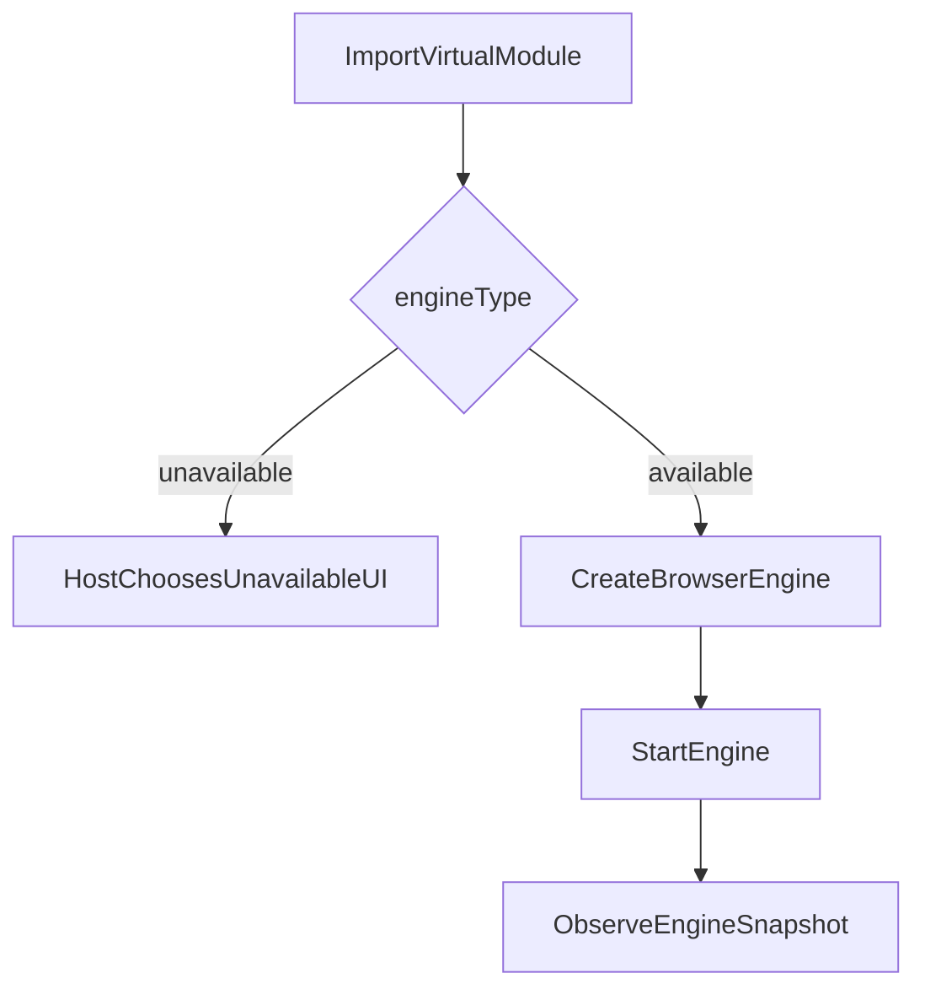
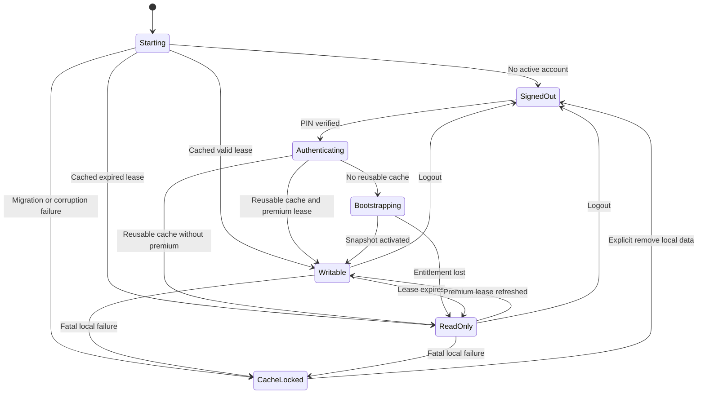
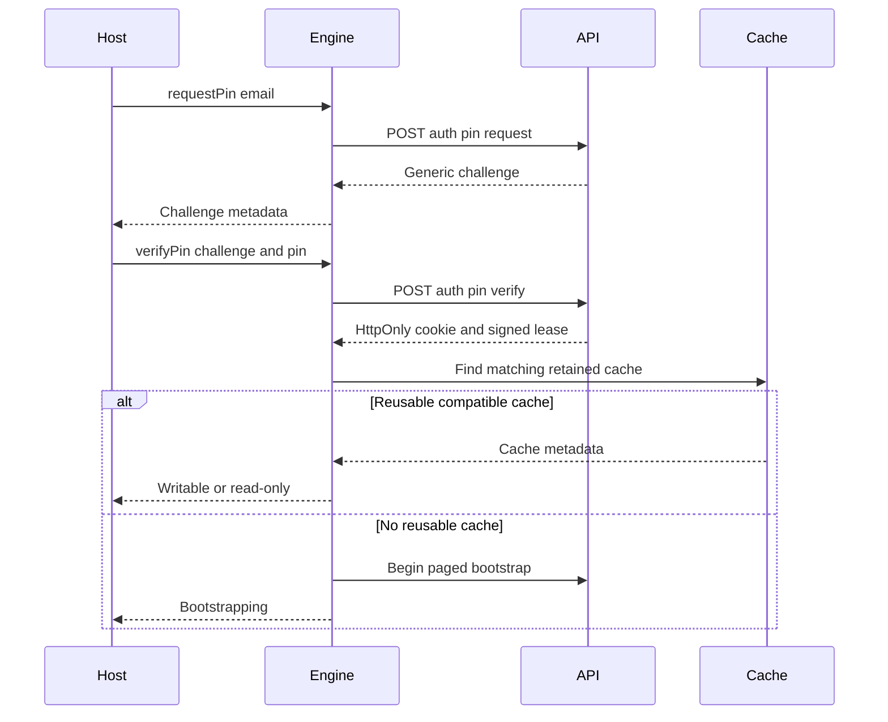
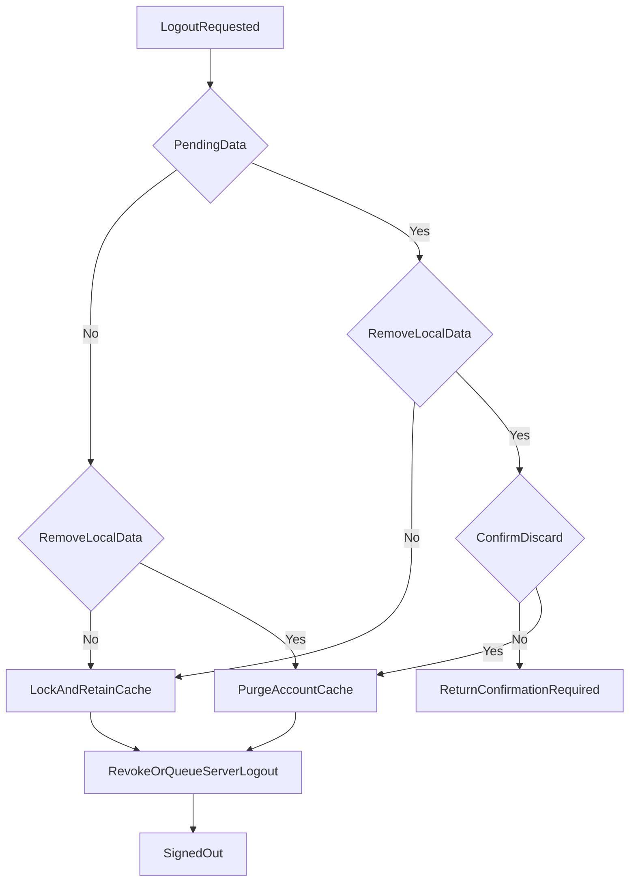

# Contract and Lifecycle

This document owns the public host-to-engine contract, runtime lifecycle, and
authentication/entitlement behavior. Domain persistence and wire schemas are
defined in the linked topic documents.

## Published package boundary

The proposed public contract package name is
`@pikapikagems/study-contract`. The final name and license remain release
decisions.

The contract package contains:

- TypeScript interfaces and discriminated unions.
- Runtime constants for the Study Contract API major version.
- Small runtime guards for artifact metadata and binding shape.
- No React, IndexedDB, Dexie, FSRS, routing, CSS, or backend implementation.

StudyEngine is one public repository/package with these entrypoints:

```text
kh-study-engine
kh-study-engine/core
kh-study-engine/browser
```

- `core` owns deterministic domain rules and has no browser globals.
- `browser` composes core rules with IndexedDB, fetch, connectivity, timers,
  browser locks, and cross-tab notification.
- The package root may re-export the supported public factory, but must not
  become a second contract definition.

The package is browser-first, not universal. Pure core functions remain easy
to execute outside a browser, but Node, Workers, and React Native are not
supported runtimes in the first release.

## Fundamental primitives

The contract uses serializable primitives at persistence and wire boundaries:

```ts
export type UnixMs = number;
export type LocalDate = string; // YYYY-MM-DD
export type IanaTimeZone = string;

export type AccountId = string;
export type DeviceId = string;
export type Kanji = string;
export type CardId = string;
export type ServerCursor = string;
```

`CardId` is an opaque handle the host passes back to `beginReview`. It is
derived from `(kanji, cardType, generation)` rather than being an independent
identity, so no separate ID column is required. `DeviceSlot` and `PileItemId`
no longer exist: slots were only needed to partition per-device counters, and
pile items are keyed by kanji with `generation` as a column.

Runtime validation must reject invalid date strings, non-finite timestamps,
multi-scalar kanji identifiers, invalid time zones, and identifiers outside
published size limits. Review-pile APIs additionally reject kanji outside the
versioned review catalog. Public wire types do not use JavaScript `Date`; a host
may convert at its own boundary.

## Expected outcomes

Expected product states resolve as typed results:

```ts
export type Result<T, E extends StudyError = StudyError> =
  | { ok: true; value: T }
  | { ok: false; error: E };

export type StudyError =
  | { code: "not_ready" }
  | { code: "auth_required" }
  | {
      code: "read_only";
      reason:
        | "entitlement_missing"
        | "entitlement_expired"
        | "protocol_incompatible"
        | "catalog_incompatible";
    }
  | { code: "bootstrap_required" }
  | { code: "offline"; operation: string }
  | { code: "validation_failed"; fields: Record<string, string> }
  | { code: "unsupported_kanji"; kanji: string }
  | { code: "stale_revision"; entity: string }
  | { code: "pile_item_exists"; kanji: Kanji; currentWord: string }
  | { code: "review_handle_expired" }
  | { code: "review_handle_consumed" }
  | { code: "review_generation_deleted" }
  | { code: "storage_quota" }
  | { code: "rate_limited"; retryAt?: UnixMs }
  | { code: "pin_invalid" | "pin_expired" | "pin_attempts_exhausted" }
  | { code: "confirmation_required"; confirmation: LogoutConfirmation }
  | { code: "backend_unavailable"; retryable: boolean };
```

Examples:

- A signed-out note query returns `auth_required`, not `null`.
- An authorized query for a kanji with no note returns
  `{ ok: true, value: null }`.
- A read-only query returns real cached data.
- A read-only mutation returns `read_only`.
- A writable offline mutation that commits locally returns success with pending
  sync metadata.
- An online-only PIN request made offline returns `offline`.

Promises reject only when the contract cannot express a safe normal outcome,
such as a violated internal invariant or an unexpected IndexedDB failure.
Recoverable conditions such as quota exhaustion, stale data, invalid input,
rate limits, and network unavailability belong in `Result`.

Error classes must not be required for expected control flow. `instanceof`
checks are brittle across separately bundled artifacts.

## Module binding

The virtual module exports one binding:

```ts
export const STUDY_CONTRACT_API_VERSION = 1 as const;

export type UnavailableReason =
  | "not_configured"
  | "entry_missing"
  | "manifest_invalid"
  | "checksum_invalid"
  | "contract_incompatible"
  | "artifact_load_failed";

export type StudyEngineModuleBinding =
  | {
      engineType: "unavailable";
      contractApiVersion: typeof STUDY_CONTRACT_API_VERSION;
      reason: UnavailableReason;
      diagnostic?: string;
    }
  | {
      engineType: "available";
      contractApiVersion: typeof STUDY_CONTRACT_API_VERSION;
      engineVersion: string;
      artifactCommit: string;
      createBrowserEngine(
        config: BrowserStudyEngineConfig
      ): Promise<StudyEngine>;
    };
```

The optional `diagnostic` is developer-facing and must not contain secrets.
Kanji Heatmap owns the user-facing copy and may hide a feature, disable it,
show a paywall, or show an unavailable screen.



NoEngine is therefore a binding factory, not an implementation of every
StudyEngine domain method.

## Explicit browser configuration

The engine never discovers security-sensitive configuration from arbitrary
global variables:

```ts
export interface BrowserStudyEngineConfig {
  backend: {
    apiBaseUrl: string;
    expectedProtocolMajor: number;
    requestTimeoutMs: number;
  };
  entitlementTrust: {
    issuer: string;
    audience: string;
    publicKeys: readonly {
      keyId: string;
      algorithm: "EdDSA" | "ES256";
      publicKeyJwk: JsonWebKey;
    }[];
  };
  host: {
    applicationId: string;
    applicationVersion: string;
    origin: string;
  };
  localPolicy?: {
    maximumTotalAccountCacheCount?: number; // default 2
    activeReviewHandleMs?: number;
    openReviewEntitlementMarginMs?: number; // default 120_000
  };
  adapters?: {
    fetch?: typeof globalThis.fetch;
    clock?: StudyClock;
    logger?: StudyLogger;
  };
}
```

The production host constructs this object from trusted build configuration.
Compatible third-party deployments supply their own backend and trust keys.
The official backend may reject unapproved `applicationId`/origin pairs.

Multiple verification keys permit planned entitlement-key rotation. A lease
must identify its key. Unknown keys fail closed for writes.

## Engine interface

The first public shape should remain small and grouped by domain:

```ts
export interface StudyEngine {
  getSnapshot(): StudyEngineSnapshot;
  subscribe(listener: () => void): () => void;

  start(): Promise<Result<void>>;
  dispose(): Promise<void>;

  readonly auth: AuthApi;
  readonly notes: NotesApi;
  readonly bookmarks: BookmarksApi;
  readonly activity: ActivityApi;
  readonly reviews: ReviewsApi;
  readonly privacy: PrivacyApi;
  readonly sync: SyncApi;
  readonly storage: StorageApi;
}

export interface AuthApi {
  requestPin(input: RequestPinInput): Promise<Result<PinChallenge>>;
  verifyPin(input: VerifyPinInput): Promise<Result<VerifyPinOutcome>>;
  refreshSession(): Promise<Result<SessionRefreshOutcome>>;
  logout(input: LogoutInput): Promise<Result<LogoutOutcome>>;
}

export interface NotesApi {
  watch(kanji: Kanji): QueryStore<KanjiNoteView | null>;
  put(input: PutNoteInput): Promise<Result<KanjiNoteView>>;
  remove(input: RemoveNoteInput): Promise<Result<void>>;
}

export interface BookmarksApi {
  watchAll(): QueryStore<readonly KanjiBookmark[]>;
  watch(kanji: Kanji): QueryStore<KanjiBookmark | null>;
  add(kanji: Kanji): Promise<Result<KanjiBookmark>>;
  remove(kanji: Kanji): Promise<Result<void>>;
}

export interface ActivityApi {
  record(input: PracticeActivityEventInput): Promise<Result<ActivityWrite>>;
  watchDaily(input: DailySummaryRange): QueryStore<readonly DailySummary[]>;
  watchAllTime(): QueryStore<AllTimeSummary>;
  watchChallenges(
    input: ChallengeSummaryQuery
  ): QueryStore<readonly ChallengeSummary[]>;
}

export interface ReviewsApi {
  readonly settings: ReviewSettingsApi;
  readonly pile: ReviewPileApi;

  watchDueCount(cardType: CardType): QueryStore<number>;
  getDue(input: DueQuery): Promise<Result<readonly DueCard[]>>;
  beginReview(input: BeginReviewInput): Promise<Result<ActiveReview>>;
  grade(input: GradeReviewInput): Promise<Result<GradeOutcome>>;
  cancel(handleId: string): Promise<Result<void>>;
}

export interface PrivacyApi {
  watchResearchParticipation(): QueryStore<ResearchParticipation>;
  setResearchParticipation(
    state: ResearchParticipationState
  ): Promise<Result<ResearchParticipation>>;
}

export interface SyncApi {
  now(reason?: ManualSyncReason): Promise<Result<SyncOutcome>>;
}

export interface StorageApi {
  requestPersistence(): Promise<Result<{ persisted: boolean }>>;
}
```

Domain types are detailed in
[Local data and domains](./LOCAL-DATA-AND-DOMAINS.md) and
[Reviews and FSRS](./REVIEWS-AND-FSRS.md).

There is no public `sessionStatus()` polling requirement. The engine snapshot is
the status source of truth. There is no public `settings.all()` because
historical scheduler settings are internal.

## Public command and view types

The contract package must define every type used by the interfaces above. These
minimal shapes prevent host and engine implementations from inventing
incompatible meanings:

```ts
export interface VerifyPinOutcome {
  accountId: AccountId;
  access: "bootstrapping" | "writable" | "read_only";
}

export interface SessionRefreshOutcome {
  accountId: AccountId;
  access: "writable" | "read_only";
  entitlementExpiresAt?: UnixMs;
}

export interface LogoutOutcome {
  removedLocalData: boolean;
  serverRevocation: "completed" | "pending";
}

export interface KanjiNoteView {
  kanji: Kanji;
  content: string;
  updatedAt: UnixMs;
  serverRevision?: number;

  /**
   * True when the backend merged a divergent edit into `content`, which can
   * leave `content` larger than `noteMaxUtf8Bytes`. `put` still enforces that
   * limit with no exception, so the host must render an over-limit editor with
   * a disabled save and explain why rather than showing a bare length error.
   * Cleared by the next successful `put`.
   */
  hasMergedEdit: boolean;
  mergedAt?: UnixMs;
}

export interface PutNoteInput {
  kanji: Kanji;
  content: string;
  expectedServerRevision?: number;
}

export interface RemoveNoteInput {
  kanji: Kanji;
  expectedServerRevision?: number;
}

export interface KanjiBookmark {
  kanji: Kanji;
  updatedAt: UnixMs;
  serverRevision?: number;
}

export interface ActivityWrite {
  eventId: string;
}

export interface DailySummaryRange {
  from: LocalDate;
  to: LocalDate;
}

export interface DailySummary {
  localDate: LocalDate;
  speedKatakanaSessions: number;
  readingPracticeRounds: number;
  writingPracticeRounds: number;
  readingCardsReviewed: number;
  writingCardsReviewed: number;
  ratingAgain: number;
  ratingHard: number;
  ratingGood: number;
  ratingEasy: number;
}

export interface AllTimeSummary extends Omit<DailySummary, "localDate"> {
  cakeDay: LocalDate | null;
  daysActive: number;
}

export interface ChallengeSummaryQuery {
  activityType: "speed_katakana";
  challengeIds?: readonly string[];
}

export interface ChallengeScore {
  eventId: string;
  value: number;
  achievedAt: UnixMs;
}

export interface ChallengeSummary {
  activityType: "speed_katakana";
  challengeId: string;
  attemptCount: number;
  latestAt: UnixMs;
  latestAccuracyPercent: number;
  latestCharactersPerMinute: number;
  bestAccuracy: ChallengeScore;
  bestCharactersPerMinute: ChallengeScore;
  bestCharactersPerMinuteAbove70Accuracy?: ChallengeScore;
}

export type ResearchParticipationState = "enabled" | "disabled";

export interface ResearchParticipation {
  state: ResearchParticipationState;
  policyVersion: string;
  updatedAt: UnixMs;
  effectiveAfterEventId?: string;
}

export type ManualSyncReason =
  | "user_requested"
  | "review_session_ended"
  | "settings_changed"
  | "connectivity_restored";

export interface SyncOutcome {
  acceptedThroughDeviceSequence: number;
  cursor: ServerCursor;
  hasMoreChanges: boolean;
}
```

`estimate()` was removed: `StudyEngineSnapshot.storage` already carries
`persisted` and a `pressure` band, live, with no round trip, and raw
`navigator.storage.estimate()` is not account-scoped so a host that wants exact
byte numbers can call it directly. `requestPersistence()` stays because it must
be invoked from a user gesture and the engine decides when it is worth asking.

`PracticeActivityEventInput` is the versioned union in
[Local data and domains](./LOCAL-DATA-AND-DOMAINS.md).
Review-specific public types are defined in
[Reviews and FSRS](./REVIEWS-AND-FSRS.md).

## Reactive query stores

The contract does not expose Dexie Observable types:

```ts
export interface QueryStore<T> {
  getSnapshot(): QuerySnapshot<T>;
  subscribe(listener: () => void): () => void;
  refresh(): Promise<void>;
}

export type QuerySnapshot<T> =
  | { status: "loading" }
  | { status: "ready"; result: Result<T> }
  | {
      status: "failed";
      diagnosticId: string;
      retryable: boolean;
    };
```

Properties:

- A query store is lazy; it starts its underlying live query on first
  subscription or `refresh()`.
- `getSnapshot()` is synchronous and referentially stable until notification.
- The browser runtime may implement stores with Dexie `liveQuery`, but that is
  private.
- Cross-tab IndexedDB commits wake affected query stores.
- A store stops background work after its final subscriber leaves.
- Time-dependent due stores schedule the next wake-up at the earliest due
  instant.
- Access changes invalidate stores. A signed-out store emits
  `auth_required`, never stale account data.

This shape can be consumed by React `useSyncExternalStore`, Svelte stores,
Angular adapters, or plain JavaScript without changing StudyEngine.

## Engine snapshot

```ts
export interface StudyEngineSnapshot {
  phase: "starting" | "ready" | "faulted" | "disposed";
  access: AccessSnapshot;
  sync: SyncSnapshot;
  storage: {
    persisted: boolean | "unknown";
    pressure: "normal" | "warning" | "critical";
  };
  dataRevision: number;
  diagnosticId?: string;
}

export type AccessSnapshot =
  | { kind: "signed_out" }
  | {
      kind: "bootstrapping";
      accountId: AccountId;
      completedPages: number;
      totalPages?: number;
    }
  | {
      kind: "writable";
      accountId: AccountId;
      entitlementExpiresAt: UnixMs;
      sessionEvidence: "server_verified" | "cached_lease";
    }
  | {
      kind: "read_only";
      accountId: AccountId;
      reason:
        | "entitlement_missing"
        | "entitlement_expired"
        | "protocol_incompatible"
        | "catalog_incompatible";
      hasReadableCache: boolean;
    }
  | {
      kind: "cache_locked";
      accountId?: AccountId;
      reason: "migration_failed" | "corrupt" | "unsupported_browser";
    };
```

`dataRevision` is a cheap coarse invalidation indicator. Domain query stores
remain the source for entity data.

There is one synchronization status because there is one outbox and one
acknowledgement path. Archive delivery happens on the backend and cannot be
degraded independently from the browser's point of view:

```ts
export type SyncSnapshot =
  | { kind: "idle"; pendingOperations: number }
  | { kind: "offline"; pendingOperations: number }
  | { kind: "syncing"; pendingOperations: number; startedAt: UnixMs }
  | {
      kind: "blocked";
      reason: "read_only" | "protocol_incompatible";
      pendingOperations: number;
    }
  | {
      kind: "error";
      pendingOperations: number;
      retryAt?: UnixMs;
      diagnosticId: string;
    };
```

## Lifecycle state machine



The module-level unavailable binding is outside this state machine because no
engine instance exists.

## PIN authentication

The browser uses same-origin `/api` by default and sends
`credentials: "include"`. The backend sets a Secure HttpOnly cookie. JavaScript
does not persist bearer or refresh tokens.

Proposed auth inputs:

```ts
export interface RequestPinInput {
  email: string;
}

export interface PinChallenge {
  challengeId: string;
  expiresAt: UnixMs;
  resendAfter: UnixMs;
}

export interface VerifyPinInput {
  challengeId: string;
  pin: string;
}
```

The backend must:

- Normalize and validate email without revealing account existence.
- Return a generic request response whether or not an account exists.
- Apply per-address, per-IP, and per-challenge rate limits.
- Limit verification attempts and expire challenges.
- Rotate the session ID after successful verification.
- Check `Origin` and CSRF protections appropriate to the cookie policy.
- Return account identity, session epoch, research participation,
  protocol/catalog metadata, and a signed entitlement lease in the response
  body.



## Entitlement lease

A signed lease should contain at least:

```ts
export interface EntitlementLeaseClaims {
  schemaVersion: 1;
  issuer: string;
  audience: string;
  keyId: string;
  accountId: AccountId;
  entitlement: "premium";
  issuedAt: UnixMs;
  expiresAt: UnixMs;
  policyVersion: string;
  sessionEpoch: number;
}
```

The engine verifies signature, issuer, audience, account, key ID, entitlement,
and expiry. It stores the signed lease, not a locally editable Boolean.

The backend stores an account/session epoch and includes it in every session,
lease-refresh, and authenticated sync response. Logout, administrative
revocation, and account-security reset increment the epoch. On contact, an
engine whose cached lease epoch differs from the backend response discards that
lease and transitions to signed out (or accepts a newly issued replacement
lease from the same response). A fully offline device cannot observe remote
revocation before contact or lease expiry.

Clock rules:

- Keep a persisted `lastObservedWallTime` and never move effective lease time
  backward.
- Use a monotonic clock while the page remains open.
- Refresh server time anchors after successful requests.
- Treat a large unexplained future jump as expiry, not a reason to extend a
  lease.

These checks deter accidental clock errors; they are not DRM. A user controls
public browser code and storage.

On a fully offline launch, an active account with a valid cached lease is
writable. When it expires, reads remain available and mutations fail. If the
backend later reports an invalid session, the engine clears the active pointer
and locks domain queries even if a stale local lease remains.

## Mid-action expiry

The write gate has **no exceptions**. Every study mutation, including `grade`,
requires a currently valid entitlement lease.

An earlier draft of this design allowed one grade to complete after the lease
expired mid-card. That was removed. It carved a special case into the most
security-relevant gate in the system, made invariant 5 untrue as written, and
protected at most one card grade in an event that occurs roughly once per
account lifetime with a low probability of landing inside the few seconds a
card is open.

The case is engineered out at the other end instead:

```ts
// beginReview, before any state is snapshotted
const OPEN_REVIEW_ENTITLEMENT_MARGIN_MS = 120_000; // policy constant

if (lease.expiresAt - now < OPEN_REVIEW_ENTITLEMENT_MARGIN_MS) {
  return err({ code: "read_only", reason: "entitlement_expired" });
}
```

Consequences:

- A card the user cannot finish is never opened, so no recall effort is ever
  wasted. The user is told before they think about the card, not after.
- The last margin-width slice of a lease cannot open a new card. For an online
  user this never occurs, because contact refreshes the lease continuously.
- Saving a note, changing a bookmark, changing settings, adding or removing a
  pile item, and recording practice all fail `read_only` after expiry, exactly
  as `grade` does.
- Session revocation (`401`) is treated the same way. There is no carve-out for
  an open card.
- An unsaved note draft belongs to the host. StudyEngine never claims it was
  persisted.

## Logout and retained caches

The host presents a “Remove data from this device” option and must pass the
choice explicitly. The host owns the default. Checked-by-default is right for a
personal device; on a shared computer it destroys the retained sibling cache
that the two-cache policy exists to provide, so the host should offer a shared
computer affordance instead. See
[Scenarios and UX](./SCENARIOS-AND-UX.md).

```ts
export interface LogoutImpact {
  pendingOperations: number;
  pendingBytes: number;
}

export interface LogoutInput {
  removeLocalData: boolean;
  confirmDiscardPending?: boolean;
}

export interface LogoutConfirmation {
  kind: "discard_pending_local_data";
  impact: LogoutImpact;
}
```

There is no `prepareLogout()`. The host calls `logout()` directly; if removal
would discard pending work, the call returns `confirmation_required` carrying
the same `LogoutImpact` that a preparation call would have produced, and the
host re-calls with `confirmDiscardPending: true`.

A separate preparation call would only have helped a host that wanted to show
pending counts _before_ the user ticked the checkbox. That count is already
available without a round trip: `StudyEngineSnapshot.sync.pendingOperations` is
live in every host that renders sync status at all.



Logout behavior:

- Clear the active account pointer immediately.
- If online, revoke the backend session.
- If offline, persist `logoutPending`; on next connectivity, revoke the cookie
  session before checking session status.
- If keeping data, preserve the isolated account database and all outboxes.
- If removing data, delete that account database only after required
  confirmation.
- A confirmed backend account deletion always purges without a local
  preservation choice.
- A different login may retain the prior inactive cache, subject to the
  two-total-cache limit. Because the limit is two, there is only ever one
  inactive cache, so eviction needs no recency ordering: a third account
  displaces the single inactive cache. A locked cache resists displacement
  only while it holds pending operations; a locked cache with nothing pending
  is broken, not precious, and is removed.

## Fault behavior

An incompatible backend protocol or kanji catalog:

- leaves compatible cached domain data readable;
- blocks new writes and sync;
- exposes a read-only reason;
- requires a compatible app/engine release.

A local migration or integrity failure:

- closes writable access;
- preserves the database and outboxes;
- emits a stable diagnostic ID;
- requires an explicit remove/rebootstrap or support-assisted recovery.

No fault handler automatically deletes a cache merely because a bootstrap is
available.

## Host responsibilities

The host must:

- Create one engine instance per tab and call `dispose()` during teardown.
- Adapt stores to its UI framework without leaking framework types back into
  the contract.
- Render access/error/unavailable states.
- Keep unsaved UI drafts separate from engine persistence.
- Sanitize Markdown during rendering. StudyEngine stores Markdown but never
  renders it.
- Ask for destructive logout confirmation when required.
- Never infer write success from a hidden or unavailable feature.

The host must not:

- Read or write StudyEngine IndexedDB tables directly.
- Manufacture entitlement state.
- Calculate canonical FSRS state.
- Mutate sync cursors or device sequences.
- Import the concrete engine package from feature components.
