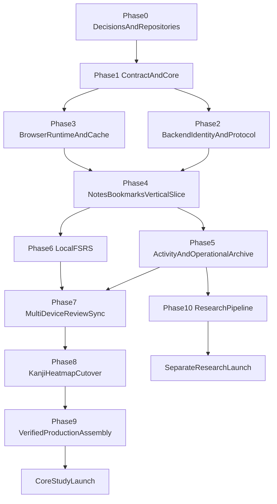

# Implementation Roadmap

This document turns the architecture into dependency-ordered vertical slices.
It does not estimate calendar time. Each phase has an explicit exit gate so the
next phase does not build on an ambiguous protocol or unverified invariant.

## Delivery principles

- Implement one end-to-end domain slice before broadening the API.
- Keep contract, browser engine, backend, and host changes independently
  reviewable.
- Make deterministic domain reducers executable without browser/network
  infrastructure.
- Treat compatibility fixtures as release artifacts.
- Do not launch research collection merely because operational archival is
  ready.
- Keep the normal Kanji Heatmap build NoEngine-capable throughout development.
- Do not delete old host localStorage until the replacement path has passed its
  rollout gate.

## Dependency graph



Research launch is not on the critical path for core StudyEngine.

## Phase 0: finalize policy and repository ownership

### Deliverables

- Decide the Study Contract and StudyEngine licenses.
- Name/publish locations for the contract package and engine package.
- Define ownership/release permissions for:
  - contract;
  - engine;
  - backend protocol;
  - kanji catalog;
  - scheduler compatibility fixtures.
- Select initial backend-published values:
  - entitlement lease policy;
  - note byte limit;
  - sync/archive batch limits;
  - bootstrap page size;
  - review ring size;
  - registered-device cap;
  - operational retention.
- Complete legal/product review of:
  - default research participation;
  - support-only opt-out/export/deletion after entitlement loss;
  - operational/research disclosures.
- Define supported browsers and Web Locks fallback expectations.

### Exit gate

- Every unresolved item in the root decision register has an owner and either a
  value or an explicit launch blocker.
- Package licensing is compatible with intended third-party use.
- Research may remain disabled if its policy gate is not complete.

## Phase 1: Study Contract and deterministic core

### Deliverables

- Publish the first prerelease of `@pikapikagems/study-contract`.
- Implement:
  - serializable primitive types;
  - `Result` and error union;
  - available/unavailable binding;
  - engine/status/query-store interfaces;
  - notes/bookmarks/activity/review public inputs and views;
  - protocol/catalog/scheduler metadata guards.
- Build pure reducers for:
  - note LWW/conflict selection;
  - bookmark set/remove;
  - device daily summary;
  - Speed Katakana challenge summary;
  - settings validation/version selection;
  - event ordering and stable tie-breaks.
- Create canonical fixture files for every reducer.
- Define artifact manifest JSON schema.
- Define protocol and archive event JSON schemas/OpenAPI components.

### Important constraints

- The contract has no Dexie, React, FSRS implementation, or host copy.
- Runtime guards reject unknown major versions.
- No public type uses JavaScript `Date`.
- Fixtures use fixed clocks/IDs and are language-neutral JSON.

### Exit gate

- A tiny sample host can compile against an unavailable binding.
- A fake engine can implement the contract without importing Kanji Heatmap.
- TypeScript and Python fixture readers agree on domain ordering/validation.
- Contract/API naming is frozen for the first vertical slice.

## Phase 2: backend identity and protocol foundation

### Deliverables

- FastAPI modules for:
  - PIN request/verification;
  - Secure HttpOnly sessions;
  - entitlement lease issuance/refresh;
  - session status/logout;
  - protocol/policy/catalog negotiation.
- Postgres identity tables:
  - users;
  - sessions;
  - entitlements;
  - account revision state;
  - devices/device sync state.
- Redis-only ephemeral functions:
  - PIN challenges/attempts;
  - auth/sync rate limits.
- Same-origin proxy behavior and approved-origin policy.
- Error mapping for `401`, `402`, `409`, `413`, `422`, `429`, and retryable
  `5xx`.
- Redacted request/diagnostic IDs and baseline metrics.

### Security gate

- PIN response does not reveal account existence.
- Sessions rotate on verification and revoke on logout.
- Origin/CSRF behavior is documented and exercised.
- Leases validate issuer, audience, account, key, epoch, and expiry.
- No cookie, PIN, lease, email, or note-like body reaches logs.

### Exit gate

- A protocol client can request/verify PIN, receive a cookie/lease, refresh,
  and logout.
- Invalid/expired entitlement produces the exact read-only response.
- Key rotation works with current/next public keys.

## Phase 3: browser runtime, caches, and stores

### Deliverables

- `kh-study-engine/core` and `kh-study-engine/browser` entrypoints.
- Explicit browser factory/config validation.
- Metadata DB and isolated per-account Dexie DB.
- Two-total-account LRU cache behavior.
- Offline signed-lease validation and persisted monotonic time guard.
- Engine status store and generic query-store implementation.
- Cross-tab:
  - live query propagation;
  - account mutation/sync lock;
  - BroadcastChannel notifications;
  - IndexedDB lease fallback.
- Hot/archive outbox primitives.
- storage estimate/persistence API.
- migration lock/failure behavior.
- logout prepare/confirmation/keep/remove/offline-revocation flow.

### Exit gate

- Two tabs cannot allocate duplicate sequences.
- Signed-out queries cannot read retained account data.
- Third-account activation evicts only the least-recently-used safe inactive
  cache.
- Migration failure preserves the DB and reports a diagnostic.
- Pending-data logout requires confirmation before deletion.
- Browser restart recovers pending outbox rows.

## Phase 4: notes and bookmarks vertical slice

This is the first complete backend-to-host-independent sync slice.

### Backend deliverables

- `notes`, `note_conflicts`, and `bookmarks` tables.
- Account-revision allocation, row revisions, tombstones, and delta selection.
- Paged bootstrap containing these domains.
- Unified `/sync` with contiguous device sequences.
- Note direct-descendant and divergent LWW/conflict behavior.
- Bookmark set/remove behavior.
- Tombstone collection guardrails.

### Engine deliverables

- Note and bookmark repositories/query stores.
- UTF-8 note limit validation.
- Local mutation + hot outbox transactions.
- Bootstrap staging/activation.
- Push/pull sync, retries, cursor application.
- Hot note conflict restore/dismiss.

### Convergence scenarios

- Same operation retried after unknown timeout.
- Note edited on two offline devices.
- Note deleted on one device and edited on another.
- Bookmark set/remove race.
- Client offline across multiple server revisions.
- Bootstrap row changes after snapshot revision.
- Pull response crash before/after cursor commit.

### Exit gate

- Every scenario converges deterministically.
- No note content appears in logs.
- A signed-out/lapsed user gets the specified locked/read-only behavior.
- No permanent server change-log table is required.

## Phase 5: activity summaries and operational archive

### Deliverables

- Typed version-one practice event union.
- Local reducers for:
  - per-device daily summaries;
  - all-time/range views;
  - Speed Katakana challenge components.
- Daily/challenge Postgres tables and unified hot-sync operations.
- Archive outbox and `/events/batch`.
- Durable acceptance through selected queue/R2/outbox mechanism.
- Operational object schema, compression, checksums, and lifecycle metadata.
- Account export/deletion primitives for retained operational data.
- Backlog status and storage-pressure warnings.

### Critical scenarios

- Two devices contribute to one local date.
- One batch retries after durable acceptance but before response.
- Hot summary sync succeeds while archive ingest fails.
- Archive sequence gap.
- Same event ID arrives with different content.
- Lapsed entitlement preserves backlog.
- Account deletion rejects an old returning device.

### Exit gate

- Account aggregate equals the sum/reduction of device components.
- Retried archive events materialize once.
- Redis loss cannot lose an acknowledged event.
- Archive outage does not block hot sync.
- Local quota failure never reports a successful event write.

## Phase 6: local FSRS and review UX contract

### Deliverables

- Versioned kanji catalog artifact/hash.
- FSRS card/settings plain schemas and adapters.
- Pinned `ts-fsrs` version.
- Pile add/remove/re-add generation behavior.
- Reading/writing due indexes and query stores.
- `beginReview` frozen handle and cross-tab review lease.
- Four canonical rating previews.
- Local grade transaction:
  - provisional card;
  - card/device counters;
  - daily review summary;
  - hot grade operation;
  - raw archive event.
- Forward-only settings update.

### Compatibility artifacts

- TypeScript FSRS fixtures for:
  - all learning states;
  - all ratings;
  - learning/relearning steps;
  - fuzz on/off under deterministic seed policy;
  - short-term on/off;
  - maximum interval;
  - weight validation;
  - timestamp precision.

### Exit gate

- New pile item always has exactly two fresh cards.
- Due order is stable by due instant/card ID.
- Two tabs cannot open the same card.
- A handle grades once and freezes previews through sync notification.
- Mid-handle entitlement expiry allows exactly one grade.
- Removal/re-add cannot apply a stale grade to a new generation.

## Phase 7: backend FSRS and multi-device review sync

### Deliverables

- Pinned `py-fsrs` version and conversion layer.
- Review pile/card/settings Postgres tables.
- Bounded history window with anchor state.
- Hot review operation processing.
- Exact common-base replay.
- Immediate LWW incomplete-history fallback.
- Deletion-wins behavior with accepted-for-stats warning.
- Canonical server card deltas.
- Replay/fallback/compatibility metrics.

### Deterministic simulations

Simulate devices with independently controlled clocks, cursors, and delivery:

- Two reviews from the same base, either arrival order.
- Multiple local reviews on one offline branch.
- Equal timestamps and deterministic ties.
- Future clock clamp.
- Settings change racing with review.
- Ring boundary exact replay.
- Common base just outside ring.
- Remove racing with grade.
- Re-add after remove with delayed old grade.
- Response staged while a review handle is open.
- Duplicate event and operation retries.

### Exit gate

- TypeScript/Python one-step and replay fixtures agree within published
  tolerances.
- Complete history replay is order-independent by network arrival.
- Incomplete fallback converges deterministically.
- Every accepted event remains in stats/archive even if its schedule branch
  loses.
- Backend canonical correction never changes card generation.

## Phase 8: Kanji Heatmap adapter and feature cutover

### Deliverables

- Install only the Study Contract.
- Add virtual-module declaration and NoEngine Vite plugin behavior.
- Add host composition/provider and `useSyncExternalStore` adapters.
- Add access/unavailable/signed-out/read-only/bootstrap/recovery UI.
- Replace host localStorage behavior for:
  - notes;
  - bookmarks;
  - daily activity;
  - Speed Katakana challenge statistics;
  - reading/writing practice activity.
- Connect dashboard query stores.
- Add review settings/pile/reading/writing screens as separate components.
- Implement logout remove checkbox/info and pending-data confirmation.
- Add versioned, exact-key localStorage cleanup with no migration.

### Cutover sequence

```mermaid
flowchart LR
    Warn[CommunicateOldDataRemoval] --> ShipAdapter[ShipHostAdapterWithNoEngine]
    ShipAdapter --> Internal[InternalEngineBuild]
    Internal --> Validate[ValidateAuthOfflineSyncPWA]
    Validate --> Production[RequiredEngineProductionBuild]
    Production --> StopOldReads[StopAllOldStudyLocalStorageReads]
    StopOldReads --> Cleanup[RunVersionedTargetedCleanup]
```



Cleanup may be delayed one release after old reads stop, but old data is never
migrated into an account.

### Exit gate

- Default public build works without real engine code.
- Every StudyEngine feature fails gracefully under unavailable binding.
- No feature component imports the concrete engine.
- No host path writes old study localStorage.
- Dashboard values come from engine stores.
- Authenticated API responses are network-only in the PWA.
- Existing theme/search/font preferences survive cleanup.

## Phase 9: verified production assembly and rollout

### Deliverables

- Engine CI builds prebundled ESM artifact and manifest.
- Public source commit/release provenance.
- Archive and per-file SHA-256.
- Kanji Heatmap preparation script with safe extraction.
- Optional local path flow.
- Required official production failure mode.
- Cloudflare Pages build wrapper preserving `CF_PAGES=1`.
- Bundle/PWA inspection.
- Runtime version/commit monitoring.

### Supply-chain gate

- No engine package install or postinstall during host build.
- No unpinned “latest” download.
- No path traversal or unmanifested runtime file.
- Contract/catalog/scheduler metadata validated before Vite build.
- Required production cannot emit an unavailable binding.

### Rollout stages

1. Engine/backend team development with fake host.
2. Kanji Heatmap internal build behind selected artifact.
3. Test account cohort.
4. Limited production cohort if deployment supports it.
5. Full required-engine official production.
6. Independent monitoring of runtime unavailable/read-only/backlogs.

NoEngine remains the default for ordinary repository users.

### Rollback

- Backend keeps the previous compatible protocol during client rollout.
- Engine artifact pins permit rebuilding the previous known-good app.
- A frontend rollback must not downgrade IndexedDB schema.
- If a schema migration shipped, rollback uses a forward-compatible hotfix, not
  an old binary that writes an older schema.
- Never roll back by wiping local outboxes.

## Phase 10: research pipeline

This phase starts only after privacy launch gates pass.

### Deliverables

- Backend-authoritative participation state.
- Operational-to-research eligibility worker.
- De-identification/minimization transform.
- Separate research bucket/IAM/lifecycle.
- Traceable staging deletion on opt-out.
- Cohort/partition thresholds.
- Disclosure and support procedures.
- Metrics that do not reintroduce identity.

### Exit gate

- Research purpose and minimum fields are approved.
- Default-with-opt-out and support-only withdrawal are approved for each launch
  market or changed.
- Opt-out stops future transfers and removes traceable staging.
- No note/bookmark content or direct identity reaches research.
- Anonymous output cannot be joined back through retained hidden mappings.
- Operational archive works correctly with research disabled.

## Cross-cutting verification strategy

No single test level is sufficient.

### Pure deterministic checks

- Reducer examples and property invariants.
- Stable ordering/tie-breaks.
- Schema validation and numeric bounds.
- FSRS cross-language fixtures.

### Storage checks

- Atomic projection/outbox writes.
- Migration and failure preservation.
- quota errors.
- live-query invalidation.
- multi-tab sequence/lease coordination.

### Protocol simulations

- Reorder, duplicate, drop, timeout, and retry requests.
- Crash before/after local/server commits.
- Cursor pagination and tombstones.
- offline lease/session transitions.
- device cap and retired device rejection.

### Browser/PWA checks

- Offline restart with valid/expired lease.
- PWA update and IndexedDB version change.
- API responses absent from Cache Storage.
- multiple tabs and background throttling.
- persistent-storage unavailable/denied.

### Backend operational checks

- Transaction contention/deadlock retry.
- R2/durable queue failure.
- lifecycle deletion.
- export/deletion account isolation.
- redaction.

## Compatibility release gate

Every engine release records:

```text
Study Contract API major
backend protocol min/max
catalog version/hash
scheduler schema/algorithm version
practice event schema versions
archive schema version
IndexedDB schema version
artifact source commit and hashes
```

A release checklist compares this matrix with:

- current Kanji Heatmap host;
- currently deployed backend;
- previous still-active PWA versions;
- staged next public verification keys.

## Observability rollout gate

Before broad rollout, dashboards/alerts exist for:

- auth request/verify/rate-limit health;
- entitlement lease issuance/expiry anomalies;
- bootstrap duration/failure;
- hot sync latency, retries, gaps, cursor lag;
- review replay/fallback rates;
- archive backlog and durable-ingest delay;
- IndexedDB migration/lock failures;
- runtime unavailable binding in official production;
- device/tombstone growth;
- account deletion/export completion.

No dashboard dimension uses note content, email, raw account ID, or full raw
event payload.

## Principal risks and mitigations

### Public client premium bypass

Risk: browser code is public and modifiable.

Mitigation: backend is authoritative for sync/server data; signed lease provides
reasonable offline product gating only. Do not claim DRM.

### Cross-language FSRS drift

Risk: TypeScript and Python differ in versions, rounding, or time handling.

Mitigation: pinned versions, plain wire schema, shared fixtures, backend
authority, compatibility metrics.

### Long-offline review conflict

Risk: common base falls outside the hot ring.

Mitigation: immediate deterministic LWW, exact stats/archive retention,
frequency monitoring, and natural future-review correction.

### Browser storage loss/pressure

Risk: browser evicts data or archive backlog fills quota.

Mitigation: backend sync, persistence request, storage estimates/warnings, no
silent write success, compact acknowledged/staging data.

### Stale PWA tabs during migration

Risk: old code touches a new IndexedDB schema.

Mitigation: version-change close/reload, no downgrade, forward-compatible
rollback.

### Privacy policy mismatch

Risk: default research plus support-only withdrawal fails user/legal
expectations.

Mitigation: explicit launch gate; operational archive can launch while research
stays disabled; retain ability to make opt-out entitlement-independent later.

### Build supply-chain compromise

Risk: app build executes downloaded engine code/dependency scripts.

Mitigation: verified prebuilt ESM, no install/postinstall, safe extraction,
manifest/file hashes, immutable commit, fail required production.

### Device-slot/tombstone growth

Risk: reset browsers accumulate slots and prevent tombstone collection.

Mitigation: backend cap, manual retirement, monitoring; do not auto-retire a
possibly offline device in version one.

## Definition of core launch-ready

Core launch is ready only when:

- all root invariants have implementation evidence;
- notes/bookmarks/activity/reviews converge under retry/offline simulations;
- backend authority and read-only transitions work;
- production artifact verification is mandatory;
- migrations preserve unsynced data;
- archive durable acceptance is operating;
- NoEngine default build remains healthy;
- privacy/legal copy accurately describes operational data;
- research is either fully approved or disabled;
- support can diagnose locked cache, account deletion, and device-cap cases.
