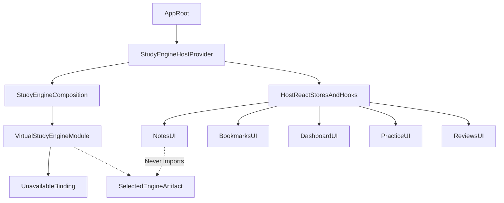
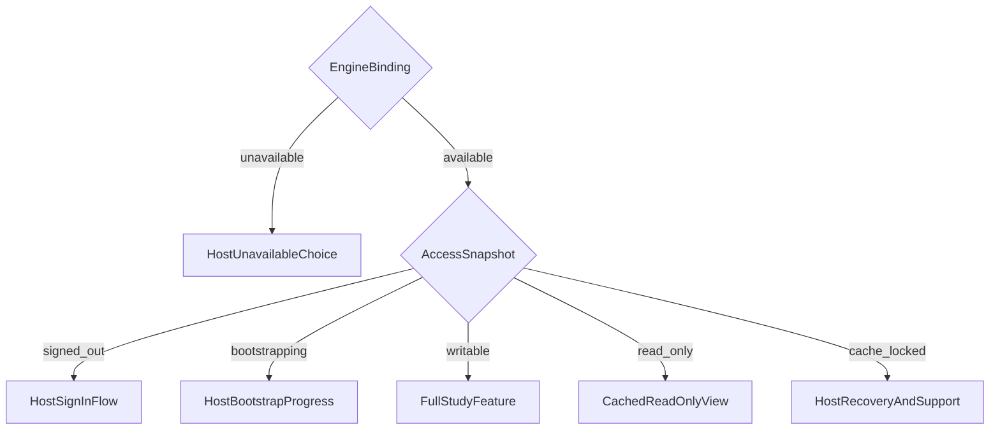
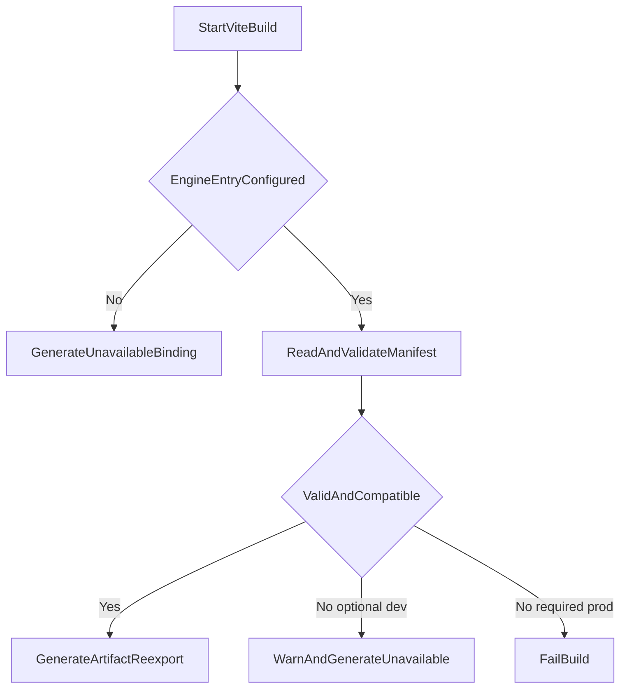
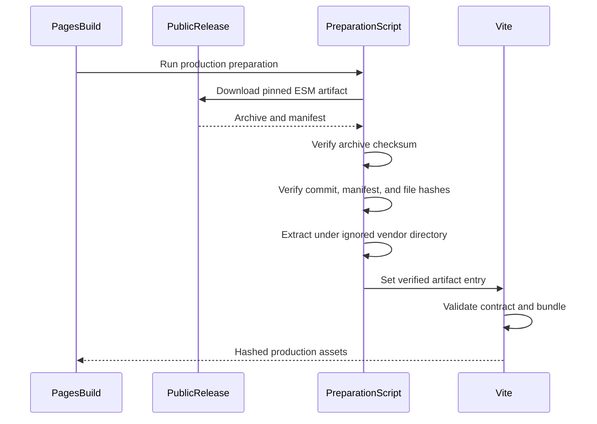

# Kanji Heatmap Integration

This document owns the optional host integration, React adapter boundary,
virtual Vite module, development/production engine selection, PWA behavior,
and replacement of the current Kanji Heatmap study persistence.

Nothing here makes StudyEngine a default Kanji Heatmap dependency.

## Integration invariants

- `package.json` installs only the tiny Study Contract by default.
- Feature components never import `kh-study-engine`.
- Exactly one composition module imports `virtual:study-engine`.
- The host owns React context/hooks and all presentation.
- NoEngine is a discriminated unavailable binding, not a fake database.
- A default clone/install/build requires no engine repository, artifact, or
  backend.
- An official production build configured to require StudyEngine fails rather
  than deploy silently without it.

## Host dependency graph



The dashed “never imports” edge is conceptual: only composition touches the
binding; feature UI depends on host-owned adapter interfaces.

## Default package installation

Proposed host dependency:

```json
{
  "dependencies": {
    "@pikapikagems/study-contract": "<pinned-compatible-version>"
  }
}
```

There is no `kh-study-engine` dependency in the normal lockfile. The contract
package is intentionally small and contains no Dexie, FSRS, auth client, or
engine implementation.

Package licensing is unresolved. If proprietary third-party UIs must be able
to bundle StudyEngine, the engine needs an appropriate permissive license. A
GPL engine imposes different downstream obligations. Decide before release.

## Proposed host module layout

Names are provisional:

```text
src/study-engine/
  composition/
    create-host-study-engine.ts
    virtual-study-engine.d.ts
  react/
    StudyEngineHostProvider.tsx
    use-study-engine-status.ts
    use-study-query.ts
    use-notes.ts
    use-bookmarks.ts
    use-activity.ts
    use-reviews.ts
  access/
    StudyFeatureGate.tsx
    StudyUnavailableScreen.tsx
    StudySignedOutScreen.tsx
    StudyReadOnlyNotice.tsx
```

This is a host adapter, not a second domain layer. It may translate engine
states into host-specific view models and copy.

The provider belongs near the app root, alongside existing host providers. It
must not be added inside individual screens.

## React adapter

The engine exposes `getSnapshot`/`subscribe`; the host adapts it with
`useSyncExternalStore`.

Domain query stores expose the same shape and should use one generic host hook:

```ts
function useStudyQuery<T>(store: QueryStore<T>): QuerySnapshot<T> {
  return useSyncExternalStore(
    store.subscribe,
    store.getSnapshot,
    store.getSnapshot
  );
}
```

This is proposed code. The real implementation must bind methods safely so
`this` is not lost and provide an appropriate server snapshot if SSR is ever
introduced.

Starting/disposal synchronizes with IndexedDB, browser locks, connectivity, and
subscriptions. If the provider needs a React effect for this external-system
lifecycle, the implementation must include the repository-required comment
explaining why render-time derivation or an event handler cannot replace it.
Domain values themselves should not be mirrored through effects.

## Host rendering freedom

The binding and access states intentionally do not prescribe UI:



For an unavailable binding, Kanji Heatmap may:

- hide a feature entry point;
- show disabled controls with explanation;
- route to a shared unavailable screen;
- leave a non-persistent core feature playable if product policy allows.

The current requirement is that bookmarks, notes, reviews, and persisted
practice activity are StudyEngine features. They must not silently fall back to
localStorage.

An operation-level expected failure is still possible after a writable screen
renders, for example lease expiry or storage pressure. Host commands must
inspect `Result`.

## Virtual module contract

Application composition imports:

```ts
import { studyEngineBinding } from "virtual:study-engine";
```

Type declaration:

```ts
declare module "virtual:study-engine" {
  import type { StudyEngineModuleBinding } from "@pikapikagems/study-contract";

  export const studyEngineBinding: StudyEngineModuleBinding;
}
```

The Vite plugin implements `resolveId` and `load`.

### Default load

When no engine is configured, generate a tiny module equivalent to:

```ts
export const studyEngineBinding = {
  engineType: "unavailable",
  contractApiVersion: 1,
  reason: "not_configured",
};
```

This is an expected build and should not warn.

### Configured development load

For local compatible-engine development:

```bash
KH_STUDY_ENGINE_ENTRY=../kh-study-engine/dist/index.js pnpm dev
```

The plugin:

1. Resolves the configured path relative to the Kanji Heatmap repository unless
   absolute.
2. Reads the adjacent artifact manifest.
3. Validates manifest schema and Study Contract API major.
4. Resolves the prebuilt ESM entry.
5. Generates a virtual re-export.
6. Returns an unavailable binding with a developer warning if an optional local
   artifact is missing/invalid.

The plugin does not install or build the external project.



## Engine artifact manifest

Official/local prebuilt artifacts include a machine-readable manifest:

```json
{
  "manifestSchemaVersion": 1,
  "engineVersion": "1.2.0",
  "contractApiMajor": 1,
  "backendProtocol": {
    "minimumMajor": 1,
    "maximumMajor": 1
  },
  "catalog": {
    "version": "kanji-review-v1",
    "sha256": "..."
  },
  "scheduler": {
    "schemaVersion": 1,
    "algorithmVersion": "..."
  },
  "source": {
    "repository": "https://github.com/...",
    "commit": "immutable-commit-sha"
  },
  "entry": "./index.js",
  "files": [
    {
      "path": "index.js",
      "sha256": "...",
      "bytes": 123456
    }
  ]
}
```

Requirements:

- ESM only for the host build.
- All runtime dependencies are bundled or listed as artifact files.
- No unresolved import from the engine repository's `node_modules`.
- No postinstall script.
- No runtime network download of engine code.
- Source/provenance URL matches the public release.
- Source maps follow an explicit production policy and do not contain secrets.
- Every file path stays inside the extracted artifact directory.

## Official production preparation

Official production configuration supplies immutable values:

```env
KH_STUDY_ENGINE_REQUIRED=1
KH_STUDY_ENGINE_VERSION=v1.2.0
KH_STUDY_ENGINE_COMMIT=immutable-commit-sha
KH_STUDY_ENGINE_SHA256=expected-archive-checksum
```

Proposed preparation:



The script must:

1. Download the exact public release artifact.
2. Verify archive SHA-256 before extraction.
3. Reject path traversal, symlinks outside the destination, or extra
   unmanifested executable files.
4. Verify source commit and every manifest file hash.
5. Extract under `.vendor/kh-study-engine/<version>/`.
6. point `KH_STUDY_ENGINE_ENTRY` at the verified ESM entry.
7. invoke the normal host build.

It must not:

- run `pnpm install` in the artifact;
- execute artifact scripts;
- silently fetch “latest”;
- fall back to NoEngine when `KH_STUDY_ENGINE_REQUIRED=1`.

The current repository's production-equivalent build requires:

```bash
CF_PAGES=1 pnpm build
```

Any future `build:production` wrapper must preserve that behavior and keep
formatting out of the build script.

## Failure matrix

Default open-source build:

- No configuration: expected NoEngine build.
- Explicit optional path missing/invalid: warn and bind unavailable.

Official required production:

- Download failure: fail.
- Archive checksum failure: fail.
- Commit mismatch: fail.
- Manifest/file hash failure: fail.
- Contract API mismatch: fail.
- Catalog/scheduler metadata unsupported by host contract: fail.
- Runtime browser initialization failure after deployment: host shows recovery
  state and monitoring alerts.

Failing the build is safer than deploying a broken premium feature and waiting
for production monitoring to discover it.

## PWA behavior

The current Vite PWA configuration precaches hashed JavaScript/CSS/HTML assets.
A selected engine bundled into Vite output therefore works offline after a
successful app install/update.

Rules:

- Engine ESM/chunks are normal build assets, not runtime CDN plugins.
- Authenticated StudyEngine `/api` responses use network-only behavior and must
  not enter a service-worker runtime cache.
- Do not add service-worker background sync.
- IndexedDB remains separate from Cache Storage.
- A new service worker/app version may introduce an IndexedDB migration only
  through the engine's explicit migration policy.
- `versionchange` closes stale tabs/connections and prompts reload. Old and new
  schema code must not operate concurrently.
- The app's auto-update policy must not delete pending outboxes.

Large engine bundles should be a distinct lazy chunk. Because JavaScript chunks
are precached, lazy execution does not imply offline unavailability after
installation.

## Creating the engine

The composition module:

1. Reads `studyEngineBinding`.
2. If unavailable, exposes an app-level unavailable view model without creating
   a provider-backed engine.
3. If available, calls `createBrowserEngine(explicitConfig)`.
4. Starts the engine once.
5. Adapts its status/query stores.
6. Disposes tab-specific listeners/locks on teardown.

Trusted explicit config includes:

- proxied API base URL;
- expected backend protocol;
- entitlement issuer/audience/public keys;
- host application ID/version/origin;
- local browser policy.

Feature components receive only host hooks/view models.

## Current feature replacement

No old study data migrates. The host must not maintain parallel localStorage
and StudyEngine sources of truth.

### Notes

Current files:

```text
src/components/sections/KanjiDetails/KanjiStudyNotes/index.tsx
src/components/sections/KanjiDetails/KanjiStudyNotes/storage.ts
```

Current behavior writes an 800-character localStorage object. The later
integration should:

- query `notes.watch(kanji)`;
- keep editor draft as host UI state;
- call `notes.put` at an explicit save/debounce boundary;
- use the backend-published byte limit, and note that the effective save limit
  for an already-merged note is `max(noteMaxUtf8Bytes, currentBytes)`, so a
  character counter must reflect that rather than the base limit;
- show a dismissible hint when `hasMergedEdit` is set, and render the merge
  separator visibly in the editor;
- warn before saving when the canonical note changes underneath an open editor
  with unsaved changes;
- sanitize Markdown in the host;
- remove localStorage warning/calls for this feature.

There is no conflict recovery screen. Divergent edits merge into the note, so
the resolution surface is the editor itself. See
[Scenarios and UX](./SCENARIOS-AND-UX.md) scenarios 8 through 10.

### Bookmarks

Current files:

```text
src/lib/bookmarks.ts
src/hooks/use-bookmarked-kanji.ts
src/components/sections/KanjiDetails/KanjiWordStatusActions.tsx
```

The host calls `bookmarks.add(kanji)` and `bookmarks.remove(kanji)` and
enriches returned kanji with its own lookup data. A bookmark carries no word.
Dashboard classification remains host logic.

This is a behavior change with a concrete fix attached. Today
`bookmarkStorageKey(kanji, word)` produces `b:<kanji>:<word>`, where `word`
comes from `useKanjiRepresentativeWord`, and `buildPracticeDeck` filters with
`isBookmarked(kanji, word)` using whatever the provider returns at that moment.
A data update that changes a kanji's representative word therefore orphans
every existing bookmark for that kanji: the key stops matching and the bookmark
silently disappears from the "bookmarked only" practice filter. Removing `word`
from the key removes the failure mode.

Host changes required:

```text
src/lib/bookmarks.ts              isBookmarked(kanji), key by kanji only
src/hooks/use-bookmarked-kanji.ts parse b:<kanji>, or read the engine store
src/components/shared-practice/build-deck.ts
                                  isBookmarked(kanji) at line 28
src/components/sections/KanjiDetails/KanjiWordStatusActions.tsx
                                  MarkAsKnownBadge takes kanji only
```

### Practice activity

Current files:

```text
src/lib/activity/storage.ts
src/lib/activity/types.ts
src/components/screens/SpeedKatakanaScreen/storage.ts
src/components/screens/SpeedKatakanaScreen/SpeedKatakanaScreen.tsx
src/components/shared-practice/use-practice-session.ts
```

The integration emits one typed completion event at the existing completion
boundary. StudyEngine writes one outbox operation and an optimistic local
projection in the same transaction; the backend derives the canonical daily and
challenge summaries from that fact. Hosts do not calculate a second persistent
count.

### Dashboard

Current files:

```text
src/components/screens/DashboardScreen/DashboardScreen.tsx
src/components/screens/DashboardScreen/StatsOverview.tsx
src/components/screens/DashboardScreen/ActivityCalendarHeatmap.tsx
src/components/screens/DashboardScreen/SpeedKatakanaBreakdown.tsx
src/components/screens/DashboardScreen/BookmarksBreakdown.tsx
```

Dashboard panels consume host-adapted query stores:

- daily range/all-time summary;
- challenge summaries;
- bookmarks.

The host still owns chart calculations, JLPT/grade enrichment, labels, and
visualization.

### Reviews

Review UI is host-owned and should be built as separate single-responsibility
screens for:

- signed-out/unavailable access;
- review settings;
- reading queue/session;
- writing queue/session;
- pile management, including the destructive word-replacement confirmation.

Do not build one variant-driven “study screen” containing every phase. Route
phases through explicit components and linear early returns.

Review session hosts must:

- call `cancel(handleId)` in review screen teardown;
- treat `review_handle_consumed` as a no-op rather than an error;
- disable rating buttons on first press;
- handle `pile_item_exists` by confirming the destructive word replacement and
  then calling `replaceWord`, never by calling `remove` and `add` separately.

Every review scenario and its proposed copy is in
[Scenarios and UX](./SCENARIOS-AND-UX.md).

## Removal of old localStorage data

The selected product decision is no migration. A one-time host cleanup may
remove:

```text
b:<kanji>:<word>
kanji-study-notes:v1:<kanji>
activity-all-time
activity-by-day
speed-katakana-stats-<challenge>
```

Safety requirements:

- Target exact known prefixes/keys only.
- Do not call `localStorage.clear()`.
- Do not remove theme/font/search preferences.
- Run cleanup at most once under a versioned host marker.
- Communicate the destructive change before rollout.
- Never import old values into a different authenticated account.

NoEngine does not revive those localStorage features after cleanup.

## Login and logout UI

The host implements:

- email form;
- PIN challenge form and resend timer;
- generic errors/rate limits;
- bootstrap progress;
- entitlement/read-only notice;
- a “Remove my study data from this computer” logout checkbox;
- “What is this?” explanation;
- pending-data discard confirmation, driven by the `confirmation_required`
  result from `logout()` itself. There is no `prepareLogout()`; a live pending
  count is already on the engine snapshot if the host wants to show one before
  the user ticks the box.

The logout checkbox default is a host decision, not an engine one. Check it by
default on what looks like a personal device; leave it **unchecked** once a
second account cache exists, because checking it destroys the retained sibling
cache that the two-cache policy exists to provide. See
[Scenarios and UX](./SCENARIOS-AND-UX.md) scenario 15, which also covers what
the host may and may not claim about privacy between two people sharing one
browser profile.

The engine supplies state and typed results, not copy.

If logout occurs offline, the host becomes signed out immediately. The engine
queues server revocation and blocks session restoration until it attempts that
revocation online.

## Custom-engine contributor flow

Normal:

```bash
pnpm install
pnpm dev
```

No StudyEngine is downloaded.

Compatible local engine:

```bash
cd ../kh-study-engine
pnpm install
pnpm build

cd ../kanji-heatmap
KH_STUDY_ENGINE_ENTRY=../kh-study-engine/dist/index.js pnpm dev
```

A custom artifact must implement the public Study Contract and provide a valid
manifest. It can target another compatible backend. The official backend is
not obligated to accept it or its host origin.

## Host monitoring

Kanji Heatmap may report redacted metrics:

- selected binding kind/reason;
- engine initialization failure and diagnostic ID;
- access-state counts;
- bootstrap progress/failure;
- pending outbox size;
- protocol/catalog incompatibility;
- storage pressure;
- runtime engine version/commit.

Never report note content, pile item word, PIN, cookie, signed lease, or raw
event payload.

An official deployed build expected to include StudyEngine should alert if the
runtime binding is unavailable even though the build should already have
failed.

## Integration acceptance conditions

- A default install/build contains no real engine code or transitive engine
  dependencies.
- Default feature entry points fail gracefully under the unavailable binding.
- A configured artifact is the only real implementation import.
- React components never import `kh-study-engine`.
- Signed-out queries do not expose retained data.
- Writable mutations work offline with a valid lease.
- Read-only state renders cached data and rejects mutations.
- PWA reload retains outboxes.
- API responses are not service-worker cached.
- Production artifact verification failures stop the required build.
- Old study localStorage is not read after cutover.
