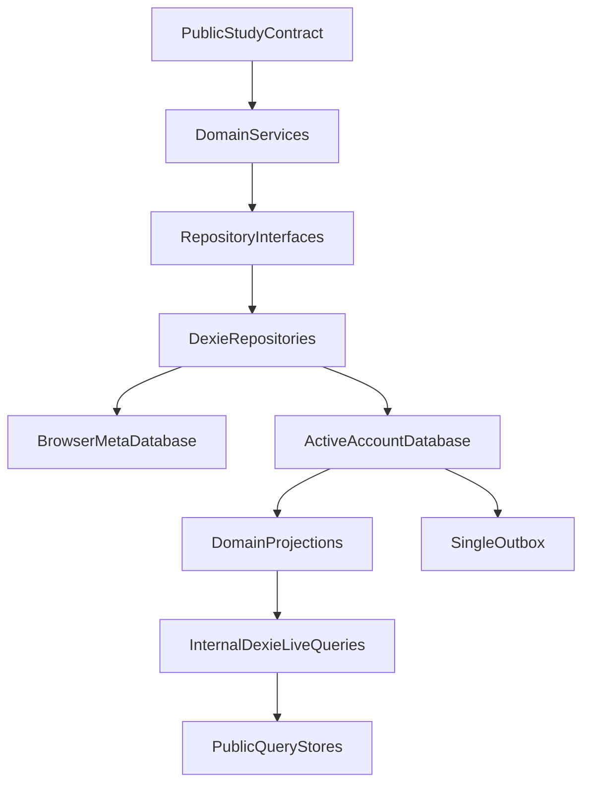
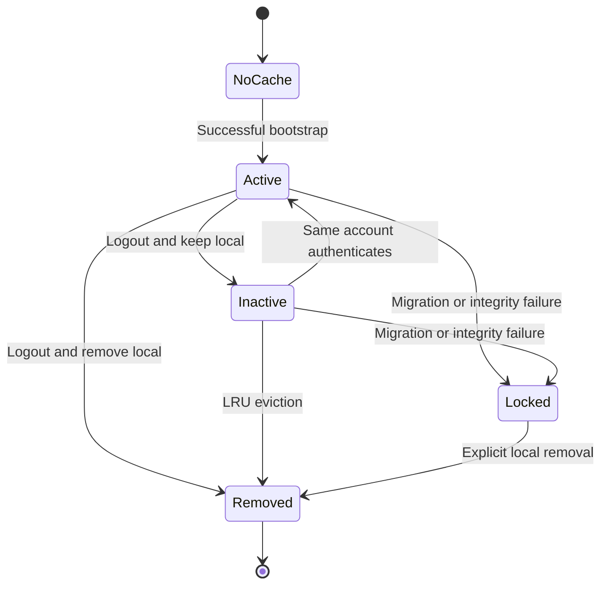
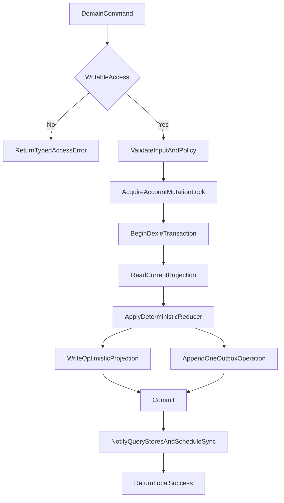
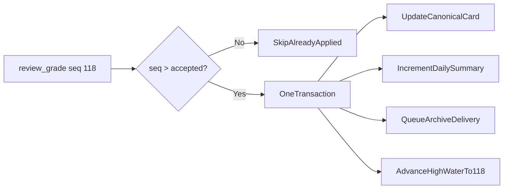
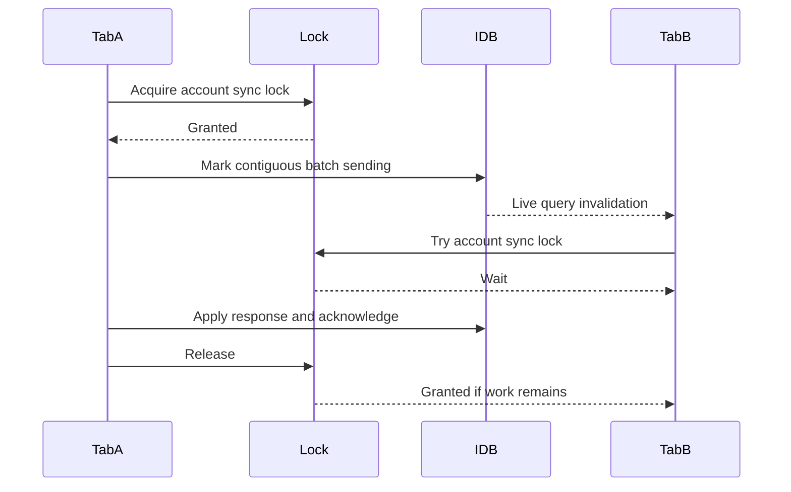

# Local Data and Domains

This document owns the browser persistence model for all non-FSRS domains,
account-cache lifecycle, device-owned activity summaries, outboxes, and
cross-tab coordination. Review-specific entities are detailed in
[Reviews and FSRS](./REVIEWS-AND-FSRS.md).

## Persistence goals

- Every accepted writable mutation is durable in IndexedDB before success is
  returned.
- A projection and the operation that will synchronize it commit in one local
  transaction.
- Domain queries are reactive across tabs.
- Account data is never exposed merely because its database remains on disk.
- Retries, reloads, tab crashes, and network failures do not duplicate hot
  operations or raw events.
- Local storage remains a cache, not a guaranteed backup. Browser eviction and
  device loss remain possible.

## Storage layering



Core domain code sees repository interfaces, a clock, and ID generation. It
does not import Dexie. The browser entrypoint supplies the Dexie adapters.

## Database topology

Use one small browser metadata database and one database per retained account.
Suggested names are implementation details:

```text
kh-study-engine-meta-v1
kh-study-engine-account-<opaqueLocalCacheId>
```

Do not put an email address or raw account ID in a database name. The metadata
database maps a random `opaqueLocalCacheId` to the backend account ID.

### Browser metadata database

Proposed records:

```ts
interface BrowserMetaRecord {
  key: "singleton";
  schemaVersion: number;
  activeCacheId: string | null;
  maximumTotalAccountCacheCount: number; // default 2
  lastObservedWallTime: UnixMs;
  logoutPending: boolean;
}

interface AccountCacheRecord {
  localCacheId: string;
  accountId: AccountId;
  databaseName: string;
  databaseSchemaVersion: number;
  createdAt: UnixMs;
  lastActivatedAt: UnixMs;
  lastOpenedAt: UnixMs;
  state: "active" | "inactive" | "locked";
  lockReason?: "migration_failed" | "corrupt";
}
```

The metadata database contains no notes, bookmarks, card states, raw events,
session token, or entitlement Boolean. It may retain the signed lease and
minimal active-account metadata needed for an offline restart, but it must not
contain JavaScript-readable bearer credentials.

### Account database

The first schema should have explicit tables rather than one polymorphic
document store:

```ts
interface AccountDatabaseTables {
  accountMeta: AccountLocalMeta;

  notes: KanjiNoteRow;
  bookmarks: KanjiBookmarkRow;

  reviewPileItems: ReviewPileItemRow;
  reviewCards: ReviewCardRow;
  reviewSettings: ReviewSettingsRow;

  dailySummaries: DailySummaryRow;
  challengeSummaries: ChallengeSummaryRow;

  outbox: OutboxRow;
}

interface AccountLocalMeta {
  key: "singleton";
  accountId: AccountId;
  deviceId: DeviceId;
  nextDeviceSequence: number;
  acceptedThroughDeviceSequence: number;
  cursor: ServerCursor;

  // Present only while access is "bootstrapping".
  activeBootstrapId?: string;
  bootstrapSnapshotRevision?: number;
  bootstrapCursor?: string;
}
```

Eight tables, down from fifteen. The removed tables and why they are no longer
required:

| Removed                  | Reason                                                       |
| ------------------------ | ------------------------------------------------------------ |
| `noteConflicts`          | Concurrent note edits merge into the canonical note          |
| `reviewSettingsVersions` | Replay applies the winning current settings                  |
| `archiveOutbox`          | The backend fans events out to the archive                   |
| `syncInbox`              | A pull response is applied in one transaction from memory    |
| `bootstrapPages`         | Pages write into live tables under the bootstrap gate        |
| `localLeases`            | The review handle is in-memory; there is no persistent lease |
| `deviceSlot` columns     | Summaries and counters are derived by the backend            |

`syncInbox` deserves an explicit note because its removal is not obvious. It
existed so that applying a delta and advancing the cursor were atomic. They
still are: a pull response is bounded by the published byte limit, so the
engine holds it in memory, applies every change group and the new cursor in one
Dexie transaction, and commits. A crash before commit changes nothing and the
same cursor is retried. A staging table adds a write amplification and buys no
additional atomicity.

Suggested IndexedDB indexes:

```text
notes: &kanji, serverRevision, active
bookmarks: &kanji, serverRevision, active
reviewPileItems: &kanji, generation, serverRevision, active
reviewCards: &[kanji+cardType], [cardType+dueAt], generation, serverRevision, active
dailySummaries: &localDate, serverRevision
challengeSummaries: &[activityType+challengeId], serverRevision
outbox: &deviceSequence, operationId, state
```

Index syntax is illustrative; final Dexie syntax belongs in implementation.

### Bounded natural keys

Every table above is keyed by a bounded natural key, and no row is ever
hard-deleted for a domain reason. This is what removes tombstones from the
design (see [Sync and backend](./SYNC-AND-BACKEND.md)).

| Entity            | Key                                      | Bound               |
| ----------------- | ---------------------------------------- | ------------------- |
| note              | `kanji`                                  | kanji set           |
| bookmark          | `kanji`                                  | kanji set           |
| review pile item  | `kanji` + `generation` field             | catalog size        |
| review card       | `(kanji, cardType)` + `generation` field | 2 × catalog size    |
| daily summary     | `localDate`                              | account age in days |
| challenge summary | `(activityType, challengeId)`            | challenge count     |

A pile item is one row per kanji whose `generation` increments on re-add. It is
not one row per generation. Removal and re-addition therefore cannot grow the
table, which removes the "review pile generations need special monitoring"
problem entirely. Stale-write protection is unaffected because it comes from
the `generation` value carried on the grade, not from row identity: a grade
based on generation 4 can never apply to generation 5.

When a card is deactivated, its heavy fields (`state`, `historyWindow`) are
nulled so an inactive card row costs tens of bytes rather than kilobytes.

## Account cache lifecycle

The default limit is two total account caches, including the active one.



Activation algorithm:

1. Verify the backend session and obtain stable `accountId`.
2. Find a retained cache for that account.
3. Validate database schema, protocol metadata, catalog hash, and account
   binding.
4. If reusable, mark it active and mark the former active cache inactive.
5. If not reusable, stage a new bootstrap.
6. If activation would exceed the configured cache count, remove the inactive
   cache with the oldest `lastActivatedAt`.
7. Never evict the currently active cache or a locked cache with uninspected
   pending data automatically.

If every removable slot is protected by a locked cache, return a storage/cache
management error instead of deleting data.

For the cache policy, “least recently used” means least recently activated for
an authenticated account. Update `lastActivatedAt` whenever a cache becomes
active. `lastOpenedAt` is diagnostic/migration metadata and does not control
eviction.

Signed-out access clears `activeCacheId`. Domain repositories must require an
active, authorized account context before opening an account database. Keeping
an inactive database is not authorization to query it.

## Local mutation transaction

Every domain command follows the same skeleton:



Every accepted mutation writes exactly one outbox row. There is no second
pipeline and no mutation that must appear in two places with a shared identity.

No network call occurs inside a Dexie transaction. IndexedDB may auto-commit
when unrelated asynchronous work is awaited, so IDs, timestamps, reductions,
and payload validation must be prepared before or use only transaction-safe
operations in scope.

### Local operation identity

Each account/device cache has:

- Backend-assigned `deviceId`.
- Monotonic `nextDeviceSequence`.
- Current server cursor.

An operation ID is `(deviceId, deviceSequence)`. Facts additionally carry a
globally unique `eventId` that follows them into the archive, but that ID is
not a second sequence space and is not separately acknowledged.

Sequences are allocated inside the same transaction as the projection and
outbox write. Multiple tabs cannot allocate the same sequence.

### Optimistic projections are recomputed, not accumulated

A projection is defined as a function of the last server value and the pending
operations that have not yet been acknowledged:

```text
displayed(key) = lastServerValue(key) with pending outbox ops for key replayed
```

Rows are materialized so Dexie can index and query them, but whenever a server
value for a key arrives, the row is rebuilt from that server value and the
still-pending operations for the same key. It is never patched in place on top
of a value that already includes those operations.

This matters most for derived counters. If a device grades twenty cards and a
server daily summary arrives while five of those grades are still unsent,
patching would either double-count the fifteen acknowledged grades or drop the
five pending ones. Rebuilding is correct in both directions and needs no
special cases.

## Notes

One canonical Markdown note exists per valid `Kanji` identifier:

```ts
interface KanjiNoteRow {
  kanji: Kanji;
  content: string;
  contentUtf8Bytes: number;
  updatedAt: UnixMs;
  writerDeviceId: DeviceId;
  writerDeviceSequence: number;
  baseServerRevision: number;
  serverRevision?: number;
  active: boolean;

  // Set when the backend merged a divergent edit into `content`.
  hasMergedEdit: boolean;
  mergedAt?: UnixMs;
}
```

Rules:

- The backend publishes a maximum UTF-8 byte count. Both engine and backend
  validate it.
- `put()` requires non-empty content after trimming for validation. A host that
  clears the editor calls explicit `remove()`, which deactivates the note.
  Empty or whitespace-only `put()` returns `validation_failed`.
- A normal edit carries the server revision it was based on.
- A direct descendant of the canonical revision replaces it outright.

### Divergent edits merge; they do not select a loser

When two edits diverge from the same base, the backend produces a canonical
note that contains **both** texts:

```markdown
<content of the edit that sorts first>

---

<!-- kh-merge: also edited on another device, 2026-07-26T14:32:00Z -->

<content of the edit that sorts second>
```

Ordering within the merge is the deterministic tuple
`(clampedUpdatedAt, deviceId, deviceSequence)`, so every device that applies
the same pair of edits produces byte-identical output.

The merged note is set with `hasMergedEdit: true`. That flag is the host's cue
to show a dismissible hint. The next successful `put` for that kanji clears it,
because the user has by then either cleaned up the merged text or deliberately
kept it.

Why this rather than a conflict copy with restore and dismiss:

- Nothing is discarded, which is what invariant 8 actually requires. A
  "recoverable losing copy" satisfies the invariant only if the user finds it,
  and a copy attached to a kanji the user never opens again is never found.
- It removes an entire domain: no `note_conflicts` table in Postgres, no
  `noteConflicts` table in IndexedDB, no `note_conflict` entity in bootstrap
  or delta, no `restoreConflict`, no `dismissConflict`, no conflict view types,
  and no conflict recovery UI.
- It removes an R2 write from inside the sync transaction. The previous design
  had to durably archive a displaced conflict copy before replacing it, which
  put an external service dependency on the transactional hot path for an
  event that occurs a few times per user per year.
- The resolution UI is the editor the user already has. Both texts are in
  front of them and they delete the half they do not want.

Constraints:

- If the merged content would exceed the published note byte limit, the backend
  keeps the deterministic winner alone, sets `hasMergedEdit`, and returns a
  `note_merge_truncated` warning. The displaced text is retained in the
  operational archive for support recovery. This is the one case where an edit
  is not immediately visible to the user, and it requires two edits that are
  together larger than the limit.
- The marker is an HTML comment so it renders invisibly if the user never
  cleans it up.
- Delete-versus-edit does not merge. An edit beats a concurrent delete, because
  reviving text is recoverable and losing it is not. The note stays active with
  the edited content.

Client timestamps are imperfect. Clamping and deterministic ties guarantee
convergence, not knowledge of the user's true intent.

Scenarios that produce a merge, and the host UI for each, are in
[Scenarios and UX](./SCENARIOS-AND-UX.md).

## Bookmarks

A bookmark is set membership for one kanji. It stores no word:

```ts
interface KanjiBookmarkRow {
  kanji: Kanji;
  updatedAt: UnixMs;
  writerDeviceId: DeviceId;
  writerDeviceSequence: number;
  baseServerRevision: number;
  serverRevision?: number;
  active: boolean;
}
```

The host resolves the representative word, reading, meaning, JLPT band, grade,
and every other presentation value. Storing those snapshots would couple
StudyEngine to a host data model and let them go stale.

Storing the word is not merely redundant, it is actively wrong, and the current
Kanji Heatmap code demonstrates why. Today a bookmark is keyed
`b:<kanji>:<word>` where the word comes from the representative-word provider,
and `buildPracticeDeck` filters with `isBookmarked(kanji, word)` using whatever
the representative word is at that moment. A data update that changes a kanji's
representative word therefore orphans every existing bookmark for that kanji:
the key no longer matches and the bookmark silently disappears from the
"bookmarked only" practice filter. Keying by kanji alone removes the failure
mode.

`add(kanji)` activates the bookmark. `remove(kanji)` deactivates it. Concurrent
writes use the deterministic version tuple. There is no conflict UI for
bookmarks, because a boolean has nothing to recover.

`watchAll()` does not need pagination. The versioned kanji catalog bounds the
review pile, but not notes/bookmarks. Version one still returns the complete
bookmark set because it is small account data; the backend publishes a maximum
bookmark count if abuse protection requires one.

## Practice activity events

Practice commands accept a versioned discriminated union. A free-form
`Record<string, string | number>` is not sufficient for validation or summary
reduction.

Proposed first event variants:

```ts
type PracticeActivityEventInput =
  | {
      schemaVersion: 1;
      type: "speed_katakana_session_completed";
      occurredAt: UnixMs;
      localDate: LocalDate;
      timeZone: IanaTimeZone;
      challengeId: string;
      accuracyPercent: number;
      charactersPerMinute: number;
      startedAt: UnixMs;
      endedAt: UnixMs;
    }
  | {
      schemaVersion: 1;
      type: "reading_practice_round_completed";
      occurredAt: UnixMs;
      localDate: LocalDate;
      timeZone: IanaTimeZone;
      correctCount: number;
      attemptedCount: number;
      startedAt: UnixMs;
      endedAt: UnixMs;
    }
  | {
      schemaVersion: 1;
      type: "writing_practice_round_completed";
      occurredAt: UnixMs;
      localDate: LocalDate;
      timeZone: IanaTimeZone;
      correctCount: number;
      attemptedCount: number;
      startedAt: UnixMs;
      endedAt: UnixMs;
    };
```

Speaking practice or sentence shadowing becomes another explicit variant in a
coordinated schema release. Unknown event types fail validation; a type the
backend cannot reduce into a summary is never accepted.

The engine, not the host, adds account/device/event identity.

`activity.record()` appends exactly one `practice_activity_event_add` operation
to the outbox and applies the same reduction locally as an optimistic
projection. It does not additionally write a summary operation. Under the
previous design a single Speed Katakana completion produced three rows across
two outboxes: a raw archive event, a daily summary snapshot, and a challenge
summary snapshot.

## Daily summaries

A daily summary is a **backend-derived projection**. Devices never send one.

```ts
interface DailySummaryRow {
  schemaVersion: 1;
  localDate: LocalDate;
  timeZonesSeen: readonly IanaTimeZone[];

  speedKatakanaSessions: number;
  readingPracticeRounds: number;
  writingPracticeRounds: number;

  readingCardsReviewed: number;
  writingCardsReviewed: number;
  ratingAgain: number;
  ratingHard: number;
  ratingGood: number;
  ratingEasy: number;

  firstActivityAt: UnixMs;
  lastActivityAt: UnixMs;
  serverRevision: number;
}
```

There is no device dimension. The backend increments this row at ingest, inside
the same transaction that applies the fact and advances the device sequence
high-water mark. The originating local day is retained even when the user
travels; `timeZonesSeen` is bounded and informational, and counts belong to
`localDate`.

### Why derivation replaced device-owned snapshots

The previous design had each device send an absolute snapshot of its own
component of each day, partitioned by `deviceSlot` so two devices could not
conflict. It worked, but it had three costs that derivation removes.

**Rewrite amplification.** A daily summary changes on every single grade. As an
absolute snapshot in a strictly contiguous sequence, that meant one
`daily_summary_put` operation per grade: two hundred reviews in a day produced
two hundred redundant snapshots. Coalescing them would have punched holes in
the sequence the protocol requires to be gap-free, and no version of the design
specified how. Deriving removes the operation kind entirely, so a grade emits
one row instead of three and a practice completion emits one instead of three.

**Two writers for one number.** The device wrote the summary and also sent the
raw event that explained it. The backend could only partially reconcile them,
which is why the earlier specification had to say the server should validate
that a component "equals a possible reduction of locally accepted typed values
where practical." That hedge was the design admitting it had two sources of
truth it could not fully align. There is now one.

**A whole partitioning scheme.** `deviceSlot` existed almost entirely to keep
two devices from colliding on counters. With the backend incrementing, nothing
needs partitioning, so slot allocation, slot caps, and slot reuse policy are
all gone, along with the per-card counter component maps.

### Exactly-once increments

Incremental derivation is only safe if a fact is never applied twice. It comes
free from machinery the protocol already has: an operation whose
`deviceSequence` is at or below `accepted_hot_sequence` is skipped, and the
high-water advance commits in the same transaction as the increments. No
separate dedupe table is needed on the sync path.



### Derive at ingest, never recompute from the archive

Daily summaries persist for the account lifetime. Raw events have a retention
policy. A summary must therefore be a durable table incremented at ingest, and
must never be defined as a query over archived events. "Recompute from cold
storage" is not a valid fallback and must not appear in the implementation.

### Rejected facts still count

A grade for a generation that was removed on another device is acknowledged so
its sequence can advance, does not resurrect card state, and **does** increment
the daily summary. The user performed the review; only the schedule is
irrelevant. See [Reviews and FSRS](./REVIEWS-AND-FSRS.md).

### Reducer duplication is the accepted cost

The summary reducers now exist twice: authoritative in Python, optimistic in
TypeScript. They must roughly agree. This is a real cost and cheaper than it
looks, because summary reducers are counters and max/latest comparators rather
than a scheduling algorithm, and because any client drift self-heals the next
time a server value overwrites the projection. They do not need the fixture
strictness that `ts-fsrs`/`py-fsrs` parity requires.

Daily rows remain for the account lifetime. This is small linear growth, not
flat storage. The design must not claim otherwise.

## Challenge summaries

Speed Katakana has one derived row per challenge, with no device dimension:

```ts
interface ScoreRecord {
  eventId: string;
  value: number;
  achievedAt: UnixMs;
}

interface LatestSpeedKatakanaAttempt {
  eventId: string;
  occurredAt: UnixMs;
  accuracyPercent: number;
  charactersPerMinute: number;
}

interface ChallengeSummaryRow {
  schemaVersion: 1;
  activityType: "speed_katakana";
  challengeId: string;
  attemptCount: number;
  latest: LatestSpeedKatakanaAttempt;
  bestAccuracy: ScoreRecord;
  bestCharactersPerMinute: ScoreRecord;
  bestCharactersPerMinuteAbove70Accuracy?: ScoreRecord;
  serverRevision: number;
}
```

Reduction rules applied by the backend as each fact is ingested:

- `attemptCount` increments by one.
- `latest` is replaced when the incoming occurrence is later; equal occurrence
  times choose the stable `eventId`.
- Best accuracy and CPM are replaced when the incoming value is larger.
- Equal best values keep the earlier achievement time, then the stable
  `eventId`, so every runtime converges.
- The 70-percent threshold rule must specify whether exactly 70 qualifies. To
  match current product behavior, version 1 uses strictly greater than 70.

Every rule above is order-insensitive, so a late-arriving fact from a device
that was offline for a week produces the same row as if it had arrived on time.
Increment, maximum, and latest-by-timestamp all commute.

Each future challenge type defines its own typed row and comparators. “Best”
must never be a generic maximum over an unknown payload.

## All-time and range views

All-time and date-range data are projections:

- `cakeDay` is the earliest local date with any non-zero component.
- `daysActive` counts dates with at least one selected activity.
- All-time practice and review counts sum daily account aggregates.
- A range query uses inclusive `LocalDate` bounds.
- Hosts choose which fields to display and filter.

The local database may cache an all-time aggregate for speed, but it is
rebuildable and not an independent source of truth.

## The outbox

There is one outbox, one sequence space, and one acknowledgement path:

```ts
interface OutboxRow {
  deviceSequence: number;
  operationId: string;
  kind:
    | "note_put"
    | "note_remove"
    | "bookmark_add"
    | "bookmark_remove"
    | "review_settings_update"
    | "review_pile_add"
    | "review_pile_remove"
    | "review_grade"
    | "practice_activity_event_add";
  payload: unknown; // narrowed by kind internally
  createdAt: UnixMs;
  state: "pending" | "sending";
  attemptCount: number;
}
```

The client sends contiguous sequence batches. A crashed `sending` row returns
to pending on startup. Rows are removed only through a server acknowledgement
covering their sequence.

### The outbox is deliberately heterogeneous

Two kinds of operation share this table, and conflating them causes design
mistakes:

- **Facts** — `review_grade` and `practice_activity_event_add`. These are
  immutable records of something the user did. They never conflict with each
  other; two devices grading offline simply each know something the other does
  not. The backend derives card state and summaries from them.
- **State intents** — `note_put`, `note_remove`, `bookmark_add`,
  `bookmark_remove`, `review_settings_update`, `review_pile_add`,
  `review_pile_remove`. These express a desired value for mutable state and are
  resolved by deterministic last-writer-wins or, for notes, by merge.

Do not attempt to model notes, bookmarks, or settings as facts. Deriving a
note's content from an event log would require event-sourcing note text, which
buys nothing and costs a domain.

### Why one outbox instead of two

The previous design had a hot outbox for the transactional sync endpoint and an
archive outbox for a separate durable event endpoint, each with its own
sequence space and high-water mark. That split existed only because raw events
had a second destination.

Once the backend derives summaries and card state from facts, it must have the
fact inside the sync transaction, so there is exactly one delivery path.
Archival becomes a backend-side fan-out behind a transactional delivery outbox.

This is better on the axis that motivated the split. Under two pipelines, an R2
outage produced a client-visible degraded archive backlog. Under one, the
client's obligation ends at the sync acknowledgement and the backlog is a
server-side condition the operator can see and alert on. Removed with the
second pipeline: `archiveSequence`, `acceptedThroughArchiveSequence`,
`POST /api/events/batch`, `ArchiveSnapshot`, and the shared-`eventId`
coupling between two rows describing the same action.

The cost accepted in exchange: raw events now travel on the transactional path
and count against published sync count and byte limits. For the version-one
event types, which are small, this is negligible. A future fat event type such
as per-utterance shadowing telemetry would deserve a reassessment rather than
an automatic second pipeline.

## Cross-tab coordination

Dexie live queries broadcast affected ranges across browsing contexts, but
notification is not mutual exclusion. The browser runtime needs:

- IndexedDB transactions for sequence allocation and entity mutation.
- A browser-wide account sync lock so only one tab sends a batch at a time.
- Broadcast notification for access, logout, sync, and active-cache changes.

It does **not** need a persistent cross-tab review lease. See
[Active review handles](#active-review-handles).



Use the Web Locks API when supported. Provide an IndexedDB lease fallback with
owner tab ID, expiry, compare-and-swap renewal, and crash-safe takeover.
BroadcastChannel is an optimization; correctness must survive a missed
broadcast.

## Active review handles

An open review is held by an **in-memory, single-use handle**. There is no
persisted lease table.

The handle holds a frozen snapshot of the card and the settings that were
current when it was opened, plus the four rating previews computed from them.
It exists to guarantee three things:

1. The grade is computed from exactly the state whose previews the user saw.
2. A consumed handle cannot be graded twice, so a double tap cannot produce two
   review facts.
3. The grade is bound to a specific generation and revision, so a screen left
   open across a remove-and-re-add cannot grade the new generation.

All three are properties of one page's memory. None of them require durable
storage, and a reload or crash correctly discards the handle.

### Why the cross-tab lease was removed

The earlier design added a `localLeases` table so two tabs could not present the
same card: due queries filtered out leased cards, the owning tab renewed the
lease on a timer, and a crashed tab's lease was taken over after expiry.

That machinery bought exclusion only, and exclusion is not a correctness
property here. If two tabs do grade the same card, the result is two review
facts from one device, which the backend replays chronologically to the correct
answer. The outcome is right; the experience is merely odd, in a situation that
is rare for a single-user study application.

Removed with it: the `localLeases` table, the lease filter in every due query,
lease renewal under background-tab timer throttling, crash takeover, and the
`review_already_open` error.

The tab-exclusion behavior is retained best-effort at a fraction of the cost. A
tab that opens a card broadcasts `{ reviewing: cardId }` on the existing
`BroadcastChannel`; other tabs keep an in-memory set and skip those cards when
building a due list. A missed broadcast degrades to both tabs showing the card,
which is the harmless case that already converges.

Handle duration is a browser policy constant. It must tolerate background-tab
timer throttling, and its expiry is the only thing that ends an abandoned
review, since `cancel()` may never be called if a tab is closed abruptly.

## Bootstrap

Bootstrap is paged from the first release. A single-response bootstrap would be
adequate for a realistic account today, but pages change the shape of the client
code — a loop with persisted progress rather than one `await` — and retrofitting
that shape later is the expensive part. The protocol risk is separate and worse:
a client that ignores an unknown `hasMore` would activate a partial account as
if it were whole.

Bootstrap data never partially becomes the active projection:

1. Start a bootstrap and record `bootstrapId` and a fixed `snapshotRevision`.
2. Create the account database and set access to `bootstrapping`.
3. For each page: verify schema versions, then in **one transaction** write the
   page's entities directly into the live tables and persist the returned
   `bootstrapCursor` in `accountMeta`.
4. When `hasMore` is false, in one small transaction set the account cursor to
   `snapshotRevision` and mark the cache active.
5. Pull deltas after that revision.

Step 2 is what makes step 3 safe. Both reads and writes are gated on the
account not being in `bootstrapping` state, so a partially written database is
unobservable. The invariant is satisfied by the access gate rather than by a
staging table, which is why `bootstrapPages`, per-page hashes, signed resumable
page tokens, and a domain manifest are all unnecessary.

Because `bootstrapCursor` commits with the page that produced it, closing the
browser mid-bootstrap resumes from the next unwritten page. An implementation
may instead delete the partial database and restart; for an account of this
size that is a defensible simplification and removes the resume path entirely.

Pages are sized by byte budget rather than entity count, because entity sizes
differ by two orders of magnitude between a bookmark and a long note. One
entity is never split across pages.

If entitlement is lost mid-bootstrap, activation stops and the engine exposes
`read_only` with `hasReadableCache: false`.

## Schema migration

Every account database records:

- IndexedDB schema version.
- Engine version that last wrote it.
- Backend protocol major.
- Catalog version/hash.
- Scheduler schema version.
- Last integrity-check result.

Migration rules:

- Migrations are deterministic and local; no fetch inside an IndexedDB upgrade.
- Back up irreplaceable metadata/outbox rows into migration staging before a
  risky transform.
- A failure closes the database, marks its cache locked, and emits a diagnostic
  ID.
- Never catch migration failure by deleting the database.
- A version change from another tab closes stale connections and asks the host
  to reload before old code touches the new schema.
- Downgrade is not supported.

## Storage pressure and persistence

The engine should expose `navigator.storage.estimate()` and a host-triggered
`navigator.storage.persist()` request where supported.

Policy:

- Compact the acknowledged outbox immediately.
- Null the heavy fields of deactivated cards.
- Keep only the configured hot review ring per card.
- Warn before the pending outbox approaches a configured byte threshold.
- Do not silently discard unacknowledged operations.
- If IndexedDB cannot commit a new mutation, return `storage_quota`; do not
  report a successful grade or note save.

Local storage pressure is now a single condition rather than two. Because there
is one outbox, there is no state in which hot data has converged while raw
events remain queued locally.

## Data integrity checks

On startup and before sync, cheaply verify:

- Account ID and device identity match the active cache.
- Outbox sequences are unique and contiguous after the acknowledged high-water
  mark.
- Every active review pile item has exactly two active cards.
- Card generations agree with their pile item's generation.
- Counts are non-negative safe integers.
- Inactive rows do not appear in due indexes.
- The local cursor does not exceed the last applied server revision.
- Operation IDs are unique.

Expensive full scans should run only after migration, explicit diagnostics, or
detected inconsistency.

## Current Kanji Heatmap localStorage data

The new engine does not import or migrate current host storage. A later host
integration removes or stops reading these study-specific key families:

```text
b:<kanji>:<word>
kanji-study-notes:v1:<kanji>
activity-all-time
activity-by-day
speed-katakana-stats-<challenge>
```

Theme, font, search, and other non-study host preferences remain host-owned.
The destructive rollout and user communication belong to
[Kanji Heatmap integration](./KANJI-HEATMAP-INTEGRATION.md).
