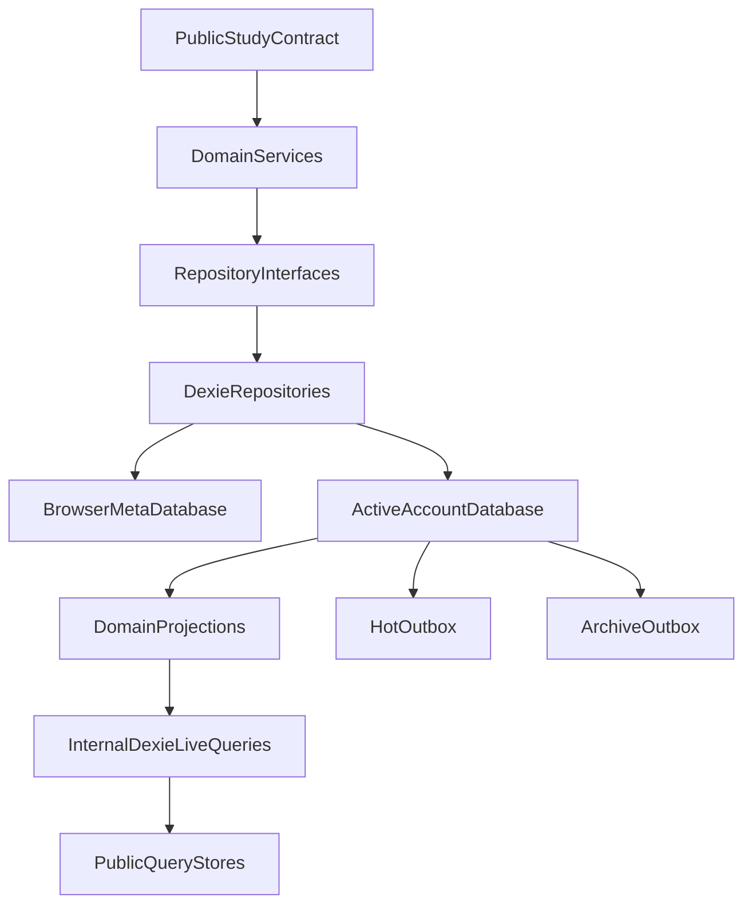
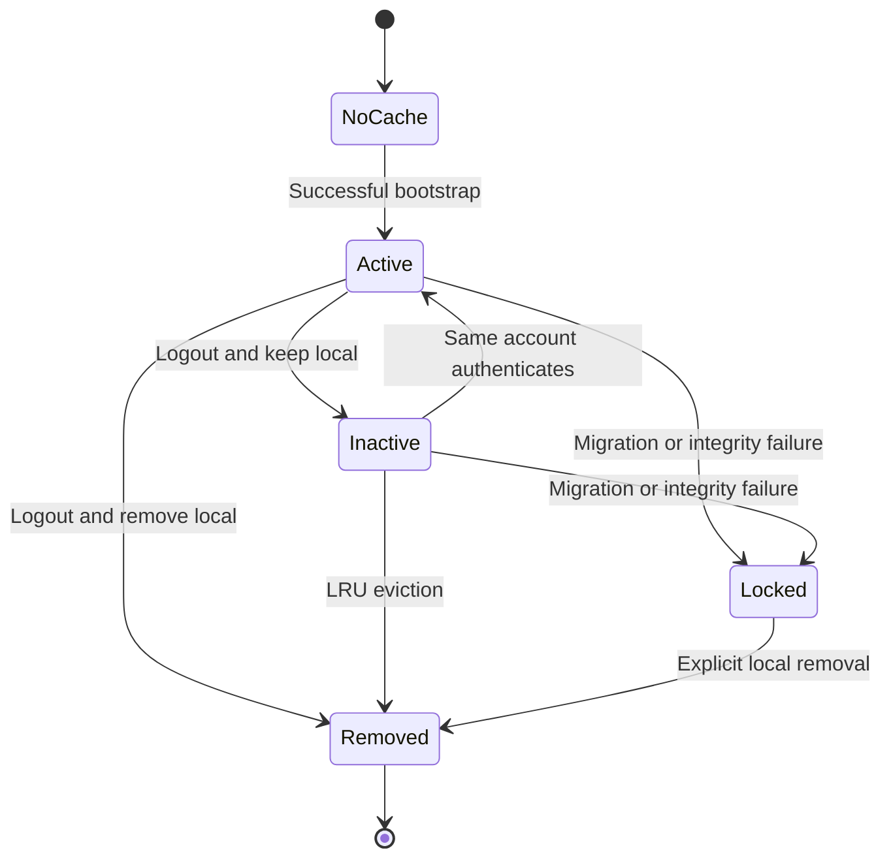
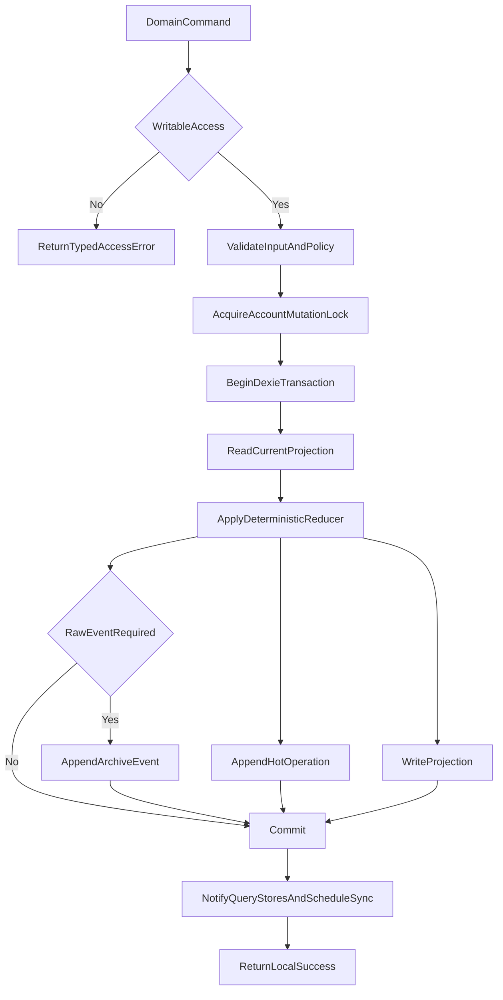
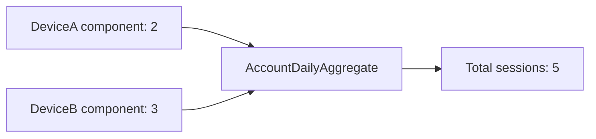
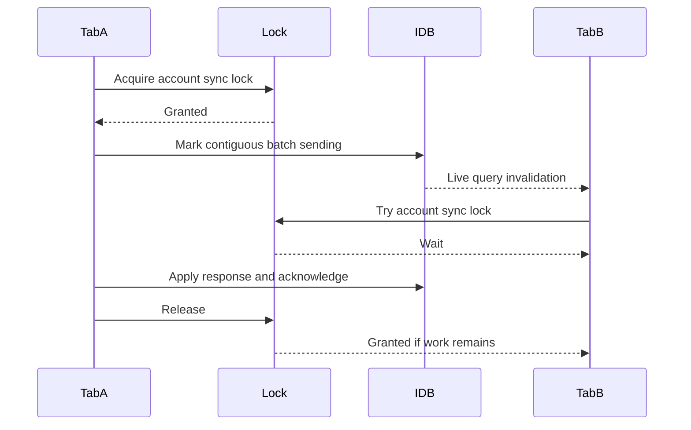

# Local Data and Domains

This document owns the browser persistence model for all non-FSRS domains,
account-cache lifecycle, device-owned activity summaries, outboxes, and
cross-tab coordination. Review-specific entities are detailed in
[Reviews and FSRS](./REVIEWS-AND-FSRS.md).

## Persistence goals

- Every accepted writable mutation is durable in IndexedDB before success is
  returned.
- A projection and the operation that will synchronize it commit in one local
  transaction.
- Domain queries are reactive across tabs.
- Account data is never exposed merely because its database remains on disk.
- Retries, reloads, tab crashes, and network failures do not duplicate hot
  operations or raw events.
- Local storage remains a cache, not a guaranteed backup. Browser eviction and
  device loss remain possible.

## Storage layering



Core domain code sees repository interfaces, a clock, and ID generation. It
does not import Dexie. The browser entrypoint supplies the Dexie adapters.

## Database topology

Use one small browser metadata database and one database per retained account.
Suggested names are implementation details:

```text
kh-study-engine-meta-v1
kh-study-engine-account-<opaqueLocalCacheId>
```

Do not put an email address or raw account ID in a database name. The metadata
database maps a random `opaqueLocalCacheId` to the backend account ID.

### Browser metadata database

Proposed records:

```ts
interface BrowserMetaRecord {
  key: "singleton";
  schemaVersion: number;
  activeCacheId: string | null;
  maximumTotalAccountCacheCount: number; // default 2
  lastObservedWallTime: UnixMs;
  logoutPending: boolean;
}

interface AccountCacheRecord {
  localCacheId: string;
  accountId: AccountId;
  databaseName: string;
  databaseSchemaVersion: number;
  createdAt: UnixMs;
  lastActivatedAt: UnixMs;
  lastOpenedAt: UnixMs;
  state: "active" | "inactive" | "locked";
  lockReason?: "migration_failed" | "corrupt";
}
```

The metadata database contains no notes, bookmarks, card states, raw events,
session token, or entitlement Boolean. It may retain the signed lease and
minimal active-account metadata needed for an offline restart, but it must not
contain JavaScript-readable bearer credentials.

### Account database

The first schema should have explicit tables rather than one polymorphic
document store:

```ts
interface AccountDatabaseTables {
  accountMeta: AccountLocalMeta;
  notes: KanjiNoteRow;
  noteConflicts: NoteConflictRow;
  bookmarks: KanjiBookmarkRow;

  reviewPileItems: ReviewPileItemRow;
  reviewCards: ReviewCardRow;
  reviewSettings: ReviewSettingsRow;
  reviewSettingsVersions: ReviewSettingsVersionRow;

  dailySummaries: DeviceDailySummaryRow;
  challengeSummaries: DeviceChallengeSummaryRow;

  hotOutbox: HotOutboxRow;
  archiveOutbox: ArchiveOutboxRow;
  syncInbox: SyncInboxRow;
  bootstrapPages: BootstrapPageRow;
  localLeases: LocalLeaseRow;
}

interface AccountLocalMeta {
  key: "singleton";
  accountId: AccountId;
  deviceId: DeviceId;
  deviceSlot: DeviceSlot;
  nextDeviceSequence: number;
  nextArchiveSequence: number;
  acceptedThroughDeviceSequence: number;
  acceptedThroughArchiveSequence: number;
  cursor: ServerCursor;
  activeBootstrapId?: string;
}

interface SyncInboxRow {
  accountRevision: number;
  encodedChangeGroup: Uint8Array;
  receivedAt: UnixMs;
}

interface BootstrapPageRow {
  bootstrapId: string;
  pageNumber: number;
  snapshotRevision: number;
  sha256: string;
  encodedPage: Uint8Array;
}

type DeviceChallengeSummaryRow = SpeedKatakanaChallengeComponent;
```

`syncInbox` is a short-lived staging table for a pulled page. Applying a server
delta and advancing the local cursor happen atomically. It is not a permanent
event log.

Suggested IndexedDB indexes:

```text
notes: &kanji, serverRevision, tombstone
noteConflicts: &kanji, createdAt
bookmarks: &kanji, serverRevision, tombstone
reviewPileItems: &pileItemId, &kanji, generation, serverRevision, tombstone
reviewCards: &cardId, [cardType+dueAt], pileItemId, serverRevision
reviewSettingsVersions: &settingsVersion, referencedUntilRevision
dailySummaries: &[localDate+deviceSlot], localDate, serverRevision
challengeSummaries: &[activityType+challengeId+deviceSlot], serverRevision
hotOutbox: &deviceSequence, operationId, state
archiveOutbox: &eventId, [state+occurredAt]
bootstrapPages: &[bootstrapId+pageNumber]
localLeases: &leaseKey, expiresAt
```

Index syntax is illustrative; final Dexie syntax belongs in implementation.

## Account cache lifecycle

The default limit is two total account caches, including the active one.



Activation algorithm:

1. Verify the backend session and obtain stable `accountId`.
2. Find a retained cache for that account.
3. Validate database schema, protocol metadata, catalog hash, and account
   binding.
4. If reusable, mark it active and mark the former active cache inactive.
5. If not reusable, stage a new bootstrap.
6. If activation would exceed the configured cache count, remove the inactive
   cache with the oldest `lastActivatedAt`.
7. Never evict the currently active cache or a locked cache with uninspected
   pending data automatically.

If every removable slot is protected by a locked cache, return a storage/cache
management error instead of deleting data.

For the cache policy, “least recently used” means least recently activated for
an authenticated account. Update `lastActivatedAt` whenever a cache becomes
active. `lastOpenedAt` is diagnostic/migration metadata and does not control
eviction.

Signed-out access clears `activeCacheId`. Domain repositories must require an
active, authorized account context before opening an account database. Keeping
an inactive database is not authorization to query it.

## Local mutation transaction

Every domain command follows the same skeleton:



No network call occurs inside a Dexie transaction. IndexedDB may auto-commit
when unrelated asynchronous work is awaited, so IDs, timestamps, reductions,
and payload validation must be prepared before or use only transaction-safe
operations in scope.

### Local operation identity

Each account/device cache has:

- Backend-assigned `deviceId`.
- Backend-assigned integer `deviceSlot`.
- Monotonic `nextDeviceSequence`.
- Monotonic `nextArchiveSequence`.
- Current server cursor.

A hot operation ID is `(deviceId, deviceSequence)`. An archive event also has a
globally unique `eventId`; `(deviceId, archiveSequence)` permits contiguous
acknowledgement and efficient retry.

Sequences are allocated inside the same transaction as the projection and
outbox write. Multiple tabs cannot allocate the same sequence.

## Notes

One canonical Markdown note exists per valid `Kanji` identifier:

```ts
interface KanjiNoteRow {
  kanji: Kanji;
  content: string;
  contentUtf8Bytes: number;
  updatedAt: UnixMs;
  writerDeviceId: DeviceId;
  writerDeviceSequence: number;
  baseServerRevision: number;
  serverRevision?: number;
  tombstone: boolean;
}

interface NoteConflictRow {
  kanji: Kanji;
  canonicalServerRevision: number;
  losingContent: string;
  losingUpdatedAt: UnixMs;
  losingDeviceId: DeviceId;
  losingDeviceSequence: number;
  createdAt: UnixMs;
}
```

Rules:

- The backend publishes a maximum UTF-8 byte count. Both engine and backend
  validate it.
- `put()` requires non-empty content after trimming for validation. A host that
  clears the editor calls explicit `remove()`, which writes a tombstone. Empty
  or whitespace-only `put()` returns `validation_failed`.
- A normal edit carries the server revision it was based on.
- If two writes diverge from the same base, the backend chooses a canonical
  value using `(clampedUpdatedAt, deviceId, deviceSequence)`.
- The losing content becomes the one hot recoverable conflict copy.
- A newer conflict replaces the hot conflict copy only after the backend
  durably places the displaced copy in account-associated operational history.
- `restoreConflict` writes the conflict content as a new edit based on the
  current canonical revision. It does not roll the server cursor backward.
- `dismissConflict` removes the hot conflict pointer, not the operational
  retention record.
- Delete-versus-edit uses the same version comparison. If deletion wins, the
  losing content remains recoverable.

Client timestamps are imperfect. Clamping and deterministic ties guarantee
convergence, not knowledge of the user's true intent.

## Bookmarks

One bookmark exists per kanji and stores only its selected representative word
surface:

```ts
interface KanjiBookmarkRow {
  kanji: Kanji;
  word: string;
  updatedAt: UnixMs;
  writerDeviceId: DeviceId;
  writerDeviceSequence: number;
  baseServerRevision: number;
  serverRevision?: number;
  tombstone: boolean;
}
```

The host resolves reading, meaning, JLPT band, grade, and other presentation
data. Storing those snapshots would couple StudyEngine to a host data model and
allow them to become stale.

`set({ kanji, word })` creates or replaces the single bookmark for that kanji.
`remove(kanji)` writes a tombstone. Concurrent writes use the deterministic
version tuple; there is no conflict-copy UI for bookmarks.

`watchAll()` does not need pagination. The versioned kanji catalog bounds the
review pile, but not notes/bookmarks. Version one still returns the complete
bookmark set because it is small account data; the backend publishes a maximum
bookmark count if abuse protection requires one.

## Practice activity events

Practice commands accept a versioned discriminated union. A free-form
`Record<string, string | number>` is not sufficient for validation or summary
reduction.

Proposed first event variants:

```ts
type PracticeActivityEventInput =
  | {
      schemaVersion: 1;
      type: "speed_katakana_session_completed";
      occurredAt: UnixMs;
      localDate: LocalDate;
      timeZone: IanaTimeZone;
      challengeId: string;
      accuracyPercent: number;
      charactersPerMinute: number;
      startedAt: UnixMs;
      endedAt: UnixMs;
    }
  | {
      schemaVersion: 1;
      type: "reading_practice_round_completed";
      occurredAt: UnixMs;
      localDate: LocalDate;
      timeZone: IanaTimeZone;
      correctCount: number;
      attemptedCount: number;
      startedAt: UnixMs;
      endedAt: UnixMs;
    }
  | {
      schemaVersion: 1;
      type: "writing_practice_round_completed";
      occurredAt: UnixMs;
      localDate: LocalDate;
      timeZone: IanaTimeZone;
      correctCount: number;
      attemptedCount: number;
      startedAt: UnixMs;
      endedAt: UnixMs;
    };
```

Speaking practice or sentence shadowing becomes another explicit variant in a
coordinated schema release. Unknown event types fail validation; they are not
silently archived without a hot summary interpretation.

The engine, not the host, adds account/device/event identity.

## Device-owned daily summaries

Daily hot summaries are not derived by replaying raw events on the backend.
Each device owns an absolute component:

```ts
interface DeviceDailySummaryRow {
  schemaVersion: 1;
  localDate: LocalDate;
  deviceSlot: DeviceSlot;
  timeZonesSeen: readonly IanaTimeZone[];

  speedKatakanaSessions: number;
  readingPracticeRounds: number;
  writingPracticeRounds: number;

  readingCardsReviewed: number;
  writingCardsReviewed: number;
  ratingAgain: number;
  ratingHard: number;
  ratingGood: number;
  ratingEasy: number;

  firstActivityAt: UnixMs;
  lastActivityAt: UnixMs;
  deviceRevision: number;
  serverRevision?: number;
}
```

All counters are non-negative safe integers and monotonic within a device
component. The originating local day is retained even when the user travels.
`timeZonesSeen` is bounded and informational; counts belong to `localDate`.

The backend accepts a component only when `deviceRevision` is newer than the
stored component. Retrying the same snapshot is a no-op. An account-wide daily
summary sums all device components for that date, takes the earliest
`firstActivityAt`, and takes the latest `lastActivityAt`.



This is ownership partitioning, not whole-document LWW. Devices never write
another device's component, so there is no cross-device counter conflict.

Daily components remain for the account lifetime. This is small linear growth,
not flat storage. The design must not claim otherwise.

## Challenge summaries

Speed Katakana has one component per challenge and device:

```ts
interface ScoreRecord {
  eventId: string;
  value: number;
  achievedAt: UnixMs;
}

interface LatestSpeedKatakanaAttempt {
  eventId: string;
  occurredAt: UnixMs;
  accuracyPercent: number;
  charactersPerMinute: number;
}

interface SpeedKatakanaChallengeComponent {
  schemaVersion: 1;
  activityType: "speed_katakana";
  challengeId: string;
  deviceSlot: DeviceSlot;
  attemptCount: number;
  latest: LatestSpeedKatakanaAttempt;
  bestAccuracy: ScoreRecord;
  bestCharactersPerMinute: ScoreRecord;
  bestCharactersPerMinuteAbove70Accuracy?: ScoreRecord;
  deviceRevision: number;
  serverRevision?: number;
}
```

Reduction rules:

- `attemptCount` is an absolute monotonic device value.
- `latest` chooses the later occurrence within that device; equal occurrence
  times choose stable `eventId`.
- Best accuracy and CPM choose the larger value.
- Equal best values choose the earlier achievement time, then stable
  `eventId`, so every runtime converges.
- The 70-percent threshold rule must specify whether exactly 70 qualifies.
  To match the current product behavior, version 1 uses strictly greater than 70.

Account-wide challenge views sum attempts, choose latest by deterministic
recency, and reduce best records with the same comparators across device
components.

Each future challenge type defines its own typed component and comparators.
“Best” must never be a generic maximum over an unknown payload.

## All-time and range views

All-time and date-range data are projections:

- `cakeDay` is the earliest local date with any non-zero component.
- `daysActive` counts dates with at least one selected activity.
- All-time practice and review counts sum daily account aggregates.
- A range query uses inclusive `LocalDate` bounds.
- Hosts choose which fields to display and filter.

The local database may cache an all-time aggregate for speed, but it is
rebuildable and not an independent source of truth.

## Outboxes

### Hot outbox

```ts
interface HotOutboxRow {
  deviceSequence: number;
  operationId: string;
  kind:
    | "note_put"
    | "note_remove"
    | "bookmark_set"
    | "bookmark_remove"
    | "review_settings_update"
    | "review_pile_add"
    | "review_pile_remove"
    | "review_grade"
    | "daily_summary_put"
    | "challenge_summary_put";
  payload: unknown; // narrowed by kind internally
  createdAt: UnixMs;
  state: "pending" | "sending";
  attemptCount: number;
}
```

The client sends contiguous sequence batches. A crashed `sending` row returns
to pending on startup. Rows are removed only through a server acknowledgement
covering their sequence.

### Archive outbox

```ts
interface ArchiveOutboxRow {
  eventId: string;
  archiveSequence: number;
  schemaVersion: number;
  eventType: string;
  occurredAt: UnixMs;
  encodedBytes: number;
  payload: unknown;
  state: "pending" | "sending";
  attemptCount: number;
}
```

Practice completion and review grading write archive rows. Notes/bookmarks do
not normally create raw archive events, except that a displaced hot note
conflict is durably moved by the backend before replacement.

Hot and archive acknowledgements are independent. A hot summary may converge
while its raw event remains queued.

## Cross-tab coordination

Dexie live queries broadcast affected ranges across browsing contexts, but
notification is not mutual exclusion. The browser runtime needs both:

- IndexedDB transactions for sequence allocation and entity mutation.
- A browser-wide account sync lock so only one tab sends a hot/archive batch at
  a time.
- A local review lease so two tabs do not present the same card concurrently.
- Broadcast notification for access, logout, sync, and active-cache changes.



Use the Web Locks API when supported. Provide an IndexedDB lease fallback with
owner tab ID, expiry, compare-and-swap renewal, and crash-safe takeover.
BroadcastChannel is an optimization; correctness must survive a missed
broadcast.

## Active review leases

The `localLeases` table includes short records such as:

```ts
interface LocalLeaseRow {
  leaseKey: string; // review:<cardId> or sync:<accountId>
  ownerTabId: string;
  acquiredAt: UnixMs;
  expiresAt: UnixMs;
  generation: number;
}
```

Due queries exclude cards with an unexpired review lease owned by another tab.
The owning tab renews while the review is open. `grade` or `cancel` releases the
lease. A crash permits takeover after expiry. Lease duration is a browser
policy and must tolerate background-tab timer throttling.

## Bootstrap staging

Bootstrap data never partially becomes the active projection:

1. Create a `bootstrapId` and fixed `snapshotRevision`.
2. Store compressed/decoded pages in `bootstrapPages`.
3. Verify page hashes/counts and schema versions.
4. In bounded transactions, materialize staging projections.
5. Atomically mark the staged dataset active with `snapshotRevision`.
6. Pull deltas after that revision.
7. Delete bootstrap staging rows.

If the browser closes, the engine resumes compatible pages. If entitlement is
lost mid-bootstrap, it stops activation and exposes `read_only` with
`hasReadableCache: false`. Verified staging pages remain resumable until the
bootstrap token/policy expiry, after which the engine deletes them.

## Schema migration

Every account database records:

- IndexedDB schema version.
- Engine version that last wrote it.
- Backend protocol major.
- Catalog version/hash.
- Scheduler schema version.
- Last integrity-check result.

Migration rules:

- Migrations are deterministic and local; no fetch inside an IndexedDB upgrade.
- Back up irreplaceable metadata/outbox rows into migration staging before a
  risky transform.
- A failure closes the database, marks its cache locked, and emits a diagnostic
  ID.
- Never catch migration failure by deleting the database.
- A version change from another tab closes stale connections and asks the host
  to reload before old code touches the new schema.
- Downgrade is not supported.

## Storage pressure and persistence

The engine should expose `navigator.storage.estimate()` and a host-triggered
`navigator.storage.persist()` request where supported.

Policy:

- Compact acknowledged outboxes immediately.
- Delete finished bootstrap staging.
- Keep only the configured hot review ring and one hot note conflict.
- Warn before archive backlog approaches a configured byte threshold.
- Do not silently discard unacknowledged hot operations or archive events.
- If IndexedDB cannot commit a new mutation, return `storage_quota`; do not
  report a successful grade or note save.

The selected “continue through archive outage” policy means continue while the
archive event can still be durably queued locally. It does not authorize
pretending an event was saved after local storage is full.

## Data integrity checks

On startup and before sync, cheaply verify:

- Account ID and device identity match the active cache.
- Outbox sequences are unique and contiguous after the acknowledged high-water
  mark.
- Every active review pile item has exactly two cards.
- Card IDs and pile generations agree.
- Counts are non-negative safe integers.
- Tombstones do not appear in due indexes.
- The local cursor does not exceed the last applied inbox revision.
- Archive event IDs are unique.

Expensive full scans should run only after migration, explicit diagnostics, or
detected inconsistency.

## Current Kanji Heatmap localStorage data

The new engine does not import or migrate current host storage. A later host
integration removes or stops reading these study-specific key families:

```text
b:<kanji>:<word>
kanji-study-notes:v1:<kanji>
activity-all-time
activity-by-day
speed-katakana-stats-<challenge>
```

Theme, font, search, and other non-study host preferences remain host-owned.
The destructive rollout and user communication belong to
[Kanji Heatmap integration](./KANJI-HEATMAP-INTEGRATION.md).
