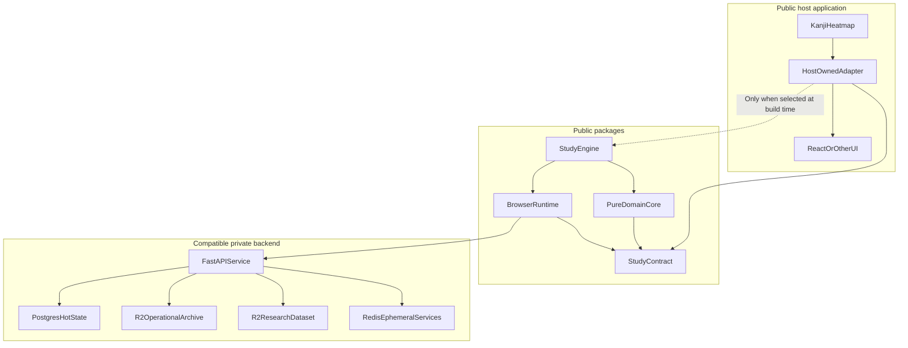
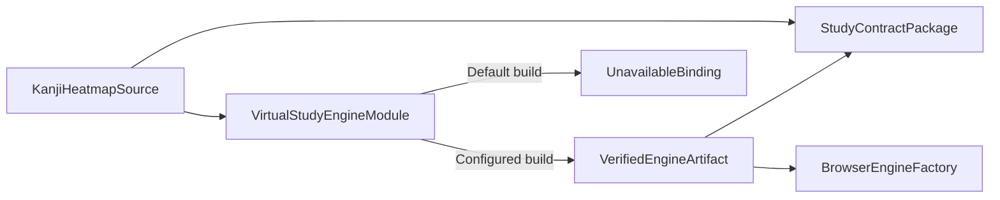
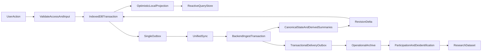

# StudyEngine Design

Status: proposed implementation specification

This directory defines the proposed StudyEngine architecture from first
principles. It is intentionally separate from the brainstorm that preceded it.
When documents in this directory disagree, this `README.md` owns the system
invariants and decision register; the topic document that owns a schema or
protocol owns its detailed definition.

The word **must** identifies an invariant or compatibility requirement.
**Should** identifies the preferred implementation when a documented exception
may be valid. All TypeScript and JSON in these documents is proposed contract
code, not implemented code.

## Purpose

StudyEngine is a browser-first, framework-independent Kanji study domain
package. It owns authenticated premium study data, local-first behavior, FSRS
scheduling, persistence, and backend synchronization.

Kanji Heatmap is one possible host. It owns React components, routing, styling,
copy, and every decision about how unavailable, signed-out, read-only, loading,
and error states appear.

The two products are independently buildable:

- Kanji Heatmap installs only a tiny public Study Contract by default.
- The real StudyEngine is not a default Kanji Heatmap dependency.
- StudyEngine does not import React, Wouter, Tailwind, Kanji Heatmap
  components, or Kanji Heatmap data files.
- StudyEngine can be used by another UI with a compatible backend.
- The official backend may allowlist only approved frontend origins and
  clients.

## Whole-system ownership



The backend is a compatible implementation of a versioned protocol, not a
package dependency. A third party may run another compatible backend. The
official production backend is not required to accept arbitrary third-party
frontends.

## Dependency and selection boundary



The virtual module exports a discriminated binding. An unavailable binding has
metadata only; it does not implement fake mutation methods. The host therefore
cannot accidentally report a successful write that was discarded.

## Non-negotiable invariants

1. **Optional installation.** A normal Kanji Heatmap install and build does not
   download or build the real StudyEngine.
2. **No presentation dependency.** StudyEngine contains no React hooks,
   components, routes, CSS, or host-specific copy.
3. **No silent writes.** NoEngine never pretends a mutation succeeded.
4. **Authentication gate.** Study data is inaccessible while signed out.
5. **Premium write gate.** Study mutations require a valid entitlement lease.
   A previously initialized cache becomes readable but not writable when the
   entitlement expires.
6. **Offline-first local commit.** While a valid offline lease exists, a study
   mutation commits to IndexedDB before it reports success. Network sync does
   not sit on the mutation's critical path.
7. **Backend authority.** The backend is authoritative after synchronization.
   Browser FSRS results and summaries are optimistic local projections.
8. **No data loss disguised as conflict resolution.** Concurrent note edits are
   merged so that both texts survive in the canonical note. Every accepted
   review fact and practice event is retained in the operational archive.
9. **Bounded hot review history.** Current card state and a small review ring
   live in Postgres. A complete hot event table is not required.
10. **Facts in, projections out.** A device sends immutable facts and state
    intents. It never sends a summary or a canonical card state. The backend
    derives every summary and every canonical schedule from accepted facts.
11. **Idempotent retry.** Every mutation carries a stable
    `(deviceId, deviceSequence)` identity and can be retried without double
    application.
12. **Soft deletion on bounded keys.** Every hot entity is keyed by a bounded
    natural key and deactivated with a flag. No row is hard-deleted for a
    domain reason, so delta sync needs no tombstone or tombstone collection.
13. **No automatic destructive recovery.** Migration or corruption failure
    locks and preserves a cache. It never silently wipes unsynced data.
14. **No CRDT framework, WebSockets, or service-worker sync.** Periodic
    request/response synchronization is sufficient. Local browser locks and
    broadcasts are permitted.
15. **Explicit compatibility.** Study Contract API, backend protocol, event
    schema, catalog, scheduler, and local database versions are distinct.
16. **Remote deletion wins.** Confirmed account deletion purges matching local
    caches and the outbox on next contact.

## Goals

- One Markdown note per kanji, with lossless merge on concurrent edits.
- One bookmark per kanji. A bookmark is set membership only.
- Versioned, typed practice activity recording and reactive daily/challenge
  statistics.
- One review-pile item per supported kanji generation, carrying the
  representative word the cards test.
- Exactly one reading and one writing card per active pile item.
- Independent grading and schedules for reading and writing.
- Shared account-wide FSRS settings.
- Multi-device convergence after offline work.
- Fast local queries suitable for React, another UI framework, or vanilla
  TypeScript.
- A verified, reproducible production assembly process.

## Explicit non-goals

- A standalone StudyEngine UI.
- Generic flashcards for arbitrary subjects.
- React integration inside the engine package.
- Real-time collaboration.
- Conflict-free replicated data type libraries.
- WebSocket push.
- Background service-worker synchronization.
- Daily new-card or review limits.
- Tamper-proof offline licensing. Public browser code cannot provide it.
- Migrating the current Kanji Heatmap localStorage study data.

## Deferred, but kept architecturally possible

These are not first-release features. The architecture must not foreclose
them, and each carries one concrete obligation.

**Per-user FSRS weight training.** Fitting a user's own `modelWeights` from
their review history is a plausible later feature.

- It does **not** reintroduce a hot event table. Training is an offline batch
  job that reads the operational archive in R2. The bounded hot review ring
  and the "no permanent hot event log" decision are unaffected.
- The storage mechanism already exists. `ReviewSettings.modelWeights` is part
  of the settings document, and settings are already versioned and
  forward-only. Training writes a new settings revision like any other update.
- Obligation: settings conflict resolution must be able to express a
  server-authored write. The comparison tuple carries an `origin` field so a
  backend writer sorts after any device writer.
- Obligation: the research dataset is anonymized and therefore useless for
  per-user fitting. The training corpus is the account-associated operational
  archive, which is why raw review events are retained for the account
  lifetime and partitioned by account.

**Review history restore.** Because raw review events are retained for the
account lifetime, a later feature could restore a schedule after an accidental
pile removal. Version one does not do this: re-adding a removed kanji always
creates a fresh generation with no restored state.

## Decision register

### Package and host contract

- Publish a tiny public Study Contract containing shared types, API-version
  constants, and runtime capability metadata.
- Publish StudyEngine from one repository with separate pure-core and browser
  entrypoints.
- Target modern browsers in the first release.
- Use an `available`/`unavailable` binding union.
- Use typed `Result` values for expected product outcomes. Throw only for
  programmer errors, broken invariants, or unexpected infrastructure failure.
- Expose framework-neutral status stores and query stores through
  `getSnapshot()` plus `subscribe(listener)`.
- The engine snapshot carries engine status only, never a data version. Entity
  changes reach the host through query stores, which wake precisely rather than
  globally. A field with no reader is not added to a published contract, since
  adding one later is not a breaking change and removing one is.

### Authentication and entitlement

- Authenticate backend requests with a Secure HttpOnly session cookie.
- Use a signed, server-issued entitlement lease for offline write access.
- Let the backend set lease issuance and expiry under a versioned policy.
- Treat backend enforcement as authoritative. Offline client checks are product
  gating, not a security boundary.
- On passive session or entitlement expiry, preserve readable cached data but
  reject study mutations.
- The write gate has no exceptions. Instead of permitting one grade after
  expiry, `beginReview` refuses to open a card whose lease expires within a
  short margin, so a card the user can finish is never started.
- In the first release, account administration and research opt-out after
  entitlement loss are handled through support. This is a known legal/product
  review item, not a recommended general privacy pattern.

### Local account caches

- Partition IndexedDB data by account.
- Keep at most two total account caches, including the active one. The
  motivating case is siblings sharing one computer: the second account should
  not re-bootstrap on every switch.
- Two caches is a convenience, not a security boundary between the people
  sharing that browser profile. IndexedDB is not encrypted by StudyEngine.
- A normal logout offers `removeLocalData`. The host chooses the default; on a
  shared computer it should be unchecked, since checking it destroys the
  benefit above.
- If removal would discard pending data, require a second explicit
  confirmation containing pending counts.
- If local data is retained, clear the active account pointer and expose no
  domain data until that account authenticates again.
- When a third account authenticates, purge the inactive cache. At a limit of
  two there is only ever one candidate, so no recency ordering is needed.
- A locked cache is protected from eviction only while it holds pending
  operations.

### Domain data

- A bookmark is keyed by kanji and stores no word. Membership is the entire
  payload. The representative word is host data and must not be snapshotted
  into user data, where it would silently go stale.
- Note limits are backend-published UTF-8 byte limits. A host may impose a
  smaller UI limit.
- Concurrent divergent note edits merge by concatenation. Both texts survive
  in the canonical note and the user resolves them in the editor.
- The edit limit applies to every save with no exception, including when a
  merge already made the note larger. A merged note is readable at its merged
  size and must be trimmed before it can be saved again. This is what bounds
  merge growth: every accepted edit is at most the limit, so every two-way
  merge is at most twice it, permanently.
- Daily and challenge summaries are backend-derived projections. Devices never
  send them.
- Daily statistics persist for the account lifetime.
- The general daily summary includes practice activity and FSRS review counts,
  including rating breakdowns.
- Practice events use a versioned discriminated union. New practice kinds
  require a coordinated contract, engine, and backend release.

### Reviews and FSRS

- Ship a versioned review-eligible kanji catalog in StudyEngine and verify its
  version/hash with the backend.
- Use canonical ratings: `Again`, `Hard`, `Good`, and `Easy`.
- Require one card type per due query. Return a minimal generation-safe card
  reference.
- Order due cards by oldest due instant, then stable card ID.
- New cards are due immediately.
- A pile item carries the representative word its two cards test. The word is
  frozen at add time. Changing it discards the generation and its schedule.
- The review history ring lives only in Postgres. The client stores current
  card state and no ring.
- Freeze an in-progress review with a one-use in-memory handle. There is no
  persistent cross-tab review lease; two tabs grading the same card produce
  two facts that replay correctly.
- Commit a grade locally, then accept the backend's canonical state after sync.
- Use exact chronological replay when the hot ring contains the common base.
- Fall back immediately to deterministic last-writer-wins when the common base
  is outside the ring. Cold history is not queried on the sync hot path.
- Removal wins over a concurrent review. Re-adding creates a fresh generation.
- Settings apply forward only; current due dates do not all reschedule.
- Keep one current settings document with a monotonic revision. There is no
  historical settings version table; replay applies the winning current
  settings across its short window.

### Synchronization and archives

- Use a paged bootstrap at a fixed account revision, written directly into the
  account database while access is `bootstrapping`. An interrupted bootstrap
  restarts from scratch; there is no durable resume.
- Block reads and writes until bootstrap activation completes, which is what
  makes a partially written cache unobservable without a staging table.
- Use one transactional sync envelope for every mutation: notes, bookmarks,
  settings, pile mutations, review facts, and practice activity facts.
- Use one opaque account revision cursor and per-row revisions. Deletion is an
  ordinary revision-bumping update of an `active` flag.
- Derive summaries and canonical card state at ingest, inside the same
  transaction that advances the device sequence high-water mark. That
  high-water mark is what makes incremental derivation exactly-once.
- Fan raw events out to the archive on the backend, behind a transactional
  delivery outbox. The browser has no second upload pipeline and no second
  acknowledgement path.
- Keep operational and research datasets separate.
- Let the backend publish operational retention policy.
- Research collection is enabled by default with opt-out. Future collection
  stops after opt-out; traceable staged data is deleted; irreversibly
  anonymized prior data cannot be selected for deletion.

### Production assembly

- Local development may select a compatible engine artifact by path.
- Official production consumes a checksummed prebuilt ESM artifact and
  manifest. It does not install the engine's dependencies during the host
  build.
- A production build configured to require StudyEngine fails on download,
  checksum, manifest, catalog, or API incompatibility.
- The selected artifact becomes a normal hashed Vite/PWA asset.

## End-to-end data path



Every mutation writes exactly one outbox row in the same transaction as its
optimistic projection. Notes, bookmarks, settings, and pile mutations are state
intents resolved by deterministic last-writer-wins. Review grades and practice
completions are immutable facts; the backend derives card state, daily
summaries, and challenge summaries from them and fans the raw event out to the
archive on its own side.

A local projection is defined as a function, not an accumulator:

```text
displayed(key) = lastServerValue(key) with pending outbox operations replayed
```

It is materialized for querying, but recomputed deterministically whenever a
server value for that key arrives. Without this rule, a server summary landing
while grades are still pending would double-count.

## Version axes

These values must not be collapsed into one package version:

- **Study Contract API version:** host-to-engine TypeScript/runtime boundary.
- **Engine release version:** public artifact version.
- **Backend protocol version:** HTTP payload and behavior compatibility.
- **Kanji catalog version/hash:** review eligibility.
- **Scheduler schema/version:** FSRS state, settings, and weight shape.
- **Practice event schema version:** raw event discriminated union.
- **IndexedDB schema version:** private browser persistence.

The archive object format is no longer a shared version axis. The browser does
not produce archive objects; the backend derives them from accepted facts, so
the format is backend-internal.

An incompatible Study Contract prevents artifact selection. An incompatible
backend protocol or catalog leaves an existing cache readable but blocks new
study writes and sync until compatible software is installed.

## Data classification

- **Hot account data:** notes, bookmarks, settings, card state, rings, derived
  summaries, cursors, and the pending outbox.
- **Operational archive:** account-associated raw practice and review events.
  Raw review events are retained for the account lifetime; other classes follow
  the backend's published retention policy. It is exportable and is deleted
  with the account.
- **Research dataset:** separately transformed behavioral data with no note
  content, bookmark content, email, account ID, or direct device ID.
- **Ephemeral data:** PIN challenges, rate-limit counters, transient locks, and
  short-lived delivery buffers.

Free-form notes must never be described as non-sensitive. App-level locking
prevents accidental UI access, but IndexedDB is not encrypted by StudyEngine
and remains visible to the browser profile, developer tools, and same-origin
script.

## Documents

Start with [SUMMARY.md](./SUMMARY.md) if you need the whole system in one
sitting: the exposed API, how each route uses it, the algorithms behind it, and
both schemas.

- [Summary](./SUMMARY.md)
- [Contract and lifecycle](./CONTRACT-AND-LIFECYCLE.md)
- [Local data and domains](./LOCAL-DATA-AND-DOMAINS.md)
- [Sync and backend](./SYNC-AND-BACKEND.md)
- [Reviews and FSRS](./REVIEWS-AND-FSRS.md)
- [Archives and privacy](./ARCHIVES-AND-PRIVACY.md)
- [Scenarios and UX](./SCENARIOS-AND-UX.md)
- [Kanji Heatmap integration](./KANJI-HEATMAP-INTEGRATION.md)
- [Implementation roadmap](./IMPLEMENTATION-ROADMAP.md)

## Unresolved pre-release decisions

The architecture supports these decisions but does not invent their values:

- Study Contract and StudyEngine licenses. The choice determines whether
  proprietary third-party UIs may bundle StudyEngine.
- Entitlement lease durations and renewal policy.
- Note edit byte limit, and the merged-note storage ceiling, which must be at
  least twice the edit limit plus a separator allowance and is recommended at
  four times it.
- Sync request limits, bootstrap page byte budget, review ring size, and the
  `beginReview` entitlement margin.
- Operational archive retention periods for classes other than raw review
  events, which are retained for the account lifetime.
- Research de-identification review and jurisdiction-specific disclosure.
- Whether support-only opt-out/export/deletion is lawful and acceptable in each
  launch market.

These values are backend-published policy or release configuration. Changing a
value within its documented bounds must not require a storage redesign.
