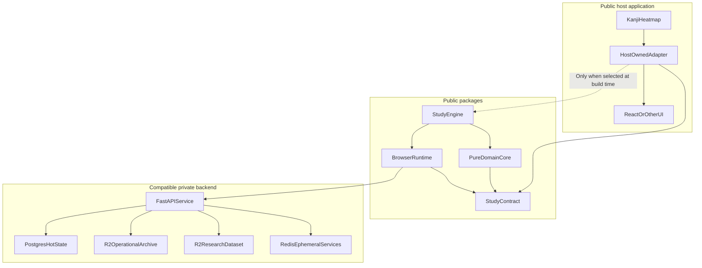
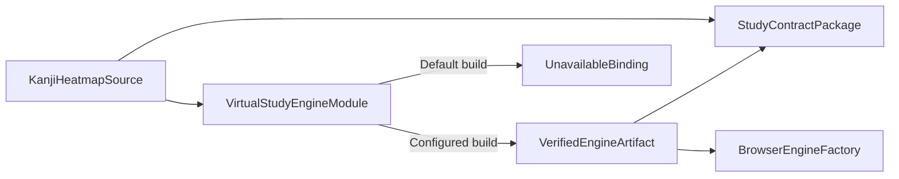
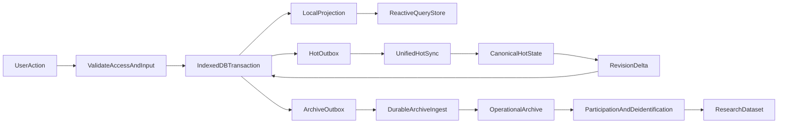

# StudyEngine Design

Status: proposed implementation specification

This directory defines the proposed StudyEngine architecture from first
principles. It is intentionally separate from the brainstorm that preceded it.
When documents in this directory disagree, this `README.md` owns the system
invariants and decision register; the topic document that owns a schema or
protocol owns its detailed definition.

The word **must** identifies an invariant or compatibility requirement.
**Should** identifies the preferred implementation when a documented exception
may be valid. All TypeScript and JSON in these documents is proposed contract
code, not implemented code.

## Purpose

StudyEngine is a browser-first, framework-independent Kanji study domain
package. It owns authenticated premium study data, local-first behavior, FSRS
scheduling, persistence, and backend synchronization.

Kanji Heatmap is one possible host. It owns React components, routing, styling,
copy, and every decision about how unavailable, signed-out, read-only, loading,
and error states appear.

The two products are independently buildable:

- Kanji Heatmap installs only a tiny public Study Contract by default.
- The real StudyEngine is not a default Kanji Heatmap dependency.
- StudyEngine does not import React, Wouter, Tailwind, Kanji Heatmap
  components, or Kanji Heatmap data files.
- StudyEngine can be used by another UI with a compatible backend.
- The official backend may allowlist only approved frontend origins and
  clients.

## Whole-system ownership

The backend is a compatible implementation of a versioned protocol, not a
package dependency. A third party may run another compatible backend. The
official production backend is not required to accept arbitrary third-party
frontends.

## Dependency and selection boundary

The virtual module exports a discriminated binding. An unavailable binding has
metadata only; it does not implement fake mutation methods. The host therefore
cannot accidentally report a successful write that was discarded.

## Non-negotiable invariants

1. **Optional installation.** A normal Kanji Heatmap install and build does not
   download or build the real StudyEngine.
2. **No presentation dependency.** StudyEngine contains no React hooks,
   components, routes, CSS, or host-specific copy.
3. **No silent writes.** NoEngine never pretends a mutation succeeded.
4. **Authentication gate.** Study data is inaccessible while signed out.
5. **Premium write gate.** Study mutations require a valid entitlement lease.
   A previously initialized cache becomes readable but not writable when the
   entitlement expires.
6. **Offline-first local commit.** While a valid offline lease exists, a study
   mutation commits to IndexedDB before it reports success. Network sync does
   not sit on the mutation's critical path.
7. **Backend authority.** The backend is authoritative after synchronization.
   Browser FSRS results and summaries are optimistic local projections.
8. **No data loss disguised as conflict resolution.** Concurrent note content
   keeps a recoverable losing copy. Every accepted review fact and practice
   event is retained in its operational archive pipeline.
9. **Bounded hot review history.** Current card state and a small review ring
   live in Postgres. A complete hot event table is not required.
10. **Per-device summary ownership.** A device writes only its own daily and
    challenge summary components. Account totals aggregate those components.
11. **Idempotent retry.** Hot mutations and archive events have stable
    identities and can be retried without double application.
12. **No automatic destructive recovery.** Migration or corruption failure
    locks and preserves a cache. It never silently wipes unsynced data.
13. **No CRDT framework, WebSockets, or service-worker sync.** Periodic
    request/response synchronization is sufficient. Local browser locks and
    broadcasts are permitted.
14. **Explicit compatibility.** Study Contract API, backend protocol, event
    schema, catalog, scheduler, and local database versions are distinct.
15. **Remote deletion wins.** Confirmed account deletion purges matching local
    caches and outboxes on next contact.

## Goals

- One Markdown note per kanji, with bounded recoverable conflict handling.
- One bookmark per kanji, including its selected representative word surface.
- Versioned, typed practice activity recording and reactive daily/challenge
  statistics.
- One review-pile item per supported kanji generation.
- Exactly one reading and one writing card per active pile item.
- Independent grading and schedules for reading and writing.
- Shared account-wide FSRS settings.
- Multi-device convergence after offline work.
- Fast local queries suitable for React, another UI framework, or vanilla
  TypeScript.
- A verified, reproducible production assembly process.

## Explicit non-goals

- A standalone StudyEngine UI.
- Generic flashcards for arbitrary subjects.
- React integration inside the engine package.
- Real-time collaboration.
- Conflict-free replicated data type libraries.
- WebSocket push.
- Background service-worker synchronization.
- Per-user FSRS weight training.
- Daily new-card or review limits.
- Tamper-proof offline licensing. Public browser code cannot provide it.
- Migrating the current Kanji Heatmap localStorage study data.

## Decision register

### Package and host contract

- Publish a tiny public Study Contract containing shared types, API-version
  constants, and runtime capability metadata.
- Publish StudyEngine from one repository with separate pure-core and browser
  entrypoints.
- Target modern browsers in the first release.
- Use an `available`/`unavailable` binding union.
- Use typed `Result` values for expected product outcomes. Throw only for
  programmer errors, broken invariants, or unexpected infrastructure failure.
- Expose framework-neutral status stores and query stores through
  `getSnapshot()` plus `subscribe(listener)`.

### Authentication and entitlement

- Authenticate backend requests with a Secure HttpOnly session cookie.
- Use a signed, server-issued entitlement lease for offline write access.
- Let the backend set lease issuance and expiry under a versioned policy.
- Treat backend enforcement as authoritative. Offline client checks are product
  gating, not a security boundary.
- On passive session or entitlement expiry, preserve readable cached data but
  reject study mutations.
- Permit one review handle opened while writable to finish one grade after the
  lease expires. Other pending edits are rejected.
- In the first release, account administration and research opt-out after
  entitlement loss are handled through support. This is a known legal/product
  review item, not a recommended general privacy pattern.

### Local account caches

- Partition IndexedDB data by account.
- Keep at most two total account caches by default, including the active one.
  Make this a browser-runtime policy constant.
- A normal logout offers `removeLocalData`, checked by default.
- If removal would discard pending data, require a second explicit
  confirmation containing pending counts.
- If local data is retained, clear the active account pointer and expose no
  domain data until that account authenticates again.
- When a third account authenticates, purge the least-recently-used inactive
  cache.

### Domain data

- A bookmark is keyed by kanji and stores one representative word surface.
- Note limits are backend-published UTF-8 byte limits. A host may impose a
  smaller UI limit.
- Daily and challenge summaries are absolute, device-owned hot snapshots.
- Raw practice events and raw FSRS review events archive independently.
- Daily statistics persist for the account lifetime.
- The general daily summary includes practice activity and FSRS review counts,
  including rating breakdowns.
- Practice events use a versioned discriminated union. New practice kinds
  require a coordinated contract, engine, and backend release.

### Reviews and FSRS

- Ship a versioned review-eligible kanji catalog in StudyEngine and verify its
  version/hash with the backend.
- Use canonical ratings: `Again`, `Hard`, `Good`, and `Easy`.
- Require one card type per due query. Return a minimal generation-safe card
  reference.
- Order due cards by oldest due instant, then stable card ID.
- New cards are due immediately.
- Freeze an in-progress review with a short cross-tab lease and one-use handle.
- Commit a grade locally, then accept the backend's canonical state after sync.
- Use exact chronological replay when the hot ring contains the common base.
- Fall back immediately to deterministic last-writer-wins when the common base
  is outside the ring. Cold history is not queried on the sync hot path.
- Removal wins over a concurrent review. Re-adding creates a fresh generation.
- Settings apply forward only; current due dates do not all reschedule.
- Historical settings versions are internal and retained hot only while needed
  by rings or outboxes.

### Synchronization and archives

- Use a paged, compressed, staged bootstrap at a fixed account revision.
- Block writes until first bootstrap activation completes.
- Use one transactional hot-sync envelope for notes, bookmarks, settings, pile
  mutations, review facts, and device-owned summaries.
- Use one opaque account revision cursor, row revisions, and tombstones.
- Archive raw events through a separate durable at-least-once pipeline.
- Continue studying through an archive outage and expose a degraded backlog
  status.
- Keep operational and research datasets separate.
- Let the backend publish operational retention policy.
- Research collection is enabled by default with opt-out. Future collection
  stops after opt-out; traceable staged data is deleted; irreversibly
  anonymized prior data cannot be selected for deletion.

### Production assembly

- Local development may select a compatible engine artifact by path.
- Official production consumes a checksummed prebuilt ESM artifact and
  manifest. It does not install the engine's dependencies during the host
  build.
- A production build configured to require StudyEngine fails on download,
  checksum, manifest, catalog, or API incompatibility.
- The selected artifact becomes a normal hashed Vite/PWA asset.

## End-to-end data path

Not every mutation writes both outboxes. Notes and bookmarks write only the hot
outbox. Practice results write a summary mutation and a raw archive event.
Review grades write a hot review fact and a raw archive event with the same
stable event identity.

## Version axes

These values must not be collapsed into one package version:

- **Study Contract API version:** host-to-engine TypeScript/runtime boundary.
- **Engine release version:** public artifact version.
- **Backend protocol version:** HTTP payload and behavior compatibility.
- **Kanji catalog version/hash:** review eligibility.
- **Scheduler schema/version:** FSRS state, settings, and weight shape.
- **Practice event schema version:** raw event discriminated union.
- **Archive schema version:** operational and research object format.
- **IndexedDB schema version:** private browser persistence.

An incompatible Study Contract prevents artifact selection. An incompatible
backend protocol or catalog leaves an existing cache readable but blocks new
study writes and sync until compatible software is installed.

## Data classification

- **Hot account data:** notes, bookmarks, settings, card state, rings,
  device-owned summaries, tombstones, cursors, and pending outboxes.
- **Operational archive:** account-associated raw practice/review events and
  displaced note conflict copies. It is exportable/deletable according to the
  backend's published retention policy.
- **Research dataset:** separately transformed behavioral data with no note
  content, bookmark content, email, account ID, or direct device ID.
- **Ephemeral data:** PIN challenges, rate-limit counters, transient locks, and
  short-lived delivery buffers.

Free-form notes must never be described as non-sensitive. App-level locking
prevents accidental UI access, but IndexedDB is not encrypted by StudyEngine
and remains visible to the browser profile, developer tools, and same-origin
script.

## Documents

- [Contract and lifecycle](./CONTRACT-AND-LIFECYCLE.md)
- [Local data and domains](./LOCAL-DATA-AND-DOMAINS.md)
- [Sync and backend](./SYNC-AND-BACKEND.md)
- [Reviews and FSRS](./REVIEWS-AND-FSRS.md)
- [Archives and privacy](./ARCHIVES-AND-PRIVACY.md)
- [Kanji Heatmap integration](./KANJI-HEATMAP-INTEGRATION.md)
- [Implementation roadmap](./IMPLEMENTATION-ROADMAP.md)

## Unresolved pre-release decisions

The architecture supports these decisions but does not invent their values:

- Study Contract and StudyEngine licenses. The choice determines whether
  proprietary third-party UIs may bundle StudyEngine.
- Entitlement lease durations and renewal policy.
- Note byte limit, sync request limits, bootstrap page size, archive backlog
  warning thresholds, review ring size, and registered-device cap.
- Operational archive retention periods.
- Research de-identification review and jurisdiction-specific disclosure.
- Whether support-only opt-out/export/deletion is lawful and acceptable in each
  launch market.

These values are backend-published policy or release configuration. Changing a
value within its documented bounds must not require a storage redesign.
