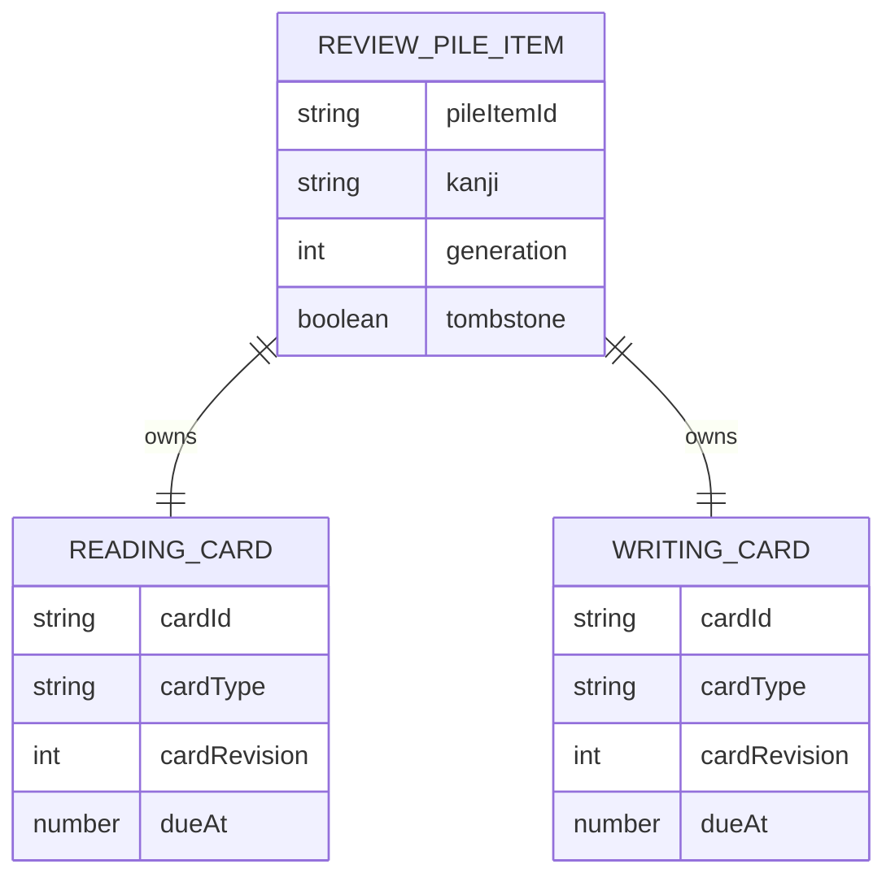
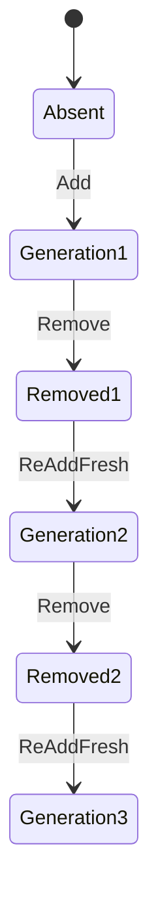
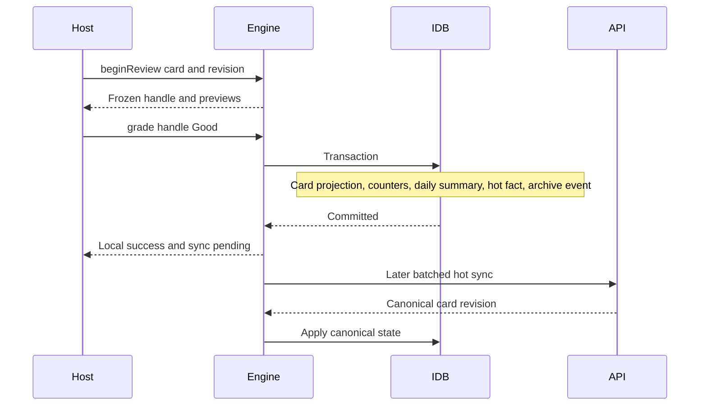
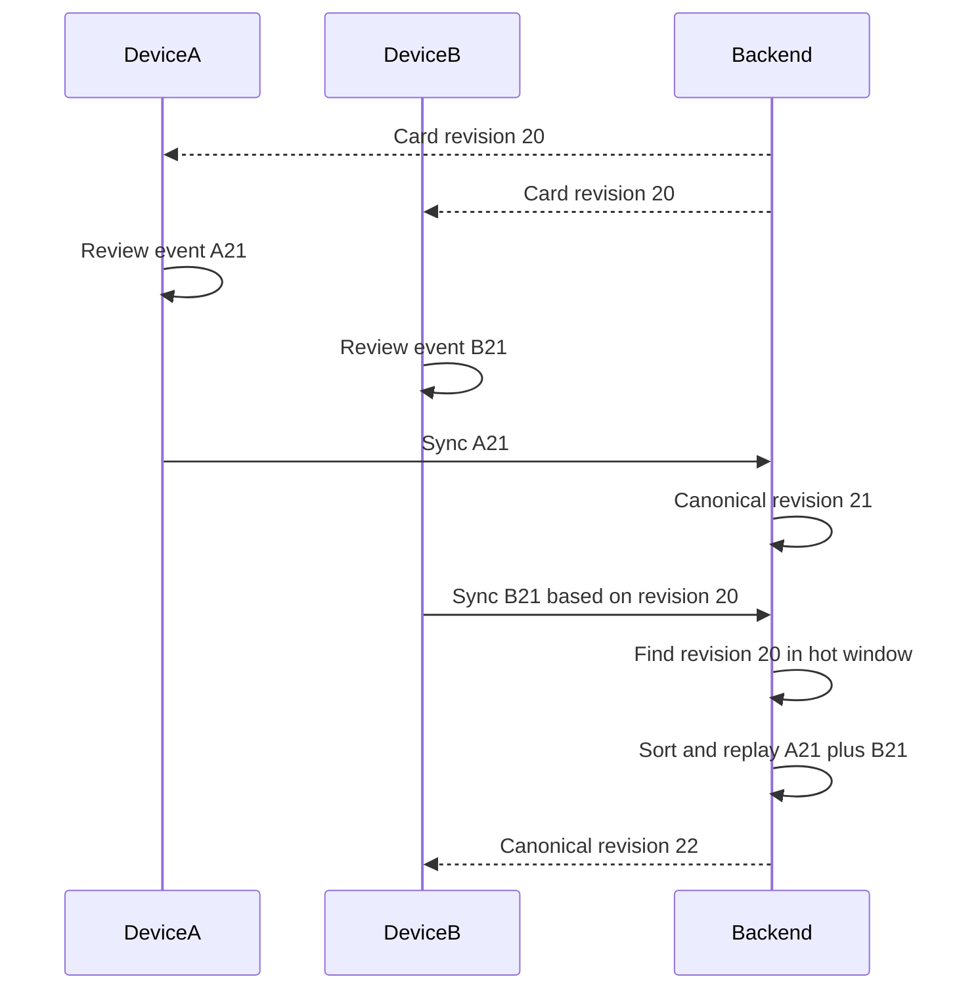
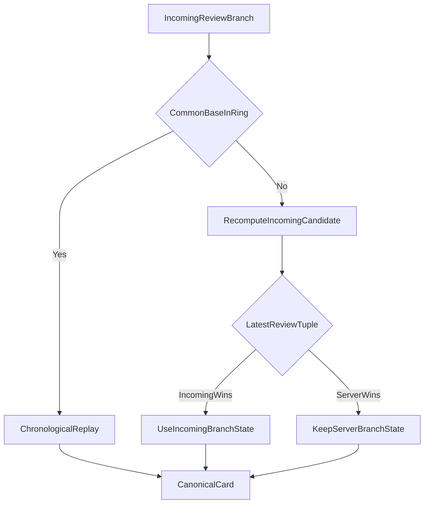

# Reviews and FSRS

This document owns the review-pile model, FSRS state/settings, due queries,
active-review handles, local grading, multi-device replay, incomplete-history
fallback, and review deletion rules.

## Domain invariants

1. Only kanji in the versioned review catalog may enter the pile.
2. One active pile-item generation exists per kanji.
3. Every active pile item owns exactly one reading card and one writing card.
4. Cards are created and removed together but graded independently.
5. Reading and writing share one account-wide settings document.
6. There are no daily new-card or maximum-review limits.
7. New cards are due immediately.
8. A review is an immutable fact; card state is a replaceable projection.
9. The backend is the canonical scheduler after sync.
10. Removal wins over a concurrent grade.
11. Re-adding a removed kanji creates a fresh generation.

## Versioned kanji catalog

StudyEngine ships its own review eligibility manifest:

```ts
interface ReviewKanjiCatalogManifest {
  schemaVersion: 1;
  catalogVersion: string;
  sha256: string;
  kanji: readonly Kanji[];
}
```

The list is independent of Kanji Heatmap public JSON files. Engine artifact and
backend verify the same version/hash during session, bootstrap, and sync.

Rules:

- Catalog entries are unique single Unicode scalar values.
- Changing membership creates a new catalog version.
- Removing a kanji from a later catalog does not silently delete an existing
  user's pile item. A migration policy must explicitly retire or grandfather
  it.
- Catalog mismatch makes an existing cache read-only.

## Entity model



Proposed rows:

```ts
interface ReviewPileItemRow {
  pileItemId: PileItemId;
  kanji: Kanji;
  generation: number;
  createdAt: UnixMs;
  createdByDeviceId: DeviceId;
  removedAt?: UnixMs;
  removedByDeviceId?: DeviceId;
  serverRevision?: number;
  tombstone: boolean;
}

type CardType = "reading" | "writing";

interface ReviewCardRow {
  cardId: CardId;
  pileItemId: PileItemId;
  kanji: Kanji;
  generation: number;
  cardType: CardType;
  cardRevision: number;
  state: FsrsCardStateV1;
  historyWindow: ReviewHistoryWindow;
  counters: ReviewCounterComponents;
  serverRevision?: number;
  tombstone: boolean;
}
```

`pileItemId` and each `cardId` are opaque generation-specific IDs. They are not
derived only from kanji. A stale screen therefore cannot grade a newly
re-created card generation.

## FSRS card state

Do not persist a library class instance. Persist a versioned plain schema:

```ts
type FsrsLearningState = "new" | "learning" | "review" | "relearning";

interface FsrsCardStateV1 {
  schemaVersion: 1;
  schedulerAlgorithm: "fsrs";
  schedulerVersion: string;
  dueAt: UnixMs;
  lastReviewAt: UnixMs | null;
  stability: number;
  difficulty: number;
  elapsedDays: number;
  scheduledDays: number;
  learningStep: number;
  repetitions: number;
  lapses: number;
  learningState: FsrsLearningState;
}
```

Adapters convert this schema to/from the pinned `ts-fsrs` and `py-fsrs`
representations. The schema must not adopt a library field rename without a
StudyEngine migration.

Validation rejects NaN/infinite values, negative counts/durations, unsupported
states, invalid scheduler versions, and due dates outside policy bounds.

## Shared settings

```ts
interface ReviewSettings {
  requestRetention: number;
  maximumIntervalDays: number;
  enableFuzz: boolean;
  enableShortTerm: boolean;
  learningStepsMinutes: readonly number[];
  relearningStepsMinutes: readonly number[];
  modelWeights: readonly number[];
}

interface ReviewSettingsVersionRow {
  settingsVersion: string;
  schemaVersion: 1;
  schedulerVersion: string;
  settings: ReviewSettings;
  createdAt: UnixMs;
  writerDeviceId: DeviceId;
  writerDeviceSequence: number;
  serverRevision?: number;
}
```

Settings rules:

- A versioned engine schema defines supported defaults, ranges, step counts,
  weight count, and numeric precision.
- The backend may publish narrower limits.
- Reading and writing always reference the same current settings version.
- Divergent updates use deterministic LWW by clamped update instant, device ID,
  and device sequence.
- Updating settings does not reschedule every current card.
- The new settings apply to the next grade and any short conflict replay that
  occurs after the setting wins.
- Hot storage retains the current version and versions still referenced by
  card windows or unsynced operations.
- Older versions move to account-associated operational history under policy.
- The public API exposes `watchCurrent()` and `update()`, not a full historical
  list.

## Pile operations

### Add

`reviews.pile.add(kanji)`:

1. Validate writable access and catalog membership.
2. Return the current item idempotently if an active item already exists.
3. Allocate the next kanji generation.
4. Create one pile item and two fresh `new` cards in one transaction.
5. Set both cards' due instant to the creation instant.
6. Append one `review_pile_add` hot operation.
7. Notify reading and writing due stores.

The backend repeats the invariant validation transactionally.

### Remove

`reviews.pile.remove(kanji)`:

1. Mark the active generation and both cards tombstoned locally.
2. Release/cancel active local handles for those cards.
3. Append one `review_pile_remove` hot operation.
4. Preserve raw review history according to archive policy.

A remove operation refers to the exact generation it observed. It cannot
delete a later generation.

### Re-add

Re-adding after removal creates:

- a new pile-item ID;
- an incremented generation;
- two new card IDs;
- two fresh FSRS states;
- no restored due dates or stability.

Old history remains operational/archive data only.



## Due queue

The caller must request exactly one card type:

```ts
interface DueQuery {
  cardType: CardType;
  limit: number;
  asOf?: UnixMs;
}

interface DueCard {
  cardId: CardId;
  kanji: Kanji;
  dueAt: UnixMs;
  revision: number;
}
```

Rules:

- `cardType: "both"` does not exist.
- `limit` is required, positive, and bounded by engine policy.
- Omitted `asOf` uses the engine clock. A host cannot use a future `asOf`
  beyond a small query-only policy bound to unlock cards early.
- Include active non-tombstoned cards with `dueAt <= asOf`.
- Exclude cards with an unexpired active-review lease in another tab.
- Sort by `dueAt` ascending, then stable `cardId`.
- Return no full FSRS state.

`revision` is the local projection's monotonic card revision. It changes after
a local grade or canonical server update.

The query-store implementation schedules a wake-up for the earliest future due
card so a due count updates even without an IndexedDB mutation.

## Begin and freeze a review

The host selects a `DueCard` and opens it through:

```ts
interface BeginReviewInput {
  cardId: CardId;
  expectedRevision: number;
}

type FsrsRating = "again" | "hard" | "good" | "easy";

interface RatingPreview {
  rating: FsrsRating;
  scheduledAt: UnixMs;
  intervalMs: number;
}

interface ActiveReview {
  handleId: string;
  cardId: CardId;
  pileItemId: PileItemId;
  kanji: Kanji;
  cardType: CardType;
  openedAt: UnixMs;
  expiresAt: UnixMs;
  basedOnRevision: number;
  previews: Readonly<Record<FsrsRating, RatingPreview>>;
}
```

`beginReview`:

- verifies the current generation/revision;
- acquires the cross-tab card lease;
- snapshots the card and current settings;
- computes all four previews;
- creates an in-memory one-use handle;
- returns a stable view that will not change while open.

If sync receives a newer card state, it stages that state rather than changing
the open handle's previews.

The handle is not persistent review history. Reloading or a crash cancels it
after lease expiry.

## Grade transaction

```ts
interface GradeReviewInput {
  handleId: string;
  rating: FsrsRating;
}

interface GradeOutcome {
  eventId: string;
  cardId: CardId;
  provisionalCard: DueCard;
  sync: "pending";
}
```

The engine owns `reviewedAt`; a host does not supply it.



One grade transaction:

1. Validate that the handle exists, is unconsumed, and belongs to the active
   generation.
2. Permit completion if the handle opened while writable and only the
   entitlement expired after opening.
3. Capture trusted local `reviewedAt`.
4. Create a stable event ID and hot/archive sequences.
5. Compute a provisional state with pinned `ts-fsrs`.
6. Increment the card's local revision.
7. Append the event to the bounded local history window.
8. Increment this device's card counters.
9. Increment the device-owned daily review summary and rating count.
10. Append `review_grade` to the hot outbox.
11. Append the raw review event to the archive outbox.
12. Consume the handle and release the local lease.
13. Commit before returning success.

Double submission of a consumed handle returns an expected stale/expired
result and never creates a second event.

## Review fact

The hot grade operation and operational archive event share a stable `eventId`.
The hot payload carries enough branch context for backend validation and
incomplete-history fallback:

```ts
interface ReviewFactV1 {
  schemaVersion: 1;
  eventId: string;
  cardId: CardId;
  pileItemId: PileItemId;
  kanji: Kanji;
  generation: number;
  cardType: CardType;
  rating: FsrsRating;

  reviewedAt: UnixMs;
  reportedWallTime: UnixMs;
  deviceId: DeviceId;
  deviceSequence: number;

  baseServerRevision: number;
  predecessorEventId?: string;
  settingsVersion: string;
  schedulerVersion: string;

  priorState: FsrsCardStateV1;
  provisionalResultState: FsrsCardStateV1;
}
```

The backend does not trust `provisionalResultState`. It reconstructs the
candidate with `py-fsrs` and the referenced settings. A materially invalid
proposal indicates incompatible scheduler behavior or tampering and produces
a diagnostic/validation failure.

`reportedWallTime` can be retained in operational history. Merge order uses a
server-adjusted/clamped `reviewedAt`.

## Bounded history window

Each card stores a small complete segment:

```ts
interface ReviewHistoryWindow {
  capacity: number;
  anchorServerRevision: number;
  anchorState: FsrsCardStateV1;
  events: readonly ReviewFactSummary[];
}

interface ReviewFactSummary {
  eventId: string;
  reviewedAt: UnixMs;
  deviceId: DeviceId;
  deviceSequence: number;
  rating: FsrsRating;
  settingsVersion: string;
  resultingServerRevision: number;
}
```

`anchorState` is the state immediately before the oldest retained event.
Without it, retaining event IDs alone is insufficient to replay from the start
of the window.

When an event is evicted:

- advance `anchorState` to that event's canonical result;
- advance `anchorServerRevision`;
- keep exactly the configured number of newer events.

The backend publishes ring capacity. Browser and backend must support that
capacity before writable access.

## Exact replay

Suppose two devices received revision 20, then reviewed offline:



Replay algorithm:

1. Verify event identity, generation, settings/scheduler versions, and device
   sequence.
2. Find a state in the current hot window corresponding to the incoming common
   base.
3. Collect all server-window events after that base plus the incoming
   contiguous branch events.
4. Deduplicate by event ID.
5. Clamp implausible future timestamps.
6. Sort by `(reviewedAt, deviceId, deviceSequence, eventId)`.
7. Select the winning current settings version under settings LWW.
8. Recompute the short combined sequence with `py-fsrs` from the common base
   under that settings version.
9. Replace canonical card state/window and allocate a new server revision.
10. Preserve every event's counters and archive identity.

Applying one winning settings version to the short replay window is deliberate.
It avoids switching algorithms mid-window and is consistent with settings
being forward-looking preferences. It may slightly reinterpret recent
intervals during a conflict.

## Incomplete-history fallback

If the incoming common base predates `anchorServerRevision`, exact replay is
not possible on the hot path. The selected policy is immediate LWW; the backend
does not fetch R2 during sync.



Fallback comparison:

```text
(latest clamped reviewedAt, deviceId, deviceSequence, eventId)
```

The backend recomputes the incoming branch from its provided prior state and
contiguous events before choosing it. It never trusts a client-provided result
blindly.

Consequences:

- The losing branch's schedule contribution is not in the canonical due date.
- Its facts still count in device/card/daily statistics.
- Its raw events remain in operational history.
- Later reviews naturally correct moderate schedule error through FSRS
  feedback.
- Metrics must report fallback frequency and affected card types.

This is deterministic convergence, not exact conflict reconstruction.

## Clock handling

Review chronology depends on time but browser clocks are not trustworthy.

The engine:

- maintains server-time offset observations;
- never lets its effective wall clock move backward within a cache;
- uses monotonic elapsed time within an open page;
- stores reported and adjusted occurrence times separately where needed.

The backend:

- clamps future times beyond policy tolerance;
- may bound implausibly old times for schedule computation while preserving raw
  operational evidence;
- breaks equal adjusted times with stable device sequence and event ID.

No clock algorithm can prove the true order of two long-offline physical
devices. The deterministic tie is the contract.

## Deletion versus review

If device A removes generation 4 while device B grades a card in generation 4:


The server acknowledges the grade operation so its device sequence can
advance, records an explicit `ignored_deleted_generation` warning, and does not
restore either card. The corresponding device-owned daily summary remains
valid because the user did perform the review.

A grade for generation 4 can never apply to generation 5.

## Per-device card counters

Current card rows keep bounded components for active registered device slots:

```ts
interface ReviewCounterComponent {
  reviews: number;
  lapses: number;
  again: number;
  hard: number;
  good: number;
  easy: number;
  deviceRevision: number;
}

type ReviewCounterComponents = Record<DeviceSlot, ReviewCounterComponent>;
```

Each device writes only its own absolute component. Account/card totals sum
components. Retries cannot double count. These totals remain exact even when
schedule fallback chooses one branch.

Retired-device counter compaction is deferred; the registered-device cap
bounds first-release growth.

## Backend scheduler authority

The browser and backend pin explicit scheduler versions. The backend's
`py-fsrs` result is canonical.

Required compatibility artifacts:

- Shared JSON fixtures for settings validation.
- Card-state conversion fixtures.
- Rating-preview fixtures.
- One-step grade fixtures for all four ratings and learning states.
- Multi-step chronological replay fixtures.
- Date/time precision and rounding fixtures.
- Explicit numeric tolerances where bit equality is not portable.

If `ts-fsrs` and `py-fsrs` differ beyond allowed tolerance:

- do not reject an already committed local fact merely for being offline;
- let the backend return its canonical projection;
- record a compatibility diagnostic;
- block further writes if the mismatch indicates unsupported scheduler
  versions rather than harmless rounding.

## Review API proposal

```ts
interface ReviewSettingsApi {
  watchCurrent(): QueryStore<ReviewSettings>;
  update(settings: ReviewSettings): Promise<Result<ReviewSettings>>;
}

interface ReviewPileApi {
  watch(kanji: Kanji): QueryStore<ReviewPileItemView | null>;
  watchMany(kanji: readonly Kanji[]): QueryStore<readonly ReviewPileItemView[]>;
  add(kanji: Kanji): Promise<Result<ReviewPileItemView>>;
  remove(kanji: Kanji): Promise<Result<void>>;
}
```

`watchMany` replaces a loosely typed `getCardInfo(kanjiArray, "both")`. It
returns pile/card summaries suitable for list badges without exposing mutable
FSRS internals.

`getDue`/`watchDue` require a single `CardType`. `beginReview` returns previews;
there is no separate public `preview(kanji, cardType)` that can race with card
replacement.

## Review session behavior

StudyEngine does not own a presentation-level review session queue. A host may:

- repeatedly query/start the next due reading card;
- repeatedly query/start the next due writing card;
- stop at any time;
- call `sync.now("review_session_ended")` when its session ends.

There are no daily caps. `limit` is only a query/page bound.

## Review statistics

Every local grade updates the unified device-owned daily summary:

- reading cards reviewed;
- writing cards reviewed;
- Again count;
- Hard count;
- Good count;
- Easy count.

The raw review archive contains richer facts. The hot daily summary is the
query source for calendars and all-time counts.

## Failure behavior

- **Storage quota before commit:** grade fails; handle remains available until
  expiry so the host can retry after freeing space.
- **Entitlement expires before opening:** `beginReview` fails read-only.
- **Entitlement expires after opening:** one grade is allowed.
- **Another tab owns lease:** `review_already_open`.
- **Card synced to a newer revision before begin:** `stale_revision`.
- **Card syncs after begin:** freeze interaction and stage remote state.
- **Generation removed:** grade is acknowledged locally as a fact only if the
  handle was valid, but never resurrects schedule state.
- **Backend offline:** local grade succeeds under valid lease and remains in
  both outboxes.
- **Protocol/catalog mismatch:** no new handle opens; cached views remain
  readable.
