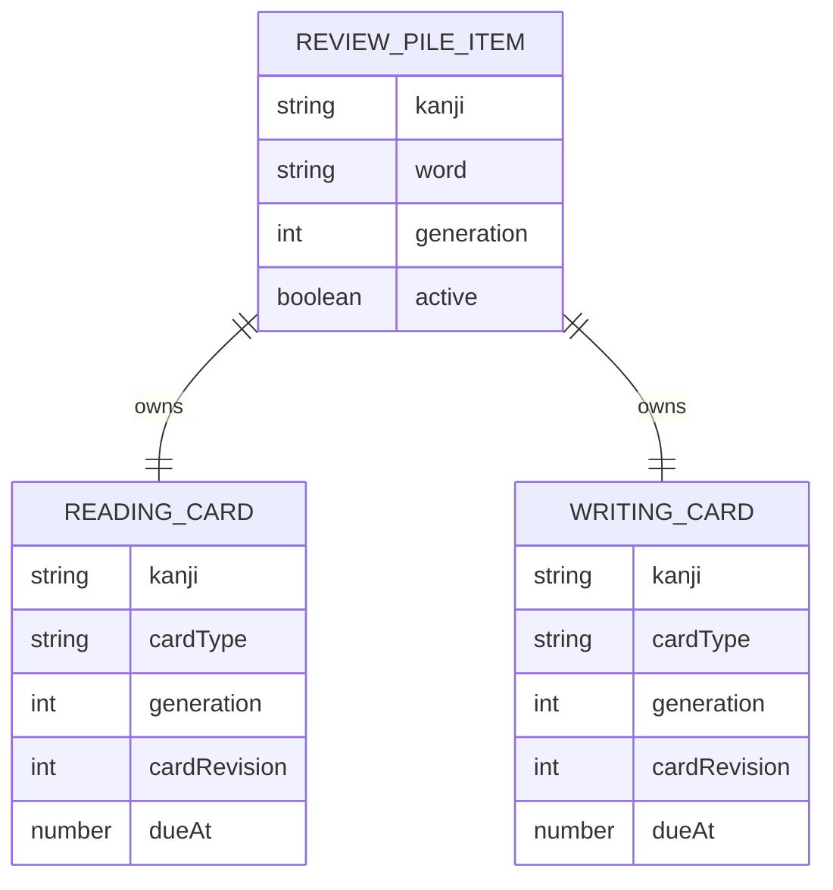
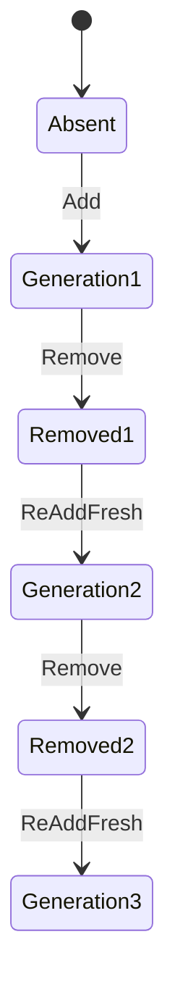
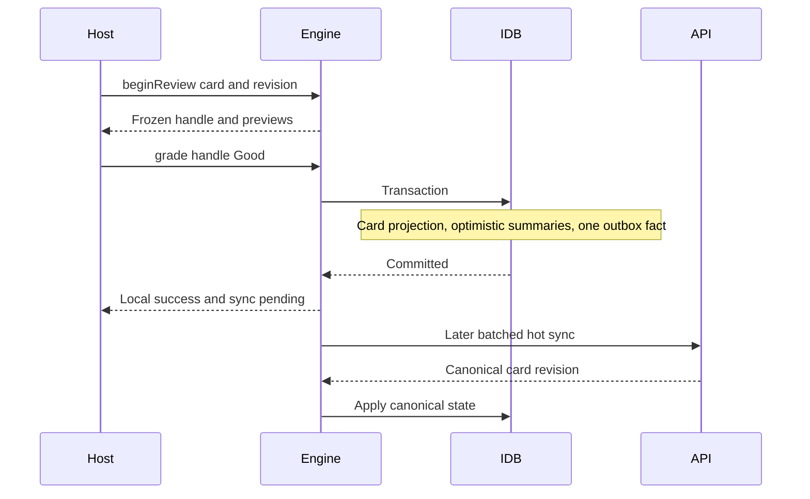
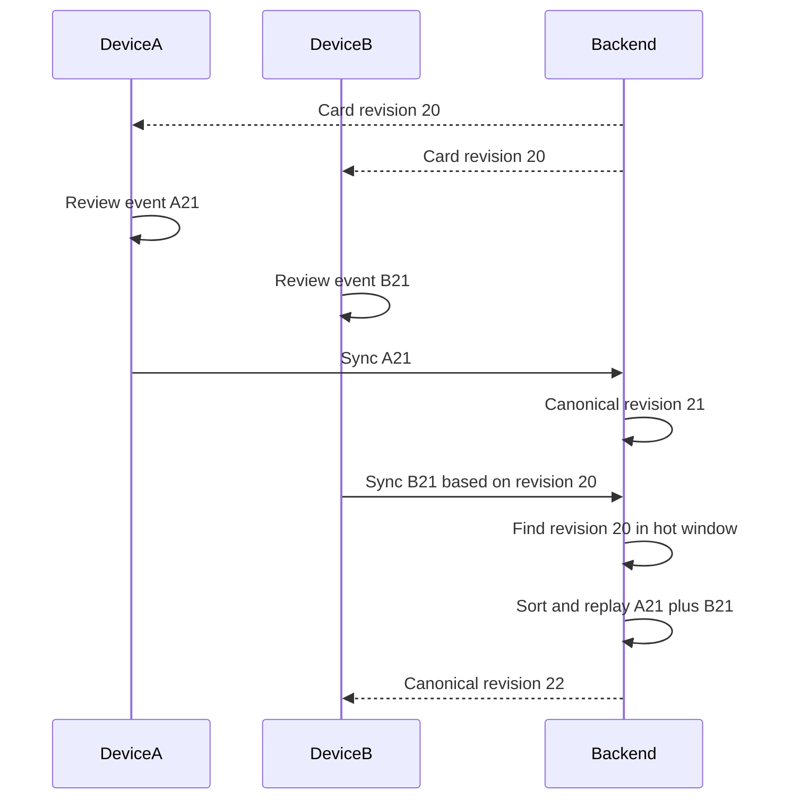
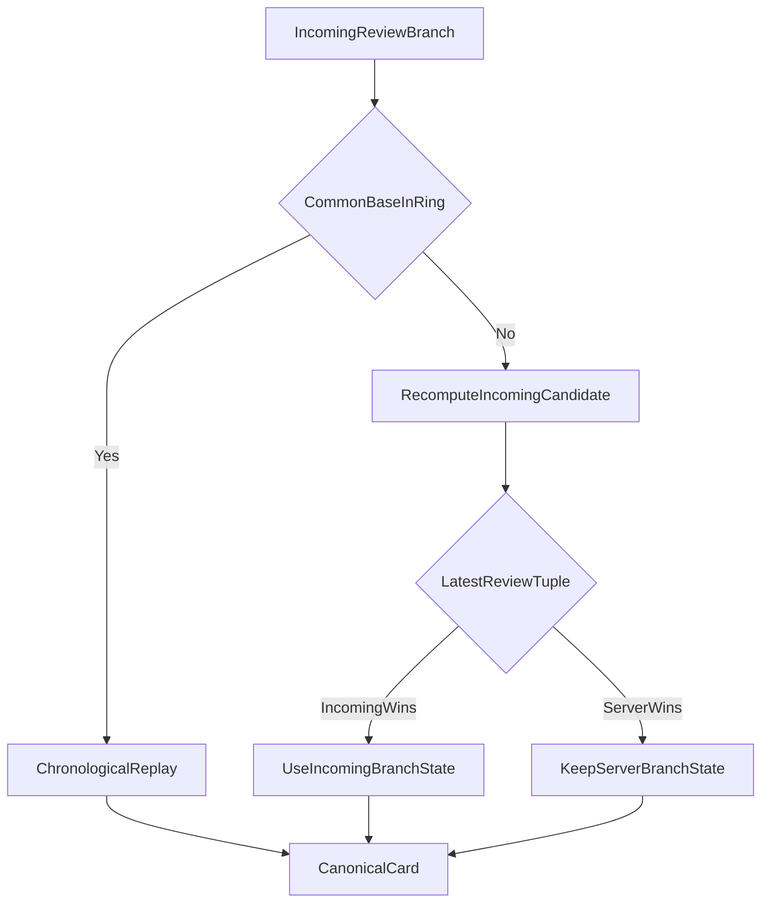
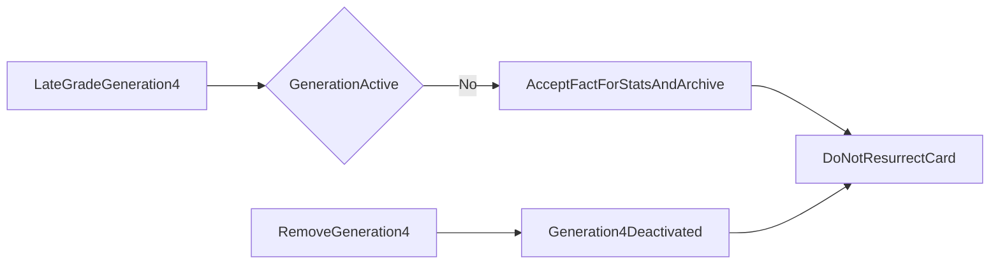

# Reviews and FSRS

This document owns the review-pile model, FSRS state/settings, due queries,
active-review handles, local grading, multi-device replay, incomplete-history
fallback, and review deletion rules.

## Domain invariants

1. Only kanji in the versioned review catalog may enter the pile.
2. One active pile-item generation exists per kanji.
3. A pile item carries the representative word its cards test.
4. Every active pile item owns exactly one reading card and one writing card.
5. Cards are created and removed together but graded independently.
6. Reading and writing share one account-wide settings document.
7. There are no daily new-card or maximum-review limits.
8. New cards are due immediately.
9. A review is an immutable fact; card state is a replaceable projection.
10. The backend is the canonical scheduler after sync.
11. Removal wins over a concurrent grade.
12. Re-adding a removed kanji creates a fresh generation with no restored
    schedule.

## Versioned kanji catalog

StudyEngine ships its own review eligibility manifest:

```ts
interface ReviewKanjiCatalogManifest {
  schemaVersion: 1;
  catalogVersion: string;
  sha256: string;
  kanji: readonly Kanji[];
}
```

The list is independent of Kanji Heatmap public JSON files. Engine artifact and
backend verify the same version/hash during session, bootstrap, and sync.

Rules:

- Catalog entries are unique single Unicode scalar values.
- Changing membership creates a new catalog version.
- Removing a kanji from a later catalog does not silently delete an existing
  user's pile item. A migration policy must explicitly retire or grandfather
  it.
- Catalog mismatch makes an existing cache read-only.

## Entity model



Proposed rows:

```ts
interface ReviewPileItemRow {
  kanji: Kanji; // primary key
  word: string; // the representative word these cards test
  generation: number;
  createdAt: UnixMs;
  createdByDeviceId: DeviceId;
  removedAt?: UnixMs;
  removedByDeviceId?: DeviceId;
  serverRevision?: number;
  active: boolean;
}

type CardType = "reading" | "writing";

interface ReviewCardRow {
  kanji: Kanji; // with cardType, the primary key
  cardType: CardType;
  generation: number;
  cardRevision: number;
  state: FsrsCardStateV1 | null; // nulled when inactive
  counters: ReviewCounters;
  serverRevision?: number;
  active: boolean;
}
```

The client does **not** store a review history ring. The bounded window and its
`anchorState` are a backend replay structure; see
[Bounded history window](#bounded-history-window). Nothing in the client reads
them: a grade carries `priorState` taken from the handle's frozen snapshot, and
several offline grades of one card form a contiguous branch identified by
device sequence, not by a local ring. Keeping a copy on the client meant
writing an eviction and anchor-advance algorithm, shipping the ring on every
canonical card in every delta, and keeping two implementations of one structure
agreeing about the same events.

Rows are keyed by bounded natural keys, and `generation` is a column rather
than part of the key. One kanji has one pile row and two card rows however many
times it is removed and re-added, so repeated re-adding cannot grow the table.

Stale-write protection is unchanged and does not depend on opaque IDs. Every
operation carries the generation it observed, and the backend rejects an
operation whose generation is not the active one. A screen left open across a
remove-and-re-add cannot grade the new generation, because its handle carries
the old generation number.

`CardId` remains in the public contract as an opaque handle for the host to
pass back, but it is derived from `(kanji, cardType, generation)` rather than
being an independent identity requiring its own row.

### The representative word

`word` is the word the two cards test. It is supplied by the host at add time
and frozen there.

Freezing is the point. In Kanji Heatmap the word comes from the
representative-word provider, which is application data that can change in a
release. If the pile item did not carry its own copy, a data update could
silently retarget an in-flight FSRS schedule: the user would have spent six
months building a memory of 日 in 日本 and would suddenly be tested on 日曜日
against a schedule that describes the old word. Storing the word makes the card
self-contained.

The engine cannot validate `word` against a catalog, because the catalog is a
list of kanji and there is no word list. Version one applies a byte limit and
NFC normalization. An implementation may additionally reject a word that does
not contain the pile item's kanji; this catches host bugs cheaply, and should
be dropped if variant forms in the host's data make it unreliable.

## FSRS card state

Do not persist a library class instance. Persist a versioned plain schema:

```ts
type FsrsLearningState = "new" | "learning" | "review" | "relearning";

interface FsrsCardStateV1 {
  schemaVersion: 1;
  schedulerAlgorithm: "fsrs";
  schedulerVersion: string;
  dueAt: UnixMs;
  lastReviewAt: UnixMs | null;
  stability: number;
  difficulty: number;
  elapsedDays: number;
  scheduledDays: number;
  learningStep: number;
  repetitions: number;
  lapses: number;
  learningState: FsrsLearningState;
}
```

Adapters convert this schema to/from the pinned `ts-fsrs` and `py-fsrs`
representations. The schema must not adopt a library field rename without a
StudyEngine migration.

Validation rejects NaN/infinite values, negative counts/durations, unsupported
states, invalid scheduler versions, and due dates outside policy bounds.

## Shared settings

```ts
interface ReviewSettings {
  requestRetention: number;
  maximumIntervalDays: number;
  enableFuzz: boolean;
  enableShortTerm: boolean;
  learningStepsMinutes: readonly number[];
  relearningStepsMinutes: readonly number[];
  modelWeights: readonly number[];
}

interface ReviewSettingsRow {
  key: "singleton";
  schemaVersion: 1;
  schedulerVersion: string;
  settings: ReviewSettings;
  settingsRevision: number; // monotonic
  updatedAt: UnixMs;
  origin: "device" | "server";
  writerDeviceId?: DeviceId;
  writerDeviceSequence?: number;
  serverRevision?: number;
}
```

Settings rules:

- A versioned engine schema defines supported defaults, ranges, step counts,
  weight count, and numeric precision.
- The backend may publish narrower limits.
- Reading and writing always reference the same current settings.
- Divergent updates use deterministic LWW on
  `(origin, clampedUpdatedAt, deviceId, deviceSequence)`. `origin` sorts a
  server-authored write after any device-authored write, which is what a
  future per-user weight-fitting job needs in order to publish results without
  racing a device.
- Updating settings does not reschedule every current card.
- The new settings apply to the next grade and to any short replay window that
  resolves after the setting wins.
- One current settings document exists, identified by a monotonic
  `settingsRevision`. Superseded revisions are not retained: replay applies one
  winning current settings version across its whole window rather than
  switching per event, so nothing reads an older one.
- The public API exposes `watchCurrent()` and `update()`.

## Pile operations

### Add

`reviews.pile.add({ kanji, word })`:

1. Validate writable access, catalog membership, and the word.
2. If an active item exists for this kanji:
   - **same word** → return it idempotently, create nothing;
   - **different word** → return
     `{ code: "pile_item_exists", kanji, currentWord }`.
3. Allocate the next kanji generation.
4. Create or reactivate one pile item and two fresh `new` cards in one
   transaction.
5. Set both cards' due instant to the creation instant.
6. Append one `review_pile_add` operation.
7. Notify reading and writing due stores.

Idempotency for the identical word is required, not optional: a double tap on
"Add to my review pile" must not create a second generation.

The backend repeats the invariant validation transactionally. Two devices that
add the same kanji offline with different words converge as: first accepted
wins, the second receives a `pile_item_exists` warning in its sync response,
and that device reconciles its projection to the canonical word.

### Remove

`reviews.pile.remove(kanji)`:

1. Deactivate the pile item and both cards locally, nulling card `state`.
2. Cancel any in-memory handle for those cards.
3. Append one `review_pile_remove` operation.
4. Preserve raw review history in the operational archive.

A remove operation refers to the exact generation it observed. It cannot
deactivate a later generation.

### Re-add

Re-adding after removal reactivates the same rows with:

- an incremented generation;
- possibly a different `word`;
- two fresh FSRS states;
- no restored due dates or stability.

Old history remains archive data only.

### Changing the word

There is no in-place `setWord`. The word is card content, so changing it
invalidates the memory the schedule describes, and the schedule is discarded.

Because that is destructive, the engine provides one atomic method rather than
making the host orchestrate two calls:

```ts
/** Destructive: discards the current generation's schedule and starts fresh. */
replaceWord(input: { kanji: Kanji; word: string }): Promise<Result<ReviewPileItemView>>;
```

`replaceWord` performs the remove and the add in **one local transaction** and
emits the same two wire operations, `review_pile_remove` then
`review_pile_add`. There is no new operation kind and no new backend logic; the
backend applies them in sequence order exactly as if the host had sent them
separately.

Doing this in the engine rather than the host closes a real failure window. Two
host calls can fail between the remove and the add — a `storage_quota` on the
second leaves the user with neither their old schedule nor their new pile item,
and the removal is already committed so the host cannot undo it. Two calls also
make the kanji briefly absent from `watchMany`, which flickers in list badges.

The host still owns the warning. See
[Scenarios and UX](./SCENARIOS-AND-UX.md).



## Due queue

The caller must request exactly one card type:

```ts
interface DueQuery {
  cardType: CardType;
  limit: number;
  asOf?: UnixMs;
}

interface DueCard {
  cardId: CardId;
  kanji: Kanji;
  dueAt: UnixMs;
  revision: number;
}
```

Rules:

- `cardType: "both"` does not exist.
- `limit` is required, positive, and bounded by engine policy.
- Omitted `asOf` uses the engine clock. A host cannot use a future `asOf`
  beyond a small query-only policy bound to unlock cards early.
- Include active cards with `dueAt <= asOf`.
- Best-effort: skip cards another tab has broadcast as open. A missed broadcast
  is harmless.
- Sort by `dueAt` ascending, then stable `cardId`.
- Return no full FSRS state.

`revision` is the local projection's monotonic card revision. It changes after
a local grade or canonical server update.

The query-store implementation schedules a wake-up for the earliest future due
card so a due count updates even without an IndexedDB mutation.

## Begin and freeze a review

The host selects a `DueCard` and opens it through:

```ts
interface BeginReviewInput {
  cardId: CardId;
  expectedRevision: number;
}

type FsrsRating = "again" | "hard" | "good" | "easy";

interface RatingPreview {
  rating: FsrsRating;
  scheduledAt: UnixMs;
  intervalMs: number;
}

interface ActiveReview {
  handleId: string;
  cardId: CardId;
  kanji: Kanji;
  word: string;
  cardType: CardType;
  generation: number;
  openedAt: UnixMs;
  expiresAt: UnixMs;
  basedOnRevision: number;
  previews: Readonly<Record<FsrsRating, RatingPreview>>;
}
```

`beginReview`:

- refuses if the entitlement lease expires within
  `openReviewEntitlementMarginMs`;
- verifies the current generation and revision;
- snapshots the card state and current settings **into memory**;
- computes all four previews from that snapshot;
- creates a single-use handle;
- broadcasts `{ reviewing: cardId }` as a hint to other tabs;
- returns a view that will not change while open.

### The handle is the snapshot

The handle exists to guarantee three things, all of which are properties of one
page's memory:

1. **Preview and grade agree.** The grade is computed from exactly the state
   whose previews the user saw. Without this, a sync landing between render and
   tap means the user presses "Good" expecting four days and gets eleven.
2. **One grade per open card.** A consumed handle cannot be graded again, so a
   double tap cannot produce two review facts.
3. **Generation binding.** A screen open across a remove-and-re-add cannot
   grade the new generation.

Because the handle owns a frozen snapshot, **incoming sync may apply freely to
the projection**, including to the row of the card currently on screen. The
displayed previews come from the snapshot, not from the row, and the resulting
fact carries the snapshot as `priorState` so the backend can replay it against
a base it recognizes. There is no staged inbox and no deferred-apply ordering.

The handle is not persistent review history. A reload or crash discards it, and
its expiry is what ends an abandoned review when `cancel()` is never called.

### Two tabs may open the same card, and that is fine

Exclusion is not a correctness property here. If two tabs do grade the same
card, the result is two review facts from one device, which the backend replays
chronologically to the correct schedule. The outcome is right; the experience
is merely odd, in a situation that is rare for a single-user study application.

So there is no lease: no per-card lock row, no lease predicate in due queries,
no renewal timer fighting background-tab throttling, and no crash takeover.
Exclusion is handled best-effort by a `BroadcastChannel` hint — a tab that
opens a card announces it, others skip that card while building a due list, and
a missed message degrades to the harmless case above.

A lock could not have helped across devices in any case. Web Locks and
IndexedDB records live inside one browser profile. Two **devices** reviewing the
same card concurrently is normal and expected, and is resolved by chronological
replay.

## Grade transaction

```ts
interface GradeReviewInput {
  handleId: string;
  rating: FsrsRating;
}

interface GradeOutcome {
  eventId: string;
  cardId: CardId;
  provisionalCard: DueCard;
}
```

The engine owns `reviewedAt`; a host does not supply it.



One grade transaction:

1. Validate that the handle exists, is unconsumed, and belongs to the active
   generation.
2. Validate writable access. There is no exception for an already-open card;
   `beginReview` refused to open a card the user could not finish.
3. Capture trusted local `reviewedAt`.
4. Create a stable event ID and allocate one device sequence.
5. Compute a provisional state with pinned `ts-fsrs` from the handle's frozen
   snapshot.
6. Increment the card's local revision.
7. Increment the card's local counters.
8. Increment the optimistic local daily summary and rating count.
9. Append one `review_grade` operation to the outbox.
10. Consume the handle and broadcast its release.
11. Commit before returning success.

Steps 8 and 9 are optimistic projections and one fact. The device does not
send a summary; the backend derives the canonical daily row from this fact and
overwrites the projection on the next pull.

Double submission of a consumed handle returns an expected stale or expired
result and never creates a second event.

## Review fact

One operation carries the grade. The backend derives canonical card state,
daily summaries, and the archived event from it. The payload carries enough
branch context for validation and for the incomplete-history fallback:

```ts
interface ReviewFactV1 {
  schemaVersion: 1;
  eventId: string;
  kanji: Kanji;
  cardType: CardType;
  generation: number;
  rating: FsrsRating;

  reviewedAt: UnixMs;
  reportedWallTime: UnixMs;
  deviceId: DeviceId;
  deviceSequence: number;

  baseServerRevision: number;
  settingsRevision: number;
  schedulerVersion: string;

  priorState: FsrsCardStateV1;
  provisionalDueAt: UnixMs;
}
```

### Why the fact carries `priorState` but not a full result

`priorState` is load-bearing. When the incoming common base falls outside the
server's ring, exact replay is impossible and the backend must recompute the
incoming branch before it can compare branches. It recomputes from this field.
Without it, the fallback degrades to "the server keeps its own branch and the
incoming facts count only for statistics," which is a real behavior loss.

The fact deliberately does **not** carry the client's computed result state.
The backend never trusts a client result and always recomputes with `py-fsrs`,
so the only value such a field would have is detecting a `ts-fsrs`/`py-fsrs`
divergence — which the single `provisionalDueAt` number does just as well at a
fraction of the bytes. A material mismatch produces a compatibility diagnostic.

`reportedWallTime` can be retained in operational history. Merge order uses a
server-adjusted and clamped `reviewedAt`.

## Bounded history window

**This structure lives only in Postgres.** It is what makes exact replay
possible; no client stores or receives it.

Each canonical card keeps a small complete segment:

```ts
interface ReviewHistoryWindow {
  capacity: number;
  anchorServerRevision: number;
  anchorState: FsrsCardStateV1;
  events: readonly ReviewFactSummary[];
}

interface ReviewFactSummary {
  eventId: string;
  reviewedAt: UnixMs;
  deviceId: DeviceId;
  deviceSequence: number;
  rating: FsrsRating;
  settingsRevision: number;
  resultingServerRevision: number;
}
```

`anchorState` is the state immediately before the oldest retained event.
Without it, retaining event IDs alone is insufficient to replay from the start
of the window.

When an event is evicted:

- advance `anchorState` to that event's canonical result;
- advance `anchorServerRevision`;
- keep exactly the configured number of newer events.

The backend publishes ring capacity so the browser can report an unsupported
value before writable access, but the browser never materializes a ring.

## Exact replay

Suppose two devices received revision 20, then reviewed offline:



Replay algorithm:

1. Verify event identity, generation, settings/scheduler versions, and device
   sequence.
2. Find a state in the current hot window corresponding to the incoming common
   base.
3. Collect all server-window events after that base plus the incoming
   contiguous branch events.
4. Deduplicate by event ID.
5. Clamp implausible future timestamps.
6. Sort by `(reviewedAt, deviceId, deviceSequence, eventId)`.
7. Select the winning current settings version under settings LWW.
8. Recompute the short combined sequence with `py-fsrs` from the common base
   under that settings version.
9. Replace canonical card state/window and allocate a new server revision.
10. Preserve every event's counters and archive identity.

Applying one winning settings version to the short replay window is deliberate.
It avoids switching algorithms mid-window and is consistent with settings
being forward-looking preferences. It may slightly reinterpret recent
intervals during a conflict.

## Incomplete-history fallback

If the incoming common base predates `anchorServerRevision`, exact replay is
not possible on the hot path. The selected policy is immediate LWW; the backend
does not fetch R2 during sync.



Fallback comparison:

```text
(latest clamped reviewedAt, deviceId, deviceSequence, eventId)
```

The backend recomputes the incoming branch from its provided prior state and
contiguous events before choosing it. It never trusts a client-provided result
blindly.

Consequences:

- The losing branch's schedule contribution is not in the canonical due date.
- Its facts still count in device/card/daily statistics.
- Its raw events remain in operational history.
- Later reviews naturally correct moderate schedule error through FSRS
  feedback.
- Metrics must report fallback frequency and affected card types.

This is deterministic convergence, not exact conflict reconstruction.

## Clock handling

Review chronology depends on time but browser clocks are not trustworthy.

The engine:

- maintains server-time offset observations;
- never lets its effective wall clock move backward within a cache;
- uses monotonic elapsed time within an open page;
- stores reported and adjusted occurrence times separately where needed.

The backend:

- clamps future times beyond policy tolerance;
- may bound implausibly old times for schedule computation while preserving raw
  operational evidence;
- breaks equal adjusted times with stable device sequence and event ID.

No clock algorithm can prove the true order of two long-offline physical
devices. The deterministic tie is the contract.

## Deletion versus review

If device A removes generation 4 while device B grades a card in generation 4:



The server acknowledges the grade operation so its device sequence can advance,
records an explicit `ignored_deleted_generation` warning, and does not
reactivate either card. It **does** increment the derived daily summary,
because the user did perform the review. Because summaries are derived rather
than device-owned, this must be an explicit backend rule rather than something
that follows automatically.

A grade for generation 4 can never apply to generation 5.

## Card counters

Each card row keeps plain totals:

```ts
interface ReviewCounters {
  reviews: number;
  lapses: number;
  again: number;
  hard: number;
  good: number;
  easy: number;
}
```

The backend increments these at ingest, inside the transaction that advances
the device sequence high-water mark, so a retry cannot double count. These
totals remain exact even when schedule fallback chooses one branch and
discards the other's contribution to the due date.

These are plain totals with no per-device dimension. Partitioning counters by
device would only be needed if two devices could write them; the backend is the
only writer, so there is nothing to partition.

## Backend scheduler authority

The browser and backend pin explicit scheduler versions. The backend's
`py-fsrs` result is canonical.

Required compatibility artifacts:

- Shared JSON fixtures for settings validation.
- Card-state conversion fixtures.
- Rating-preview fixtures.
- One-step grade fixtures for all four ratings and learning states.
- Multi-step chronological replay fixtures.
- Date/time precision and rounding fixtures.
- Explicit numeric tolerances where bit equality is not portable.

If `ts-fsrs` and `py-fsrs` differ beyond allowed tolerance:

- do not reject an already committed local fact merely for being offline;
- let the backend return its canonical projection;
- record a compatibility diagnostic;
- block further writes if the mismatch indicates unsupported scheduler
  versions rather than harmless rounding.

## Review API proposal

```ts
interface ReviewSettingsApi {
  watchCurrent(): QueryStore<ReviewSettings>;
  update(settings: ReviewSettings): Promise<Result<ReviewSettings>>;
}

interface ReviewPileApi {
  watch(kanji: Kanji): QueryStore<ReviewPileItemView | null>;
  watchMany(kanji: readonly Kanji[]): QueryStore<readonly ReviewPileItemView[]>;
  watchAll(): QueryStore<readonly ReviewPileItemView[]>;
  add(input: {
    kanji: Kanji;
    word: string;
  }): Promise<Result<ReviewPileItemView>>;
  remove(kanji: Kanji): Promise<Result<void>>;

  /** Destructive: discards this generation's schedule and starts fresh. */
  replaceWord(input: {
    kanji: Kanji;
    word: string;
  }): Promise<Result<ReviewPileItemView>>;
}

/** Read-only progress for display. Not sufficient to compute a schedule. */
interface CardProgress {
  dueAt: UnixMs;
  learningState: FsrsLearningState;
  stability: number; // days; higher means better retained
  difficulty: number; // 1..10; higher means harder for this user
  reviews: number;
  lapses: number;
}

interface ReviewPileItemView {
  kanji: Kanji;
  word: string;
  generation: number;
  reading: CardProgress;
  writing: CardProgress;
}
```

`watchMany` replaces a loosely typed `getCardInfo(kanjiArray, "both")`. It
returns pile/card summaries suitable for list badges. `watchAll` serves a
whole-collection visualization; it is bounded by the review catalog, so it needs
no paging.

### Why `CardProgress` exposes stability and difficulty

The rule that due queries return no FSRS state exists so a host cannot compute
its own schedule and disagree with the backend. `CardProgress` does not enable
that: it omits `elapsedDays`, `scheduledDays`, `learningStep`, `lastReviewAt`,
and the settings, so it cannot be fed to `ts-fsrs`. What it does enable is the
`/mastery` visualization, whose entire purpose is to colour a tile by how well
a kanji is known.

Stability and difficulty are the only two numbers FSRS produces that mean
something to a person — roughly "how long this will stay learned" and "how much
work it is for you" — so a host that cannot read them cannot build a mastery
view at all. Combined values are host arithmetic and are deliberately not
engine surface: combined stability is `min(reading, writing)` and combined
difficulty is `max(reading, writing)`, both because the weaker half is what
governs whether the kanji is actually known.

An item is included with `learningState: "new"` and `stability: 0` between
`add` and its first grade, so a mastery view can distinguish "in the pile,
never reviewed" from "not in the pile" without a second query.

`getDue` requires a single `CardType`. `beginReview` returns previews; there is
no separate public `preview(kanji, cardType)` that can race with card
replacement.

## Review session behavior

StudyEngine does not own a presentation-level review session queue. A host may:

- repeatedly query/start the next due reading card;
- repeatedly query/start the next due writing card;
- stop at any time;
- call `sync.now("review_session_ended")` when its session ends.

There are no daily caps. `limit` is only a query/page bound.

## Review statistics

Every local grade updates the unified device-owned daily summary:

- reading cards reviewed;
- writing cards reviewed;
- Again count;
- Hard count;
- Good count;
- Easy count.

The device applies these as optimistic projections and sends only the grade
fact. The backend derives the canonical values and returns them on the next
pull.

The raw review archive contains richer facts. The derived daily summary is the
query source for calendars and all-time counts, and must never be recomputed
from the archive, which has a retention policy the summaries do not share.

## Failure behavior

- **Storage quota before commit:** grade fails; the handle remains available
  until expiry so the host can retry after freeing space.
- **Entitlement expires before opening:** `beginReview` fails `read_only`.
- **Entitlement expires within the open margin:** `beginReview` fails
  `read_only` rather than opening a card the user could not finish.
- **Entitlement expires after opening:** `grade` fails `read_only`. There is no
  exception. In practice this is nearly unreachable, because the margin check
  refuses to open such a card.
- **Card synced to a newer revision before begin:** `stale_revision`.
- **Card syncs after begin:** the server row applies immediately; the handle's
  frozen snapshot and previews are unaffected.
- **Same card open in two tabs:** both may grade. Two facts are recorded and
  replay resolves them. Best-effort broadcast usually prevents the second tab
  from offering the card at all.
- **Generation removed:** the grade is acknowledged as a fact and counted in
  statistics, but never reactivates schedule state.
- **Backend offline:** the local grade succeeds under a valid lease and remains
  in the outbox.
- **Protocol/catalog mismatch:** no new handle opens; cached views remain
  readable.

Host-facing behavior for each of these is in
[Scenarios and UX](./SCENARIOS-AND-UX.md).
