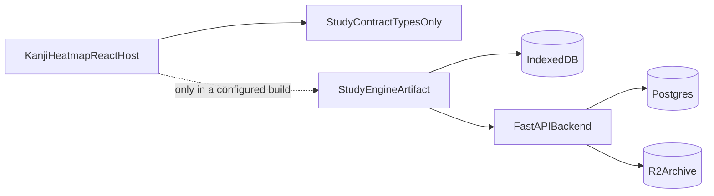
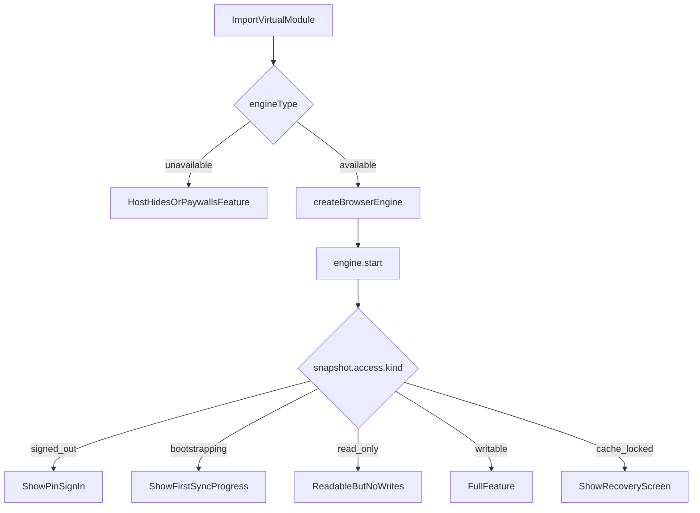
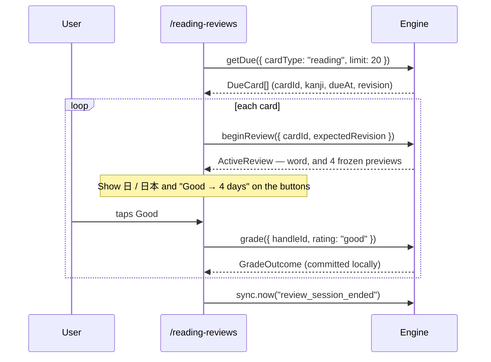
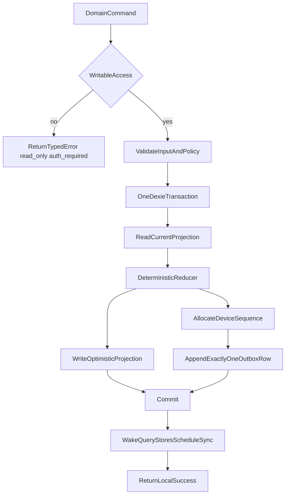
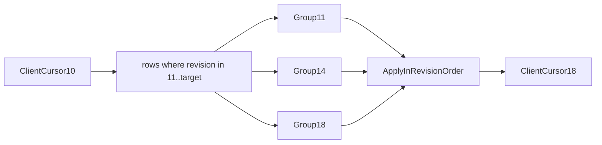
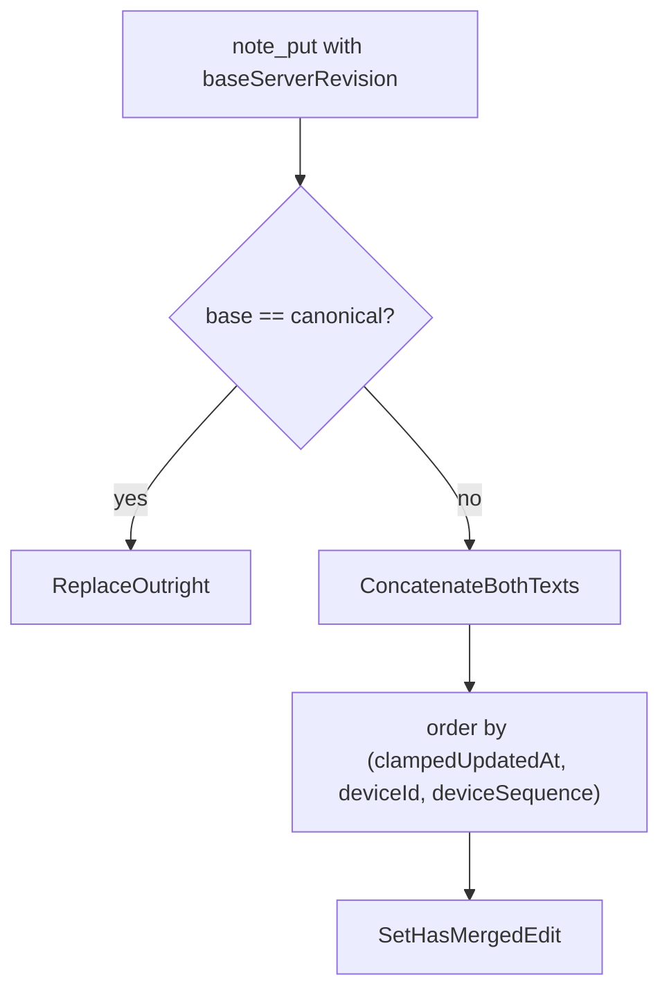
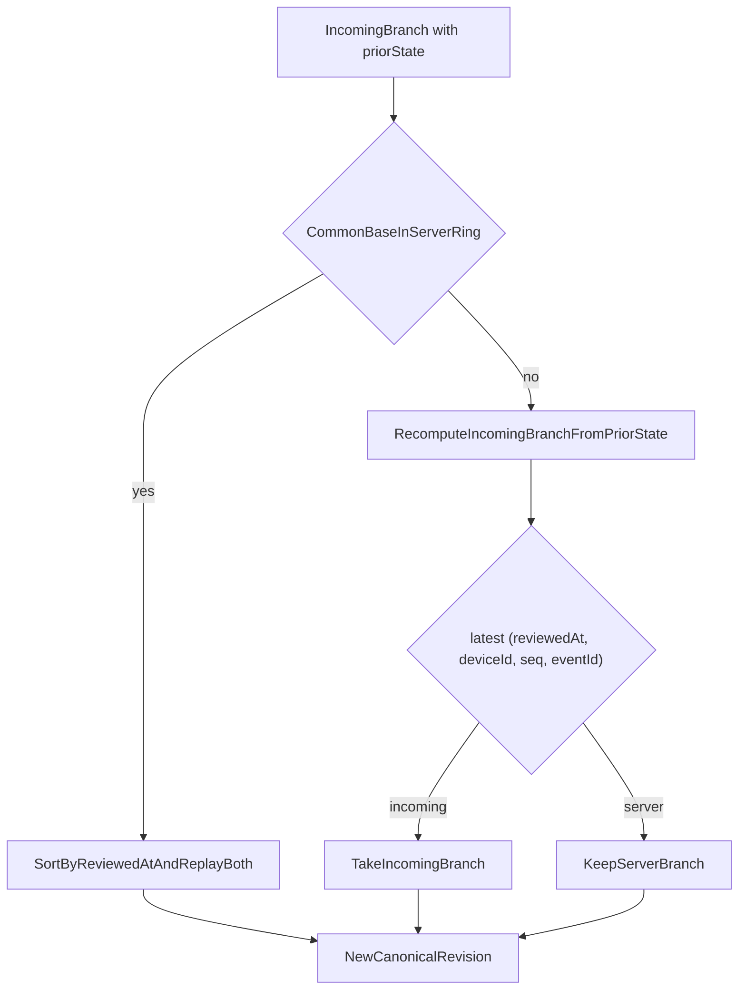
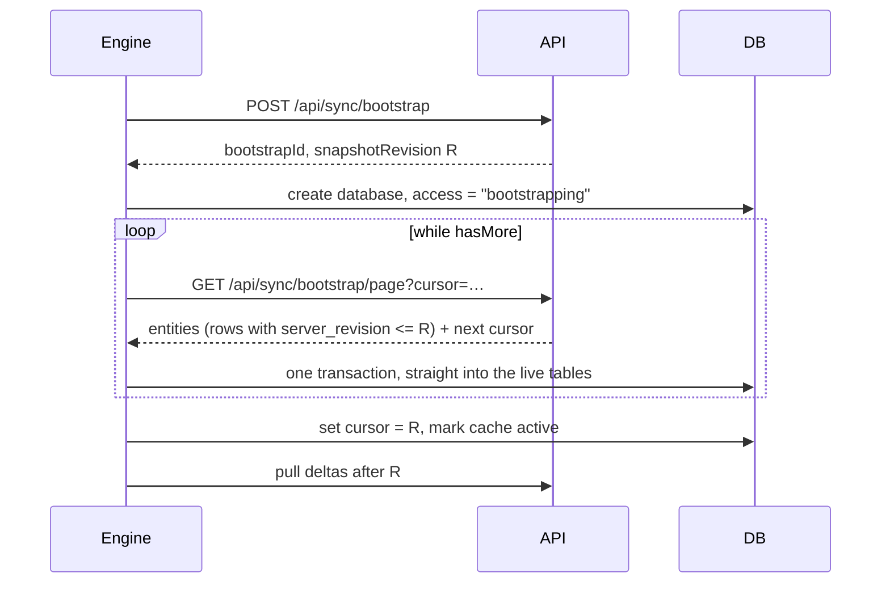
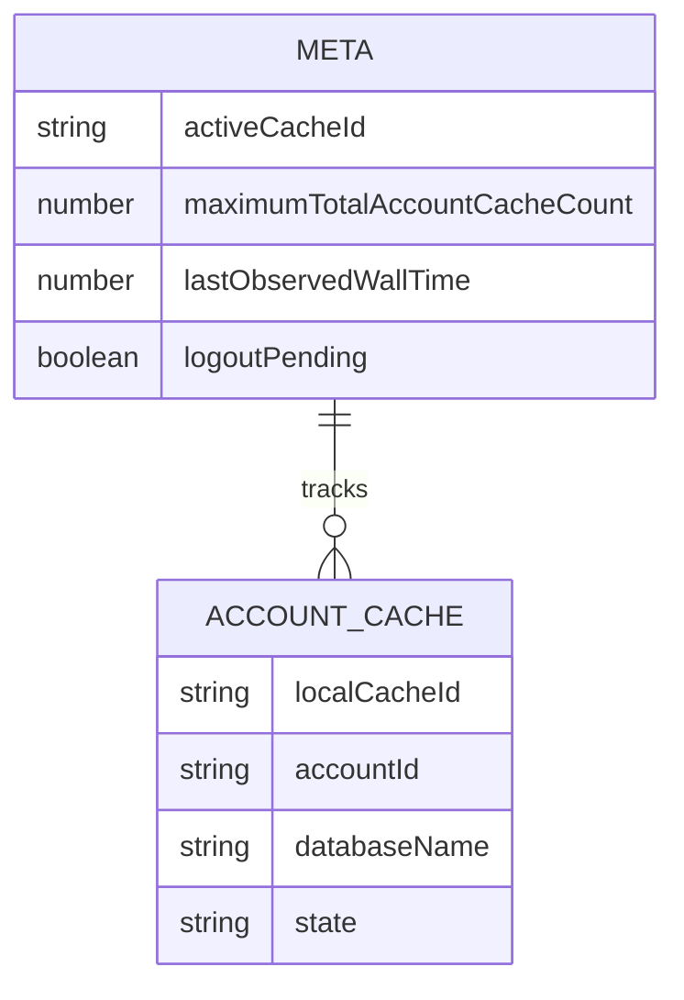
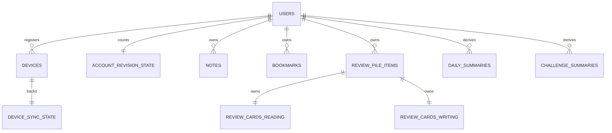

# StudyEngine in One Sitting

This is the short version of the nine documents beside it. It is written for
someone
who needs to know what StudyEngine is, what it exposes, how the app will use it,
what happens under the hood, and what the data looks like — without reading the
specifications that own each of those.

Where this document and a topic document disagree, the topic document wins.
Every link below points at the authority for that subject.

---

## 1. What it is, in sixty seconds

StudyEngine is a browser-first, framework-independent TypeScript package that
owns **premium, authenticated, multi-device study data** for Kanji Heatmap:

- one Markdown note per kanji,
- one bookmark per kanji,
- a practice activity log with daily and challenge statistics,
- an FSRS spaced-repetition review pile with independent reading and writing
  schedules.

Four properties shape every decision in the design:

| Property               | Consequence                                                                  |
| ---------------------- | ---------------------------------------------------------------------------- |
| **Optional**           | A default Kanji Heatmap build does not download or build it at all.          |
| **Offline-first**      | A mutation commits to IndexedDB _before_ it reports success. Sync is later.  |
| **Premium**            | Writes require a signed entitlement lease. Reads survive its expiry.         |
| **Framework-agnostic** | No React, no routing, no CSS, no copy. The host owns every pixel and string. |



The host always installs the tiny **Study Contract** (types and constants). The
real engine is a separately built, checksummed artifact selected at build time.
When it is absent, the host imports an `unavailable` binding that has metadata
and _no mutation methods_, so a build without the engine cannot silently
pretend a write succeeded.

## 2. The five ideas that explain everything else

Almost every specific rule in the other documents follows from one of these.

### Facts in, projections out

A device sends two kinds of thing, and never a third:

- **Facts** — `review_grade`, `practice_activity_event_add`. Immutable records
  of something the user did. Two devices grading offline do not conflict; they
  each know something the other does not.
- **State intents** — notes, bookmarks, settings, pile add/remove. A desired
  value for mutable state, resolved by deterministic last-writer-wins (or, for
  notes, by merge).

A device **never** sends a summary or a canonical card state. The backend
derives daily summaries, challenge summaries, and FSRS schedules from facts.
This is why there is no summary operation of any kind. If a device sent an
absolute daily snapshot, a 200-review day would emit 200 redundant snapshots in
a sequence the protocol requires to be gap-free.

### One outbox, one sequence, one acknowledgement

Every mutation writes exactly one row to one `outbox` table, in the same
IndexedDB transaction as its optimistic projection. There is no second pipeline,
no second high-water mark, and no second backoff. Archive fan-out happens on the
_backend_ side, behind a transactional delivery outbox.

### Soft deletion on bounded natural keys

Every entity is keyed by something bounded — kanji, `(kanji, cardType)`,
`localDate`, `(activityType, challengeId)` — so nothing is ever hard-deleted.
Deletion sets `active = false` and bumps a revision, which means a delta query
of `server_revision > cursor` naturally carries deletions.

This one decision is why there are no tombstones, no tombstone garbage
collection, no per-device cursor tracking, no device cap, no device retirement,
and no unbounded review-pile generation growth.

### A projection is a function, not an accumulator

```text
displayed(key) = lastServerValue(key) with pending outbox ops for key replayed
```

Rows are materialized so Dexie can index them, but whenever a server value
arrives the row is **rebuilt**, never patched. Without this rule, a server daily
summary landing while five grades are still unsent would double-count the
fifteen that were already acknowledged.

### The handle is the snapshot; the projection is free to move

An open review is an **in-memory, single-use handle** holding a frozen copy of
the card state, the settings, and the four rating previews. Grading reads the
snapshot, never the live row. So sync may apply a new version of that very card
mid-review with no staging, no deferred apply, and no lock.

---

## 3. Part A — the exposed surface and how the app uses it

### The whole API

```ts
interface StudyEngine {
  getSnapshot(): StudyEngineSnapshot; //  ← sync status, access state, storage
  subscribe(listener: () => void): () => void;
  start(): Promise<Result<void>>;
  dispose(): Promise<void>;

  readonly auth: AuthApi;
  readonly notes: NotesApi;
  readonly bookmarks: BookmarksApi;
  readonly activity: ActivityApi;
  readonly reviews: ReviewsApi;
  readonly privacy: PrivacyApi;
  readonly sync: SyncApi;
  readonly storage: StorageApi;
}
```

Two return conventions cover the entire surface:

| Shape                   | Meaning                                                                                              |
| ----------------------- | ---------------------------------------------------------------------------------------------------- |
| `QueryStore<T>`         | A reactive read. `getSnapshot()` + `subscribe()` + `refresh()`, shaped for `useSyncExternalStore`.   |
| `Promise<Result<T, E>>` | A write. `{ ok: true, value }` or `{ ok: false, error }` — expected outcomes are values, not throws. |

Promises reject only for programmer errors and broken invariants. Quota
exhaustion, offline, rate limits, stale revisions, and read-only access are all
`Result` values.

```ts
type QuerySnapshot<T> =
  | { status: "loading" }
  | { status: "ready"; result: Result<T> }
  | { status: "failed"; diagnosticId: string; retryable: boolean };
```

### Full method list

| Group       | Method                               | In                             | Out                                    |
| ----------- | ------------------------------------ | ------------------------------ | -------------------------------------- |
| `auth`      | `requestPin`                         | `{ email }`                    | `PinChallenge`                         |
|             | `verifyPin`                          | `{ challengeId, pin }`         | `VerifyPinOutcome`                     |
|             | `refreshSession`                     | —                              | `SessionRefreshOutcome`                |
|             | `logout`                             | `{ removeLocalData, confirm }` | `LogoutOutcome`                        |
| `notes`     | `watch`                              | `kanji`                        | `QueryStore<KanjiNoteView \| null>`    |
|             | `put`                                | `{ kanji, content, base? }`    | `KanjiNoteView`                        |
|             | `remove`                             | `{ kanji }`                    | `void`                                 |
| `bookmarks` | `watchAll` / `watch`                 | — / `kanji`                    | `QueryStore<KanjiBookmark[] \| …>`     |
|             | `add` / `remove`                     | `kanji`                        | `KanjiBookmark` / `void`               |
| `activity`  | `record`                             | `PracticeActivityEventInput`   | `ActivityWrite`                        |
|             | `watchDaily`                         | `{ from, to }`                 | `QueryStore<DailySummary[]>`           |
|             | `watchAllTime`                       | —                              | `QueryStore<AllTimeSummary>`           |
|             | `watchChallenges`                    | `{ activityType, ids? }`       | `QueryStore<ChallengeSummary[]>`       |
| `reviews`   | `settings.watchCurrent` / `update`   | — / `ReviewSettings`           | `QueryStore<ReviewSettings>` / …       |
|             | `pile.watch` / `watchMany`           | `kanji` / `kanji[]`            | `QueryStore<ReviewPileItemView…>`      |
|             | `pile.watchAll`                      | —                              | `QueryStore<ReviewPileItemView[]>`     |
|             | `pile.add` / `remove`                | `{ kanji, word }` / `kanji`    | `ReviewPileItemView` / `void`          |
|             | `pile.replaceWord`                   | `{ kanji, word }`              | `ReviewPileItemView` **(destructive)** |
|             | `watchDueCount`                      | `cardType`                     | `QueryStore<number>`                   |
|             | `getDue`                             | `{ cardType, limit, asOf? }`   | `DueCard[]`                            |
|             | `beginReview`                        | `{ cardId, expectedRevision }` | `ActiveReview` (frozen previews)       |
|             | `grade`                              | `{ handleId, rating }`         | `GradeOutcome`                         |
|             | `cancel`                             | `handleId`                     | `void`                                 |
| `privacy`   | `watchResearchParticipation` / `set` | — / `"enabled" \| "disabled"`  | `ResearchParticipation`                |
| `sync`      | `now`                                | `ManualSyncReason?`            | `SyncOutcome`                          |
| `storage`   | `requestPersistence`                 | —                              | `{ persisted }`                        |

Note what is **not** there. There is no untyped `getCardInfo`, no standalone
`preview()` that could race with card replacement, no live due **list** (a
session wants a stable queue and a badge wants `watchDueCount`), no
`sessionStatus()` poll (the engine snapshot is the status source of truth), no
conflict list (divergent notes merge), no device management (nothing waits on a
device's cursor), and no separate logout-preparation call (`logout()` returns
`confirmation_required` with the impact).

### How the host binds to it



One engine per tab. The host adapts `QueryStore` to React once:

```ts
function useStudyQuery<T>(store: QueryStore<T>) {
  return useSyncExternalStore(store.subscribe, store.getSnapshot);
}
```

`getSnapshot()` is synchronous and referentially stable until notification,
which is exactly `useSyncExternalStore`'s tearing-safety requirement.

### Route by route

#### `/reading-practice` and `/writing-practice` (existing)

Host-built decks from host data, unchanged, plus one line at the end of a round.
Scheduling belongs to `/reading-reviews` and `/writing-reviews`.

```mermaid
sequenceDiagram
    participant User
    participant Route as /reading-practice
    participant Engine
    User->>Route: Completes a round
    Route->>Route: Show end screen (host state, unchanged)
    Route->>Engine: activity.record({ type: "reading_practice_round_completed", … })
    Engine-->>Route: { eventId } — already durable in IndexedDB
    Note over Engine: Optimistic daily summary updated; one outbox row queued
```

The call is fire-and-forget from the user's point of view: it never blocks the
end screen, and if the engine is unavailable or read-only the host simply skips
it. The one existing behavior that changes is the **bookmarked-only filter**,
which today calls `isBookmarked(kanji, word)` and breaks whenever a kanji's
representative word changes in a data release. It becomes a set membership test
against `bookmarks.watchAll()`, keyed by kanji alone.

#### `/speed-katakana` (existing)

Same shape, plus a leaderboard read:

```ts
activity.record({
  schemaVersion: 1,
  type: "speed_katakana_session_completed",
  challengeId,
  accuracyPercent,
  charactersPerMinute,
  occurredAt,
  localDate,
  timeZone,
  startedAt,
  endedAt,
});

const best = activity.watchChallenges({ activityType: "speed_katakana" });
```

Personal bests move from `localStorage` to a **backend-derived**
`ChallengeSummary`, so a best set on the phone shows up on the laptop. The
reduction rules (increment, max, latest-by-timestamp) all commute, so a session
that syncs a week late produces the same row as one that syncs immediately.

#### `/dashboard` (existing)

Pure read. Three stores drive the whole page:

```ts
activity.watchDaily({ from, to });   // calendar heatmap
activity.watchAllTime();             // cake day, days active, totals
activity.watchChallenges({ … });     // Speed Katakana bests
```

`DailySummary` carries practice counts _and_ FSRS review counts with the rating
breakdown (`ratingAgain`/`Hard`/`Good`/`Easy`) in one row, so the calendar does
not need a second query once reviews exist.

#### Future speaking / shadowing routes

Adding a practice type is a **coordinated schema release**, deliberately:

1. Add a variant to `PracticeActivityEventInput` in the contract.
2. Add its reducer to the backend so it lands in a daily summary.
3. Ship both, then the route.

An unknown event type fails validation. This is the accepted cost of typed
events over a free-form `Record<string, number>` — the backend can never accept
a fact it cannot reduce, so a summary can never silently under-count.

#### `/reading-reviews` and `/writing-reviews` (future, FSRS)

The engine owns no session queue. A session is a host loop over three calls:



Host rules that matter:

- **Use `getDue`, not a live store.** A queue that reorders between choosing a
  card and opening it is worse than a slightly stale one.
- **Call `cancel(handleId)` in `useEffect` cleanup.** Otherwise an abandoned
  handle lingers until expiry and other tabs keep skipping that card.
- **Treat `review_handle_consumed` as a no-op**, not an error. That is a double
  tap, and exactly one review was recorded.
- **Never recompute intervals.** The previews in `ActiveReview` are the contract:
  what the button said is what the grade does.
- **`read_only` at `beginReview` is expected**, not a bug — the engine refuses
  to open a card whose entitlement expires within the margin, so a card the user
  cannot finish is never started.

#### `/mastery` (future)

`/mastery` is the `/` grid with tile colour driven by memory strength instead of
frequency rank. One store supplies the whole page:

```ts
const pile = reviews.pile.watchAll(); // ReviewPileItemView[]

interface ReviewPileItemView {
  kanji: Kanji;
  word: string;
  generation: number;
  reading: CardProgress;
  writing: CardProgress;
}

interface CardProgress {
  dueAt: UnixMs;
  learningState: "new" | "learning" | "review" | "relearning";
  stability: number; // days — roughly "how long this stays learned"
  difficulty: number; // 1..10 — roughly "how much work this is for you"
  reviews: number;
  lapses: number;
}
```

The six colour modes are host arithmetic over those two numbers:

| Mode                | Value                                         |
| ------------------- | --------------------------------------------- |
| reading stability   | `reading.stability`                           |
| writing stability   | `writing.stability`                           |
| combined stability  | `min(reading.stability, writing.stability)`   |
| reading difficulty  | `reading.difficulty`                          |
| writing difficulty  | `writing.difficulty`                          |
| combined difficulty | `max(reading.difficulty, writing.difficulty)` |

Both combined modes take the **worse** half, because a kanji you can read but
cannot write is not a kanji you know.

Two design notes. First, this is the one place the "due queries expose no FSRS
state" rule is relaxed, and deliberately: `CardProgress` omits `elapsedDays`,
`scheduledDays`, `learningStep`, `lastReviewAt`, and the settings, so it cannot
be fed back into `ts-fsrs` to compute a competing schedule — it is display data.
Second, kanji **not** in the pile have no entry at all, and kanji in the pile but
never reviewed appear with `learningState: "new"` and `stability: 0`, so the
grid can distinguish "not studying this", "queued", and "known" without a second
query.

### The UX rules that fall out of the architecture

| Situation                         | What the user should see                                                      |
| --------------------------------- | ----------------------------------------------------------------------------- |
| Two tabs, same card               | Nothing. Broadcast hint usually prevents it; if not, both grades replay fine. |
| Two devices, same card            | Nothing. Chronological replay is the answer.                                  |
| Sync lands mid-card               | Nothing. Previews came from the frozen snapshot.                              |
| Double-tapped rating              | Nothing. One review recorded.                                                 |
| Note edited on two devices        | Both texts in the editor, over-limit counter, disabled save, one explanation. |
| Entitlement expiring within 2 min | Told **before** opening the card, never after answering it.                   |
| Offline for a week                | Ambient pending count only. No modal, no banner.                              |

The governing principle is in [Scenarios and UX](./SCENARIOS-AND-UX.md):
**silence is a valid design**, and a notification the user cannot act on teaches
them to distrust sync.

---

## 4. Part B — what happens under the hood

### Every mutation is the same five steps



The projection and the operation that will synchronize it commit **together**.
That is what makes "durable before success" true, and what makes a crash between
them impossible. No network call ever happens inside the transaction, because
IndexedDB auto-commits across an unrelated `await`.

### Sync: one envelope, push and pull

```mermaid
sequenceDiagram
    participant Engine
    participant API
    participant PG as Postgres
    Engine->>API: POST /api/sync { cursor, push: ops N..M, pull: limits }
    API->>PG: BEGIN; lock account revision + device sync row
    Note over PG: classify push: new / exact retry / old retry / gap
    PG->>PG: apply ops in sequence order, allocate revisions
    PG->>PG: derive summaries, update cards, queue archive delivery
    PG->>PG: advance accepted_sequence to M
    PG->>PG: select rows with server_revision > cursor
    API-->>Engine: { acceptedThroughSequence, cursor', changeGroups[] }
    Engine->>Engine: ONE Dexie tx: apply all groups + advance cursor + drop acked ops
```

Three things make this safe with no extra machinery:

1. **Idempotent retry.** Every operation has a stable `(deviceId, deviceSequence)`.
   A batch at or below the accepted high-water mark is skipped, not reapplied.
2. **Exactly-once derivation.** `reviews = reviews + 1` would be unsafe under
   retry — except that the high-water advance commits in the _same transaction_
   as the increments it authorized. No dedupe table is needed.
3. **Atomic apply.** The response is fully in memory (bounded by `syncMaxBytes`)
   before one transaction writes every change group _and_ the new cursor. Crash
   before commit → cursor unchanged, same range re-pulled.

### Delta sync with no change-log table

Postgres keeps one monotonic account revision counter; every hot row stores its
latest `server_revision`. A pull is `WHERE server_revision > cursor` per table,
merged in revision order.



If a row changed at revisions 11 and 18, only its revision-18 state is sent —
current state is sufficient, so no permanent change log exists. Deletions come
through the same query because they are revision-bumping `active = false`
updates.

### Notes: merge, never choose



Both texts survive; the user resolves them in the editor they already have. The
ordering tuple is deterministic, so every device that applies the same pair
produces byte-identical output.

The size rule is what keeps this bounded: **`noteMaxUtf8Bytes` applies to every
save with no exception**, including when a merge already made the note larger.
A merged note is readable at its merged size and must be trimmed before it can
be saved again. Because every accepted edit is capped, every two-way merge is
capped at twice that — permanently, not just the first time.

An edit beats a concurrent delete: reviving text is recoverable, losing it is
not.

### Reviews: local grade, backend authority

The browser computes an optimistic result with `ts-fsrs`; the backend recomputes
canonically with `py-fsrs`. When two devices grade the same card from the same
base:



Exact replay when the base is in the bounded ring; immediate deterministic LWW
when it is not. **R2 is never queried on the sync path** — cold replay would put
an external service inside the transaction to slightly improve a schedule that
FSRS self-corrects anyway. Either way, both branches' facts count in every
statistic and both are archived; only the _due date_ takes one branch.

The ring lives **only in Postgres**. The client stores current card state and no
history, because a client grade carries `priorState` from the frozen handle and
several offline grades form a contiguous branch identified by device sequence.

### Bootstrap without a staging table



Pages write **directly into the live tables**. That is safe because reads _and_
writes are gated on the account not being in `bootstrapping` state, so a
partially written database is unobservable — the access gate does the job a
staging table would have done. Pages are sized by byte budget, not entity count,
because a note and a bookmark differ in size by two orders of magnitude. An
interrupted bootstrap deletes the partial database and restarts; there is no
durable resume.

### Where each thing is authoritative

| Concern                     | Authority                                          |
| --------------------------- | -------------------------------------------------- |
| Did this write happen?      | IndexedDB, immediately                             |
| What is the schedule?       | `py-fsrs` on the backend, after sync               |
| What are the daily counts?  | Backend-derived rows, after sync                   |
| Is the user premium?        | Backend. The lease is an offline _proxy_, not DRM. |
| What does the UI look like? | The host, entirely                                 |

---

## 5. Part C — the schemas

### IndexedDB

Two databases: one small metadata database, and one per retained account
(at most two accounts, for siblings sharing a computer).



The metadata database holds **no** notes, card state, events, session token, or
entitlement boolean, and no database name contains an email or raw account ID.

Eight tables per account database:

| Table                | Primary key          | Holds                                                 |
| -------------------- | -------------------- | ----------------------------------------------------- |
| `accountMeta`        | `"singleton"`        | deviceId, next/accepted sequence, cursor              |
| `notes`              | `kanji`              | Markdown, byte count, writer tuple, `hasMergedEdit`   |
| `bookmarks`          | `kanji`              | membership only — **no word**                         |
| `reviewPileItems`    | `kanji`              | frozen `word`, `generation`, `active`                 |
| `reviewCards`        | `(kanji, cardType)`  | `FsrsCardStateV1`, counters, revision                 |
| `reviewSettings`     | `"singleton"`        | FSRS settings + monotonic `settingsRevision`          |
| `dailySummaries`     | `localDate`          | backend-derived counts (practice + reviews + ratings) |
| `challengeSummaries` | `(activityType, id)` | backend-derived attempts and bests                    |
| `outbox`             | `deviceSequence`     | pending facts and state intents                       |

```text
notes:              &kanji, serverRevision, active
bookmarks:          &kanji, serverRevision, active
reviewPileItems:    &kanji, generation, serverRevision, active
reviewCards:        &[kanji+cardType], [cardType+dueAt], generation, serverRevision, active
dailySummaries:     &localDate, serverRevision
challengeSummaries: &[activityType+challengeId], serverRevision
outbox:             &deviceSequence, operationId, state
```

Two shapes matter most:

```ts
interface ReviewCardRow {
  kanji: Kanji;
  cardType: "reading" | "writing";
  generation: number;
  cardRevision: number;
  state: FsrsCardStateV1 | null; // nulled when inactive
  counters: ReviewCounters;
  serverRevision?: number;
  active: boolean;
}

interface OutboxRow {
  deviceSequence: number;
  operationId: string;
  kind:
    | "note_put"
    | "note_remove"
    | "bookmark_add"
    | "bookmark_remove"
    | "review_settings_update"
    | "review_pile_add"
    | "review_pile_remove"
    | "review_grade" // fact
    | "practice_activity_event_add"; // fact
  payload: unknown;
  createdAt: UnixMs;
  state: "pending" | "sending";
  attemptCount: number;
}
```

Nine operation kinds, and no `daily_summary_put` or `challenge_summary_put` —
that is the facts-in/projections-out rule expressed as a type.

### Postgres



**Identity and protocol:** `users`, `auth_sessions`, `entitlements`,
`account_revision_state`, `devices`, `device_sync_state`.

`device_sync_state` holds the accepted-sequence high-water mark that makes
derivation exactly-once. There is one sequence space per device.

**Study data**, every key bounded and natural:

```text
notes                (account_id, kanji)
bookmarks            (account_id, kanji)
review_pile_items    (account_id, kanji)                 + generation column
review_cards         (account_id, kanji, card_type)      + generation column
review_settings      (account_id)
daily_summaries      (account_id, local_date)
challenge_summaries  (account_id, activity_type, challenge_id)
```

Every one carries `server_revision`, `active`, `created_at`, `updated_at`. There
is **no tombstone table and no change-log table**; `server_revision > cursor`
over these tables _is_ the change feed.

`review_cards` additionally carries `history_window` — the bounded replay ring,
which exists only here. A deactivated card nulls `state` and `history_window`,
so an inactive row costs tens of bytes.

**Infrastructure:** a transactional `delivery_outbox`, written inside the sync
transaction and drained into R2 by a retrying worker. It is bounded
infrastructure monitored by oldest-undelivered age, not the account's permanent
history.

**There is no hot event table.** Facts arrive, update canonical state and
summaries, and are handed to the archive. Postgres retains no permanent
per-review row.

### R2 and Redis

| Store | Holds                                                                          | Never                        |
| ----- | ------------------------------------------------------------------------------ | ---------------------------- |
| R2    | operational archive (account-associated raw events), research dataset, exports | queried on the sync hot path |
| Redis | PIN challenges, rate limits, short caches, delivery acceleration               | authoritative for anything   |

Raw **review** events are kept for the account lifetime — they are the only
corpus from which per-user FSRS weights could later be fitted, since the research
dataset is anonymized by design. Account deletion is the only path by which they
leave.

---

## 6. What is deliberately not here

| Not built              | Why                                                            |
| ---------------------- | -------------------------------------------------------------- |
| CRDTs                  | Bounded keys + LWW + note merge cover every real case          |
| WebSockets             | Request/response sync is sufficient; there is no collaboration |
| Service-worker sync    | Adds a lifecycle without solving a problem this app has        |
| Daily new-card limits  | A product decision, not an engine one                          |
| Tamper-proof licensing | Public browser code cannot provide it; the backend enforces    |
| localStorage migration | The old `b:<kanji>:<word>` keys are abandoned, not imported    |

And two things the architecture keeps _possible_ without building:
**per-user FSRS weight training** (an offline batch job over the archive,
writing a `settings` revision with `origin: "server"`) and **review history
restore** (the raw events exist; version one just never reads them back).

---

## Where to read more

| Question                                       | Document                                                    |
| ---------------------------------------------- | ----------------------------------------------------------- |
| Invariants, decisions, open values             | [README](./README.md)                                       |
| Exact API types, lifecycle, auth, entitlement  | [Contract and lifecycle](./CONTRACT-AND-LIFECYCLE.md)       |
| IndexedDB, outbox, notes, bookmarks, summaries | [Local data and domains](./LOCAL-DATA-AND-DOMAINS.md)       |
| HTTP protocol, Postgres, bootstrap, retry      | [Sync and backend](./SYNC-AND-BACKEND.md)                   |
| Pile, FSRS state, handles, replay              | [Reviews and FSRS](./REVIEWS-AND-FSRS.md)                   |
| Retention, research dataset, deletion          | [Archives and privacy](./ARCHIVES-AND-PRIVACY.md)           |
| Concrete situations and proposed copy          | [Scenarios and UX](./SCENARIOS-AND-UX.md)                   |
| Which Kanji Heatmap files change               | [Kanji Heatmap integration](./KANJI-HEATMAP-INTEGRATION.md) |
| Build order and risks                          | [Implementation roadmap](./IMPLEMENTATION-ROADMAP.md)       |
