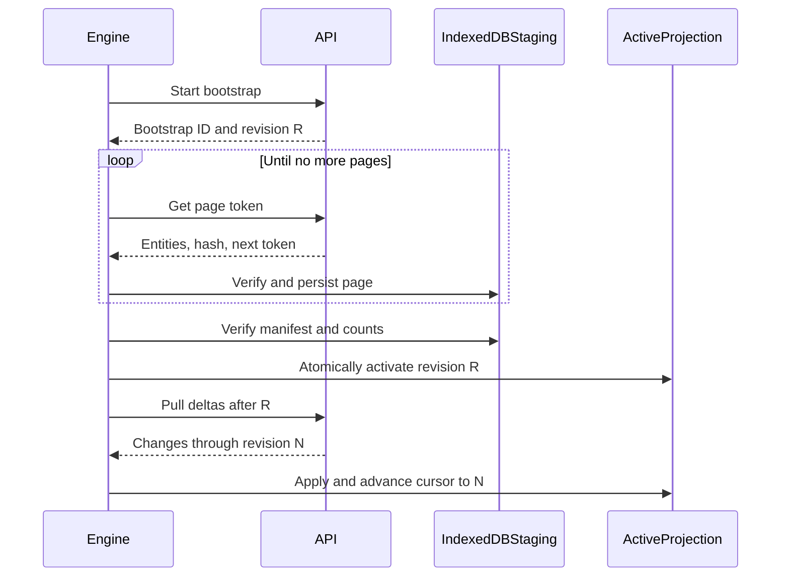
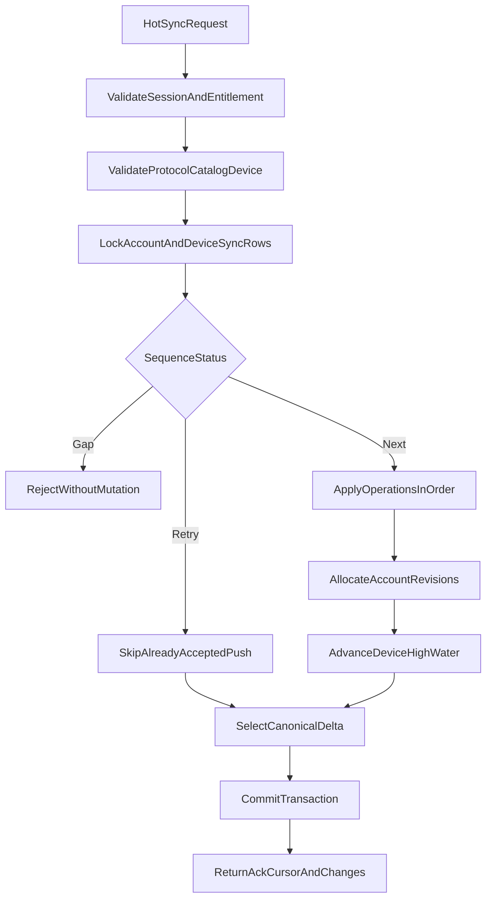
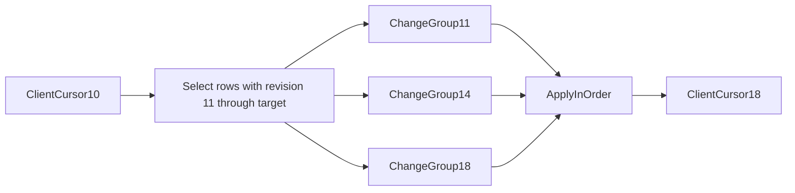
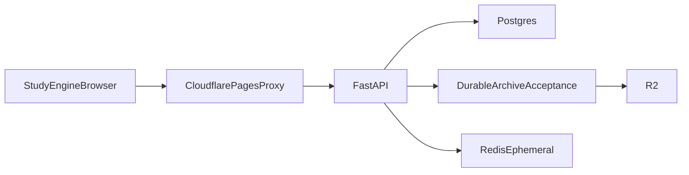

# Sync and Backend

This document owns the HTTP protocol, bootstrap and delta algorithms,
idempotency, Postgres hot-state model, retry behavior, and backend service
boundaries.

## Protocol goals

- One request/response protocol converges every hot domain.
- Client retries are safe after timeouts and unknown responses.
- No permanent hot event table is required to pull deltas.
- New devices can bootstrap large accounts without one unbounded response.
- Raw archive delivery cannot block hot synchronization.
- Entitlement, protocol, catalog, and device failures preserve local outboxes.
- The backend is canonical after it processes a hot operation.

## Same-origin transport

The browser normally calls the Kanji Heatmap origin:

```text
https://frontend.example/api/...
```

A Cloudflare Pages Function proxies to the private FastAPI origin. The browser
uses a Secure HttpOnly cookie and `credentials: "include"`. The engine supports
an explicit compatible backend base URL, but the official backend allowlists
approved origins and application IDs.

Suggested endpoint surface:

```text
POST /api/auth/pin/request
POST /api/auth/pin/verify
POST /api/auth/logout
GET  /api/auth/session

POST /api/sync/bootstrap
GET  /api/sync/bootstrap/page
POST /api/sync

POST /api/events/batch
```

Versioning may appear in the URL or an explicit media type. Every body still
contains a protocol version so cached proxies and incorrect routes cannot hide
a mismatch.

## Session response and policy

`GET /api/auth/session` and successful PIN verification return:

```json
{
  "protocol": { "major": 1, "minor": 0 },
  "serverTime": 1784995200000,
  "account": {
    "accountId": "acct_...",
    "state": "active"
  },
  "entitlementLease": "<signed-compact-value>",
  "catalog": {
    "version": "kanji-review-v1",
    "sha256": "..."
  },
  "scheduler": {
    "schemaVersion": 1,
    "algorithm": "fsrs",
    "algorithmVersion": "..."
  },
  "policy": {
    "policyVersion": "2026-07",
    "noteMaxUtf8Bytes": 10000,
    "hotSyncMaxOperations": 250,
    "hotSyncMaxBytes": 524288,
    "bootstrapPageMaxBytes": 524288,
    "archiveBatchMaxEvents": 500,
    "archiveBatchMaxBytes": 1048576,
    "reviewRingSize": 8,
    "registeredDeviceLimit": 12,
    "operationalArchiveRetentionDays": 365
  }
}
```

Numbers are examples, not decisions. The backend publishes policy values
within bounds supported by the engine release.

The response must not tell a signed-out caller which retained local account
database to open. Account identity comes only from a valid session or a valid
cached lease for the already active local account.

## Device registration

A successful first bootstrap registers:

```ts
interface RegisteredDevice {
  deviceId: DeviceId; // random, opaque
  deviceSlot: DeviceSlot; // small integer, unique within account
  acceptedHotSequence: number;
  acceptedArchiveSequence: number;
  lastSeenAt: UnixMs;
}
```

Device slots are backend-assigned, never client-selected, and not automatically
reused. The backend publishes a cap. Reaching it returns
`device_limit_reached`; manual/support retirement is the version-one recovery
path.

This avoids automatically retiring a browser that may still hold unsynced
offline work. A retired device ID is permanently rejected. A later design may
migrate only its unsynced deltas to a fresh device slot, but that is not a
version-one behavior.

## Paged bootstrap

Bootstrap is required when:

- the account has no local cache;
- the user explicitly removed the cache;
- the browser evicted it;
- the backend requires a full reset after an explicitly supported protocol
  migration.

Writes remain blocked until activation.

### Start or resume

Proposed request:

```json
{
  "protocol": { "major": 1, "minor": 0 },
  "engineVersion": "1.0.0",
  "applicationId": "kanji-heatmap",
  "catalogVersion": "kanji-review-v1",
  "catalogSha256": "...",
  "resumeBootstrapId": null
}
```

Proposed response:

```json
{
  "bootstrapId": "boot_...",
  "snapshotRevision": 4812,
  "device": {
    "deviceId": "dev_...",
    "deviceSlot": 3,
    "acceptedHotSequence": 0,
    "acceptedArchiveSequence": 0
  },
  "page": {
    "pageToken": "opaque",
    "pageNumber": 0,
    "hasMore": true
  },
  "manifest": {
    "schemaVersion": 1,
    "domains": [
      "notes",
      "note_conflicts",
      "bookmarks",
      "review_pile_items",
      "review_cards",
      "review_settings",
      "daily_summaries",
      "challenge_summaries"
    ]
  }
}
```

Each page contains whole typed entities, a page hash, uncompressed byte count,
and the next opaque token. A token is bound to account, bootstrap ID, snapshot
revision, and expiry.



### Snapshot consistency without a long transaction

The start response captures account revision `R`.

Pages select current rows whose `server_revision <= R`. If a row changes after
`R` before its page is read, its current revision is now greater than `R`, so
the page may omit it. The post-activation delta after `R` returns its newest
state. If it was deleted, the delta returns its tombstone.

This yields a convergent snapshot without holding one Postgres transaction
open across multiple HTTP requests.

The bootstrap API must not split one entity across pages. It may split domains
and may return large revision groups as one bounded exception.

## Unified hot-sync request

One envelope pushes a contiguous operation batch and pulls canonical changes:

```ts
interface HotSyncRequest {
  protocol: { major: number; minor: number };
  engineVersion: string;
  catalogVersion: string;
  catalogSha256: string;
  device: {
    deviceId: DeviceId;
    deviceSlot: DeviceSlot;
  };
  cursor: ServerCursor;
  push: {
    firstSequence: number;
    lastSequence: number;
    operations: readonly HotOperation[];
  } | null;
  pull: {
    maxChangeGroups: number;
    maxBytes: number;
  };
}
```

The operation union is versioned and typed:

```ts
type HotOperation =
  | NotePutOperation
  | NoteRemoveOperation
  | BookmarkSetOperation
  | BookmarkRemoveOperation
  | ReviewSettingsUpdateOperation
  | ReviewPileAddOperation
  | ReviewPileRemoveOperation
  | ReviewGradeOperation
  | DailySummaryPutOperation
  | ChallengeSummaryPutOperation;

interface HotOperationBase {
  schemaVersion: 1;
  operationId: string;
  deviceSequence: number;
  occurredAt: UnixMs;
}
```

The request batch must:

- be ordered by `deviceSequence`;
- start at `acceptedHotSequence + 1`, unless it is a retry wholly at or below
  the accepted high-water mark;
- contain no gap;
- stay within published count and byte limits;
- use the authenticated device ID and slot.

No generic patch operation is accepted. Every operation has domain-specific
validation and reduction.

## Unified hot-sync response

```ts
interface HotSyncResponse {
  protocol: { major: number; minor: number };
  serverTime: UnixMs;
  acceptedThroughSequence: number;
  cursor: ServerCursor;
  targetRevision: number;
  hasMoreChanges: boolean;
  changeGroups: readonly ServerChangeGroup[];
  entitlementLease?: string;
  policy?: PublishedPolicy;
  warnings: readonly SyncWarning[];
}

interface ServerChangeGroup {
  accountRevision: number;
  changes: readonly ServerEntityChange[];
}
```

Entity changes contain complete canonical current rows, not JSON Patch:

```ts
type ServerEntityChange =
  | { type: "note"; value: CanonicalNote }
  | { type: "note_conflict"; value: CanonicalNoteConflict | Tombstone }
  | { type: "bookmark"; value: CanonicalBookmark | Tombstone }
  | { type: "review_pile_item"; value: CanonicalReviewPileItem | Tombstone }
  | { type: "review_card"; value: CanonicalReviewCard | Tombstone }
  | { type: "review_settings"; value: CanonicalReviewSettings }
  | { type: "daily_summary"; value: CanonicalDeviceDailySummary }
  | { type: "challenge_summary"; value: CanonicalChallengeSummary };
```

The engine stages one response, applies every group transactionally in
revision order, removes acknowledged outbox rows, and then advances the local
cursor. A crash before commit safely retries.

## Server operation transaction



Within one Postgres transaction:

1. Validate the HttpOnly session, active account, entitlement, protocol,
   catalog, scheduler, application, and device.
2. Lock the account revision row and device sync-state row.
3. Classify the push as new, exact retry, old retry, or invalid gap.
4. Apply new operations in sequence.
5. Allocate a new account revision for each logical operation that changes
   canonical state. All rows changed by that operation share its revision.
6. Advance `accepted_hot_sequence` only after every operation succeeds.
7. Select pull changes after the request cursor up to a fixed target revision.
8. Commit and return.

The batch is atomic. Engine-generated validation should prevent one malformed
operation from poisoning an outbox. If the backend nevertheless rejects a
valid-looking operation as a permanent schema error, the engine locks sync and
surfaces diagnostics; it must not silently skip it and create a sequence gap.

## Account revision cursor

Postgres keeps one monotonic account revision counter. Every canonical hot row
stores its latest `server_revision`.

An opaque cursor encodes the last completely applied account revision.



No permanent change log is needed:

- If one row changed at revisions 11 and 18, returning only its revision-18
  current state is sufficient.
- A deletion remains as a tombstone until safe garbage collection.
- Pull pagination never splits a change group. The cursor advances only through
  the final complete group in the response.
- The server captures `targetRevision` before selecting. A row updated after
  that target appears on the next pull.

### Tombstone collection

A tombstone may be hard-deleted only when:

- every non-retired registered device has acknowledged a cursor later than its
  revision;
- no active bootstrap references an earlier snapshot;
- no domain retention rule requires it;
- operational archive obligations are satisfied.

Because devices are not automatically retired, a long-offline device may keep
tombstones alive. Bounded domain keys and the registered-device policy keep
this manageable. Review pile generations need special monitoring because a
single kanji can be removed and re-added repeatedly.

## Domain processing

### Notes

- Compare `baseServerRevision` with the canonical note.
- A direct descendant becomes canonical.
- Divergent edits use deterministic LWW.
- Preserve the loser in the hot conflict slot.
- Before replacing an occupied hot conflict, durably archive the displaced
  content according to operational policy.

### Bookmarks

- Key by kanji.
- Store the representative word surface.
- Apply deterministic LWW to set/remove operations.
- Keep tombstones for delta correctness.

### Review settings

- Validate against the versioned scheduler schema and narrower backend policy.
- Resolve divergence by deterministic LWW.
- Create a new settings version; never mutate an old referenced version.
- Apply forward only.

### Review pile and grades

- Add creates one pile generation and exactly two cards.
- Remove creates generation/card tombstones and wins over concurrent grades.
- Grade operations are immutable facts.
- Replay exactly when the card ring contains a complete common base.
- Otherwise use the immediate deterministic LWW fallback.
- Return backend-canonical cards and affected summaries.

See [Reviews and FSRS](./REVIEWS-AND-FSRS.md).

### Daily summaries

- Verify the request device owns `deviceSlot`.
- Upsert `(account_id, local_date, device_slot)` only when
  `deviceRevision` increases.
- Reject counter regression and malformed dates.
- Do not merge another device's counters into this row.
- Account aggregate responses sum component rows.

### Challenge summaries

- Upsert `(account_id, activity_type, challenge_id, device_slot)`.
- Accept only a newer device revision.
- Validate that the component equals a possible reduction of locally accepted
  typed values where practical.
- Account aggregate responses apply documented comparators.

## Postgres hot schema

The exact SQL belongs in backend implementation. The logical tables are:

### Identity and protocol

```text
users
auth_sessions
entitlements
account_revision_state
devices
device_sync_state
```

`device_sync_state` stores accepted hot/archive sequences, latest acknowledged
cursor, timestamps, and retirement state.

### Study data

```text
notes
note_conflicts
bookmarks
review_pile_items
review_cards
review_settings
review_settings_versions
daily_summaries
challenge_summaries
```

Common columns:

```text
account_id
server_revision
created_at
updated_at
tombstone or deleted_at where applicable
```

Important keys:

```text
notes:                  (account_id, kanji)
note_conflicts:         (account_id, kanji)
bookmarks:              (account_id, kanji)
review_pile_items:      (account_id, pile_item_id), unique active kanji
review_cards:           (account_id, card_id), unique pile generation + type
review_settings:        (account_id)
review_settings_versions:(account_id, settings_version)
daily_summaries:        (account_id, local_date, device_slot)
challenge_summaries:    (account_id, activity_type, challenge_id, device_slot)
```

Indexes must support:

- due cards by account, card type, due instant, and active state;
- all rows with `server_revision > cursor` across each hot table;
- daily date ranges;
- challenge batches;
- settings versions referenced by current rings.

The backend should query each table's revision index and merge sorted results.
Do not build a polymorphic permanent change-log table merely to implement the
cursor.

## No full hot event table

Review facts arrive through hot sync and raw review events also travel through
the independent archive outbox. Practice summaries arrive through hot sync and
raw practice events travel through the archive outbox.

Postgres may use short-lived infrastructure records such as a transactional
delivery outbox if required for a durable queue. Such rows are bounded,
monitored, and deleted after delivery; they are not the account's permanent
review history.

## Raw event endpoint

Archive ingestion is independent:

```ts
interface EventBatchRequest {
  protocol: { major: number; minor: number };
  deviceId: DeviceId;
  firstArchiveSequence: number;
  lastArchiveSequence: number;
  events: readonly OperationalArchiveEvent[];
}

interface EventBatchResponse {
  acceptedThroughArchiveSequence: number;
  acceptedEventIds: readonly string[];
  serverTime: UnixMs;
}
```

The backend acknowledges only after a durable queue or R2 accepts every newly
acknowledged event. Redis-only buffering is not sufficient. Stable event IDs
deduplicate retries.

The archive endpoint and hot sync have independent sequence spaces. A review
event may be hot-accepted before it is archive-accepted or vice versa; both
paths converge independently.

Detailed object layout and research transformation are in
[Archives and privacy](./ARCHIVES-AND-PRIVACY.md).

## Sync triggers

The engine schedules hot sync on:

- successful startup with an active account;
- regained connectivity;
- page visibility after meaningful inactivity;
- end of a review session;
- debounced active study;
- settings change;
- outbox byte/count threshold;
- explicit `sync.now()`.

Archive upload uses similar connectivity and threshold triggers.

Do not sync after every grade. The local outbox exists to batch.

`navigator.onLine` is only a hint. A failed request drives actual offline and
backoff status.

## Retry and backoff

Retryable failures use capped exponential backoff with jitter. A successful
request resets the relevant hot or archive backoff independently.

Rules:

- Reuse exactly the same sequence IDs and event IDs on retry.
- A timeout after send is an unknown outcome; retry, do not manufacture new
  operations.
- Respect `Retry-After` for rate limits and service protection.
- A `413` shrinks future batches without dropping the current first operation.
- A `401` locks account data and moves to signed-out state.
- A `402` moves to entitlement read-only and preserves outboxes.
- Protocol/catalog incompatibility moves to read-only.
- Permanent payload rejection locks sync with a diagnostic.
- `5xx`, timeout, and network errors preserve writable offline behavior while
  the signed lease remains valid.

## Mid-review pull safety

A sync response may contain a card currently protected by an active local
review handle. The engine:

1. Stores the server change in a staged inbox.
2. Does not replace the frozen active-review snapshot.
3. Accepts the local grade as another immutable fact.
4. Releases the handle after local grade/cancel.
5. Applies/reconciles the staged server card and queues/sends the local fact.
6. Accepts the later backend-canonical state.

Other entities in the response may apply immediately.

## Redis responsibilities

Redis is permitted for:

- PIN challenge values and attempt counters.
- Request rate limits.
- Short-lived cache entries.
- Ephemeral coordination or delivery acceleration when loss is recoverable
  from a durable source.

Redis is not authoritative for:

- user notes/bookmarks/settings;
- card state or summaries;
- sync sequence acknowledgement;
- operational archive durability;
- entitlement ownership.

## R2 responsibilities

R2 stores:

- account-associated operational event objects under retention policy;
- displaced note conflict copies;
- separately transformed research objects;
- optional export bundles.

R2 is not queried by the hot review merge path. The selected incomplete-history
fallback is immediate LWW, not cold replay.

## Security and validation

The backend must:

- bind every account query to the authenticated session;
- ignore any account ID supplied in a client payload;
- verify device ID/slot ownership;
- check Origin/CSRF policy for cookie-authenticated mutations;
- validate body size before decoding large payloads;
- validate every discriminated union and reject unknown schema majors;
- clamp implausible future occurrence times and preserve the raw reported time
  only where policy permits;
- compare IDs and sequences in constant behavior where practical;
- redact notes, PINs, cookies, leases, and event payloads from logs;
- use parameterized SQL and transaction timeouts;
- rate-limit authentication, bootstrap, sync, and archive endpoints separately.

## Observability

Record metrics without note content or direct event payloads:

- bootstrap starts, resumptions, bytes, pages, duration, and failure reason;
- hot batch count/bytes/latency and operations by kind;
- duplicate retry and sequence-gap counts;
- delta sizes and cursor lag;
- review replay versus LWW fallback rates;
- note conflict rates;
- archive backlog age, durable-ingest latency, and dedupe rate;
- entitlement/read-only transitions;
- device-limit and tombstone counts;
- Postgres transaction retries/deadlocks.

Correlate a request with a random diagnostic/request ID, not an email address.

## Backend deployment boundary

FastAPI owns authentication, entitlement, validation, transactions, merge
rules, and archive ingestion. Postgres owns current account state. R2 owns cold
objects. Redis owns explicitly ephemeral functions.



The proxy must stream or forward bounded bodies without caching authenticated
responses. StudyEngine API responses must not be captured by the PWA runtime
cache.
