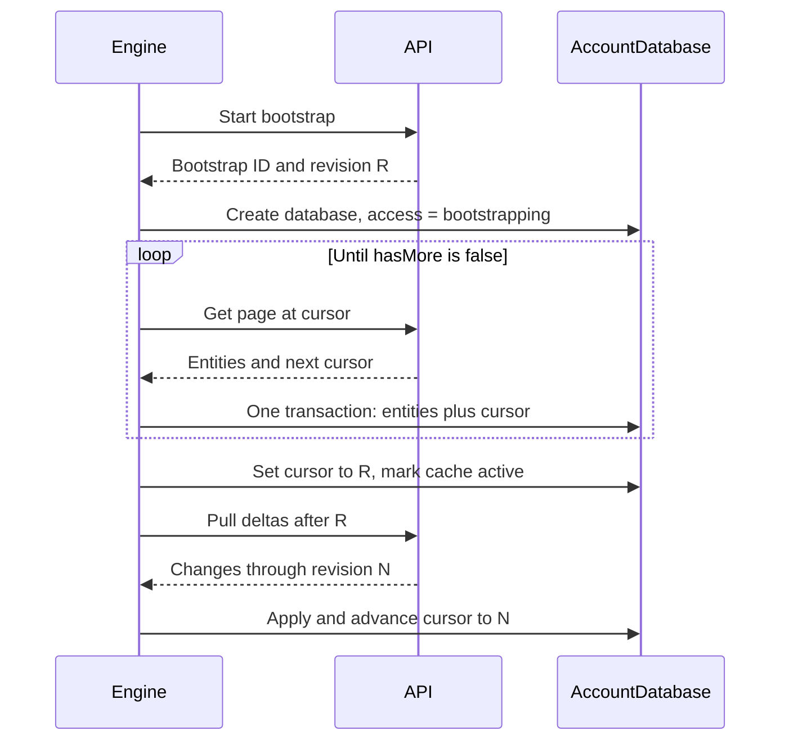
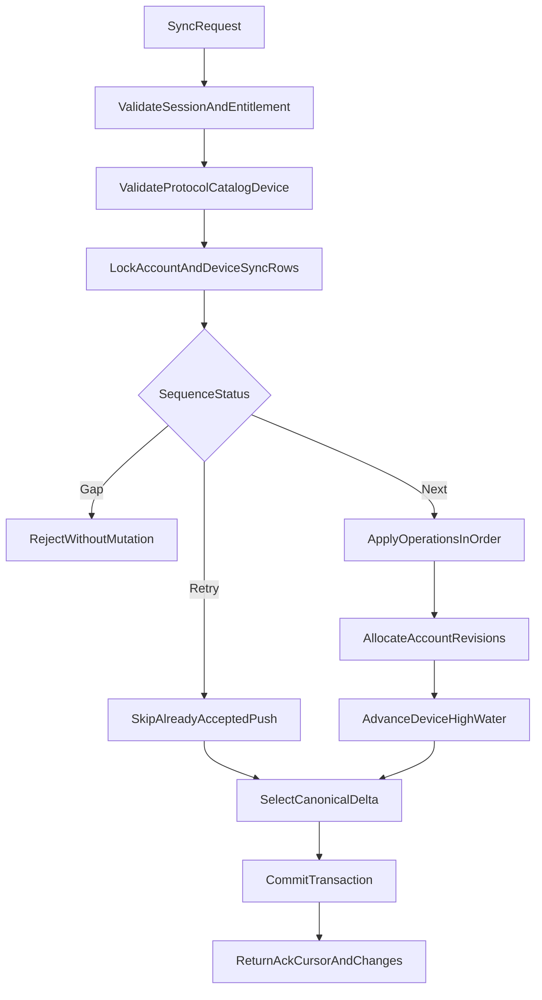
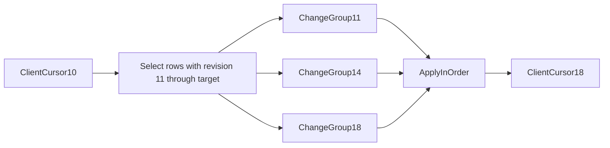
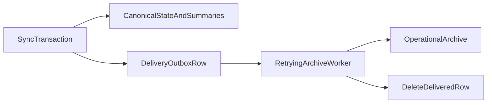
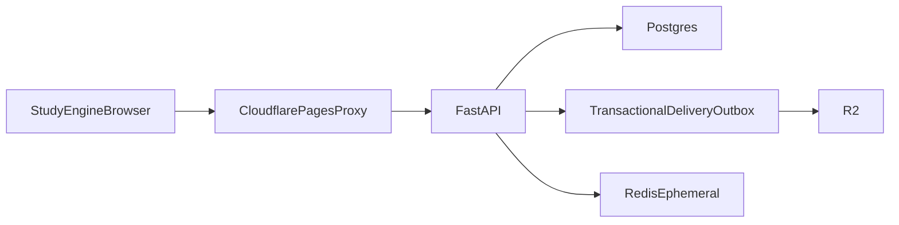

# Sync and Backend

This document owns the HTTP protocol, bootstrap and delta algorithms,
idempotency, Postgres hot-state model, retry behavior, and backend service
boundaries.

## Protocol goals

- One request/response protocol converges every hot domain.
- Client retries are safe after timeouts and unknown responses.
- No permanent hot event table is required to pull deltas.
- No tombstone is required to propagate a deletion.
- New devices can bootstrap large accounts without one unbounded response.
- Raw archive delivery is a backend concern and cannot block a client.
- Entitlement, protocol, catalog, and device failures preserve the local outbox.
- The backend is canonical after it processes an operation.

## Same-origin transport

The browser normally calls the Kanji Heatmap origin:

```text
https://frontend.example/api/...
```

A Cloudflare Pages Function proxies to the private FastAPI origin. The browser
uses a Secure HttpOnly cookie and `credentials: "include"`. The engine supports
an explicit compatible backend base URL, but the official backend allowlists
approved origins and application IDs.

Suggested endpoint surface:

```text
POST /api/auth/pin/request
POST /api/auth/pin/verify
POST /api/auth/logout
GET  /api/auth/session

POST /api/sync/bootstrap
GET  /api/sync/bootstrap/page
POST /api/sync
```

There is no client-facing event endpoint. Raw events arrive as ordinary
operations inside `POST /api/sync` and the backend fans them out to the
archive on its own side.

Versioning may appear in the URL or an explicit media type. Every body still
contains a protocol version so cached proxies and incorrect routes cannot hide
a mismatch.

## Session response and policy

`GET /api/auth/session` and successful PIN verification return:

```json
{
  "protocol": { "major": 1, "minor": 0 },
  "serverTime": 1784995200000,
  "account": {
    "accountId": "acct_...",
    "state": "active"
  },
  "entitlementLease": "<signed-compact-value>",
  "catalog": {
    "version": "kanji-review-v1",
    "sha256": "..."
  },
  "scheduler": {
    "schemaVersion": 1,
    "algorithm": "fsrs",
    "algorithmVersion": "..."
  },
  "policy": {
    "policyVersion": "2026-07",
    "noteMaxUtf8Bytes": 10000,
    "noteMergedMaxUtf8Bytes": 20000,
    "syncMaxOperations": 250,
    "syncMaxBytes": 524288,
    "bootstrapPageMaxBytes": 262144,
    "reviewRingSize": 8,
    "openReviewEntitlementMarginMs": 120000,
    "rawPracticeEventRetentionDays": 365,
    "rawReviewEventRetentionDays": null
  }
}
```

Numbers are examples, not decisions. The backend publishes policy values
within bounds supported by the engine release.

`rawReviewEventRetentionDays` is `null`, meaning retained for the account
lifetime. Raw review events are the only corpus from which per-user FSRS
weights could later be fitted; the research dataset is anonymized and cannot
serve that purpose. Storage cost is not the constraint at this volume, so the
decision is a disclosure decision rather than an engineering one. Account
deletion becomes the only path by which review history leaves the system.

The response must not tell a signed-out caller which retained local account
database to open. Account identity comes only from a valid session or a valid
cached lease for the already active local account.

## Device registration

A successful first bootstrap registers:

```ts
interface RegisteredDevice {
  deviceId: DeviceId; // random, opaque
  acceptedSequence: number;
  lastSeenAt: UnixMs;
}
```

There is no device slot. Slots existed to partition summary and counter
components so two devices could not conflict on a shared number. With the
backend deriving those values from facts, nothing needs partitioning, and slot
allocation, slot caps, and slot reuse policy are all removed.

There is also **no device cap and no device retirement**. Registration exists
only to hold per-device sequence state: a `deviceId`, its accepted sequence
high-water mark, and a last-seen timestamp. A stale registration from a browser
that was reset costs one small row.

The earlier design capped registered devices and offered manual retirement,
because a long-offline device blocked tombstone collection account-wide — its
unacknowledged cursor kept every tombstone alive. Device policy and storage
growth were entangled, which is why the risk register listed "device-slot and
tombstone growth" as a principal risk and why retirement had to be manual to
avoid discarding a browser holding unsynced work.

Soft deletion on bounded natural keys severed that entanglement. Nothing is
waiting on any device's cursor, so an abandoned registration has no downstream
cost. Removed with the cap: `device_limit_reached`, `device_retired`, the
`setup_blocked` access state, the `SetupBlocked` lifecycle branch, the
`registeredDeviceLimit` policy value, and the manual retirement recovery path.

Abuse control remains a backend concern, handled where other abuse is handled:
registration is rate-limited per account, and an implausible registration rate
is an alerting signal, not a hard product wall that locks a paying user out of
their own account until support intervenes.

## Paged bootstrap

Bootstrap is required when:

- the account has no local cache;
- the user explicitly removed the cache;
- the browser evicted it;
- the backend requires a full reset after an explicitly supported protocol
  migration.

Writes remain blocked until activation.

### Start or resume

Proposed request:

```json
{
  "protocol": { "major": 1, "minor": 0 },
  "engineVersion": "1.0.0",
  "applicationId": "kanji-heatmap",
  "catalogVersion": "kanji-review-v1",
  "catalogSha256": "...",
  "resumeBootstrapId": null
}
```

Proposed response:

```json
{
  "bootstrapId": "boot_...",
  "snapshotRevision": 4812,
  "device": {
    "deviceId": "dev_...",
    "acceptedSequence": 0
  },
  "page": {
    "cursor": "opaque",
    "pageNumber": 0,
    "hasMore": true
  }
}
```

Each page contains whole typed entities and the next opaque cursor. A cursor is
bound to account, bootstrap ID, snapshot revision, and expiry.

The cursor is keyset, not offset: a fixed domain order with primary key order
inside each domain, encoded opaquely. Pages are bounded by
`bootstrapPageMaxBytes` rather than an entity count, because a long note and a
bookmark differ in size by two orders of magnitude. One entity is never split
across pages.

Pages are written directly into the client's live tables while its access state
is `bootstrapping`, so no staging table, per-page hash, or domain manifest is
required. See [Local data and domains](./LOCAL-DATA-AND-DOMAINS.md).

A client must treat `hasMore` as mandatory. A client that cannot consume a
response it does not fully understand must fail loudly rather than activate a
partial account as though it were complete. This is the single forward
compatibility rule that matters here, and it is the reason paging is defined in
version one rather than added later.



### Snapshot consistency without a long transaction

The start response captures account revision `R`.

Pages select current rows whose `server_revision <= R`. If a row changes after
`R` before its page is read, its current revision is now greater than `R`, so
the page may omit it. The post-activation delta after `R` returns its newest
state. If it was deactivated, the delta returns the row with `active` false.

This yields a convergent snapshot without holding one Postgres transaction
open across multiple HTTP requests. Because deletion is a revision-bumping
update rather than a row removal, a row deactivated after `R` is delivered by
the same delta mechanism as any other change.

The bootstrap API must not split one entity across pages. It may split domains
and may return large revision groups as one bounded exception.

Inactive rows may be omitted from bootstrap pages. A new device does not need
to know which kanji the account once bookmarked and later removed; absent means
inactive. Deltas must still carry deactivations, because a device that already
holds the active row needs to learn it was deactivated.

## Unified sync request

One envelope pushes a contiguous operation batch and pulls canonical changes:

```ts
interface SyncRequest {
  protocol: { major: number; minor: number };
  engineVersion: string;
  catalogVersion: string;
  catalogSha256: string;
  device: {
    deviceId: DeviceId;
  };
  cursor: ServerCursor;
  push: {
    firstSequence: number;
    lastSequence: number;
    operations: readonly SyncOperation[];
  } | null;
  pull: {
    maxChangeGroups: number;
    maxBytes: number;
  };
}
```

The operation union is versioned and typed:

```ts
type SyncOperation =
  // State intents, resolved by deterministic LWW or note merge
  | NotePutOperation
  | NoteRemoveOperation
  | BookmarkAddOperation
  | BookmarkRemoveOperation
  | ReviewSettingsUpdateOperation
  | ReviewPileAddOperation
  | ReviewPileRemoveOperation
  // Immutable facts, from which the backend derives state
  | ReviewGradeOperation
  | PracticeActivityEventAddOperation;

interface SyncOperationBase {
  schemaVersion: 1;
  operationId: string;
  deviceSequence: number;
  occurredAt: UnixMs;
}
```

`DailySummaryPutOperation` and `ChallengeSummaryPutOperation` no longer exist.
A device never sends a summary or a canonical card state.

The request batch must:

- be ordered by `deviceSequence`;
- start at `acceptedHotSequence + 1`, unless it is a retry wholly at or below
  the accepted high-water mark;
- contain no gap;
- stay within published count and byte limits;
- use the authenticated device ID and slot.

No generic patch operation is accepted. Every operation has domain-specific
validation and reduction.

## Unified sync response

```ts
interface SyncResponse {
  protocol: { major: number; minor: number };
  serverTime: UnixMs;
  acceptedThroughSequence: number;
  cursor: ServerCursor;
  targetRevision: number;
  hasMoreChanges: boolean;
  changeGroups: readonly ServerChangeGroup[];
  entitlementLease?: string;
  policy?: PublishedPolicy;
  warnings: readonly SyncWarning[];
}

interface ServerChangeGroup {
  accountRevision: number;
  changes: readonly ServerEntityChange[];
}
```

Entity changes contain complete canonical current rows, not JSON Patch:

```ts
type ServerEntityChange =
  | { type: "note"; value: CanonicalNote }
  | { type: "bookmark"; value: CanonicalBookmark }
  | { type: "review_pile_item"; value: CanonicalReviewPileItem }
  | { type: "review_card"; value: CanonicalReviewCard }
  | { type: "review_settings"; value: CanonicalReviewSettings }
  | { type: "daily_summary"; value: CanonicalDailySummary }
  | { type: "challenge_summary"; value: CanonicalChallengeSummary };
```

There is no `Tombstone` variant. Every canonical row carries an `active`
boolean, and a deletion is an ordinary revision-bumping update that sets it
false. A deactivated row is a complete row like any other.

The engine holds one response in memory, applies every group transactionally in
revision order, removes acknowledged outbox rows, and advances the local cursor
in the same transaction. A crash before commit safely retries from the
unchanged cursor. A staging table is not required: the response is already
bounded by `syncMaxBytes`, so nothing is gained by persisting it before
applying it.

## Server operation transaction



Within one Postgres transaction:

1. Validate the HttpOnly session, active account, entitlement, protocol,
   catalog, scheduler, application, and device.
2. Lock the account revision row and device sync-state row.
3. Classify the push as new, exact retry, old retry, or invalid gap.
4. Apply new operations in sequence. For a fact, this means updating canonical
   card state, incrementing the derived daily and challenge summaries, and
   enqueueing the raw event on the transactional delivery outbox.
5. Allocate a new account revision for each logical operation that changes
   canonical state. All rows changed by that operation share its revision.
6. Advance `accepted_sequence` only after every operation succeeds.
7. Select pull changes after the request cursor up to a fixed target revision.
8. Commit and return.

### Derived summaries are exactly-once by construction

Step 6 is what makes step 4's increments safe. An operation at or below
`accepted_sequence` is skipped in step 3, and the high-water advance commits
atomically with the increments it authorized. A separate deduplication table is
not required on the sync path.

This is the property that makes incremental derivation viable at all. Without
it, `reviews = reviews + 1` would be unsafe under retry and the design would
be forced back to absolute device-owned snapshots.

Summaries must be incremented into durable tables at ingest. They must never be
defined as a query over the archive, because summaries persist for the account
lifetime while other archive classes expire.

The batch is atomic. Engine-generated validation should prevent one malformed
operation from poisoning an outbox. If the backend nevertheless rejects a
valid-looking operation as a permanent schema error, the engine locks sync and
surfaces diagnostics; it must not silently skip it and create a sequence gap.

## Account revision cursor

Postgres keeps one monotonic account revision counter. Every canonical hot row
stores its latest `server_revision`.

An opaque cursor encodes the last completely applied account revision.



No permanent change log is needed:

- If one row changed at revisions 11 and 18, returning only its revision-18
  current state is sufficient.
- A deletion is a revision-bumping update that sets `active` false, so it is
  selected by the same query as any other change.
- Pull pagination never splits a change group. The cursor advances only through
  the final complete group in the response.
- The server captures `targetRevision` before selecting. A row updated after
  that target appears on the next pull.

### No tombstones, and therefore no tombstone collection

A tombstone is only necessary when a row is physically removed, because a
removed row cannot be selected by `server_revision > cursor` and an offline
device would never learn of the deletion.

Every hot entity in this design is keyed by a bounded natural key, so no row
ever needs to be physically removed for a domain reason:

```text
notes                (account_id, kanji)
bookmarks            (account_id, kanji)
review_pile_items    (account_id, kanji)                 + generation column
review_cards         (account_id, kanji, card_type)      + generation column
daily_summaries      (account_id, local_date)
challenge_summaries  (account_id, activity_type, challenge_id)
```

Deletion sets `active = false` and bumps the revision. Deltas carry it like any
other update. This removes, in full:

- the `Tombstone` variant of every entity change;
- the tombstone garbage collection job;
- the requirement to track every device's acknowledged cursor before reclaiming
  a row;
- the coupling between device retirement policy and storage growth;
- the unbounded growth of review pile generations, which the previous design
  flagged as needing "special monitoring" because a kanji can be removed and
  re-added repeatedly.

A pile item is one row per kanji whose `generation` column increments on
re-add, not one row per generation. Stale-write protection is preserved,
because it derives from the generation value carried on an operation rather
than from row identity.

The cost is that rows are never reclaimed. Bounded by the kanji set, an account
that bookmarked and un-bookmarked every kanji it ever saw retains a few
thousand small rows. Deactivated card rows null their `state` and
`history_window` columns so an inactive card costs tens of bytes.

## Domain processing

### Notes

- Compare `baseServerRevision` with the canonical note.
- A direct descendant becomes canonical outright.
- Divergent edits **merge**: the canonical content becomes both texts joined by
  a rule and an HTML comment marker, ordered by the deterministic tuple
  `(clampedUpdatedAt, deviceId, deviceSequence)` so every runtime produces
  byte-identical output. Set `has_merged_edit`.
- Validate a `note_put` against
  `min(max(noteMaxUtf8Bytes, currentCanonicalBytes), noteMergedMaxUtf8Bytes)`,
  so a user can always save a merged note that the system made oversized, but
  can never grow it.
- Size `noteMergedMaxUtf8Bytes` at no less than
  `2 * noteMaxUtf8Bytes + separator`, which makes a first merge provably
  unable to overflow.
- Only a chained merge can reach the ceiling. When it does, keep the winner in
  full, append the loser truncated at a UTF-8 scalar boundary with a visible
  marker, archive the loser's full text, and return a `note_merge_truncated`
  warning.
- An edit beats a concurrent delete. The note stays active with the edited
  content, because reviving text is recoverable and losing it is not.
- The next accepted `note_put` for that kanji clears `has_merged_edit`.

No conflict table, no displaced-copy archival inside the sync transaction, and
no restore or dismiss endpoint. See
[Local data and domains](./LOCAL-DATA-AND-DOMAINS.md).

### Bookmarks

- Key by kanji. Store no word.
- Apply deterministic LWW to add/remove operations.
- Removal sets `active = false`; the row is retained for delta correctness.

### Review settings

- Validate against the versioned scheduler schema and narrower backend policy.
- Resolve divergence by deterministic LWW on
  `(origin, clampedUpdatedAt, deviceId, deviceSequence)`, where `origin` sorts
  a server-authored write after any device-authored write.
- Store one current settings row with a monotonic `settings_revision`. There is
  no historical settings version table: replay applies the winning current
  settings across its short window, so older versions have no reader.
- Apply forward only.

### Review pile and grades

- Add creates one pile generation and exactly two cards, and records the
  representative `word` the cards test.
- Add for a kanji whose active item already carries the same word is
  idempotent. Add with a different word is rejected `pile_item_exists`.
- Two devices adding the same kanji offline with different words: the first
  accepted wins, the second returns a `pile_item_exists` warning, and the
  losing device reconciles to the canonical word.
- Remove deactivates the item and both cards and wins over concurrent grades.
- Grade operations are immutable facts.
- Replay exactly when the card ring contains a complete common base.
- Otherwise use the immediate deterministic LWW fallback.
- A grade for a deactivated generation is acknowledged so its sequence can
  advance, does not resurrect card state, and **does** increment the daily
  summary, because the user performed the review.
- Return backend-canonical cards and affected summaries.

See [Reviews and FSRS](./REVIEWS-AND-FSRS.md).

### Daily summaries

Derived, never pushed.

- On each accepted fact, upsert `(account_id, local_date)` with the appropriate
  increment inside the ingest transaction.
- Widen `first_activity_at` and `last_activity_at`.
- Append to `time_zones_seen` if the value is new and the list is under bound.
- Reject malformed dates.
- Allocate an account revision so the updated summary reaches every device.

### Challenge summaries

Derived, never pushed.

- On each accepted practice fact, upsert
  `(account_id, activity_type, challenge_id)`.
- Increment `attempt_count`.
- Replace `latest` when the incoming occurrence is later; break equal times by
  stable `event_id`.
- Replace a best record when the incoming value is larger; keep the earlier
  achievement time on equal values, then stable `event_id`.
- Every rule above commutes, so a fact arriving a week late from a device that
  was offline produces the same row as one arriving on time.

## Postgres hot schema

The exact SQL belongs in backend implementation. The logical tables are:

### Identity and protocol

```text
users
auth_sessions
entitlements
account_revision_state
devices
device_sync_state
```

`device_sync_state` stores the accepted sequence high-water mark, latest
acknowledged cursor, timestamps, and retirement state. There is one sequence
space per device.

### Study data

```text
notes
bookmarks
review_pile_items
review_cards
review_settings
daily_summaries
challenge_summaries
```

Common columns:

```text
account_id
server_revision
active
created_at
updated_at
```

Important keys, all bounded natural keys:

```text
notes:                  (account_id, kanji)
bookmarks:              (account_id, kanji)
review_pile_items:      (account_id, kanji)                 + generation column
review_cards:           (account_id, kanji, card_type)      + generation column
review_settings:        (account_id)
daily_summaries:        (account_id, local_date)
challenge_summaries:    (account_id, activity_type, challenge_id)
```

Indexes must support:

- due cards by account, card type, due instant, and active state;
- all rows with `server_revision > cursor` across each hot table;
- daily date ranges;
- challenge batches.

The backend should query each table's revision index and merge sorted results.
Do not build a polymorphic permanent change-log table merely to implement the
cursor.

## No full hot event table

Facts arrive through sync, update canonical state and derived summaries, and
are then handed to the archive pipeline. Postgres retains no permanent
per-review row.

## Backend-side archive fan-out

There is no client-facing event endpoint and no second client sequence space.
Inside the same transaction that accepts a fact, the backend appends the raw
event to a **transactional delivery outbox** table. A retrying worker drains
that table into R2 and deletes delivered rows.



Properties:

- The client's obligation ends at the sync acknowledgement. An R2 outage is a
  server-side backlog the operator can see and alert on, not a degraded status
  the browser has to model, expose, and retry.
- Durability is guaranteed by the same transaction that accepted the fact, so
  an acknowledged fact can never be lost before it reaches the archive.
- Delivery outbox rows are bounded infrastructure, monitored by oldest
  undelivered age, and deleted after verified R2 persistence. They are not the
  account's permanent review history.
- Stable event IDs deduplicate at the sink.
- Redis may accelerate or batch this work but can never be the only copy.

Detailed object layout and research transformation are in
[Archives and privacy](./ARCHIVES-AND-PRIVACY.md).

## Sync triggers

The engine schedules sync on:

- successful startup with an active account;
- regained connectivity;
- page visibility after meaningful inactivity;
- end of a review session;
- debounced active study;
- settings change;
- outbox byte/count threshold;
- explicit `sync.now()`.

Do not sync after every grade. The local outbox exists to batch.

`navigator.onLine` is only a hint. A failed request drives actual offline and
backoff status.

## Retry and backoff

Retryable failures use capped exponential backoff with jitter. There is one
backoff, because there is one outbox and one endpoint.

Rules:

- Reuse exactly the same sequence IDs and event IDs on retry.
- A timeout after send is an unknown outcome; retry, do not manufacture new
  operations.
- Respect `Retry-After` for rate limits and service protection.
- A `413` shrinks future batches without dropping the current first operation.
- A `401` locks account data and moves to signed-out state.
- A `402` moves to entitlement read-only and preserves outboxes.
- Protocol/catalog incompatibility moves to read-only.
- Permanent payload rejection locks sync with a diagnostic.
- `5xx`, timeout, and network errors preserve writable offline behavior while
  the signed lease remains valid.

## Mid-review pull safety

A sync response may contain a card the user currently has open. This needs no
special handling and no staging table.

The review handle owns a **frozen in-memory snapshot** of the card and settings
as they were when the card was opened. The grade is computed from that
snapshot, and the resulting fact carries it as `priorState`. Nothing about
grading reads the live projection row.

The engine therefore applies every change in the response immediately,
including that card's row. The open card's displayed previews do not change,
because they came from the frozen snapshot rather than from the row. When the
user grades, the fact is based on `priorState`, the backend sees an incoming
branch from a base it recognizes, and replay reconciles the two.

This replaces a staged inbox, a deferred-apply step, and a handle-release
ordering constraint with one rule: **the handle is the snapshot, the projection
is free to move.**

## Redis responsibilities

Redis is permitted for:

- PIN challenge values and attempt counters.
- Request rate limits.
- Short-lived cache entries.
- Ephemeral coordination or delivery acceleration when loss is recoverable
  from a durable source.

Redis is not authoritative for:

- user notes/bookmarks/settings;
- card state or summaries;
- sync sequence acknowledgement;
- operational archive durability;
- entitlement ownership.

## R2 responsibilities

R2 stores:

- account-associated operational event objects under retention policy;
- note text truncated by a chained merge that reached the byte ceiling;
- separately transformed research objects;
- optional export bundles.

R2 is not queried by the hot review merge path. The selected incomplete-history
fallback is immediate LWW, not cold replay.

## Security and validation

The backend must:

- bind every account query to the authenticated session;
- ignore any account ID supplied in a client payload;
- verify device ID/slot ownership;
- check Origin/CSRF policy for cookie-authenticated mutations;
- validate body size before decoding large payloads;
- validate every discriminated union and reject unknown schema majors;
- clamp implausible future occurrence times and preserve the raw reported time
  only where policy permits;
- compare IDs and sequences in constant behavior where practical;
- redact notes, PINs, cookies, leases, and event payloads from logs;
- use parameterized SQL and transaction timeouts;
- rate-limit authentication, bootstrap, and sync endpoints separately.

## Observability

Record metrics without note content or direct event payloads:

- bootstrap starts, resumptions, bytes, pages, duration, and failure reason;
- sync batch count/bytes/latency and operations by kind;
- duplicate retry and sequence-gap counts;
- delta sizes and cursor lag;
- review replay versus LWW fallback rates;
- note merge rate and merge-truncation rate;
- pile add rejections by `pile_item_exists`;
- delivery outbox oldest undelivered age and R2 write failures;
- entitlement/read-only transitions;
- registered device count and inactive-row growth per account;
- `beginReview` refusals due to the entitlement margin;
- Postgres transaction retries/deadlocks.

Correlate a request with a random diagnostic/request ID, not an email address.

## Backend deployment boundary

FastAPI owns authentication, entitlement, validation, transactions, merge
rules, and archive ingestion. Postgres owns current account state. R2 owns cold
objects. Redis owns explicitly ephemeral functions.



The proxy must stream or forward bounded bodies without caching authenticated
responses. StudyEngine API responses must not be captured by the PWA runtime
cache.
