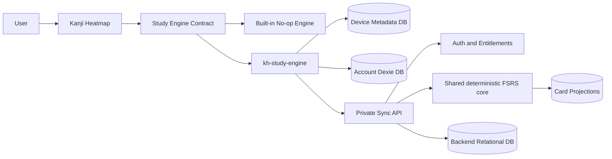
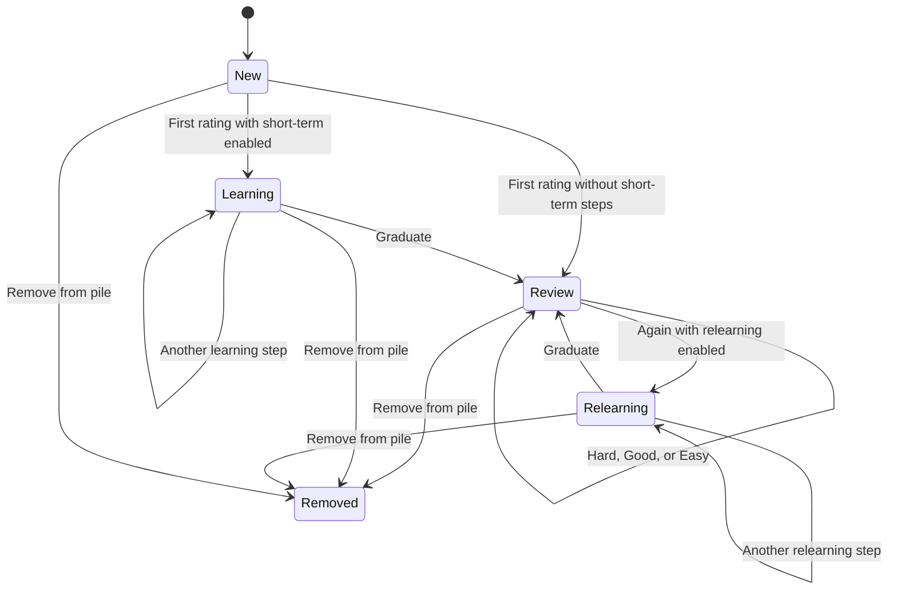
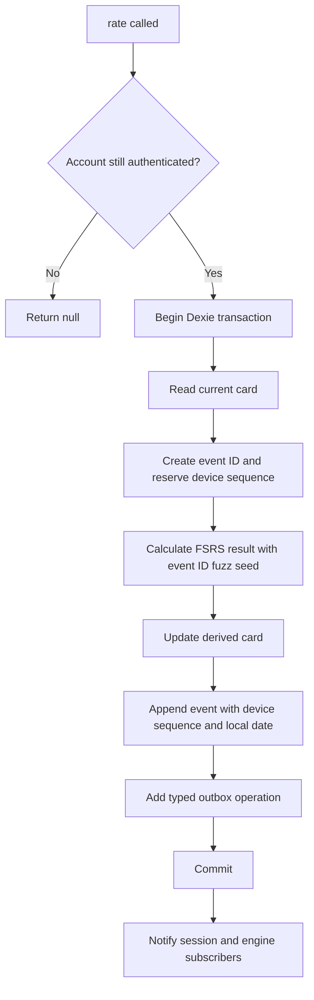
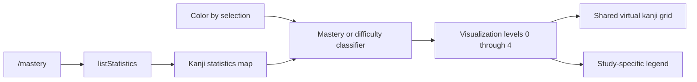
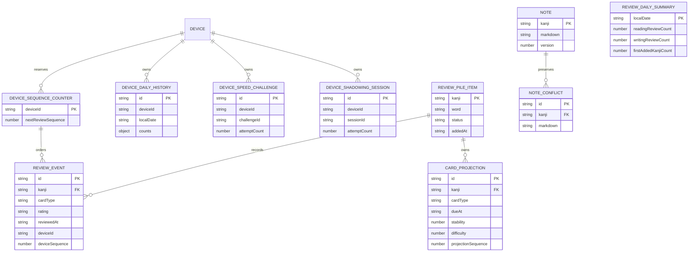
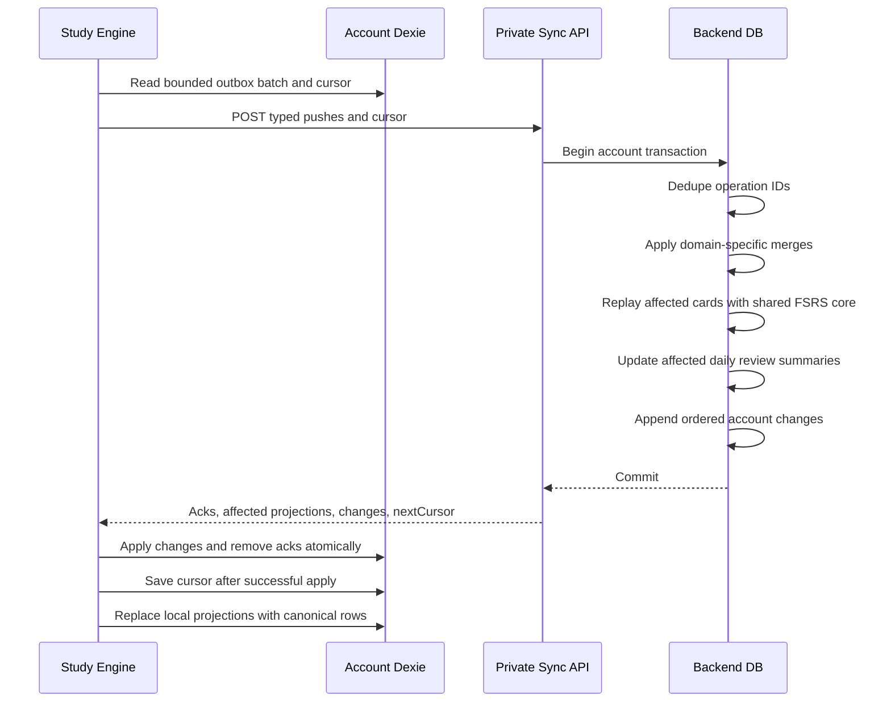
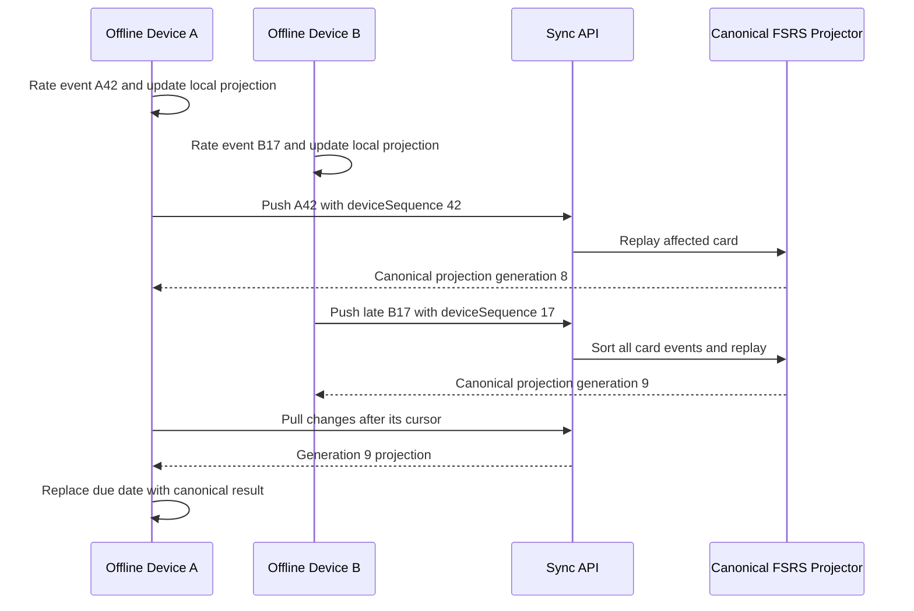
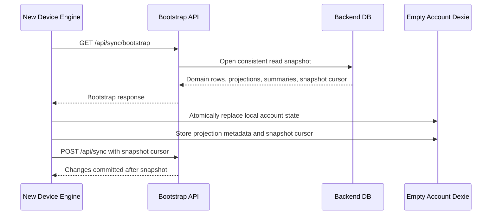

# Study Engine Plan V2

## Decisions

The system has three separately owned parts:

1. **Kanji Heatmap** — the public GPLv3 React application.
2. **`kh-study-engine`** — a separate public, GPL-compatible repository.
3. **Private backend** — authentication, entitlement, storage, and sync.

Kanji Heatmap uses a no-op engine by default. A normal `pnpm install` does
not download the official study engine. Developers may provide any compatible
engine through the build-time virtual module.

The first release deliberately favors simple, explicit rules:

- Login is required for reviews, bookmarks, history, notes, and sync.
- One review-pile item exists per kanji.
- Each pile item owns one reading card and one writing card.
- Reading and writing share one FSRS settings document.
- There are no daily new-card or review limits.
- One Markdown note exists per kanji.
- Practice history stores device-scoped summaries, not session histories.
- Review events are immutable and remain the scheduling source of truth.
- The backend runs the shared deterministic FSRS core and stores rebuildable
  canonical card projections.
- New devices bootstrap from projections and compact history summaries instead
  of downloading every historical review event.
- The backend uses typed sync and bootstrap endpoints.
- The offline access window lasts 14 days.

## Design principles

- Keep presentation logic in Kanji Heatmap.
- Keep scheduling, persistence, and sync out of React.
- Store only data that supports a current product requirement.
- Prefer typed domain operations over generic CRUD envelopes.
- Make local mutations immediately and sync them later.
- Keep immutable facts when ordering matters; use compact snapshots when only
  current aggregates matter.
- Treat materialized cards and history summaries as rebuildable projections,
  never as replacements for immutable review events.
- Do not add CRDTs, WebSockets, or service-worker sync in the first release.

## System architecture



### Kanji Heatmap owns

- React screens and components
- The versioned engine interface
- The built-in no-op engine
- The React provider and hooks
- Reading and writing review presentation
- The `/mastery` heatmap and visualization rules
- Markdown editing, previews, and sanitized rendering
- Visual and gameplay preferences
- Vite integration for selecting an engine

Application components never import `kh-study-engine` directly.

### `kh-study-engine` owns

- `ts-fsrs` integration
- A framework-independent deterministic scheduler-core package consumed by
  both the browser engine and backend
- Dexie and IndexedDB schemas
- Review-pile membership and review sessions
- Card scheduling, previews, and statistics
- Immutable review events
- Bookmarks
- Device-scoped practice-history summaries
- Per-kanji note persistence
- Shared FSRS settings
- Authentication API client and offline access grant
- Typed sync outbox and cloud sync client

The engine is framework-independent. It does not depend on React, Wouter,
Tailwind, or Kanji Heatmap components.

The shared scheduler core contains only versioned settings validation, event
ordering, deterministic PRNG/fuzz behavior, and FSRS replay. It contains no
Dexie, HTTP, authentication, or UI code.

### Private backend owns

- Sending and verifying email PINs
- Session creation and revocation
- Premium entitlement checks
- Canonical cloud data
- Idempotent sync processing
- Ordered account change delivery
- The same version-pinned deterministic FSRS core used by the browser
- Canonical, rebuildable card projections and compact review summaries
- Fast new-device bootstrap snapshots
- Note conflict preservation
- Billing, rate limits, secrets, and abuse prevention

Immutable review events remain authoritative. Backend card rows are projections
that can be discarded and rebuilt; they are not a second review history.

## Storage policy

### localStorage

Only device-level preferences remain in localStorage:

- Theme and colors
- Font
- Item presentation settings
- Reading-practice preferences
- Writing-practice preferences
- Speed Katakana preferences

These settings work without login and are not synchronized.

### IndexedDB

The engine uses:

1. One small device metadata database.
2. One account-scoped Dexie database per user.

The metadata database identifies the device and the active account before an
account database is opened. Account databases contain all offline study data.

One browser profile has one active account at a time. Multiple tabs share the
same device ID and account database.

Logging out closes the account database and clears its offline access grant.
It does not delete account data. Logging in to the same account reopens it.

### Existing anonymous data cleanup

Existing anonymous bookmarks and activity are not migrated. On startup,
Kanji Heatmap removes:

- `activity-all-time`
- `activity-by-day`
- Every localStorage key starting with `b:`

It does not call `localStorage.clear()`. Presentation and gameplay
preferences remain.

## Engine module

Every engine implementation exports the same versioned module:

```ts
export interface StudyEngineModule {
  readonly apiVersion: 1;

  createStudyEngine(options: StudyEngineOptions): StudyEngine;
}

export interface StudyEngineOptions {
  apiBaseUrl: string;
  clock?: () => Date;
}

export interface StudyUser {
  id: string;
  email: string;
}
```

The optional clock supports deterministic tests. Production uses current
date and time.

## Main engine interface

```ts
export interface StudyEngine {
  readonly auth: AuthService;
  readonly study: AuthenticatedStudy | null;

  initialize(): Promise<void>;
  dispose(): Promise<void>;

  getSnapshot(): StudyEngineSnapshot;
  subscribe(listener: () => void): () => void;
}

export interface AuthenticatedStudy {
  readonly review: ReviewService;
  readonly reviewHistory: ReviewHistoryService;
  readonly bookmarks: BookmarkService;
  readonly kanjiPracticeHistory: KanjiPracticeHistoryService;
  readonly speedKatakanaHistory: SpeedKatakanaHistoryService;
  readonly sentenceShadowingHistory: SentenceShadowingHistoryService;
  readonly notes: NotesService;
  readonly sync: SyncService;
}
```

Only authentication is available while logged out:

```ts
engine.study === null;
```

Every service operation verifies the current account. A stale service
reference retained after logout returns `null` and does not touch IndexedDB.

## Engine state

```ts
export type StudyEngineSnapshot =
  | {
      status: "unavailable";
      revision: number;
    }
  | {
      status: "checking-session";
      revision: number;
    }
  | {
      status: "logged-out";
      revision: number;
    }
  | {
      status: "logged-in";
      user: StudyUser;
      connectivity: "online" | "offline";
      sync: SyncSnapshot;
      revision: number;
    };

export interface SyncSnapshot {
  status: "idle" | "syncing" | "offline" | "error";
  pendingOperationCount: number;
  lastSyncedAt: string | null;
  errorMessage: string | null;
}
```

- The no-op engine reports `unavailable`.
- An installed engine without a session reports `logged-out`.
- A valid offline access grant reports `logged-in` with offline connectivity.

The React provider consumes `subscribe()` and `getSnapshot()` through
`useSyncExternalStore`.

## Authentication and offline access

```ts
export interface AuthService {
  requestPin(email: string): Promise<AuthResult<PinChallenge>>;

  verifyPin(input: {
    challengeId: string;
    pin: string;
  }): Promise<AuthResult<StudyUser>>;

  refreshSession(): Promise<AuthResult<StudyUser | null>>;

  logout(): Promise<AuthResult<void>>;
}

export interface PinChallenge {
  id: string;
  expiresAt: string;
}

export type AuthResult<T> =
  | {
      ok: true;
      value: T;
    }
  | {
      ok: false;
      code:
        | "invalid-email"
        | "invalid-pin"
        | "expired-pin"
        | "rate-limited"
        | "network-error"
        | "server-error";
      message?: string;
    };
```

The browser calls same-origin endpoints:

```text
POST /api/auth/pin/request
POST /api/auth/pin/verify
POST /api/auth/logout
GET  /api/auth/session
POST /api/sync
GET  /api/sync/bootstrap
```

`kanjiheatmap.com/api` proxies these requests to the private backend.
Online sessions use secure, HttpOnly cookies.

After successful online verification, the backend grants a signed offline
access grant. The user-facing **offline access window** expires 14 days from
server time. The grant:

- Allows the local account database to open while offline.
- Allows offline reads, reviews, notes, bookmarks, and history updates.
- Does not authorize backend API calls or sync.
- Is refreshed after successful online session verification.
- Is cleared immediately by explicit logout.

After expiration, the engine closes the account database and reports
`logged-out` until online authentication succeeds. Pending outbox entries stay
on disk. Remote revocation cannot take effect while a device is offline; this
is an inherent tradeoff of offline access.

The grant is a product-policy control for cached local access, not a secure
paywall for public browser code. Backend sync always requires a current
HttpOnly session and entitlement check.

## Public review facade

The consumer works with one active pile item per kanji. The representative
word stored on first addition is retained for that kanji. Duplicate additions
are idempotent. Removing and re-adding resumes the same item and review
history. Changing the representative word and resetting history is deferred
until there is a concrete product requirement.

```ts
export interface StudyItem {
  kanji: string;
  word: string;
}

export type CardType = "recognition" | "production";

/**
 * One user-facing pile entry.
 *
 * Internally it owns two cards: recognition and production.
 */
export interface ReviewPileItem {
  item: StudyItem;
  addedAt: string;
}

/**
 * Card-level counts currently eligible for a review session.
 *
 * `due` equals `new + learning + review`.
 * `learning` includes both Learning and Relearning FSRS states.
 */
export interface ReviewQueueCounts {
  due: number;
  new: number;
  learning: number;
  review: number;
}

export interface ReviewOverview {
  recognition: ReviewQueueCounts;
  production: ReviewQueueCounts;
}
```

`new` means a card that has never been reviewed. It is not a creation rule or
a daily quota. Every new or due card is available.

### Shared FSRS settings

```ts
/**
 * Account-wide settings shared by recognition and production.
 */
export interface ReviewSettings {
  requestRetention: number;
  maximumIntervalDays: number;
  enableFuzz: boolean;
  enableShortTerm: boolean;
  learningStepsMinutes: number[];
  relearningStepsMinutes: number[];
  modelWeights: readonly number[];
}
```

The settings map to these `ts-fsrs` parameters:

```text
requestRetention       -> request_retention
maximumIntervalDays    -> maximum_interval
enableFuzz             -> enable_fuzz
enableShortTerm        -> enable_short_term
learningStepsMinutes   -> learning_steps
relearningStepsMinutes -> relearning_steps
modelWeights           -> w
```

When short-term scheduling is disabled, learning and relearning steps remain
stored but are ignored. The UI hides those controls. Model weights are an
advanced option and are validated against the engine's pinned FSRS version.
FSRS 6 currently uses 21 weights.

There are no `newCardsPerDay` or `maximumReviewsPerDay` settings.

### Review service

```ts
export interface ReviewService {
  addToPile(item: StudyItem): Promise<ReviewPileItem | null>;

  removeFromPile(kanji: string): Promise<boolean | null>;

  isInPile(kanji: string): Promise<boolean | null>;

  /**
   * Returns active items newest-first by addedAt.
   * Ties are resolved lexicographically by kanji.
   */
  listPile(): Promise<ReviewPileItem[] | null>;

  /**
   * Returns the currently eligible card counts for both review modes.
   */
  getOverview(): Promise<ReviewOverview | null>;

  /**
   * Returns statistics for one active pile item.
   *
   * `undefined` means the kanji is not in the pile.
   * `null` means authenticated study access is unavailable.
   */
  getStatistics(
    kanji: string
  ): Promise<ReviewItemStatistics | undefined | null>;

  /**
   * Bulk form used by the Mastery heatmap.
   */
  listStatistics(): Promise<ReviewItemStatistics[] | null>;

  /**
   * Creates an in-memory queue from cards eligible at call time.
   */
  startSession(
    options: StartReviewSessionOptions
  ): Promise<ReviewSession | null>;

  getSettings(): Promise<ReviewSettings | null>;

  updateSettings(
    changes: Partial<ReviewSettings>
  ): Promise<ReviewSettings | null>;
}
```

Changing settings creates a new canonical settings version. The backend
rebuilds card projections from immutable review events under that version and
returns the projections to clients. A client may show a temporary local
projection while offline; the backend projection wins after sync.

Because a bootstrapped client does not retain the full historical event log,
an offline settings edit cannot rebuild every card correctly. The edit may be
queued offline, but existing schedules remain in place until the backend
accepts it and publishes the rebuilt projection generation. The UI shows that
recalculation is pending.

### Deterministic scheduling

The browser and backend use the same version-pinned scheduler package. Every
review event supplies the seed for interval fuzz:

```text
fuzzSeed = reviewEvent.id
```

The scheduler obtains all randomness from a deterministic PRNG initialized
with that seed. Replaying the same ordered events, FSRS version, and settings
must produce byte-equivalent scheduling state on every platform. If the
selected `ts-fsrs` integration cannot inject deterministic randomness, fuzz
must remain disabled for synchronized accounts until that capability exists.

## Review sessions

```ts
export interface StartReviewSessionOptions {
  cardType: CardType;

  /**
   * Optional size of this session, not a daily quota.
   * Omit it to include every currently eligible card.
   */
  limit?: number;
}

export interface ReviewSession {
  readonly id: string;
  readonly cardType: CardType;

  /**
   * Returns the current immutable UI view of this session.
   */
  getSnapshot(): ReviewSessionSnapshot;

  rate(rating: ReviewRating): Promise<void | null>;

  end(): Promise<ReviewSessionSummary | null>;

  subscribe(listener: () => void): () => void;
}

export interface ReviewSessionSummary {
  startedAt: string;
  endedAt: string;
  reviewedCount: number;
  ratingCounts: Record<ReviewRating, number>;
}

export interface ReviewSessionSnapshot {
  status: "loading" | "ready" | "saving" | "complete";
  current: PreparedReview | null;
  completedCount: number;

  /**
   * Cards remaining in this session, including current when present.
   */
  remainingCount: number;
}

export interface PreparedReview {
  item: StudyItem;
  cardType: CardType;
  preview: ReviewPreview;
}
```

`getSnapshot()` lets React subscribe to an asynchronous, stateful review
session without knowing its internal queue or persistence work:

- `loading`: the queue and first preview are being prepared.
- `ready`: the current card can be answered.
- `saving`: a rating transaction is in progress.
- `complete`: no cards remain or the session has ended.

The engine chooses eligible cards and their order. The first release orders
overdue Learning/Relearning cards first, then Review cards by earliest due
time, then New cards by pile addition time.

### Rating behavior

- Incorrect answer maps to `again`.
- Correct answer reveals Hard, Normal, and Easy.
- Normal maps to FSRS `good`.
- The engine records review time using its clock.
- The UI does not provide a timestamp.

```ts
export type ReviewRating = "again" | "hard" | "good" | "easy";

export type ReviewState = "new" | "learning" | "review" | "relearning";

export interface ReviewPreview {
  calculatedAt: string;
  outcomes: Record<ReviewRating, ReviewOutcome>;
}

export interface ReviewOutcome {
  intervalMinutes: number;
  nextDueAt: string;
  resultingState: ReviewState;
}
```

Previewing does not mutate data. Rating recalculates from the actual current
time before saving.

### Review state lifecycle



### Atomic rating transaction



## Review statistics

Statistics support per-kanji detail UI and the `/mastery` heatmap. They are
derived from the active canonical card projections and immutable review
events.

```ts
export interface ReviewItemStatistics {
  item: StudyItem;
  addedAt: string;
  recognition: CardStatistics;
  production: CardStatistics;
}

export interface CardStatistics {
  createdAt: string;
  state: ReviewState;
  dueAt: string;
  lastReviewedAt: string | null;
  reviewCount: number;
  lapseCount: number;
  ratingCounts: Record<ReviewRating, number>;

  /**
   * Null until the card has a meaningful FSRS memory state.
   */
  stabilityDays: number | null;
  difficulty: number | null;
  retrievability: number | null;
}
```

There is no combined `totalReviewCount`. Consumers can display each mode's
count independently.

## Mastery heatmap

The `/mastery` route reuses the `/` route's search, sorting, drawer, virtual
grid, tile layout, item design, and five opacity levels. It changes only the
source and meaning of tile background color.

The implementation should extract a generic background-level resolver from
`useItemBtnCn`. A route-level provider supplies either frequency or study
levels. The internal five-band type should be named `VisualizationLevel`
rather than `FreqCategory`, while retaining the existing static CSS palette.

Under **Background Color Meaning**, the select field is labeled **Color by**
and contains:

- Reading Mastery
- Writing Mastery
- Combined Mastery
- Reading Difficulty
- Writing Difficulty
- Combined Difficulty

### Mastery levels

Mastery uses FSRS stability, not distance from today to the due date.
Stability is the estimated number of days for recall probability to fall from
100% to 90%. It remains meaningful when a card is overdue and does not shift
merely because request retention changes.

| Level | Meaning                                                    |
| ----- | ---------------------------------------------------------- |
| 0     | Not studying; there is no card                             |
| 1     | New card, or stability below 30 days                       |
| 2     | Stability from 30 through 334 days                         |
| 3     | Stability at least 335 days and card age below 365 days    |
| 4     | Stability at least 335 days and card age at least 365 days |

Combined Mastery is the lower of reading and writing. A strong mode cannot
hide the weaker mode.

### Difficulty levels

FSRS difficulty ranges from 1 to 10 and changes only after a review.
Fixed thresholds keep colors stable as the user's studied population changes.

| Level | Meaning                          | FSRS difficulty       |
| ----- | -------------------------------- | --------------------- |
| 0     | No reviewed-card difficulty data | None                  |
| 1     | Easy                             | 1 to less than 3.25   |
| 2     | Moderate                         | 3.25 to less than 5.5 |
| 3     | Difficult                        | 5.5 to less than 7.75 |
| 4     | Very Difficult                   | 7.75 through 10       |

Combined Difficulty is the higher available reading or writing difficulty.
If neither card has been reviewed, it is level 0.

### Mastery data flow



The screen performs one bulk IndexedDB query and builds a
`kanji -> statistics` map. It does not call `getStatistics()` once per tile.
It has explicit unavailable-engine, logged-out, loading, and empty states.

## Bookmarks

Bookmarks remain keyed by kanji and word because a kanji may have multiple
bookmarkable vocabulary entries.

```ts
export interface BookmarkService {
  create(item: StudyItem): Promise<Bookmark | null>;
  delete(item: StudyItem): Promise<boolean | null>;
  has(item: StudyItem): Promise<boolean | null>;
  list(): Promise<Bookmark[] | null>;
}

export interface Bookmark {
  item: StudyItem;
  createdAt: string;
}
```

When logged out, bookmark controls show a login prompt.

## Practice and review history

Games remain playable while logged out, but anonymous history is not
recorded. The public API uses focused history services rather than one
catch-all service. They may share one internal device/day repository; service
separation does not require duplicated tables.

Use **Kanji Reading Practice** and **Kanji Writing Practice** for the existing
games. Use **Kanji Reading Reviews** and **Kanji Writing Reviews** for
scheduled review activity.

```ts
export type KanjiPracticeMode = "reading" | "writing";
export type ReviewMode = "reading" | "writing";

export interface DailyHistoryCount<TKind extends string> {
  date: string;
  kind: TKind;
  count: number;
}

export interface HistoryTotal<TKind extends string> {
  kind: TKind;
  count: number;
}

export interface KanjiPracticeHistoryService {
  recordRound(mode: KanjiPracticeMode): Promise<void | null>;

  getDailyCounts(input: {
    from: string;
    to: string;
    modes?: KanjiPracticeMode[];
  }): Promise<DailyHistoryCount<KanjiPracticeMode>[] | null>;

  getTotals(
    modes?: KanjiPracticeMode[]
  ): Promise<HistoryTotal<KanjiPracticeMode>[] | null>;
}
```

Each completed 10-item practice round increments its device's daily counter.
No item answers, item counts, correct counts, or per-session scores are
stored.

### Speed Katakana history

```ts
export interface TimedValue {
  timestamp: string;
  value: number;
}

export interface SpeedKatakanaAttempt {
  completedAt: string;
  accuracyPercent: number;
  charactersPerMinute: number;
}

export interface SpeedKatakanaChallengeProgress {
  challengeId: string;
  attemptCount: number;
  latestAttempt: SpeedKatakanaAttempt;
  bestAccuracy: TimedValue;
  bestSpeed: TimedValue;
  bestSpeedAbove70Accuracy: TimedValue | null;
  updatedAt: string;
}

export interface SpeedKatakanaHistoryService {
  /**
   * Atomically increments today's session count and updates the active
   * device's challenge summary.
   */
  recordAttempt(input: {
    challengeId: string;
    accuracyPercent: number;
    charactersPerMinute: number;
  }): Promise<SpeedKatakanaChallengeProgress | null>;

  getDailyCounts(input: {
    from: string;
    to: string;
  }): Promise<DailyHistoryCount<"speed-katakana">[] | null>;

  getTotal(): Promise<number | null>;

  listChallenges(): Promise<SpeedKatakanaChallengeProgress[] | null>;
}
```

Only completed 48-word runs update Speed Katakana history. Challenge summaries
remain device-specific because typing performance depends strongly on the
device.

### Sentence shadowing history

```ts
export interface SentenceShadowingSessionProgress {
  sessionId: string;
  attemptCount: number;
  lastAttemptAt: string;
  updatedAt: string;
}

export interface SentenceShadowingHistoryService {
  /**
   * Atomically increments today's session count and the selected session's
   * attempt count.
   */
  recordAttempt(
    sessionId: string
  ): Promise<SentenceShadowingSessionProgress | null>;

  getDailyCounts(input: {
    from: string;
    to: string;
  }): Promise<DailyHistoryCount<"sentence-shadowing">[] | null>;

  getTotal(): Promise<number | null>;

  listSessions(): Promise<SentenceShadowingSessionProgress[] | null>;
}
```

Sentence-session IDs are stable content identifiers. Device rows merge into
account totals, so its heatmap shows attempts across all devices.

### Review history

`ReviewHistoryService` is read-only. The engine records review history through
the normal rating transaction; it does not maintain a second review-history
event stream.

```ts
export interface NewKanjiDailyCount {
  date: string;
  count: number;
}

export interface ReviewHistoryService {
  getDailyCounts(input: {
    from: string;
    to: string;
    modes?: ReviewMode[];
  }): Promise<DailyHistoryCount<ReviewMode>[] | null>;

  getTotals(modes?: ReviewMode[]): Promise<HistoryTotal<ReviewMode>[] | null>;

  getNewKanjiDailyCounts(input: {
    from: string;
    to: string;
  }): Promise<NewKanjiDailyCount[] | null>;

  getNewKanjiTotal(): Promise<number | null>;
}
```

Reading and writing totals count **review actions**: one immutable rating
event equals one review. A card repeated during learning therefore counts
again. The dashboard must use “Reading Reviews” and “Writing Reviews,” not the
ambiguous “items reviewed.”

First-time new-kanji counts come from pile `addedAt` and `addedLocalDate`.
They count one kanji, not the two internal cards it creates. Removing and
re-adding a kanji does not increment the count.

### Device-scoped merge model

A practice day is stored per `(deviceId, localDate)`. Using date alone would
lose increments when two offline devices sync.

For one device row:

- Daily counters merge component-wise by maximum.
- Speed and shadowing attempt counts merge by maximum.
- Latest values use the newest timestamp.
- Best values merge by maximum.

Account daily totals sum device rows. Review totals are derived from immutable
events and canonical daily review summaries rather than mutable counters.

## Dashboard requirements

### All-time overview and activity heatmap

The dashboard includes:

- Total active days
- Days Speed Katakana
- Days Kanji Reading Practice
- Days Kanji Writing Practice
- Days Sentence Shadowing
- Days Kanji Reading Reviews
- Days Kanji Writing Reviews
- Days Adding New Kanji
- Total Speed Katakana sessions
- Total Kanji Reading Practice rounds
- Total Kanji Writing Practice rounds
- Total Sentence Shadowing sessions
- Total Kanji Reading Reviews
- Total Kanji Writing Reviews
- Total New Kanji Added

“Days Adding New Kanji” and “Total New Kanji Added” are separate statistics.

Activity heatmap filters include:

- Speed Katakana
- Kanji Reading Practice
- Kanji Writing Practice
- Sentence Shadowing
- New Kanji Added
- Kanji Reading Reviews
- Kanji Writing Reviews

### Specialized heatmaps

- Speed Katakana keeps its per-device challenge heatmap.
- Sentence Shadowing shows one cell per stable session ID, colored by total
  attempt count across devices.

### Kanji Mastery and Kanji Difficulty

Add dashboard sections grouped by JLPT. Each JLPT row is a five-segment
horizontal bar showing the same levels used by `/mastery`.

Each section has a Reading, Writing, or Combined selector. Reuse the existing
mastery/difficulty classifiers and bulk statistics; do not create separate
stored mastery counters.

## Per-kanji Markdown notes

There is at most one current note per kanji. The kanji is the note identity;
there is no arbitrary ID or title.

```ts
export interface StudyNote {
  kanji: string;
  markdown: string;
  version: number;
  createdAt: string;
  updatedAt: string;
}

export interface NoteConflictCopy {
  id: string;
  kanji: string;
  markdown: string;
  baseVersion: number;
  createdAt: string;
}

export type NoteSaveResult =
  | {
      status: "saved";
      note: StudyNote;
    }
  | {
      status: "conflict";
      note: StudyNote;
      conflictCopy: NoteConflictCopy;
    };

export interface NotesService {
  /**
   * expectedVersion is null when creating the first note.
   */
  save(input: {
    kanji: string;
    markdown: string;
    expectedVersion: number | null;
  }): Promise<NoteSaveResult | null>;

  delete(input: {
    kanji: string;
    expectedVersion: number;
  }): Promise<boolean | null>;

  get(kanji: string): Promise<StudyNote | undefined | null>;

  list(): Promise<StudyNote[] | null>;
}
```

Kanji Heatmap owns editing, previews, and sanitized rendering. Raw HTML is
disabled by default.

If two devices edit from the same base version, the backend keeps its current
note and stores the stale submitted version as a conflict copy. A CRDT is not
needed.

## Local IndexedDB schema

All timestamps are UTC ISO 8601 strings unless a field explicitly represents
a local calendar date. Fixed-width ISO strings remain chronologically
sortable in IndexedDB indexes and JSON sync payloads.

Schema changes use explicit Dexie versions and migration functions.

### Device metadata database

Database name: `kh-study-device`

#### `device`

| Column      | Type        | Purpose                         |
| ----------- | ----------- | ------------------------------- |
| `id`        | `"current"` | Singleton primary key           |
| `deviceId`  | string      | Random stable device identifier |
| `createdAt` | string      | Device record creation time     |

Dexie indexes:

```text
id
```

#### `accounts`

| Column               | Type   | Purpose                  |
| -------------------- | ------ | ------------------------ |
| `userId`             | string | Primary key              |
| `email`              | string | Display identity         |
| `offlineAccessGrant` | string | Signed local-only grant  |
| `grantExpiresAt`     | string | Access-window expiration |
| `lastVerifiedAt`     | string | Last online verification |

Dexie indexes:

```text
userId, grantExpiresAt
```

#### `activeAccount`

| Column   | Type        | Purpose               |
| -------- | ----------- | --------------------- |
| `id`     | `"current"` | Singleton primary key |
| `userId` | string      | Active account        |

Dexie indexes:

```text
id, userId
```

### Account database

Database name: `kh-study-account-${hash(userId)}`

The database name uses a deterministic hash so it does not expose an email
address or raw account identifier.

#### `deviceSequenceCounters`

| Column               | Type   | Purpose                        |
| -------------------- | ------ | ------------------------------ |
| `deviceId`           | string | Primary key                    |
| `nextReviewSequence` | number | Next monotonic review sequence |

The rating transaction increments this account-local counter in the same
Dexie transaction as the review event and outbox operation. It is not kept in
the separate metadata database because IndexedDB cannot transact across two
databases.

Dexie indexes:

```text
deviceId
```

#### `reviewPileItems`

| Column             | Type                    | Purpose                       |
| ------------------ | ----------------------- | ----------------------------- |
| `kanji`            | string                  | Primary key and pile identity |
| `word`             | string                  | Frozen representative word    |
| `addedAt`          | string                  | First addition time           |
| `addedLocalDate`   | string                  | First-addition calendar date  |
| `utcOffsetMinutes` | number                  | Date interpretation           |
| `status`           | `"active" \| "removed"` | Membership/tombstone state    |
| `removedAt`        | string or null          | Removal time                  |
| `updatedAt`        | string                  | Last local or remote update   |
| `serverVersion`    | number                  | Last applied server version   |

Dexie indexes:

```text
kanji, [status+addedAt], updatedAt
```

#### `cards`

Cards are rebuildable materialized projections. Local ratings update them
immediately for offline responsiveness. Sync replaces affected rows with the
newest canonical backend projection.

| Column                   | Type                    | Purpose                          |
| ------------------------ | ----------------------- | -------------------------------- |
| `id`                     | string                  | `kanji + cardType` primary key   |
| `kanji`                  | string                  | Pile item                        |
| `cardType`               | `CardType`              | Recognition or production        |
| `createdAt`              | string                  | Card creation time               |
| `dueAt`                  | string                  | Next due time                    |
| `state`                  | `ReviewState`           | FSRS state                       |
| `stability`              | number                  | FSRS stability                   |
| `difficulty`             | number                  | FSRS difficulty                  |
| `scheduledDays`          | number                  | Last scheduled interval          |
| `reps`                   | number                  | Review count                     |
| `lapses`                 | number                  | Again count                      |
| `ratingCounts`           | object                  | Counts for all four ratings      |
| `learningSteps`          | number                  | Current step position            |
| `lastReviewAt`           | string or null          | Most recent review               |
| `status`                 | `"active" \| "removed"` | Mirrors pile membership          |
| `fsrsVersion`            | string                  | Scheduler compatibility          |
| `settingsVersion`        | number                  | Settings used for projection     |
| `projectionSequence`     | number                  | Backend projection version       |
| `lastEventOrderKey`      | string or null          | Last included event ordering key |
| `pendingLocalEventCount` | number                  | Unsynced events on this card     |

Dexie indexes:

```text
id, &[kanji+cardType], [cardType+dueAt], [cardType+state+dueAt]
```

#### `reviewEvents`

A bootstrapped account database does not contain the complete account review
history. It retains locally created events and events delivered after its
bootstrap cursor. Complete immutable history remains on the backend.

| Column             | Type           | Purpose                      |
| ------------------ | -------------- | ---------------------------- |
| `id`               | string         | Immutable event UUID         |
| `kanji`            | string         | Reviewed pile item           |
| `cardType`         | `CardType`     | Reviewed mode                |
| `rating`           | `ReviewRating` | User rating                  |
| `reviewedAt`       | string         | Actual review time           |
| `localDate`        | string         | Review calendar date         |
| `utcOffsetMinutes` | number         | Date interpretation          |
| `deviceId`         | string         | Originating device           |
| `deviceSequence`   | number         | Monotonic sequence on device |
| `serverSequence`   | number or null | Delivery sequence after sync |

Dexie indexes:

```text
id, [kanji+cardType+reviewedAt], reviewedAt, [deviceId+deviceSequence], localDate, serverSequence
```

#### `reviewSettings`

| Column                   | Type        | Purpose                   |
| ------------------------ | ----------- | ------------------------- |
| `id`                     | `"current"` | Singleton primary key     |
| `fsrsVersion`            | string      | Parameter compatibility   |
| `version`                | number      | Optimistic sync version   |
| `requestRetention`       | number      | Target recall probability |
| `maximumIntervalDays`    | number      | Interval cap              |
| `enableFuzz`             | boolean     | Interval fuzz             |
| `enableShortTerm`        | boolean     | Short-term scheduling     |
| `learningStepsMinutes`   | number[]    | Learning steps            |
| `relearningStepsMinutes` | number[]    | Relearning steps          |
| `modelWeights`           | number[]    | FSRS model weights        |
| `updatedAt`              | string      | Last update               |

Dexie indexes:

```text
id
```

#### `bookmarks`

| Column          | Type                    | Purpose                          |
| --------------- | ----------------------- | -------------------------------- |
| `id`            | string                  | Deterministic `kanji + word` key |
| `kanji`         | string                  | Bookmarked kanji                 |
| `word`          | string                  | Bookmarked word                  |
| `createdAt`     | string                  | Creation time                    |
| `status`        | `"active" \| "removed"` | State/tombstone                  |
| `removedAt`     | string or null          | Removal time                     |
| `updatedAt`     | string                  | Last update                      |
| `serverVersion` | number                  | Last applied server version      |

Dexie indexes:

```text
id, &[kanji+word], [status+createdAt], updatedAt
```

#### `deviceDailyHistory`

| Column             | Type                     | Purpose                            |
| ------------------ | ------------------------ | ---------------------------------- |
| `id`               | string                   | `deviceId + localDate` primary key |
| `deviceId`         | string                   | Owning device                      |
| `localDate`        | string                   | `YYYY-MM-DD` history date          |
| `utcOffsetMinutes` | number                   | Date interpretation                |
| `counts`           | `Record<string, number>` | Monotonic practice counters        |
| `updatedAt`        | string                   | Last update                        |

Dexie indexes:

```text
id, &[deviceId+localDate], localDate, deviceId
```

#### `deviceSpeedKatakanaChallenges`

| Column                     | Type                 | Purpose                              |
| -------------------------- | -------------------- | ------------------------------------ |
| `id`                       | string               | `deviceId + challengeId` primary key |
| `deviceId`                 | string               | Owning device                        |
| `challengeId`              | string               | Challenge identity                   |
| `attemptCount`             | number               | Monotonic attempt count              |
| `latestAttempt`            | object               | Latest accuracy, speed, and time     |
| `bestAccuracy`             | `TimedValue`         | Best accuracy                        |
| `bestSpeed`                | `TimedValue`         | Best speed                           |
| `bestSpeedAbove70Accuracy` | `TimedValue` or null | Qualified best                       |
| `updatedAt`                | string               | Last update                          |

Dexie indexes:

```text
id, &[deviceId+challengeId], deviceId, challengeId
```

#### `deviceSentenceShadowingSessions`

| Column          | Type   | Purpose                            |
| --------------- | ------ | ---------------------------------- |
| `id`            | string | `deviceId + sessionId` primary key |
| `deviceId`      | string | Owning device                      |
| `sessionId`     | string | Stable content identity            |
| `attemptCount`  | number | Monotonic attempt count            |
| `lastAttemptAt` | string | Latest completion                  |
| `updatedAt`     | string | Last update                        |

Dexie indexes:

```text
id, &[deviceId+sessionId], deviceId, sessionId
```

#### `reviewDailySummaries`

Canonical compact rows let the dashboard work without retaining every remote
review event locally.

| Column                     | Type   | Purpose                   |
| -------------------------- | ------ | ------------------------- |
| `localDate`                | string | Primary key               |
| `readingReviewCount`       | number | Reading review actions    |
| `writingReviewCount`       | number | Writing review actions    |
| `firstAddedKanjiCount`     | number | First-time pile additions |
| `sourceProjectionSequence` | number | Projection frontier       |
| `updatedAt`                | string | Last canonical update     |

Dexie indexes:

```text
localDate
```

#### `reviewProjectionMetadata`

| Column               | Type        | Purpose                          |
| -------------------- | ----------- | -------------------------------- |
| `id`                 | `"current"` | Singleton primary key            |
| `sourceCursor`       | number      | Snapshot/change-log frontier     |
| `projectionSequence` | number      | Applied projection generation    |
| `settingsVersion`    | number      | Canonical settings version       |
| `fsrsVersion`        | string      | Canonical scheduler version      |
| `lastRebuiltAt`      | string      | Backend projection rebuild time  |
| `lastBootstrapAt`    | string      | Last local bootstrap application |

Dexie indexes:

```text
id
```

#### `notes`

| Column      | Type                    | Purpose                 |
| ----------- | ----------------------- | ----------------------- |
| `kanji`     | string                  | Primary key             |
| `markdown`  | string                  | Raw Markdown            |
| `version`   | number                  | Optimistic sync version |
| `status`    | `"active" \| "removed"` | State/tombstone         |
| `createdAt` | string                  | Creation time           |
| `updatedAt` | string                  | Update time             |
| `removedAt` | string or null          | Deletion time           |

Dexie indexes:

```text
kanji, status, updatedAt
```

#### `noteConflicts`

| Column        | Type   | Purpose            |
| ------------- | ------ | ------------------ |
| `id`          | string | Conflict UUID      |
| `kanji`       | string | Conflicted note    |
| `markdown`    | string | Preserved Markdown |
| `baseVersion` | number | Version edited     |
| `createdAt`   | string | Conflict time      |

Dexie indexes:

```text
id, kanji, [kanji+createdAt], createdAt
```

#### `outbox`

| Column          | Type           | Purpose                      |
| --------------- | -------------- | ---------------------------- |
| `operationId`   | string         | Idempotency UUID             |
| `kind`          | string         | Typed append/upsert kind     |
| `body`          | object         | Discriminated operation body |
| `occurredAt`    | string         | Local operation time         |
| `attemptCount`  | number         | Retry count                  |
| `lastAttemptAt` | string or null | Last push attempt            |

Dexie indexes:

```text
operationId, kind, occurredAt, lastAttemptAt
```

#### `syncMetadata`

| Column            | Type           | Purpose                                |
| ----------------- | -------------- | -------------------------------------- |
| `id`              | `"current"`    | Singleton primary key                  |
| `cursor`          | number or null | Last locally committed change sequence |
| `bootstrapCursor` | number or null | Cursor supplied by latest bootstrap    |
| `lastSyncedAt`    | string or null | Last completed sync                    |
| `lastServerTime`  | string or null | Most recent server time                |

Dexie indexes:

```text
id
```

### Local schema relationships



## Sync strategy

The client changes local data first and adds a typed operation to the outbox
in the same Dexie transaction. Sync transports those operations and pulls
canonical account changes, card projections, and compact review summaries.

The protocol has two lanes:

1. **Append-only:** immutable review events.
2. **Typed upserts:** bookmarks, pile membership, settings, notes, daily
   practice history, Speed Katakana challenge summaries, and shadowing
   summaries.

Clients never upload authoritative cards. The backend derives canonical card
projections and review summaries from accepted facts, then syncs those
rebuildable projections down to clients.

### Local mutation rule

Every local mutation:

1. Verifies the authenticated account.
2. Updates the local domain row.
3. Adds a typed operation with a unique operation ID.
4. Commits the data and outbox entry atomically.
5. Updates UI subscribers immediately.

### Typed protocol

```ts
export interface ReviewEventPush {
  operationId: string;
  event: {
    id: string;
    kanji: string;
    cardType: CardType;
    rating: ReviewRating;
    reviewedAt: string;
    localDate: string;
    utcOffsetMinutes: number;
    deviceId: string;
    deviceSequence: number;
  };
}

export type SyncUpsert =
  | {
      kind: "bookmark";
      operationId: string;
      value: BookmarkSyncRecord;
    }
  | {
      kind: "review-pile-item";
      operationId: string;
      value: ReviewPileSyncRecord;
    }
  | {
      kind: "review-settings";
      operationId: string;
      expectedVersion: number;
      value: ReviewSettingsSyncRecord;
    }
  | {
      kind: "note";
      operationId: string;
      expectedVersion: number | null;
      value: NoteSyncRecord;
    }
  | {
      kind: "device-daily-history";
      operationId: string;
      value: DeviceDailyHistorySyncRecord;
    }
  | {
      kind: "device-speed-katakana-challenge";
      operationId: string;
      value: DeviceSpeedChallengeSyncRecord;
    }
  | {
      kind: "device-sentence-shadowing-session";
      operationId: string;
      value: DeviceSentenceShadowingSyncRecord;
    };

export interface SyncRequest {
  deviceId: string;
  cursor: number | null;
  reviewEvents: ReviewEventPush[];
  upserts: SyncUpsert[];
}

export type AccountChange =
  | ReviewEventChange
  | BookmarkChange
  | ReviewPileChange
  | ReviewSettingsChange
  | NoteChange
  | NoteConflictChange
  | DeviceDailyHistoryChange
  | DeviceSpeedChallengeChange
  | DeviceSentenceShadowingChange
  | ReviewCardProjectionChange
  | ReviewDailySummaryChange
  | ReviewProjectionMetadataChange;

export interface SyncResponse {
  acknowledgedOperationIds: string[];
  affectedReviewCardProjections: ReviewCardProjectionSyncRecord[];
  changes: AccountChange[];
  nextCursor: number;
  hasMore: boolean;
  serverTime: string;
}
```

Each `AccountChange` is a discriminated union member with a sequence, a
literal kind, and a fully typed domain value. The protocol has no
`payload: unknown` and does not allow update/delete actions on immutable
review events.

`affectedReviewCardProjections` contains the canonical projection for every
card changed by review events accepted in this request, independent of change
pagination. This lets the client reconcile an acknowledged local rating
without waiting for its projection change to appear on a later pull page.

A card with unacknowledged local review events is dirty. The client does not
replace that card with an older pulled projection. It first pushes those
events, then installs the matching projection returned in
`affectedReviewCardProjections`. This avoids attempting an incorrect
out-of-order replay on a bootstrapped device that lacks full history.

### One sync round trip



### Backend transaction

For each `POST /api/sync`, the backend:

1. Verifies the HttpOnly session and premium entitlement.
2. Validates the full typed batch before applying it.
3. Begins one database transaction.
4. Skips operations already present in `processed_operations`.
5. Applies new operations with entity-specific rules.
6. Replays each card affected by accepted review events, using the canonical
   settings and deterministic event order.
7. Updates review daily summaries for affected local dates.
8. Appends domain rows and changed projections to `account_changes`.
9. Records accepted operation IDs.
10. Selects the next bounded page after the supplied cursor.
11. Commits and returns acknowledgements and changes.

A late offline review may invalidate every later projection for that card.
The backend replays that card's full event stream, not the entire account.
Concurrent offline reviews can therefore adjust a due date that another device
previously displayed.

A settings, model-weight, or FSRS-version change enqueues one idempotent
account-wide projection rebuild. The current projection generation remains
readable while the job runs. The completed job atomically publishes a new
generation of card projections, projection metadata, and account changes.

A lost response is safe: the client retries the same operation IDs and the
backend acknowledges them without applying them twice.

Recommended initial limits:

- At most 100 pushed operations per request.
- At most 500 pulled changes per response.
- Continue while `hasMore` is true.

### Ordering

`account_changes.sequence` orders delivery and cursor advancement. It does
not define when an offline review happened.

Review replay sorts events by:

1. `reviewedAt`
2. `deviceId`
3. `deviceSequence`
4. event ID

Using server receipt order would incorrectly turn reviews completed offline
into reviews performed at sync time. The backend validates timestamps against
the 14-day offline access window and rejects unreasonable future timestamps.
Browser clocks cannot be made tamper-proof in a public local engine.

`deviceSequence` preserves order among reviews created by one device when
timestamps tie or clock precision is insufficient. It is only an ordering
tie-breaker; it does not make one device win over another. The event ID is the
final deterministic tie-breaker. Ordering changes are versioned behavior and
must be covered by engine-compatibility tests.



### Merge rules

- **Review events:** immutable union by event ID.
- **Bookmarks:** last operation accepted by the server; retain tombstones.
- **Pile membership:** last operation accepted by the server; retain
  tombstones.
- **Settings:** one document with `expectedVersion`; on conflict, the server
  version wins and is returned.
- **Notes:** `expectedVersion`; stale submissions become conflict copies.
- **Daily practice history:** for one device/day, merge every counter by
  maximum.
- **Speed challenge:** for one device/challenge, merge attempt count and best
  values by maximum and latest attempt by newest timestamp.
- **Shadowing session:** for one device/session, merge attempt count by maximum
  and latest attempt by newest timestamp.
- **Card projections:** server-authoritative but rebuildable; accept only from
  the backend and replace older generations locally.
- **Review daily summaries:** server-authoritative, rebuildable aggregates of
  review events and first-time pile additions.

### Sync triggers

Sync runs:

- At engine startup after session verification
- Shortly after a local mutation, with debounce
- When connectivity returns
- When the tab becomes focused
- Periodically while an authenticated tab remains active
- When the user requests Sync Now

Use the Web Locks API so one tab owns sync work for an account at a time.
Use exponential backoff with jitter after transient errors.

Do not add WebSockets, CRDTs, background service-worker sync, or aggressive
real-time polling in the first release.

### Fast bootstrap

`GET /api/sync/bootstrap` returns a consistent account snapshot for new or
repaired devices:

```ts
export interface BootstrapResponse {
  snapshotCursor: number;
  generatedAt: string;
  nextDeviceReviewSequence: number;
  bookmarks: BookmarkSyncRecord[];
  reviewPileItems: ReviewPileSyncRecord[];
  reviewSettings: ReviewSettingsSyncRecord;
  notes: NoteSyncRecord[];
  noteConflicts: NoteConflictSyncRecord[];
  deviceDailyHistory: DeviceDailyHistorySyncRecord[];
  speedKatakanaChallenges: DeviceSpeedChallengeSyncRecord[];
  sentenceShadowingSessions: DeviceSentenceShadowingSyncRecord[];
  reviewCardProjections: ReviewCardProjectionSyncRecord[];
  reviewDailySummaries: ReviewDailySummarySyncRecord[];
  reviewProjectionMetadata: ReviewProjectionMetadataSyncRecord;
}
```

The request identifies the current device. The backend returns one greater
than that device's highest accepted review sequence, allowing a repaired local
database to continue without reusing a sequence.

The backend obtains `snapshotCursor` and all rows from one repeatable-read
snapshot. Historical review events are intentionally absent. This response is
the V1 checkpoint format; it is generated from canonical tables rather than
maintained as a separate serialized account blob. After applying the snapshot
in one Dexie transaction, the client stores `snapshotCursor` as its normal
sync cursor and pulls only changes with a greater sequence.



The backend retains all immutable review events for audit, projection rebuild,
and disaster recovery. Full-log replay is a backend recovery and verification
tool, not the normal new-device path.

### Projection invalidation and recovery

- A new review replays only its affected card.
- A late event replays its affected card from the beginning because it may
  change every later interval.
- A pile membership change updates the projection's active/removed status.
- A settings or engine-version change rebuilds every card asynchronously and
  publishes a new projection generation atomically.
- Daily review summaries are rebuilt for dates affected by late events or
  corrected pile-addition metadata.
- A corrupted local account database is deleted and restored through
  bootstrap, followed by changes after the snapshot cursor.
- The client advances its cursor only in the same Dexie transaction that
  successfully applies the page.
- The client removes outbox entries only when their operation IDs are
  acknowledged.
- If a client sees an unsupported `fsrsVersion` or projection format, it stops
  applying review projections and requires an engine upgrade; it must not
  silently recalculate with another version.

The backend may compact old `account_changes` after all supported clients can
bootstrap beyond the compaction frontier. Event retention is independent:
immutable review events remain available for canonical rebuilds.

## Backend relational schema

The exact SQL dialect depends on the backend platform. The logical tables are
the same for PostgreSQL or another transactional relational database.

### Sync infrastructure

#### `processed_operations`

```text
account_id
operation_id
processed_at
PRIMARY KEY (account_id, operation_id)
```

#### `account_changes`

```text
sequence
account_id
kind
entity_key
value
source_device_id
source_operation_id
created_at
PRIMARY KEY (sequence)
INDEX (account_id, sequence)
```

### Canonical domain tables

#### `bookmarks`

```text
account_id
bookmark_id
kanji
word
status
created_at
removed_at
version
PRIMARY KEY (account_id, bookmark_id)
```

#### `review_pile_items`

```text
account_id
kanji
word
status
added_at
added_local_date
utc_offset_minutes
removed_at
version
PRIMARY KEY (account_id, kanji)
```

#### `review_events`

```text
account_id
event_id
device_id
device_sequence
kanji
card_type
rating
reviewed_at
local_date
utc_offset_minutes
PRIMARY KEY (account_id, event_id)
INDEX (account_id, kanji, card_type, reviewed_at)
UNIQUE (account_id, device_id, device_sequence)
```

#### `review_settings`

```text
account_id
version
fsrs_version
settings
updated_at
PRIMARY KEY (account_id)
```

#### `review_card_projections`

```text
account_id
kanji
card_type
created_at
due_at
state
stability
difficulty
scheduled_days
reps
lapses
rating_counts
learning_steps
last_review_at
status
last_event_order_key
source_event_count
source_event_id
projection_sequence
settings_version
fsrs_version
updated_at
PRIMARY KEY (account_id, kanji, card_type)
INDEX (account_id, card_type, due_at)
```

These rows are canonical for clients but remain disposable backend
projections. Every row identifies the event frontier, settings version, and
algorithm version needed to explain or rebuild it.

#### `review_projection_metadata`

```text
account_id
projection_sequence
status
settings_version
fsrs_version
last_rebuilt_at
PRIMARY KEY (account_id)
```

`status` is `ready` or `rebuilding`. Projection generations are published
atomically.

#### `review_daily_summaries`

```text
account_id
local_date
reading_review_count
writing_review_count
first_added_kanji_count
source_projection_sequence
updated_at
PRIMARY KEY (account_id, local_date)
```

#### `device_daily_history`

```text
account_id
device_id
local_date
utc_offset_minutes
counts
updated_at
PRIMARY KEY (account_id, device_id, local_date)
```

#### `device_speed_katakana_challenges`

```text
account_id
device_id
challenge_id
attempt_count
latest_attempt
best_accuracy
best_speed
best_speed_above_70_accuracy
updated_at
PRIMARY KEY (account_id, device_id, challenge_id)
```

#### `device_sentence_shadowing_sessions`

```text
account_id
device_id
session_id
attempt_count
last_attempt_at
updated_at
PRIMARY KEY (account_id, device_id, session_id)
```

#### `notes`

```text
account_id
kanji
markdown
version
status
created_at
updated_at
removed_at
PRIMARY KEY (account_id, kanji)
```

#### `note_conflicts`

```text
account_id
conflict_id
kanji
markdown
base_version
created_at
PRIMARY KEY (account_id, conflict_id)
INDEX (account_id, kanji, created_at)
```

There is no per-attempt or per-session score-history table. Speed Katakana and
sentence shadowing store only rolling device-scoped summaries.

### Backend schema relationships

```mermaid
erDiagram
    ACCOUNT ||--o{ PROCESSED_OPERATION : deduplicates
    ACCOUNT ||--o{ ACCOUNT_CHANGE : receives
    ACCOUNT ||--o{ BOOKMARK : owns
    ACCOUNT ||--o{ REVIEW_PILE_ITEM : owns
    ACCOUNT ||--o{ REVIEW_EVENT : records
    ACCOUNT ||--|| REVIEW_SETTINGS : configures
    ACCOUNT ||--o{ REVIEW_CARD_PROJECTION : materializes
    ACCOUNT ||--o{ REVIEW_DAILY_SUMMARY : aggregates
    ACCOUNT ||--|| REVIEW_PROJECTION_METADATA : versions
    ACCOUNT ||--o{ DEVICE_DAILY_HISTORY : aggregates
    ACCOUNT ||--o{ DEVICE_SPEED_CHALLENGE : tracks
    ACCOUNT ||--o{ DEVICE_SHADOWING_SESSION : tracks
    ACCOUNT ||--o{ NOTE : owns
    NOTE ||--o{ NOTE_CONFLICT : preserves

    PROCESSED_OPERATION {
        string accountId PK
        string operationId PK
        string processedAt
    }
    ACCOUNT_CHANGE {
        number sequence PK
        string accountId
        string kind
        string entityKey
        object value
    }
    REVIEW_EVENT {
        string eventId PK
        string accountId
        string kanji
        string cardType
        string rating
        string reviewedAt
        string deviceId
        number deviceSequence
    }
    REVIEW_PILE_ITEM {
        string accountId PK
        string kanji PK
        string word
        string status
    }
    REVIEW_CARD_PROJECTION {
        string accountId PK
        string kanji PK
        string cardType PK
        string dueAt
        number stability
        number difficulty
        number projectionSequence
    }
    REVIEW_DAILY_SUMMARY {
        string accountId PK
        string localDate PK
        number readingReviewCount
        number writingReviewCount
        number firstAddedKanjiCount
    }
    REVIEW_PROJECTION_METADATA {
        string accountId PK
        number projectionSequence
        string fsrsVersion
        number settingsVersion
    }
    DEVICE_DAILY_HISTORY {
        string accountId PK
        string deviceId PK
        string localDate PK
        object counts
    }
    DEVICE_SPEED_CHALLENGE {
        string accountId PK
        string deviceId PK
        string challengeId PK
        number attemptCount
    }
    DEVICE_SHADOWING_SESSION {
        string accountId PK
        string deviceId PK
        string sessionId PK
        number attemptCount
    }
    NOTE {
        string accountId PK
        string kanji PK
        string markdown
        number version
    }
    NOTE_CONFLICT {
        string conflictId PK
        string accountId
        string kanji
        string markdown
    }
```



## Internal review separation

```text
ReviewService facade
├── ReviewPileRepository
├── CardProjectionRepository
├── ReviewEventRepository
├── ReviewSessionManager
├── SharedDeterministicFsrsCore
├── ReviewSettingsRepository
├── ReviewDailySummaryRepository
├── EngineClock
└── SyncOutbox
```

These parts are implementation details and can be unit-tested independently.
The backend imports the same `SharedDeterministicFsrsCore`; it does not import
browser persistence or session-management code.

## Selecting an engine

Application code imports one virtual module:

```ts
import { createStudyEngine } from "virtual:study-engine";
```

Vite resolves it using:

```env
KH_STUDY_ENGINE_ENTRY=/absolute/or/relative/path/to/dist/index.js
```

Selection rules:

- Variable not set: use the no-op engine.
- Configured file exists and supports API version 1: use it.
- Missing, invalid, or incompatible file: warn and use the no-op.

React components contain no engine-selection branches.

## Contributor and custom-engine flow

Normal development:

```bash
pnpm install
pnpm dev
```

Custom engine:

```bash
cd ../my-study-engine
pnpm install
pnpm build

cd ../kanji-heatmap
KH_STUDY_ENGINE_ENTRY=../my-study-engine/dist/index.js pnpm dev
```

## Production build

Cloudflare Pages runs:

```bash
pnpm build:production
```

Production environment variables provide:

```env
KH_STUDY_ENGINE_VERSION=v1.2.0
KH_STUDY_ENGINE_COMMIT=immutable-commit-sha
KH_STUDY_ENGINE_SHA256=expected-archive-checksum
```

The production build:

1. Downloads the pinned public engine release.
2. Verifies commit and archive checksum.
3. Extracts it under `.vendor/kh-study-engine`.
4. Installs locked dependencies.
5. Builds the engine.
6. Builds Kanji Heatmap with its entry path.

The engine becomes part of normal hashed Vite assets and works with the PWA
offline.

If preparation fails, the build warns and uses the no-op. Production
monitoring alerts when the deployed engine reports `unavailable`.

## Licensing

- Kanji Heatmap remains GPLv3.
- `kh-study-engine` is public and GPL-compatible.
- The shared scheduler-core package uses a permissive GPL-compatible license
  so the private backend can consume it without coupling to browser code.
- `ts-fsrs` is MIT.
- Dexie is Apache-2.0.
- Required notices are retained.
- The private backend remains separate and proprietary.

Local FSRS behavior cannot be securely paywalled because it runs in public
browser code. Authentication, cloud sync, backups, and multi-device support
remain enforceable premium services.

Developers may distribute other compatible engines subject to applicable GPL
terms.

## Implementation order

1. Publish and test the versioned engine contract.
2. Add the no-op engine and React provider.
3. Add Vite virtual-module selection.
4. Publish the version-pinned deterministic FSRS core shared by browser and
   backend.
5. Add device metadata and account-scoped Dexie databases.
6. Implement review pile, projections, events, settings, and migrations.
7. Add review facade and repository unit tests.
8. Implement reading and writing review sessions.
9. Add previews, statistics, and bulk statistics.
10. Implement the shared `/` and `/mastery` heatmap shell.
11. Add bookmarks and per-kanji notes.
12. Add focused practice/review history services and dashboard summaries.
13. Add authentication and the 14-day offline access window.
14. Implement typed sync, canonical backend projections, and relational
    schema.
15. Implement fast bootstrap and projection rebuild jobs.
16. Add multi-device, retry, conflict, bootstrap, and rebuild tests.
17. Add the pinned production build.
18. Add monitoring for accidental no-op production deployments.

## Required tests

- Duplicate pile addition is idempotent.
- One kanji creates exactly two cards.
- Pile removal tombstones both cards.
- No daily card/review limits are applied.
- Rating atomically updates card, event, and outbox.
- Settings are shared by reading and writing.
- Settings changes deterministically rebuild cards.
- Deterministic fuzz produces the same intervals from the same event IDs in
  browser and backend runtimes.
- Duplicate sync operation IDs do not duplicate data.
- Lost sync responses are safe to retry.
- Review events from two offline devices are both retained.
- Clock ties order by device ID, device sequence, and event ID.
- `deviceSequence` preserves same-device order and never acts as a
  device-wins rule.
- Late offline events rebuild the affected card and can adjust its canonical
  due date.
- Concurrent reviews converge to the same canonical card projection.
- Unsupported scheduler or projection versions fail explicitly.
- Settings/model changes publish one complete new projection generation.
- Daily practice history from two devices sums without lost increments.
- Same-device daily rows merge counters by maximum.
- Speed challenge rows merge best and latest values correctly.
- Shadowing session rows merge attempt counts and latest times correctly.
- Review totals count immutable rating events.
- First-time new-kanji totals count one pile item, not its two cards.
- Stale note updates preserve conflict copies.
- Expired offline access grants prevent the account database from opening.
- Bootstrap snapshot rows and cursor come from one consistent database
  snapshot.
- A deleted local database restores from bootstrap without historical event
  replay.
- Changes committed after the bootstrap cursor are pulled normally.
- Rebuilt daily summaries match a full immutable-event aggregation.

### Review-history stress test

Generate **2,190,000 review events**: 2,000 per day for three years. This is a
test and abuse bound, not a user-facing scheduler limit.

Measure and publish:

- Batched event-ingestion throughput and database growth
- Full backend projection-rebuild wall time, CPU, and peak memory
- Single-card replay latency for a late event near the beginning of history
- Bootstrap payload compressed/uncompressed size and server response time
- IndexedDB bootstrap-apply time and storage size
- Time until `/mastery` and `/dashboard` are interactive
- Sync catch-up time for changes committed after the bootstrap cursor
- Mobile-class browser memory use, transaction failures, and UI responsiveness

The test passes only with explicit budgets chosen before implementation. Run
it in CI as a scheduled or release benchmark rather than on every unit-test
job. Full-log browser replay may be measured diagnostically but is not a
required new-device workflow.

## Resolved product decisions

- Offline access window: 14 days.
- FSRS settings: shared by reading and writing.
- FSRS execution: one version-pinned deterministic core in browser and backend.
- Notes: one per kanji.
- Review pile: one item per kanji.
- Pile list order: newest first.
- History APIs: focused practice, Speed Katakana, shadowing, and review
  services.
- Practice history: per-device daily, Speed Katakana, and shadowing summaries.
- Session score history: not stored.
- Mastery: FSRS stability and card age.
- Combined mastery: weaker mode.
- Combined difficulty: harder mode.
- Backend cards: canonical, rebuildable projections.
- New-device recovery: consistent bootstrap snapshot plus later cursor pulls.
- Sync transport: typed push, ordered cursor pull, and fast bootstrap.
