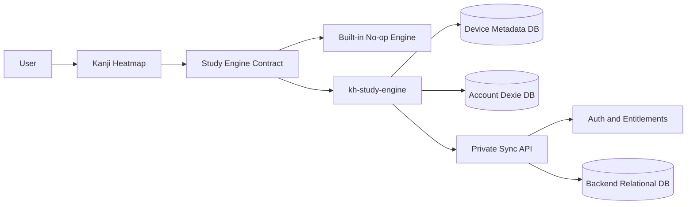
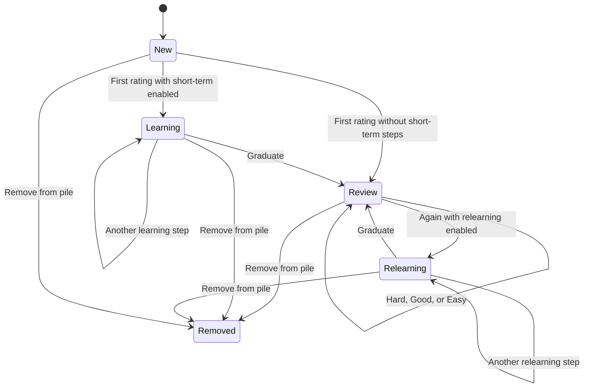
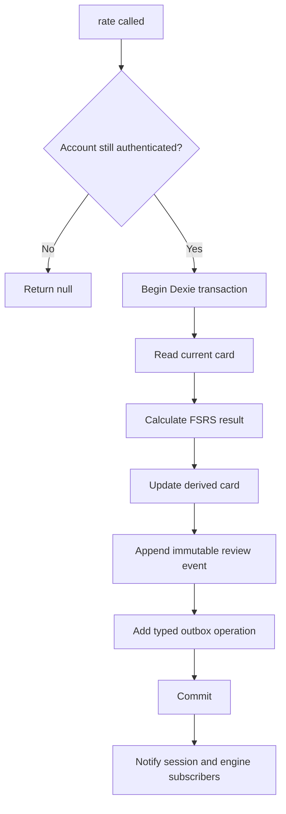
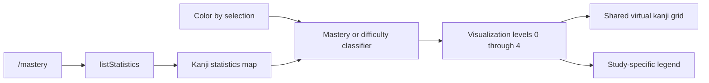
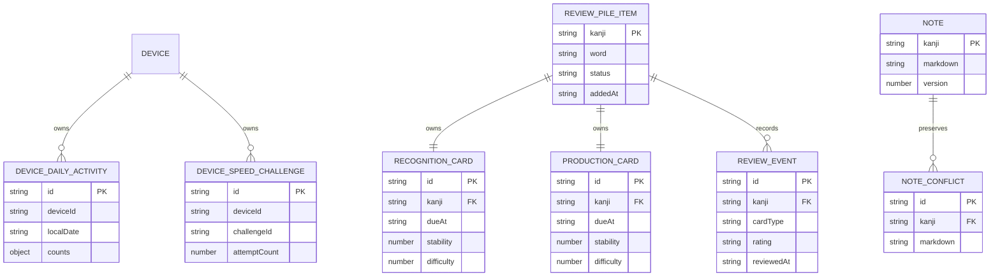
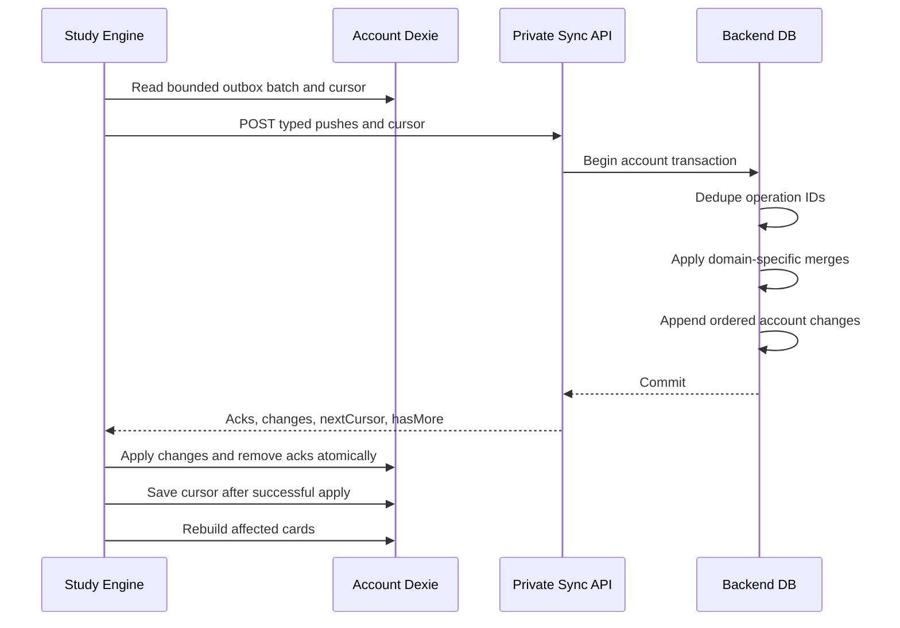
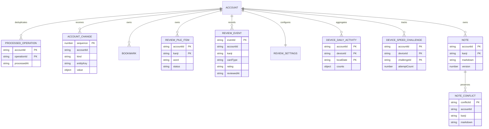

# Study Engine Plan V2

## Decisions

The system has three separately owned parts:

1. **Kanji Heatmap** — the public GPLv3 React application.
2. **`kh-study-engine`** — a separate public, GPL-compatible repository.
3. **Private backend** — authentication, entitlement, storage, and sync.

Kanji Heatmap uses a no-op engine by default. A normal `pnpm install` does
not download the official study engine. Developers may provide any compatible
engine through the build-time virtual module.

The first release deliberately favors simple, explicit rules:

- Login is required for reviews, bookmarks, activity, notes, and sync.
- One review-pile item exists per kanji.
- Each pile item owns one reading card and one writing card.
- Reading and writing share one FSRS settings document.
- There are no daily new-card or review limits.
- One Markdown note exists per kanji.
- Activity stores device-scoped summaries, not session histories.
- Review events are immutable; FSRS cards are derived and never synced.
- The backend uses one typed, cursor-based sync endpoint.
- The offline authentication lease lasts 14 days.

## Design principles

- Keep presentation logic in Kanji Heatmap.
- Keep scheduling, persistence, and sync out of React.
- Store only data that supports a current product requirement.
- Prefer typed domain operations over generic CRUD envelopes.
- Make local mutations immediately and sync them later.
- Keep immutable facts when ordering matters; use compact snapshots when only
  current aggregates matter.
- Do not add CRDTs, WebSockets, service-worker sync, or server-side FSRS in
  the first release.

## System architecture



### Kanji Heatmap owns

- React screens and components
- The versioned engine interface
- The built-in no-op engine
- The React provider and hooks
- Reading and writing review presentation
- The `/mastery` heatmap and visualization rules
- Markdown editing, previews, and sanitized rendering
- Visual and gameplay preferences
- Vite integration for selecting an engine

Application components never import `kh-study-engine` directly.

### `kh-study-engine` owns

- `ts-fsrs` integration
- Dexie and IndexedDB schemas
- Review-pile membership and review sessions
- Card scheduling, previews, and statistics
- Immutable review events
- Bookmarks
- Device-scoped activity summaries
- Per-kanji note persistence
- Shared FSRS settings
- Authentication API client and offline lease
- Typed sync outbox and cloud sync client

The engine is framework-independent. It does not depend on React, Wouter,
Tailwind, or Kanji Heatmap components.

### Private backend owns

- Sending and verifying email PINs
- Session creation and revocation
- Premium entitlement checks
- Canonical cloud data
- Idempotent sync processing
- Ordered account change delivery
- Note conflict preservation
- Billing, rate limits, secrets, and abuse prevention

The backend does not run FSRS and does not store materialized FSRS cards in
the first release.

## Storage policy

### localStorage

Only device-level preferences remain in localStorage:

- Theme and colors
- Font
- Item presentation settings
- Reading-practice preferences
- Writing-practice preferences
- Speed Katakana preferences

These settings work without login and are not synchronized.

### IndexedDB

The engine uses:

1. One small device metadata database.
2. One account-scoped Dexie database per user.

The metadata database identifies the device and the active account before an
account database is opened. Account databases contain all offline study data.

One browser profile has one active account at a time. Multiple tabs share the
same device ID and account database.

Logging out closes the account database and clears its offline lease. It does
not delete account data. Logging in to the same account reopens it.

### Existing anonymous data cleanup

Existing anonymous bookmarks and activity are not migrated. On startup,
Kanji Heatmap removes:

- `activity-all-time`
- `activity-by-day`
- Every localStorage key starting with `b:`

It does not call `localStorage.clear()`. Presentation and gameplay
preferences remain.

## Engine module

Every engine implementation exports the same versioned module:

```ts
export interface StudyEngineModule {
  readonly apiVersion: 1;

  createStudyEngine(options: StudyEngineOptions): StudyEngine;
}

export interface StudyEngineOptions {
  apiBaseUrl: string;
  clock?: () => Date;
}

export interface StudyUser {
  id: string;
  email: string;
}
```

The optional clock supports deterministic tests. Production uses current
date and time.

## Main engine interface

```ts
export interface StudyEngine {
  readonly auth: AuthService;
  readonly study: AuthenticatedStudy | null;

  initialize(): Promise<void>;
  dispose(): Promise<void>;

  getSnapshot(): StudyEngineSnapshot;
  subscribe(listener: () => void): () => void;
}

export interface AuthenticatedStudy {
  readonly review: ReviewService;
  readonly bookmarks: BookmarkService;
  readonly activity: ActivityService;
  readonly notes: NotesService;
  readonly sync: SyncService;
}
```

Only authentication is available while logged out:

```ts
engine.study === null;
```

Every service operation verifies the current account. A stale service
reference retained after logout returns `null` and does not touch IndexedDB.

## Engine state

```ts
export type StudyEngineSnapshot =
  | {
      status: "unavailable";
      revision: number;
    }
  | {
      status: "checking-session";
      revision: number;
    }
  | {
      status: "logged-out";
      revision: number;
    }
  | {
      status: "logged-in";
      user: StudyUser;
      connectivity: "online" | "offline";
      sync: SyncSnapshot;
      revision: number;
    };

export interface SyncSnapshot {
  status: "idle" | "syncing" | "offline" | "error";
  pendingOperationCount: number;
  lastSyncedAt: string | null;
  errorMessage: string | null;
}
```

- The no-op engine reports `unavailable`.
- An installed engine without a session reports `logged-out`.
- A valid offline lease reports `logged-in` with offline connectivity.

The React provider consumes `subscribe()` and `getSnapshot()` through
`useSyncExternalStore`.

## Authentication and offline lease

```ts
export interface AuthService {
  requestPin(email: string): Promise<AuthResult<PinChallenge>>;

  verifyPin(input: {
    challengeId: string;
    pin: string;
  }): Promise<AuthResult<StudyUser>>;

  refreshSession(): Promise<AuthResult<StudyUser | null>>;

  logout(): Promise<AuthResult<void>>;
}

export interface PinChallenge {
  id: string;
  expiresAt: string;
}

export type AuthResult<T> =
  | {
      ok: true;
      value: T;
    }
  | {
      ok: false;
      code:
        | "invalid-email"
        | "invalid-pin"
        | "expired-pin"
        | "rate-limited"
        | "network-error"
        | "server-error";
      message?: string;
    };
```

The browser calls same-origin endpoints:

```text
POST /api/auth/pin/request
POST /api/auth/pin/verify
POST /api/auth/logout
GET  /api/auth/session
POST /api/sync
```

`kanjiheatmap.com/api` proxies these requests to the private backend.
Online sessions use secure, HttpOnly cookies.

After successful online verification, the backend grants a signed offline
lease that expires 14 days from server time. The lease:

- Allows the local account database to open while offline.
- Allows offline reads, reviews, notes, bookmarks, and activity updates.
- Does not authorize backend API calls or sync.
- Is refreshed after successful online session verification.
- Is cleared immediately by explicit logout.

After expiration, the engine closes the account database and reports
`logged-out` until online authentication succeeds. Pending outbox entries stay
on disk. Remote revocation cannot take effect while a device is offline; this
is an inherent tradeoff of the lease.

## Public review facade

The consumer works with one active pile item per kanji. The representative
word stored on first addition is retained for that kanji. Duplicate additions
are idempotent. Removing and re-adding resumes the same item and review
history. Changing the representative word and resetting history is deferred
until there is a concrete product requirement.

```ts
export interface StudyItem {
  kanji: string;
  word: string;
}

export type CardType = "recognition" | "production";

/**
 * One user-facing pile entry.
 *
 * Internally it owns two cards: recognition and production.
 */
export interface ReviewPileItem {
  item: StudyItem;
  addedAt: string;
}

/**
 * Card-level counts currently eligible for a review session.
 *
 * `due` equals `new + learning + review`.
 * `learning` includes both Learning and Relearning FSRS states.
 */
export interface ReviewQueueCounts {
  due: number;
  new: number;
  learning: number;
  review: number;
}

export interface ReviewOverview {
  recognition: ReviewQueueCounts;
  production: ReviewQueueCounts;
}
```

`new` means a card that has never been reviewed. It is not a creation rule or
a daily quota. Every new or due card is available.

### Shared FSRS settings

```ts
/**
 * Account-wide settings shared by recognition and production.
 */
export interface ReviewSettings {
  requestRetention: number;
  maximumIntervalDays: number;
  enableFuzz: boolean;
  enableShortTerm: boolean;
  learningStepsMinutes: number[];
  relearningStepsMinutes: number[];
  modelWeights: readonly number[];
}
```

The settings map to these `ts-fsrs` parameters:

```text
requestRetention       -> request_retention
maximumIntervalDays    -> maximum_interval
enableFuzz             -> enable_fuzz
enableShortTerm        -> enable_short_term
learningStepsMinutes   -> learning_steps
relearningStepsMinutes -> relearning_steps
modelWeights           -> w
```

When short-term scheduling is disabled, learning and relearning steps remain
stored but are ignored. The UI hides those controls. Model weights are an
advanced option and are validated against the engine's pinned FSRS version.
FSRS 6 currently uses 21 weights.

There are no `newCardsPerDay` or `maximumReviewsPerDay` settings.

### Review service

```ts
export interface ReviewService {
  addToPile(item: StudyItem): Promise<ReviewPileItem | null>;

  removeFromPile(kanji: string): Promise<boolean | null>;

  isInPile(kanji: string): Promise<boolean | null>;

  /**
   * Returns active items newest-first by addedAt.
   * Ties are resolved lexicographically by kanji.
   */
  listPile(): Promise<ReviewPileItem[] | null>;

  /**
   * Returns the currently eligible card counts for both review modes.
   */
  getOverview(): Promise<ReviewOverview | null>;

  /**
   * Returns statistics for one active pile item.
   *
   * `undefined` means the kanji is not in the pile.
   * `null` means authenticated study access is unavailable.
   */
  getStatistics(
    kanji: string
  ): Promise<ReviewItemStatistics | undefined | null>;

  /**
   * Bulk form used by the Mastery heatmap.
   */
  listStatistics(): Promise<ReviewItemStatistics[] | null>;

  /**
   * Creates an in-memory queue from cards eligible at call time.
   */
  startSession(
    options: StartReviewSessionOptions
  ): Promise<ReviewSession | null>;

  getSettings(): Promise<ReviewSettings | null>;

  updateSettings(
    changes: Partial<ReviewSettings>
  ): Promise<ReviewSettings | null>;
}
```

Changing settings reschedules cards by replaying their immutable review
events under the new canonical settings.

## Review sessions

```ts
export interface StartReviewSessionOptions {
  cardType: CardType;

  /**
   * Optional size of this session, not a daily quota.
   * Omit it to include every currently eligible card.
   */
  limit?: number;
}

export interface ReviewSession {
  readonly id: string;
  readonly cardType: CardType;

  /**
   * Returns the current immutable UI view of this session.
   */
  getSnapshot(): ReviewSessionSnapshot;

  rate(rating: ReviewRating): Promise<void | null>;

  end(): Promise<ReviewSessionSummary | null>;

  subscribe(listener: () => void): () => void;
}

export interface ReviewSessionSummary {
  startedAt: string;
  endedAt: string;
  reviewedCount: number;
  ratingCounts: Record<ReviewRating, number>;
}

export interface ReviewSessionSnapshot {
  status: "loading" | "ready" | "saving" | "complete";
  current: PreparedReview | null;
  completedCount: number;

  /**
   * Cards remaining in this session, including current when present.
   */
  remainingCount: number;
}

export interface PreparedReview {
  item: StudyItem;
  cardType: CardType;
  preview: ReviewPreview;
}
```

`getSnapshot()` lets React subscribe to an asynchronous, stateful review
session without knowing its internal queue or persistence work:

- `loading`: the queue and first preview are being prepared.
- `ready`: the current card can be answered.
- `saving`: a rating transaction is in progress.
- `complete`: no cards remain or the session has ended.

The engine chooses eligible cards and their order. The first release orders
overdue Learning/Relearning cards first, then Review cards by earliest due
time, then New cards by pile addition time.

### Rating behavior

- Incorrect answer maps to `again`.
- Correct answer reveals Hard, Normal, and Easy.
- Normal maps to FSRS `good`.
- The engine records review time using its clock.
- The UI does not provide a timestamp.

```ts
export type ReviewRating = "again" | "hard" | "good" | "easy";

export type ReviewState = "new" | "learning" | "review" | "relearning";

export interface ReviewPreview {
  calculatedAt: string;
  outcomes: Record<ReviewRating, ReviewOutcome>;
}

export interface ReviewOutcome {
  intervalMinutes: number;
  nextDueAt: string;
  resultingState: ReviewState;
}
```

Previewing does not mutate data. Rating recalculates from the actual current
time before saving.

### Review state lifecycle



### Atomic rating transaction



## Review statistics

Statistics support per-kanji detail UI and the `/mastery` heatmap. They are
derived from the active cards and immutable review events.

```ts
export interface ReviewItemStatistics {
  item: StudyItem;
  addedAt: string;
  recognition: CardStatistics;
  production: CardStatistics;
}

export interface CardStatistics {
  createdAt: string;
  state: ReviewState;
  dueAt: string;
  lastReviewedAt: string | null;
  reviewCount: number;
  lapseCount: number;
  ratingCounts: Record<ReviewRating, number>;

  /**
   * Null until the card has a meaningful FSRS memory state.
   */
  stabilityDays: number | null;
  difficulty: number | null;
  retrievability: number | null;
}
```

There is no combined `totalReviewCount`. Consumers can display each mode's
count independently.

## Mastery heatmap

The `/mastery` route reuses the `/` route's search, sorting, drawer, virtual
grid, tile layout, item design, and five opacity levels. It changes only the
source and meaning of tile background color.

The implementation should extract a generic background-level resolver from
`useItemBtnCn`. A route-level provider supplies either frequency or study
levels. The internal five-band type should be named `VisualizationLevel`
rather than `FreqCategory`, while retaining the existing static CSS palette.

Under **Background Color Meaning**, the select field is labeled **Color by**
and contains:

- Reading Mastery
- Writing Mastery
- Combined Mastery
- Reading Difficulty
- Writing Difficulty
- Combined Difficulty

### Mastery levels

Mastery uses FSRS stability, not distance from today to the due date.
Stability is the estimated number of days for recall probability to fall from
100% to 90%. It remains meaningful when a card is overdue and does not shift
merely because request retention changes.

| Level | Meaning                                                    |
| ----- | ---------------------------------------------------------- |
| 0     | Not studying; there is no card                             |
| 1     | New card, or stability below 30 days                       |
| 2     | Stability from 30 through 334 days                         |
| 3     | Stability at least 335 days and card age below 365 days    |
| 4     | Stability at least 335 days and card age at least 365 days |

Combined Mastery is the lower of reading and writing. A strong mode cannot
hide the weaker mode.

### Difficulty levels

FSRS difficulty ranges from 1 to 10 and changes only after a review.
Fixed thresholds keep colors stable as the user's studied population changes.

| Level | Meaning                          | FSRS difficulty       |
| ----- | -------------------------------- | --------------------- |
| 0     | No reviewed-card difficulty data | None                  |
| 1     | Easy                             | 1 to less than 3.25   |
| 2     | Moderate                         | 3.25 to less than 5.5 |
| 3     | Difficult                        | 5.5 to less than 7.75 |
| 4     | Very Difficult                   | 7.75 through 10       |

Combined Difficulty is the higher available reading or writing difficulty.
If neither card has been reviewed, it is level 0.

### Mastery data flow



The screen performs one bulk IndexedDB query and builds a
`kanji -> statistics` map. It does not call `getStatistics()` once per tile.
It has explicit unavailable-engine, logged-out, loading, and empty states.

## Bookmarks

Bookmarks remain keyed by kanji and word because a kanji may have multiple
bookmarkable vocabulary entries.

```ts
export interface BookmarkService {
  create(item: StudyItem): Promise<Bookmark | null>;
  delete(item: StudyItem): Promise<boolean | null>;
  has(item: StudyItem): Promise<boolean | null>;
  list(): Promise<Bookmark[] | null>;
}

export interface Bookmark {
  item: StudyItem;
  createdAt: string;
}
```

When logged out, bookmark controls show a login prompt.

## Practice activity

Games remain playable while logged out, but anonymous activity is not
recorded.

The dashboard currently needs:

- Daily activity intensity
- Active-day counts
- Total Speed Katakana sessions
- Total reading rounds
- Total writing rounds
- Per-device Speed Katakana challenge progress

It does not need item-level answers, item counts, correct counts, or
per-session score histories. Those are not stored.

```ts
export type PracticeGameId = string;

export interface DailyActivityCount {
  date: string;
  gameId: PracticeGameId;
  count: number;
}

export interface ActivityTotal {
  gameId: PracticeGameId;
  count: number;
}

export interface TimedValue {
  timestamp: string;
  value: number;
}

export interface SpeedKatakanaAttempt {
  completedAt: string;
  accuracyPercent: number;
  charactersPerMinute: number;
}

export interface SpeedKatakanaChallengeProgress {
  challengeId: string;
  attemptCount: number;
  latestAttempt: SpeedKatakanaAttempt;
  bestAccuracy: TimedValue;
  bestSpeed: TimedValue;
  bestSpeedAbove70Accuracy: TimedValue | null;
  updatedAt: string;
}

export interface ActivityService {
  /**
   * Records one completed reading, writing, or future practice round.
   * Speed Katakana uses recordSpeedKatakanaAttempt instead.
   */
  recordCompletion(gameId: PracticeGameId): Promise<void | null>;

  /**
   * Atomically increments today's Speed Katakana count and updates the
   * active device's challenge snapshot.
   */
  recordSpeedKatakanaAttempt(input: {
    challengeId: string;
    accuracyPercent: number;
    charactersPerMinute: number;
  }): Promise<SpeedKatakanaChallengeProgress | null>;

  getDailyCounts(input: {
    from: string;
    to: string;
    gameIds?: PracticeGameId[];
  }): Promise<DailyActivityCount[] | null>;

  getTotals(input?: {
    gameIds?: PracticeGameId[];
  }): Promise<ActivityTotal[] | null>;

  listSpeedKatakanaChallenges(): Promise<
    SpeedKatakanaChallengeProgress[] | null
  >;
}
```

Stable game IDs are:

```text
speed-katakana-v1
kanji-reading-v1
kanji-writing-v1
sentence-shadowing-v1
fsrs-reading-v1
fsrs-writing-v1
```

Only completed 48-word Speed Katakana runs update activity and challenge
progress. Each completed 10-item reading or writing round increments its
device's daily counter. Future speaking/shadowing practice initially needs
only a daily completion count; specialized progress is added only when the
dashboard has a concrete requirement.

### Device-scoped merge model

A day is not keyed only by date. That would lose increments when two offline
devices sync. The engine stores one row per `(deviceId, localDate)` and sums
device rows when producing account-level daily counts.

Speed Katakana stores one rolling row per `(deviceId, challengeId)`. This
keeps device performance separate without another input-mode dimension.

For the same device row:

- Daily counters merge component-wise by maximum.
- Attempt count merges by maximum.
- Latest attempt uses the newest completion timestamp.
- Best values merge by maximum.

Different devices remain separate. Account daily totals sum device rows.
The current dashboard reads Speed Katakana challenge progress for the active
device.

## Per-kanji Markdown notes

There is at most one current note per kanji. The kanji is the note identity;
there is no arbitrary ID or title.

```ts
export interface StudyNote {
  kanji: string;
  markdown: string;
  version: number;
  createdAt: string;
  updatedAt: string;
}

export interface NoteConflictCopy {
  id: string;
  kanji: string;
  markdown: string;
  baseVersion: number;
  createdAt: string;
}

export type NoteSaveResult =
  | {
      status: "saved";
      note: StudyNote;
    }
  | {
      status: "conflict";
      note: StudyNote;
      conflictCopy: NoteConflictCopy;
    };

export interface NotesService {
  /**
   * expectedVersion is null when creating the first note.
   */
  save(input: {
    kanji: string;
    markdown: string;
    expectedVersion: number | null;
  }): Promise<NoteSaveResult | null>;

  delete(input: {
    kanji: string;
    expectedVersion: number;
  }): Promise<boolean | null>;

  get(kanji: string): Promise<StudyNote | undefined | null>;

  list(): Promise<StudyNote[] | null>;
}
```

Kanji Heatmap owns editing, previews, and sanitized rendering. Raw HTML is
disabled by default.

If two devices edit from the same base version, the backend keeps its current
note and stores the stale submitted version as a conflict copy. A CRDT is not
needed.

## Local IndexedDB schema

All timestamps are UTC ISO 8601 strings unless a field explicitly represents
a local calendar date. Fixed-width ISO strings remain chronologically
sortable in IndexedDB indexes and JSON sync payloads.

Schema changes use explicit Dexie versions and migration functions.

### Device metadata database

Database name: `kh-study-device`

#### `device`

| Column      | Type        | Purpose                         |
| ----------- | ----------- | ------------------------------- |
| `id`        | `"current"` | Singleton primary key           |
| `deviceId`  | string      | Random stable device identifier |
| `createdAt` | string      | Device record creation time     |

Dexie indexes:

```text
id
```

#### `accounts`

| Column           | Type   | Purpose                  |
| ---------------- | ------ | ------------------------ |
| `userId`         | string | Primary key              |
| `email`          | string | Display identity         |
| `offlineLease`   | string | Signed local-only lease  |
| `leaseExpiresAt` | string | Lease expiration         |
| `lastVerifiedAt` | string | Last online verification |

Dexie indexes:

```text
userId, leaseExpiresAt
```

#### `activeAccount`

| Column   | Type        | Purpose               |
| -------- | ----------- | --------------------- |
| `id`     | `"current"` | Singleton primary key |
| `userId` | string      | Active account        |

Dexie indexes:

```text
id, userId
```

### Account database

Database name: `kh-study-account-${hash(userId)}`

The database name uses a deterministic hash so it does not expose an email
address or raw account identifier.

#### `reviewPileItems`

| Column          | Type                    | Purpose                       |
| --------------- | ----------------------- | ----------------------------- |
| `kanji`         | string                  | Primary key and pile identity |
| `word`          | string                  | Frozen representative word    |
| `addedAt`       | string                  | First addition time           |
| `status`        | `"active" \| "removed"` | Membership/tombstone state    |
| `removedAt`     | string or null          | Removal time                  |
| `updatedAt`     | string                  | Last local or remote update   |
| `serverVersion` | number                  | Last applied server version   |

Dexie indexes:

```text
kanji, [status+addedAt], updatedAt
```

#### `cards`

Cards are rebuildable local materialized state. They are never synchronized.

| Column          | Type                    | Purpose                        |
| --------------- | ----------------------- | ------------------------------ |
| `id`            | string                  | `kanji + cardType` primary key |
| `kanji`         | string                  | Pile item                      |
| `cardType`      | `CardType`              | Recognition or production      |
| `createdAt`     | string                  | Card creation time             |
| `dueAt`         | string                  | Next due time                  |
| `state`         | `ReviewState`           | FSRS state                     |
| `stability`     | number                  | FSRS stability                 |
| `difficulty`    | number                  | FSRS difficulty                |
| `scheduledDays` | number                  | Last scheduled interval        |
| `reps`          | number                  | Review count                   |
| `lapses`        | number                  | Again count                    |
| `learningSteps` | number                  | Current step position          |
| `lastReviewAt`  | string or null          | Most recent review             |
| `status`        | `"active" \| "removed"` | Mirrors pile membership        |

Dexie indexes:

```text
id, &[kanji+cardType], [cardType+dueAt], [cardType+state+dueAt]
```

#### `reviewEvents`

| Column           | Type           | Purpose                      |
| ---------------- | -------------- | ---------------------------- |
| `id`             | string         | Immutable event UUID         |
| `kanji`          | string         | Reviewed pile item           |
| `cardType`       | `CardType`     | Reviewed mode                |
| `rating`         | `ReviewRating` | User rating                  |
| `reviewedAt`     | string         | Actual review time           |
| `deviceId`       | string         | Originating device           |
| `serverSequence` | number or null | Delivery sequence after sync |

Dexie indexes:

```text
id, [kanji+cardType+reviewedAt], reviewedAt, deviceId, serverSequence
```

#### `reviewSettings`

| Column                   | Type        | Purpose                   |
| ------------------------ | ----------- | ------------------------- |
| `id`                     | `"current"` | Singleton primary key     |
| `fsrsVersion`            | string      | Parameter compatibility   |
| `version`                | number      | Optimistic sync version   |
| `requestRetention`       | number      | Target recall probability |
| `maximumIntervalDays`    | number      | Interval cap              |
| `enableFuzz`             | boolean     | Interval fuzz             |
| `enableShortTerm`        | boolean     | Short-term scheduling     |
| `learningStepsMinutes`   | number[]    | Learning steps            |
| `relearningStepsMinutes` | number[]    | Relearning steps          |
| `modelWeights`           | number[]    | FSRS model weights        |
| `updatedAt`              | string      | Last update               |

Dexie indexes:

```text
id
```

#### `bookmarks`

| Column          | Type                    | Purpose                          |
| --------------- | ----------------------- | -------------------------------- |
| `id`            | string                  | Deterministic `kanji + word` key |
| `kanji`         | string                  | Bookmarked kanji                 |
| `word`          | string                  | Bookmarked word                  |
| `createdAt`     | string                  | Creation time                    |
| `status`        | `"active" \| "removed"` | State/tombstone                  |
| `removedAt`     | string or null          | Removal time                     |
| `updatedAt`     | string                  | Last update                      |
| `serverVersion` | number                  | Last applied server version      |

Dexie indexes:

```text
id, &[kanji+word], [status+createdAt], updatedAt
```

#### `deviceDailyActivity`

| Column             | Type                             | Purpose                            |
| ------------------ | -------------------------------- | ---------------------------------- |
| `id`               | string                           | `deviceId + localDate` primary key |
| `deviceId`         | string                           | Owning device                      |
| `localDate`        | string                           | `YYYY-MM-DD` activity date         |
| `utcOffsetMinutes` | number                           | Date interpretation                |
| `counts`           | `Record<PracticeGameId, number>` | Monotonic counters                 |
| `updatedAt`        | string                           | Last update                        |

Dexie indexes:

```text
id, &[deviceId+localDate], localDate, deviceId
```

#### `deviceSpeedKatakanaChallenges`

| Column                     | Type                 | Purpose                              |
| -------------------------- | -------------------- | ------------------------------------ |
| `id`                       | string               | `deviceId + challengeId` primary key |
| `deviceId`                 | string               | Owning device                        |
| `challengeId`              | string               | Challenge identity                   |
| `attemptCount`             | number               | Monotonic attempt count              |
| `latestAttempt`            | object               | Latest accuracy, speed, and time     |
| `bestAccuracy`             | `TimedValue`         | Best accuracy                        |
| `bestSpeed`                | `TimedValue`         | Best speed                           |
| `bestSpeedAbove70Accuracy` | `TimedValue` or null | Qualified best                       |
| `updatedAt`                | string               | Last update                          |

Dexie indexes:

```text
id, &[deviceId+challengeId], deviceId, challengeId
```

#### `notes`

| Column      | Type                    | Purpose                 |
| ----------- | ----------------------- | ----------------------- |
| `kanji`     | string                  | Primary key             |
| `markdown`  | string                  | Raw Markdown            |
| `version`   | number                  | Optimistic sync version |
| `status`    | `"active" \| "removed"` | State/tombstone         |
| `createdAt` | string                  | Creation time           |
| `updatedAt` | string                  | Update time             |
| `removedAt` | string or null          | Deletion time           |

Dexie indexes:

```text
kanji, status, updatedAt
```

#### `noteConflicts`

| Column        | Type   | Purpose            |
| ------------- | ------ | ------------------ |
| `id`          | string | Conflict UUID      |
| `kanji`       | string | Conflicted note    |
| `markdown`    | string | Preserved Markdown |
| `baseVersion` | number | Version edited     |
| `createdAt`   | string | Conflict time      |

Dexie indexes:

```text
id, kanji, [kanji+createdAt], createdAt
```

#### `outbox`

| Column          | Type           | Purpose                      |
| --------------- | -------------- | ---------------------------- |
| `operationId`   | string         | Idempotency UUID             |
| `kind`          | string         | Typed append/upsert kind     |
| `body`          | object         | Discriminated operation body |
| `occurredAt`    | string         | Local operation time         |
| `attemptCount`  | number         | Retry count                  |
| `lastAttemptAt` | string or null | Last push attempt            |

Dexie indexes:

```text
operationId, kind, occurredAt, lastAttemptAt
```

#### `syncMetadata`

| Column           | Type           | Purpose                                |
| ---------------- | -------------- | -------------------------------------- |
| `id`             | `"current"`    | Singleton primary key                  |
| `cursor`         | number or null | Last locally committed change sequence |
| `lastSyncedAt`   | string or null | Last completed sync                    |
| `lastServerTime` | string or null | Most recent server time                |

Dexie indexes:

```text
id
```

### Local schema relationships



## Sync strategy

The client changes local data first and adds a typed operation to the outbox
in the same Dexie transaction. Sync transports those operations and pulls
canonical account changes.

The protocol has two lanes:

1. **Append-only:** immutable review events.
2. **Typed upserts:** bookmarks, pile membership, settings, notes, daily
   activity, and Speed Katakana challenge snapshots.

Cards, statistics, and dashboard totals are derived locally and never synced.

### Local mutation rule

Every local mutation:

1. Verifies the authenticated account.
2. Updates the local domain row.
3. Adds a typed operation with a unique operation ID.
4. Commits the data and outbox entry atomically.
5. Updates UI subscribers immediately.

### Typed protocol

```ts
export interface ReviewEventPush {
  operationId: string;
  event: {
    id: string;
    kanji: string;
    cardType: CardType;
    rating: ReviewRating;
    reviewedAt: string;
    deviceId: string;
  };
}

export type SyncUpsert =
  | {
      kind: "bookmark";
      operationId: string;
      value: BookmarkSyncRecord;
    }
  | {
      kind: "review-pile-item";
      operationId: string;
      value: ReviewPileSyncRecord;
    }
  | {
      kind: "review-settings";
      operationId: string;
      expectedVersion: number;
      value: ReviewSettingsSyncRecord;
    }
  | {
      kind: "note";
      operationId: string;
      expectedVersion: number | null;
      value: NoteSyncRecord;
    }
  | {
      kind: "device-daily-activity";
      operationId: string;
      value: DeviceDailyActivitySyncRecord;
    }
  | {
      kind: "device-speed-katakana-challenge";
      operationId: string;
      value: DeviceSpeedChallengeSyncRecord;
    };

export interface SyncRequest {
  deviceId: string;
  cursor: number | null;
  reviewEvents: ReviewEventPush[];
  upserts: SyncUpsert[];
}

export type AccountChange =
  | ReviewEventChange
  | BookmarkChange
  | ReviewPileChange
  | ReviewSettingsChange
  | NoteChange
  | NoteConflictChange
  | DeviceDailyActivityChange
  | DeviceSpeedChallengeChange;

export interface SyncResponse {
  acknowledgedOperationIds: string[];
  changes: AccountChange[];
  nextCursor: number;
  hasMore: boolean;
  serverTime: string;
}
```

Each `AccountChange` is a discriminated union member with a sequence, a
literal kind, and a fully typed domain value. The protocol has no
`payload: unknown` and does not allow update/delete actions on immutable
review events.

### One sync round trip



### Backend transaction

For each `POST /api/sync`, the backend:

1. Verifies the HttpOnly session and premium entitlement.
2. Validates the full typed batch before applying it.
3. Begins one database transaction.
4. Skips operations already present in `processed_operations`.
5. Applies new operations with entity-specific rules.
6. Appends canonical rows to `account_changes`.
7. Records accepted operation IDs.
8. Selects the next bounded page after the supplied cursor.
9. Commits and returns acknowledgements and changes.

A lost response is safe: the client retries the same operation IDs and the
backend acknowledges them without applying them twice.

Recommended initial limits:

- At most 100 pushed operations per request.
- At most 500 pulled changes per response.
- Continue while `hasMore` is true.

### Ordering

`account_changes.sequence` orders delivery and cursor advancement. It does
not define when an offline review happened.

Review replay sorts events by:

1. `reviewedAt`
2. `deviceId`
3. event ID

Using server receipt order would incorrectly turn reviews completed offline
into reviews performed at sync time. The backend validates timestamps against
the 14-day lease window and rejects unreasonable future timestamps. Browser
clocks cannot be made tamper-proof in a public local engine.

### Merge rules

- **Review events:** immutable union by event ID.
- **Bookmarks:** last operation accepted by the server; retain tombstones.
- **Pile membership:** last operation accepted by the server; retain
  tombstones.
- **Settings:** one document with `expectedVersion`; on conflict, the server
  version wins and is returned.
- **Notes:** `expectedVersion`; stale submissions become conflict copies.
- **Daily activity:** for one device/day, merge every counter by maximum.
- **Speed challenge:** for one device/challenge, merge attempt count and best
  values by maximum and latest attempt by newest timestamp.
- **Cards:** never synced; replay events under current canonical settings.

### Sync triggers

Sync runs:

- At engine startup after session verification
- Shortly after a local mutation, with debounce
- When connectivity returns
- When the tab becomes focused
- Periodically while an authenticated tab remains active
- When the user requests Sync Now

Use the Web Locks API so one tab owns sync work for an account at a time.
Use exponential backoff with jitter after transient errors.

Do not add WebSockets, CRDTs, background service-worker sync, or aggressive
real-time polling in the first release.

### Recovery and retention

- Keep the complete account change log initially.
- A new device starts with a null cursor and pulls all pages.
- A corrupted local account database can be deleted and rebuilt by a full
  pull followed by review replay.
- The client advances its cursor only in the same Dexie transaction that
  successfully applies the page.
- The client removes outbox entries only when their operation IDs are
  acknowledged.
- Add snapshots or change-log compaction only after measured scale requires
  them.

## Backend relational schema

The exact SQL dialect depends on the backend platform. The logical tables are
the same for PostgreSQL or another transactional relational database.

### Sync infrastructure

#### `processed_operations`

```text
account_id
operation_id
processed_at
PRIMARY KEY (account_id, operation_id)
```

#### `account_changes`

```text
sequence
account_id
kind
entity_key
value
source_device_id
source_operation_id
created_at
PRIMARY KEY (sequence)
INDEX (account_id, sequence)
```

### Canonical domain tables

#### `bookmarks`

```text
account_id
bookmark_id
kanji
word
status
created_at
removed_at
version
PRIMARY KEY (account_id, bookmark_id)
```

#### `review_pile_items`

```text
account_id
kanji
word
status
added_at
removed_at
version
PRIMARY KEY (account_id, kanji)
```

#### `review_events`

```text
account_id
event_id
device_id
kanji
card_type
rating
reviewed_at
PRIMARY KEY (account_id, event_id)
INDEX (account_id, kanji, card_type, reviewed_at)
```

#### `review_settings`

```text
account_id
version
fsrs_version
settings
updated_at
PRIMARY KEY (account_id)
```

#### `device_daily_activity`

```text
account_id
device_id
local_date
utc_offset_minutes
counts
updated_at
PRIMARY KEY (account_id, device_id, local_date)
```

#### `device_speed_katakana_challenges`

```text
account_id
device_id
challenge_id
attempt_count
latest_attempt
best_accuracy
best_speed
best_speed_above_70_accuracy
updated_at
PRIMARY KEY (account_id, device_id, challenge_id)
```

#### `notes`

```text
account_id
kanji
markdown
version
status
created_at
updated_at
removed_at
PRIMARY KEY (account_id, kanji)
```

#### `note_conflicts`

```text
account_id
conflict_id
kanji
markdown
base_version
created_at
PRIMARY KEY (account_id, conflict_id)
INDEX (account_id, kanji, created_at)
```

There is no backend card table and no per-session activity table.

### Backend schema relationships



## Internal review separation

```text
ReviewService facade
├── ReviewPileRepository
├── CardRepository
├── ReviewEventRepository
├── ReviewSessionManager
├── FsrsScheduler
├── ReviewSettingsRepository
├── EngineClock
└── SyncOutbox
```

These parts are implementation details and can be unit-tested independently.

## Selecting an engine

Application code imports one virtual module:

```ts
import { createStudyEngine } from "virtual:study-engine";
```

Vite resolves it using:

```env
KH_STUDY_ENGINE_ENTRY=/absolute/or/relative/path/to/dist/index.js
```

Selection rules:

- Variable not set: use the no-op engine.
- Configured file exists and supports API version 1: use it.
- Missing, invalid, or incompatible file: warn and use the no-op.

React components contain no engine-selection branches.

## Contributor and custom-engine flow

Normal development:

```bash
pnpm install
pnpm dev
```

Custom engine:

```bash
cd ../my-study-engine
pnpm install
pnpm build

cd ../kanji-heatmap
KH_STUDY_ENGINE_ENTRY=../my-study-engine/dist/index.js pnpm dev
```

## Production build

Cloudflare Pages runs:

```bash
pnpm build:production
```

Production environment variables provide:

```env
KH_STUDY_ENGINE_VERSION=v1.2.0
KH_STUDY_ENGINE_COMMIT=immutable-commit-sha
KH_STUDY_ENGINE_SHA256=expected-archive-checksum
```

The production build:

1. Downloads the pinned public engine release.
2. Verifies commit and archive checksum.
3. Extracts it under `.vendor/kh-study-engine`.
4. Installs locked dependencies.
5. Builds the engine.
6. Builds Kanji Heatmap with its entry path.

The engine becomes part of normal hashed Vite assets and works with the PWA
offline.

If preparation fails, the build warns and uses the no-op. Production
monitoring alerts when the deployed engine reports `unavailable`.

## Licensing

- Kanji Heatmap remains GPLv3.
- `kh-study-engine` is public and GPL-compatible.
- `ts-fsrs` is MIT.
- Dexie is Apache-2.0.
- Required notices are retained.
- The private backend remains separate and proprietary.

Local FSRS behavior cannot be securely paywalled because it runs in public
browser code. Authentication, cloud sync, backups, and multi-device support
remain enforceable premium services.

Developers may distribute other compatible engines subject to applicable GPL
terms.

## Implementation order

1. Publish and test the versioned engine contract.
2. Add the no-op engine and React provider.
3. Add Vite virtual-module selection.
4. Add device metadata and account-scoped Dexie databases.
5. Implement review pile, cards, events, settings, and migrations.
6. Add review facade and repository unit tests.
7. Implement reading and writing review sessions.
8. Add previews, statistics, and bulk statistics.
9. Implement the shared `/` and `/mastery` heatmap shell.
10. Add bookmarks and per-kanji notes.
11. Replace anonymous activity with device-scoped summaries.
12. Add authentication and the 14-day offline lease.
13. Implement the typed backend sync endpoint and relational schema.
14. Add multi-device, retry, conflict, and full-rebuild tests.
15. Add the pinned production build.
16. Add monitoring for accidental no-op production deployments.

## Required tests

- Duplicate pile addition is idempotent.
- One kanji creates exactly two cards.
- Pile removal tombstones both cards.
- No daily card/review limits are applied.
- Rating atomically updates card, event, and outbox.
- Settings are shared by reading and writing.
- Settings changes deterministically rebuild cards.
- Duplicate sync operation IDs do not duplicate data.
- Lost sync responses are safe to retry.
- Review events from two offline devices are both retained.
- Review replay ordering is deterministic.
- Daily activity from two devices sums without lost increments.
- Same-device daily rows merge counters by maximum.
- Speed challenge rows merge best and latest values correctly.
- Stale note updates preserve conflict copies.
- Expired leases prevent the account database from opening.
- A deleted local database can rebuild from a null cursor.

## Resolved product decisions

- Offline lease: 14 days.
- FSRS settings: shared by reading and writing.
- Notes: one per kanji.
- Review pile: one item per kanji.
- Pile list order: newest first.
- Activity: per-device daily and Speed Katakana challenge snapshots.
- Session score history: not stored.
- Mastery: FSRS stability and card age.
- Combined mastery: weaker mode.
- Combined difficulty: harder mode.
- Backend cards: not stored.
- Sync transport: typed push plus ordered cursor pull.
