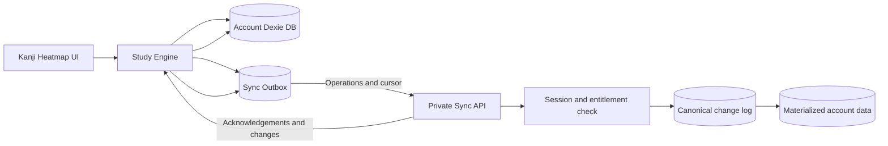

# Study Engine Plan

## Decision

We will use three separate parts:

1. **Kanji Heatmap** — the public GPLv3 React application.
2. **`kh-study-engine`** — a separate public, GPL-compatible repository.
3. **Backend** — a private service owned by PikaPikaGems.

Kanji Heatmap will use a no-op engine by default. A normal `pnpm install`
will not download or install `kh-study-engine`.

Developers can provide any compatible study engine through an environment
variable. The official engine is one implementation, not a required default.

## Goals

- Keep Kanji Heatmap easy to build and contribute to.
- Let developers use their own engine.
- Keep React independent of engine implementation details.
- Support offline reviews and later multi-device sync.
- Require login for bookmarks, activity history, reviews, and notes.
- Keep authentication, cloud storage, and premium access control in the
  private backend.

## Responsibilities

### Kanji Heatmap

Kanji Heatmap owns:

- React screens and components
- The versioned engine interface
- The built-in no-op engine
- The React provider and hooks
- Recognition and production quiz presentation
- Markdown editing and safe rendering
- Visual and gameplay preferences
- Vite integration for selecting an engine

Application components never import `kh-study-engine` directly.

### `kh-study-engine`

The official engine owns:

- `ts-fsrs` integration
- Dexie and IndexedDB storage
- Review pile and review sessions
- Card scheduling and review history
- Bookmarks and practice activity
- Markdown note persistence
- FSRS settings
- Offline operation queue
- Authentication API client
- Cloud sync client

It is framework-independent. It does not depend on React, Wouter, Tailwind,
or Kanji Heatmap components.

### Private backend

The backend owns:

- Sending and verifying email PINs
- Session creation and revocation
- Premium entitlement checks
- Cloud data storage
- Sync processing and conflict handling
- Billing, rate limits, secrets, and abuse prevention

The browser never stores backend secrets or long-lived session tokens.

## Storage policy

### localStorage

Only device-level preferences remain in localStorage:

- Theme and colors
- Font
- Presentation settings
- Recognition practice preferences
- Production practice preferences
- Speed Katakana preferences

These settings work without login and are not synchronized.

### Account-scoped IndexedDB

The engine stores account data in a separate Dexie database for each user:

- Bookmarks
- Practice activity
- Review pile and FSRS card state
- Immutable review events
- FSRS settings
- Markdown notes
- Pending sync operations
- Sync cursor and metadata

One browser profile has one active user at a time. Multiple tabs share that
user. Different accounts require switching accounts or separate browser
profiles.

Logging out closes the active database but does not delete it. The same
account can reopen it after logging in again.

### Existing data cleanup

We will not migrate existing anonymous bookmarks or activity history.

On startup, Kanji Heatmap will remove:

- `activity-all-time`
- `activity-by-day`
- Every localStorage key starting with `b:`

It will not call `localStorage.clear()`. Presentation and gameplay settings
remain untouched.

## Engine module

Every implementation exports the same module:

```ts
export interface StudyEngineModule {
  readonly apiVersion: 1;

  createStudyEngine(options: StudyEngineOptions): StudyEngine;
}

export interface StudyEngineOptions {
  apiBaseUrl: string;
  clock?: () => Date;
}

export interface StudyUser {
  id: string;
  email: string;
}
```

The optional clock is for deterministic tests. Production uses the current
date and time.

## Main engine interface

```ts
export interface StudyEngine {
  readonly auth: AuthService;
  readonly study: AuthenticatedStudy | null;

  initialize(): Promise<void>;
  dispose(): Promise<void>;

  getSnapshot(): StudyEngineSnapshot;
  subscribe(listener: () => void): () => void;
}
```

Only authentication is available while logged out. Bookmarks, activity,
reviews, settings, notes, and sync are grouped under `study`.

```ts
export interface AuthenticatedStudy {
  readonly review: ReviewService;
  readonly bookmarks: BookmarkService;
  readonly activity: ActivityService;
  readonly notes: NotesService;
  readonly sync: SyncService;
}
```

When the user is logged out:

```ts
engine.study === null;
```

The engine also checks authentication inside every operation. If old code
keeps a service reference after logout, reads and writes return `null` and do
not touch IndexedDB.

## Engine state

```ts
export type StudyEngineSnapshot =
  | {
      status: "unavailable";
      revision: number;
    }
  | {
      status: "checking-session";
      revision: number;
    }
  | {
      status: "logged-out";
      revision: number;
    }
  | {
      status: "logged-in";
      user: StudyUser;
      connectivity: "online" | "offline";
      sync: SyncSnapshot;
      revision: number;
    };

export interface SyncSnapshot {
  status: "idle" | "syncing" | "offline" | "error";
  pendingOperationCount: number;
  lastSyncedAt: string | null;
  errorMessage: string | null;
}
```

- The no-op engine reports `unavailable`.
- An installed engine without a session reports `logged-out`.
- A valid offline lease reports `logged-in` with `offline` connectivity.

The React provider uses `subscribe()` and `getSnapshot()` with
`useSyncExternalStore`.

## Authentication

Authentication must remain available while logged out:

```ts
export interface AuthService {
  requestPin(email: string): Promise<AuthResult<PinChallenge>>;

  verifyPin(input: {
    challengeId: string;
    pin: string;
  }): Promise<AuthResult<StudyUser>>;

  refreshSession(): Promise<AuthResult<StudyUser | null>>;

  logout(): Promise<AuthResult<void>>;
}

export interface PinChallenge {
  id: string;
  expiresAt: string;
}

export type AuthResult<T> =
  | {
      ok: true;
      value: T;
    }
  | {
      ok: false;
      code:
        | "invalid-email"
        | "invalid-pin"
        | "expired-pin"
        | "rate-limited"
        | "network-error"
        | "server-error";
      message?: string;
    };
```

The browser calls same-origin endpoints:

```text
POST /api/auth/pin/request
POST /api/auth/pin/verify
POST /api/auth/logout
GET  /api/auth/session
POST /api/sync
```

`kanjiheatmap.com/api` proxies requests to the private backend. Browser
sessions use secure, HttpOnly cookies.

After an online login, the backend may grant a limited offline lease. A valid
lease lets the user review offline. When the connection returns, the backend
verifies the session and premium entitlement before accepting sync.

## Public review facade

The consumer works with a review pile and review sessions. It does not manage
FSRS cards, Dexie rows, scheduler state, or sync operations.

```ts
export interface StudyItem {
  kanji: string;
  word: string;
}

export type CardType = "recognition" | "production";

/**
 * One user-facing entry in the review pile.
 *
 * Internally, one entry owns two FSRS cards: recognition and production.
 */
export interface ReviewPileItem {
  item: StudyItem;
  addedAt: string;
}

export interface ReviewOverview {
  itemCount: number;
  recognition: ReviewQueueCounts;
  production: ReviewQueueCounts;
}

export interface ReviewQueueCounts {
  due: number;
  new: number;
  learning: number;
  review: number;
}

export interface ReviewSettings {
  desiredRetention: number;
  maximumIntervalDays: number;
  newCardsPerDay: number;
  maximumReviewsPerDay: number;
  learningStepsMinutes: number[];
  relearningStepsMinutes: number[];
}

export interface ReviewService {
  addToPile(item: StudyItem): Promise<ReviewPileItem | null>;

  removeFromPile(item: StudyItem): Promise<boolean | null>;

  isInPile(item: StudyItem): Promise<boolean | null>;

  listPile(): Promise<ReviewPileItem[] | null>;

  getOverview(): Promise<ReviewOverview | null>;

  getStatistics(
    item: StudyItem
  ): Promise<ReviewItemStatistics | undefined | null>;

  startSession(
    options: StartReviewSessionOptions
  ): Promise<ReviewSession | null>;

  getSettings(): Promise<ReviewSettings | null>;

  updateSettings(
    changes: Partial<ReviewSettings>
  ): Promise<ReviewSettings | null>;
}
```

### Adding to the review pile

`ReviewPileItem` is the user-facing record that says a `StudyItem` belongs to
the review pile. It is not an FSRS card. It contains the item and pile-level
metadata such as when it was added. Returning this record leaves room for
future pile-level metadata without exposing the two internal cards.

Adding one item always creates two internal FSRS cards:

```text
kanji + word + recognition
kanji + word + production
```

Calling `addToPile()` more than once is idempotent. Removing an item
tombstones both cards.

The engine stores only `kanji` and `word` as the study item. Kanji Heatmap
resolves readings, meanings, keywords, and other presentation data from its
canonical JSON data.

## Review sessions

```ts
export interface StartReviewSessionOptions {
  cardType: CardType;
  limit?: number;
}

export interface ReviewSession {
  readonly id: string;
  readonly cardType: CardType;

  getSnapshot(): ReviewSessionSnapshot;

  rate(rating: ReviewRating): Promise<void | null>;

  end(): Promise<ReviewSessionSummary | null>;

  subscribe(listener: () => void): () => void;
}

export interface ReviewSessionSummary {
  startedAt: string;
  endedAt: string;
  reviewedCount: number;
  ratingCounts: Record<ReviewRating, number>;
}
```

The consumer chooses recognition or production. The engine chooses which due
items to show and in what order.

```ts
export interface ReviewSessionSnapshot {
  status: "loading" | "ready" | "saving" | "complete";
  current: PreparedReview | null;
  completedCount: number;
  remainingCount: number;
}

export interface PreparedReview {
  item: StudyItem;
  cardType: CardType;
  preview: ReviewPreview;
}
```

Review behavior:

- Incorrect answer: rate `again`.
- Correct answer: show Hard, Normal, and Easy.
- Normal maps to FSRS `good`.

The engine records the review time using its clock. The UI does not pass a
timestamp.

## Rating preview

The UI will show the next interval for each rating:

```ts
export type ReviewRating = "again" | "hard" | "good" | "easy";

export type ReviewState = "new" | "learning" | "review" | "relearning";

export interface ReviewPreview {
  calculatedAt: string;
  outcomes: Record<ReviewRating, ReviewOutcome>;
}

export interface ReviewOutcome {
  intervalMinutes: number;
  nextDueAt: string;
  resultingState: ReviewState;
}
```

Example:

```text
Again       10m
Hard         2d
Normal       5d
Easy         9d
```

Previewing does not mutate data. Rating recalculates with the actual current
time before saving.

## Review statistics

Statistics are returned for one review-pile item and include both internal
cards:

```ts
export interface ReviewItemStatistics {
  item: StudyItem;
  recognition: CardStatistics;
  production: CardStatistics;
  totalReviewCount: number;
}

export interface CardStatistics {
  state: ReviewState;
  dueAt: string;
  lastReviewedAt: string | null;
  reviewCount: number;
  lapseCount: number;
  ratingCounts: Record<ReviewRating, number>;
  stabilityDays: number;
  difficulty: number;
  retrievability: number;
}
```

## Internal review separation

The public facade remains simple, while the official engine keeps clear
internal boundaries:

```text
ReviewService facade
├── ReviewPileRepository
├── CardRepository
├── ReviewEventRepository
├── ReviewSessionManager
├── FsrsScheduler
├── ReviewSettingsRepository
├── EngineClock
└── SyncOutbox
```

These internal parts can be unit-tested independently. They are not exposed
to Kanji Heatmap.

Rating the current item performs one Dexie transaction:

1. Verify the authenticated account.
2. Read the current card.
3. Calculate the FSRS result.
4. Update the card and next due date.
5. Append an immutable review event.
6. Add a sync operation to the outbox.

## Bookmarks

Bookmarks require login and live in account-scoped IndexedDB.

```ts
export interface BookmarkService {
  create(item: StudyItem): Promise<Bookmark | null>;
  delete(item: StudyItem): Promise<boolean | null>;
  has(item: StudyItem): Promise<boolean | null>;
  list(): Promise<Bookmark[] | null>;
}

export interface Bookmark {
  item: StudyItem;
  createdAt: string;
}
```

When logged out, bookmark controls show a login prompt.

## Practice activity

Games remain available while logged out, but anonymous activity is not
recorded.

```ts
export type PracticeGameId = string;

export interface PracticeActivity {
  id: string;
  gameId: PracticeGameId;
  schemaVersion: number;
  completedAt: string;
  metrics: Record<string, number>;
}

export interface DailyActivityCount {
  date: string;
  gameId: PracticeGameId;
  count: number;
}

export interface ActivityTotal {
  gameId: PracticeGameId;
  count: number;
}

export interface ActivityService {
  record(input: {
    gameId: PracticeGameId;
    schemaVersion: number;
    metrics?: Record<string, number>;
  }): Promise<PracticeActivity | null>;

  list(input: {
    from: string;
    to: string;
    gameIds?: PracticeGameId[];
  }): Promise<PracticeActivity[] | null>;

  getDailyCounts(input: {
    from: string;
    to: string;
    gameIds?: PracticeGameId[];
  }): Promise<DailyActivityCount[] | null>;

  getTotals(input?: {
    gameIds?: PracticeGameId[];
  }): Promise<ActivityTotal[] | null>;
}
```

`gameId` is an extensible string because more games will be added. Examples:

```text
recognition-v1
production-v1
speed-katakana-v1
fsrs-recognition-v1
fsrs-production-v1
```

Activity totals are derived from immutable events. Mutable totals are never
synchronized.

## Markdown notes

Notes require login and sync between devices.

```ts
export interface NotesService {
  create(input: CreateNoteInput): Promise<StudyNote | null>;

  update(input: {
    id: string;
    title?: string;
    markdown?: string;
    expectedVersion: number;
  }): Promise<NoteUpdateResult | null>;

  delete(id: string): Promise<boolean | null>;

  get(id: string): Promise<StudyNote | undefined | null>;

  list(filter?: NoteFilter): Promise<StudyNote[] | null>;
}

export interface CreateNoteInput {
  title: string;
  markdown: string;
}

export interface StudyNote {
  id: string;
  title: string;
  markdown: string;
  version: number;
  createdAt: string;
  updatedAt: string;
}

export interface NoteFilter {
  query?: string;
}

export type NoteUpdateResult =
  | {
      status: "updated";
      note: StudyNote;
    }
  | {
      status: "conflict";
      note: StudyNote;
      conflictCopy: StudyNote;
    };
```

The engine stores raw Markdown. Kanji Heatmap owns editing, previews, and
sanitized rendering. Raw HTML is disabled by default.

If two devices edit the same note from the same base version, the backend
keeps both versions instead of silently overwriting one. A CRDT is not needed
for the first release.

## FSRS settings

Review settings are exposed through `ReviewService`:

- Desired retention
- Maximum interval
- New cards per day
- Maximum reviews per day
- Learning steps
- Relearning steps

They are versioned, stored in account-scoped IndexedDB, and synchronized.

Normal gameplay preferences remain in localStorage.

## Sync model

Offline sync uses operations and immutable events. It does not copy entire
database snapshots or merge counters.



### Local mutation

Every mutation:

1. Generates a unique operation ID.
2. Updates local data.
3. Adds an operation to the outbox.
4. Commits both changes in one Dexie transaction.
5. Updates the UI immediately.

### Sync request

```ts
export interface SyncService {
  syncNow(): Promise<SyncResult | null>;
  getSnapshot(): SyncSnapshot;
}

export interface SyncResult {
  pushedOperationCount: number;
  pulledChangeCount: number;
  completedAt: string;
}

export type SyncEntityType =
  | "bookmark"
  | "activity"
  | "review-pile-item"
  | "review"
  | "review-settings"
  | "note";

export interface SyncOperation {
  id: string;
  deviceId: string;
  entityType: SyncEntityType;
  entityId: string;
  action: "create" | "update" | "delete";
  payload: unknown;
  occurredAt: string;
}

export interface ServerChange {
  sequence: number;
  entityType: SyncEntityType;
  entityId: string;
  action: "create" | "update" | "delete";
  payload: unknown;
  occurredAt: string;
}

export interface SyncRequest {
  deviceId: string;
  cursor: number | null;
  operations: SyncOperation[];
}

export interface SyncResponse {
  acknowledgedOperationIds: string[];
  changes: ServerChange[];
  nextCursor: number;
  serverTime: string;
}
```

The backend:

1. Verifies the session and premium entitlement.
2. Ignores operation IDs it has already processed.
3. Applies new operations in a transaction.
4. Adds accepted changes to an ordered account change log.
5. Returns acknowledgements and all changes after the client cursor.

The client atomically applies remote changes, removes acknowledged outbox
operations, and stores the new cursor.

If a response is lost, the client safely retries the same operation IDs.

### Merge rules

- **Activity:** immutable events; merge by event ID.
- **Reviews:** immutable events; merge by event ID, order deterministically,
  and replay FSRS to calculate current card state.
- **Bookmarks:** deterministic IDs and tombstones.
- **Review cards:** deterministic IDs based on `kanji + word + cardType`.
- **Settings:** field-level last-write-wins.
- **Notes:** preserve a conflict copy when the base version is stale.

If two devices review the same card while offline, both reviews are kept.
After sync, the engine replays both events and may adjust the next due date.
This is the unavoidable tradeoff that allows offline review on multiple
devices.

## Selecting an engine

Application code imports one virtual module:

```ts
import { createStudyEngine } from "virtual:study-engine";
```

Vite resolves it using:

```env
KH_STUDY_ENGINE_ENTRY=/absolute/or/relative/path/to/dist/index.js
```

Selection rules:

- Variable not set: use the no-op engine.
- Configured file exists: use that engine.
- Configured file is missing or invalid: warn and use the no-op.
- Unsupported API version: warn and use the no-op.

Selection happens in build configuration. React components contain no engine
selection branches.

## Contributor and custom-engine flow

Normal development uses the no-op:

```bash
pnpm install
pnpm dev
```

A developer can build any compatible local engine:

```bash
cd ../my-study-engine
pnpm install
pnpm build

cd ../kanji-heatmap
KH_STUDY_ENGINE_ENTRY=../my-study-engine/dist/index.js pnpm dev
```

They do not need the official engine or production build.

## PikaPikaGems production flow

Cloudflare Pages runs:

```bash
pnpm build:production
```

Production environment variables provide:

```env
KH_STUDY_ENGINE_VERSION=v1.2.0
KH_STUDY_ENGINE_COMMIT=immutable-commit-sha
KH_STUDY_ENGINE_SHA256=expected-archive-checksum
```

The build script:

1. Downloads the pinned public `kh-study-engine` GitHub release.
2. Verifies its commit and SHA-256 checksum.
3. Extracts it under `.vendor/kh-study-engine`.
4. Installs its locked dependencies.
5. Builds the engine.
6. Builds Kanji Heatmap with `KH_STUDY_ENGINE_ENTRY` pointing to it.

The engine becomes part of normal hashed Vite assets and works with the PWA
offline.

If preparation fails, the build warns and uses the no-op. Production
monitoring alerts when the deployed engine reports `unavailable`.

## Licensing

- Kanji Heatmap remains GPLv3.
- `kh-study-engine` is public and GPL-compatible.
- `ts-fsrs` is MIT licensed.
- Dexie is Apache-2.0 licensed.
- Required dependency notices are retained.
- The private backend remains separate and proprietary.

No Kanji Heatmap relicensing is planned.

Local FSRS behavior cannot be securely paywalled because it runs in public
browser code. Authentication, cloud sync, backups, and multi-device support
remain enforceable premium services through the private backend.

Developers may create other compatible engines. Anyone distributing an
engine with Kanji Heatmap must follow the applicable GPL terms.

## Implementation order

1. Finalize and document the versioned engine contract.
2. Add the no-op engine and React provider.
3. Add Vite virtual-module selection.
4. Remove anonymous bookmark and activity persistence.
5. Create the public `kh-study-engine` repository.
6. Implement account-scoped Dexie databases and migrations.
7. Implement the review facade and its internal repositories.
8. Add engine unit tests.
9. Add recognition and production review sessions.
10. Add review settings, previews, statistics, and the Mastery screen.
11. Add account bookmarks and activity history.
12. Add Markdown notes.
13. Add authentication and offline leases.
14. Add the sync protocol and private backend endpoints.
15. Add the pinned production build.
16. Add production monitoring for accidental no-op deployments.

## Remaining product decisions

- How long should an offline authentication lease remain valid?
- Should review settings be shared by recognition and production?
- What note targets are supported: general, kanji, word, and review item?
- What activity metrics should each current game record?
